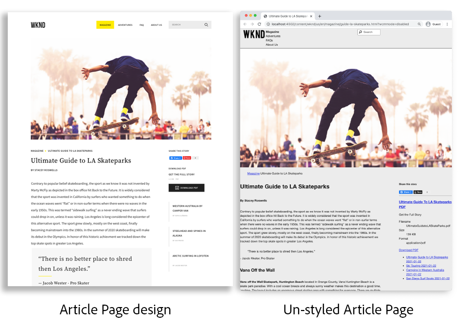
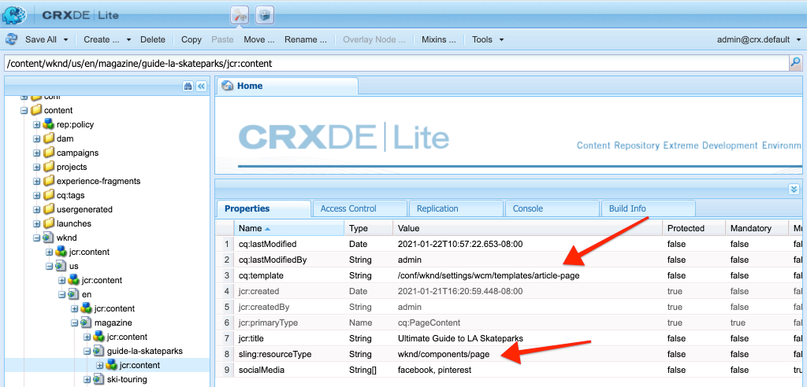
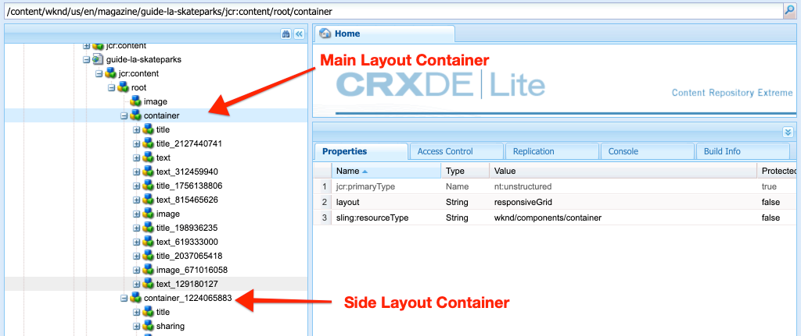
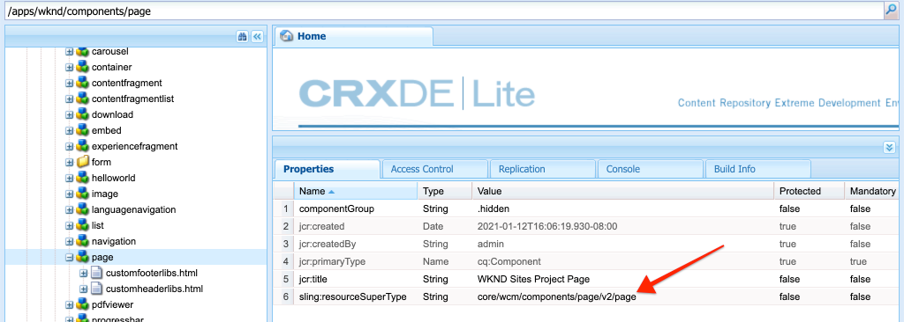
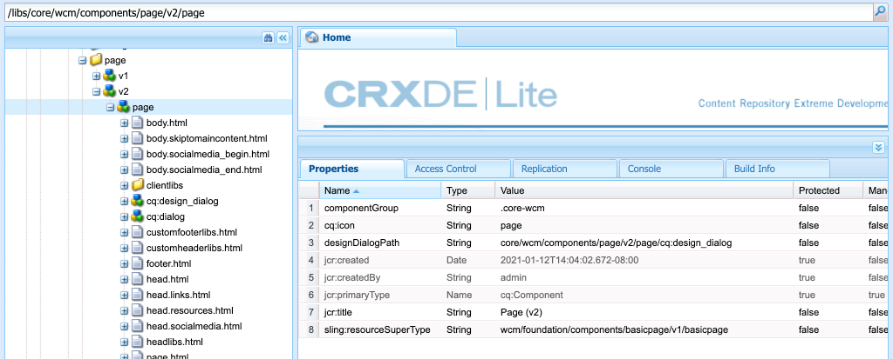
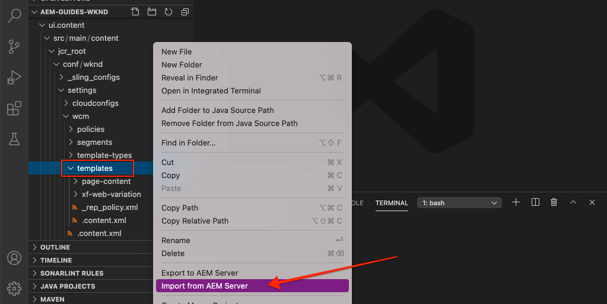

# Pages and Templates {#pages-and-template}

{{edge-delivery-services-and-page-editor}}

In this chapter, let's explore the relationship between a base page component and editable templates. Learn to build out an unstyled Article template based on some mockups from [Adobe XD](https://helpx.adobe.com/support/xd.html). In the process of building out the template, Core Components and advanced policy configurations of the Editable Templates are covered.

## Prerequisites {#prerequisites}

Review the required tooling and instructions for setting up a [local development environment](overview.md#local-dev-environment).

### Starter Project

>[!NOTE]
>
> If you successfully completed the previous chapter, you can reuse the project and skip the steps for checking out the starter project.

Check out the base-line code that the tutorial builds on:

1. Check out the `tutorial/pages-templates-start` branch from [GitHub](https://github.com/adobe/aem-guides-wknd)

    ```shell
    $ cd ~/code/aem-guides-wknd
    $ git checkout tutorial/pages-templates-start
    ```

1. Deploy code base to a local AEM instance using your Maven skills:

    ```shell
    $ mvn clean install -PautoInstallSinglePackage
    ```

    >[!NOTE]
    >
    > If using AEM 6.5 or 6.4, append the `classic` profile to any Maven commands.

    ```shell
    $ mvn clean install -PautoInstallSinglePackage -Pclassic
    ```

You can always view the finished code on [GitHub](https://github.com/adobe/aem-guides-wknd/tree/tutorial/pages-templates-solution) or check out the code locally by switching to the branch `tutorial/pages-templates-solution`.

## Objective

1. Inspect a page design created in Adobe XD and map it to Core Components.
1. Understand the details of Editable Templates and how policies can be used to enforce granular control of page content.
1. Learn how Templates and Pages are linked

## What you are going to build {#what-build}

In this part of the tutorial, you build a new Article Page Template that can be used to create article pages and aligns with a common structure. The Article Page Template is based on designs and a UI Kit produced in Adobe XD. This chapter is only focused on building out the structure or skeleton of the template. No styles are implemented but the template and pages are functional.



## UI Planning with Adobe XD {#adobexd}

Usually, planning for a new website starts with mockups and static designs. [Adobe XD](https://helpx.adobe.com/support/xd.html) is a design tool building user experience. Next let's inspect a UI Kit and mockups to help plan the structure of the Article Page Template.

>[!VIDEO](https://video.tv.adobe.com/v/30214?quality=12&learn=on)

**Download the [WKND Article Design File](https://github.com/adobe/aem-guides-wknd/releases/download/aem-guides-wknd-0.0.2/AEM_UI-kit-WKND-article-design.xd)**.

>[!NOTE]
>
> A generic [AEM Core Components UI Kit is also available](https://experienceleague.adobe.com/docs/experience-manager-learn/assets/AEM-CoreComponents-UI-Kit.xd) as a starting point for custom projects.

## Create the Article Page Template

When creating a page you must select a template, which is used as the basis for creating the page. The template defines the structure of the resultant page, initial content, and allowed components.

There are three main areas of [Editable Templates](https://experienceleague.adobe.com/docs/experience-manager-65/developing/platform/templates/page-templates-editable.html):

1. **Structure** - defines components that are a part of the template. These are not editable by content authors.
1. **Initial Content** - defines components that the template start with, these can be edited and/or deleted by content authors
1. **Policies** - defines configurations on how components behave and what options authors have.

Next, create a template in AEM that matches the structure of the mockups. This occurs in a local instance of AEM. Follow the steps in the video below:

>[!VIDEO](https://video.tv.adobe.com/v/330991?quality=12&learn=on)

High-level steps for the video above:

### Structure configurations

1. Create a template using the **Page Template Type**, named **Article Page**.
1. Switch into **Structure** mode.
1. Add an **Experience Fragment** component to act as the **Header** at the top of the template.
    * Configure the component to point to `/content/experience-fragments/wknd/us/en/site/header/master`.
    * Set the policy to **Page Header** and ensure that the **Default Element** is set to `header`. The `header`element is targeted with CSS in the next chapter.
1. Add an **Experience Fragment** component to act as the **Footer** at the bottom of the template.
    * Configure the component to point to `/content/experience-fragments/wknd/us/en/site/footer/master`.
    * Set the policy to **Page Footer** and ensure that the **Default Element** is set to `footer`. The `footer` element is targeted with CSS in the next chapter.
1. Lock the **main** container that was included when the template was initially created.
    * Set the policy to **Page Main** and ensure that the **Default Element** is set to `main`. The `main` element is targeted with CSS in the next chapter.
1. Add an **Image** component to the **main** container.
    * Unlock the **Image** component.
1. Add a **Breadcrumb** component beneath the **Image** component in the main container.
    * Create a policy for the **Breadcrumb** component named **Article Page - Breadcrumb**. Set the **Navigation Start Level** to **4**.
1. Add a **Container** component beneath the **Breadcrumb** component and inside the **main** container. This acts as the **Content container** for the template.
    * Unlock the **Content** container.
    * Set the policy to **Page Content**.
1. Add another **Container** component beneath the **Content container**. This acts as the **Side Rail** container for the template.
    * Unlock the **Side Rail** container.
    * Create a policy named **Article Page - Side Rail**.
    * Configure the **Allowed Components** under **WKND Sites Project - Content** to include: **Button**, **Download**, **Image**, **List**, **Separator**, **Social Media Sharing**, **Text**, and **Title**.
1. Update the policy of the Page Root container. This is the outer-most container on the template. Set the policy to **Page Root**.
    * Under **Container Settings**, set the **Layout** to **Responsive Grid**.
1. Engage Layout Mode for the **Content container**. Drag the handle from right to left and shrink the container to be eight columns wide.
1. Engage Layout Mode for the **Side Rail container**. Drag the handle from right to left and shrink the container to be four columns wide. Then drag the left handle from left to right one column to make the container 3 columns wide and leave a 1-column gap between the **Content container**.
1. Open mobile emulator and switch to a mobile breakpoint. Engage layout mode again and make the **Content container** and the **Side Rail container** the full width of the page. This stacks the containers vertically in the mobile breakpoint.
1. Update the policy of the **Text** component in the **Content container**.
    * Set the policy to **Content text**.
    * Under **Plugins** > **Paragraph Styles**, check **Enable paragraph styles** and ensure that the **Quote block** is enabled.

### Initial Content configurations

1. Switch to **Initial Content** mode.
1. Add a **Title** component to the **Content container**. This acts as the Article title. When it is left empty, it  automatically displays the current page's Title.
1. Add a second **Title** component beneath the first Title component. 
    * Configure the component with the text: "By Author". This is a text placeholder.
    * Set the type to be `H4`.
1. Add a **Text** component beneath the **By Author** Title component.
1. Add a **Title** component to the **Side Rail Container**.
    * Configure the component with the text: "Share this Story".
    * Set the type to be `H5`.
1. Add a **Social Media Sharing** component beneath the **Share this Story** Title component.
1. Add a **Separator** component beneath the **Social Media Sharing** component.
1. Add a **Download** component beneath the **Separator** component.
1. Add a **List** component beneath the **Download** component.
1. Update the **Initial Page Properties** for the template.
    * Under **Social Media** > **Social Media Sharing**, check **Facebook** and **Pinterest**

### Enable the template and add a thumbnail

1. View the template in the Template console by navigating to [http://localhost:4502/libs/wcm/core/content/sites/templates.html/conf/wknd](http://localhost:4502/libs/wcm/core/content/sites/templates.html/conf/wknd)
1. **Enable** the Article Page template.
1. Edit the properties of the Article Page template and upload the following thumbnail to quickly identify pages created using the Article Page template:

    

## Update the Header and Footer with Experience Fragments {#experience-fragments}

A common practice when creating global content, such as a header or footer, is to use an [Experience Fragment](https://experienceleague.adobe.com/docs/experience-manager-learn/sites/experience-fragments/experience-fragments-feature-video-use.html). Experience Fragments, allows users to combine multiple components to create a single, reference-able, component. Experience Fragments have the advantage of supporting multi-site management and [localization](https://experienceleague.adobe.com/docs/experience-manager-core-components/using/wcm-components/experience-fragment.html?lang=en).

The AEM Project Archetype generated a Header and Footer. Next, update the Experience Fragments to match the mockups. Follow the steps in the video below:

>[!VIDEO](https://video.tv.adobe.com/v/330992?quality=12&learn=on)

High-level steps for the video above:

1. Download the sample content package **[WKND-PagesTemplates-Content-Assets.zip](assets/pages-templates/WKND-PagesTemplates-Content-Assets-1.1.zip)**.
1. Upload and install the content package using Package Manager at [http://localhost:4502/crx/packmgr/index.jsp](http://localhost:4502/crx/packmgr/index.jsp)
1. Update the Web Variation template, which is the template used for Experience Fragments at [http://localhost:4502/editor.html/conf/wknd/settings/wcm/templates/xf-web-variation/structure.html](http://localhost:4502/editor.html/conf/wknd/settings/wcm/templates/xf-web-variation/structure.html)
    * Update the policy the **Container** component on the template.
    * Set the policy to **XF Root**.
    * Under, the **Allowed Components** select the component group **WKND Sites Project - Structure** to include **Language Navigation**, **Navigation**, and **Quick Search** components.

### Update Header Experience Fragment

1. Open the Experience Fragment that renders the Header at [http://localhost:4502/editor.html/content/experience-fragments/wknd/us/en/site/header/master.html](http://localhost:4502/editor.html/content/experience-fragments/wknd/us/en/site/header/master.html)
1. Configure the root **Container** of the fragment. This is the outer most **Container**.
    * Set the **Layout** to **Responsive Grid**
1. Add the **WKND Dark Logo** as an image to the top of the **Container**. The logo was included in the package installed in a previous step.
    * Modify the layout of the **WKND Dark Logo** to be **two** columns wide. Drag the handles from right to left.
    * Configure the logo with **Alternative Text** of "WKND Logo".
    * Configure the logo to **Link** to `/content/wknd/us/en` the Home page.
1. Configure the **Navigation** component that is already placed on the page.
    * Set the **Exclude Root Levels** to **1**.
    * Set the **Navigation Structure Depth** to **1**.
    * Modify the layout of the **Navigation** component to be **eight** columns wide. Drag the handles from right to left.
1. Remove the **Language Navigation** component.
1. Modify the layout of the **Search** component to be **two** columns wide. Drag the handles from right to left. All the components should now be aligned horizontally on a single row.

### Update Footer Experience Fragment

1. Open the Experience Fragment that renders the Footer at [http://localhost:4502/editor.html/content/experience-fragments/wknd/us/en/site/footer/master.html](http://localhost:4502/editor.html/content/experience-fragments/wknd/us/en/site/footer/master.html)
1. Configure the root **Container** of the fragment. This is the outer most **Container**.
    * Set the **Layout** to **Responsive Grid**
1. Add the **WKND Light Logo** as an image to the top of the **Container**. The logo was included in the package installed in a previous step.
    * Modify the layout of the **WKND Light Logo** to be **two** columns wide. Drag the handles from right to left.
    * Configure the logo with **Alternative Text** of "WKND Logo Light".
    * Configure the logo to **Link** to `/content/wknd/us/en` the Home page.
1. Add a **Navigation** component beneath the logo. Configure the **Navigation** component:
    * Set the **Exclude Root Levels** to **1**.
    * Uncheck **Collect all child pages**.
    * Set the **Navigation Structure Depth** to **1**.
    * Modify the layout of the **Navigation** component to be **eight** columns wide. Drag the handles from right to left.

## Create an Article Page

Next, create a page using the Article Page template. Author the content of the page to match the site mockups. Follow the steps in the video below:

>[!VIDEO](https://video.tv.adobe.com/v/330993?quality=12&learn=on)

High-level steps for the video above:

1. Navigate to the Sites console at [http://localhost:4502/sites.html/content/wknd/us/en/magazine](http://localhost:4502/sites.html/content/wknd/us/en/magazine).
1. Create a page beneath **WKND** > **US** > **EN** > **Magazine**.
    * Choose the **Article Page** template.
    * Under **Properties** set the **Title** to "Ultimate Guide to LA Skateparks"
    * Set the **Name** to "guide-la-skateparks"
1. Replace **By Author** Title with the text "By Stacey Roswells".
1. Update the **Text** component to include a paragraph to populate the article. You can use the following text file as the copy: [la-skate-parks-copy.txt](assets/pages-templates/la-skateparks-copy.txt).
1. Add another **Text** component.
    * Update the component to include the quote: "There is no better place to shred than Los Angeles.".
    * Edit the Rich Text Editor in full-screen mode and modify the above quote to use the **Quote Block** element.
1. Continue populating the body of the article to match the mockups.
1. Configure the **Download** component to use a PDF version of the article.
    * Under **Download** > **Properties**, click the checkbox to **Get the title from the DAM asset**.
    * Set the **Description** to: "Get the Full Story".
    * Set the **Action Text** to: "Download PDF".
1. Configure the **List** component.
    * Under **List Settings** > **Build List Using**, select **Child Pages**.
    * Set the **Parent Page** to `/content/wknd/us/en/magazine`.
    * Under, the **Item Settings** check **Link Items** and check **Show date**.

## Inspect the node structure {#node-structure}

At this point, the article page is clearly unstyled. However the basic structure is in place. Next, inspect the node structure of the article page to gain a better understanding of the role of the template, page, and components.

Use the CRXDE-Lite tool on a local AEM instance to view the underlying node structure.

1. Open [CRXDE-Lite](http://localhost:4502/crx/de/index.jsp#/content/wknd/us/en/magazine/guide-la-skateparks/jcr%3Acontent) and use the tree navigation to navigate to `/content/wknd/us/en/magazine/guide-la-skateparks`.

1. Click on the `jcr:content` node beneath the `la-skateparks` page and view the properties:

    

    Notice the value for `cq:template`, which points to `/conf/wknd/settings/wcm/templates/article-page`, the Article Page Template created earlier.

    Also notice the value of `sling:resourceType`, which points to `wknd/components/page`. This is the page component created by the AEM project archetype and is responsible for rendering page based on the template.

1. Expand the `jcr:content` node beneath `/content/wknd/us/en/magazine/guide-la-skateparks/jcr:content` and view the node hierarchy:

    

    You should be able to loosely map each of the nodes to components that were authored. See if you can identify the different Layout Containers used by inspecting the nodes prefixed with `container`.

1. Next inspect the page component at `/apps/wknd/components/page`. View the component properties in CRXDE Lite:

    

    There are only two HTL scripts, `customfooterlibs.html` and `customheaderlibs.html` beneath the page component. *So how does this component render the page?*

    The `sling:resourceSuperType` property points to `core/wcm/components/page/v2/page`. This property allows the WKND's page component to inherit **all** the functionality of the Core Component page component. This is the first example of something called the [Proxy Component Pattern](https://experienceleague.adobe.com/docs/experience-manager-core-components/using/developing/guidelines.html#ProxyComponentPattern). More information can be found [here](https://experienceleague.adobe.com/docs/experience-manager-core-components/using/developing/guidelines.html).

1. Inspect another component within the WKND components, the `Breadcrumb` component from: `/apps/wknd/components/breadcrumb`. Notice that the same `sling:resourceSuperType` property can be found, but this time it points to `core/wcm/components/breadcrumb/v2/breadcrumb`. This is another example of using the Proxy component pattern to include a Core Component. In fact, all the components in the WKND code base are proxies of AEM Core Components (except for the custom demo HelloWorld component). It is a best practice to reuse as much of the functionality of Core Components as possible *before* writing custom code.

1. Next inspect the Core Component Page at `/libs/core/wcm/components/page/v2/page` using CRXDE Lite:

    >[!NOTE]
    >
    > In, AEM 6.5/6.4 the Core Components are located under `/apps/core/wcm/components`. In, AEM as a Cloud Service, the Core Components are located under `/libs` and are updated automatically.

    

    Notice that many script files are included beneath this page. The Core Component Page contains numerous functionalities. This functionality is broken into multiple scripts for easier maintenance and readability. You can trace the inclusion of the HTL scripts by opening the `page.html` and looking for `data-sly-include`:

    ```html
    <!--/* /libs/core/wcm/components/page/v2/page/page.html */-->
    <!DOCTYPE HTML>
    <html data-sly-use.page="com.adobe.cq.wcm.core.components.models.Page" lang="${page.language}"
        data-sly-use.head="head.html"
        data-sly-use.footer="footer.html"
        data-sly-use.redirect="redirect.html">
        <head data-sly-call="${head.head @ page = page}"></head>
        <body class="${page.cssClassNames}"
            id="${page.id}"
            data-cmp-data-layer-enabled="${page.data ? true : false}">
            <script data-sly-test.dataLayerEnabled="${page.data}">
            window.adobeDataLayer = window.adobeDataLayer || [];
            adobeDataLayer.push({
                page: JSON.parse("${page.data.json @ context='scriptString'}"),
                event:'cmp:show',
                eventInfo: {
                    path: 'page.${page.id @ context="scriptString"}'
                }
            });
            </script>
            <sly data-sly-test.isRedirectPage="${page.redirectTarget && (wcmmode.edit || wcmmode.preview)}"
                data-sly-call="${redirect.redirect @ redirectTarget = page.redirectTarget}"></sly>
            <sly data-sly-test="${!isRedirectPage}">
                <sly data-sly-include="body.skiptomaincontent.html"></sly>
                <sly data-sly-include="body.socialmedia_begin.html"></sly>
                <sly data-sly-include="body.html"></sly>
                <sly data-sly-call="${footer.footer @ page = page}"></sly>
                <sly data-sly-include="body.socialmedia_end.html"></sly>
            </sly>
        </body>
    </html>
    ```

    The other reason for breaking out the HTL into multiple scripts is to allow the proxy components to override individual scripts to implement custom business logic. The HTL scripts `customfooterlibs.html`, and `customheaderlibs.html`, are created for the explicit purpose to be overridden by implementing projects.

    You can learn more about how the Editable Template factors into the rendering of the [content page by reading this article](https://experienceleague.adobe.com/docs/experience-manager-65/developing/platform/templates/page-templates-editable.html).

1. Inspect another Core Component, like the Breadcrumb at `/libs/core/wcm/components/breadcrumb/v2/breadcrumb`. View the `breadcrumb.html` script to understand how the markup for the Breadcrumb component is ultimately generated.

## Saving Configurations to Source Control {#configuration-persistence}

Often, especially at the beginning of an AEM project it is valuable to persist configurations, like templates and related content policies, to source control. This ensures that all developers are working against the same set of content and configurations and can ensure additional consistency between environments. Once a project reaches a certain level of maturity, the practice of managing templates can be turned over to a special group of power users.


For now, templates are treated like other pieces of code and sync the **Article Page Template** down as part of the project.
Until now code is pushed from the AEM project to a local instance of AEM. The **Article Page Template** was created directly on a local instance of AEM, so it needs to **import** the template into the AEM project. The **ui.content** module is included in the AEM project for this specific purpose.

The next few steps are done in the VSCode IDE using the [VSCode AEM Sync](https://marketplace.visualstudio.com/items?itemName=yamato-ltd.vscode-aem-sync&ssr=false#overview) plugin. But they could be doing using any IDE that you have configured to **import** or import content from a local instance of AEM.

1. In, the VSCode open the `aem-guides-wknd` project.

1. Expand the **ui.content** module in the Project explorer. Expand the `src` folder and navigate to `/conf/wknd/settings/wcm/templates`.

1. [!UICONTROL Right+Click] the `templates` folder and select **Import from AEM Server**:

    

    The `article-page` should be imported, and the `page-content`, `xf-web-variation` templates should also be updated.

    

1. Repeat the steps to import content but select the **policies** folder from `/conf/wknd/settings/wcm/policies`.

    

1. Inspect the `filter.xml` file from `ui.content/src/main/content/META-INF/vault/filter.xml`.

    ```xml
    <!--ui.content filter.xml-->
    <?xml version="1.0" encoding="UTF-8"?>
    <workspaceFilter version="1.0">
        <filter root="/conf/wknd" mode="merge"/>
        <filter root="/content/wknd" mode="merge"/>
        <filter root="/content/dam/wknd" mode="merge"/>
        <filter root="/content/experience-fragments/wknd" mode="merge"/>
    </workspaceFilter>
    ```

    The `filter.xml` file is responsible for identifying the paths of nodes that are installed with the package. Notice the `mode="merge"` on each of the filters which indicates that existing content not to be modified, only new content is added. Since content authors may be updating these paths, it is important that a code deployment does **not** overwrite content. See the [FileVault documentation](https://jackrabbit.apache.org/filevault/filter.html) for more details on working with filter elements.

    Compare `ui.content/src/main/content/META-INF/vault/filter.xml` and `ui.apps/src/main/content/META-INF/vault/filter.xml` to understand the different nodes managed by each module.

    >[!WARNING]
    >
    > In order to ensure consistent deployments for the WKND Reference site some branches of the project are set up such that `ui.content` overwrites any changes in the JCR. This is by design, i.e for Solution Branches, since code/styles are written for specific policies.

## Congratulations! {#congratulations}

Congratulations, you have created a template and page with Adobe Experience Manager Sites.

### Next Steps {#next-steps}

At this point, the article page is clearly unstyled. Follow the [Client-Side Libraries and Front-end Workflow](client-side-libraries.md) tutorial to learn the best practices for including CSS and JavaScript to apply global styles to the site and integrate a dedicated front-end build.

View the finished code on [GitHub](https://github.com/adobe/aem-guides-wknd) or review and deploy the code locally at on the Git branch `tutorial/pages-templates-solution`.

1. Clone the [github.com/adobe/aem-wknd-guides](https://github.com/adobe/aem-guides-wknd) repository.
1. Check out the `tutorial/pages-templates-solution` branch.
