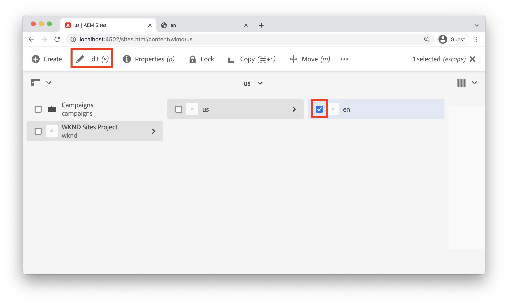
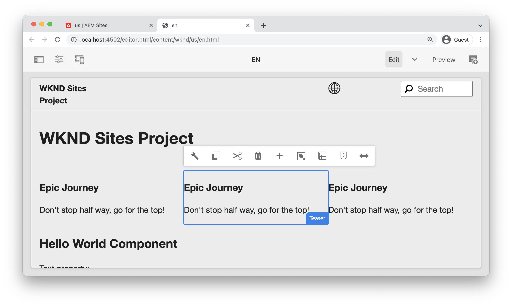
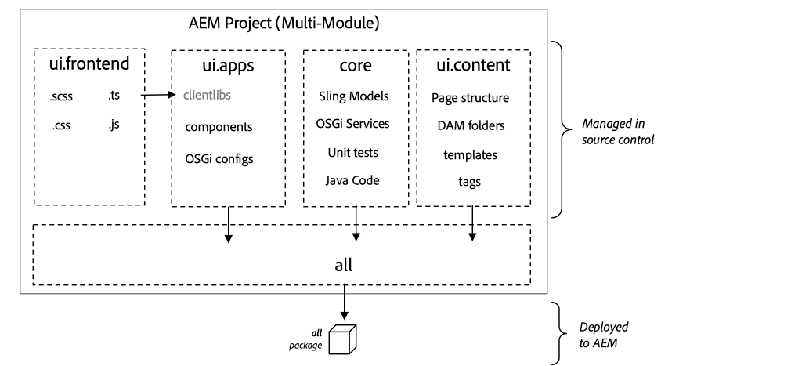
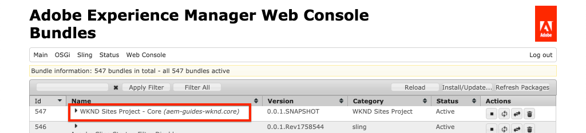
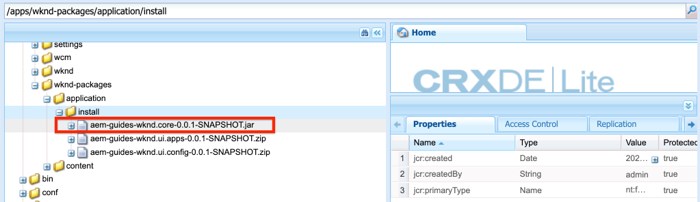
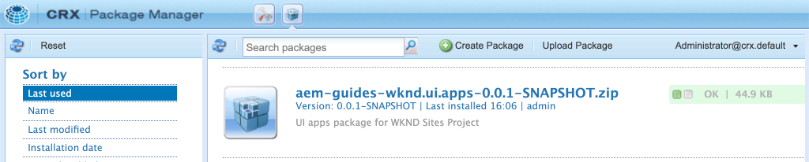

# Project Setup {#project-setup}

This tutorial covers the creation of a Maven Multi Module Project to manage the code and configurations for an Adobe Experience Manager Site.

## Prerequisites {#prerequisites}

Review the required tooling and instructions for setting up a [local development environment](./overview.md#local-dev-environment). Ensure that you have a fresh instance of Adobe Experience Manager available locally and that no additional sample/demo packages have been installed (other than required Service Packs).

## Objective {#objective}

1. Learn how to generate a new AEM project using a Maven archetype.
1. Understand the different modules generated by the AEM Project Archetype and how they work together.
1. Understand how AEM Core Components are included in an AEM Project.

## What you will build {#what-build}

>[!VIDEO](https://video.tv.adobe.com/v/30152/?quality=12&learn=on)

In this chapter, you will generate a new Adobe Experience Manager project using the [AEM Project Archetype](https://github.com/adobe/aem-project-archetype). Your AEM project contains all of the code, content, and configurations used for a Sites implementation. The project generated in this chapter will serve as the basis for an implementation of the WKND Site and will be built upon in future chapters.

**What is a Maven project?** - [Apache Maven](https://maven.apache.org/) is a software management tool to build projects. *All Adobe Experience Manager* implementations use Maven projects to build, manage and deploy custom code on top of AEM.

**What is a Maven archetype?** - A [Maven archetype](https://maven.apache.org/archetype/index.html) is a template or pattern for generating new projects. The AEM Project archetype allows us to generate a new project with a custom namespace and include a project structure that follows best practices, greatly accelerating our project.

## Create the project {#create}

There are a  couple  options for creating a Maven Multi-module project for AEM. This tutorial will leverage the [Maven AEM Project Archetype **35**](https://github.com/adobe/aem-project-archetype). Cloud Manager also [provides a UI wizard](https://experienceleague.adobe.com/docs/experience-manager-cloud-manager/using/getting-started/create-application-project/using-the-wizard.html) to initiate the creation of an AEM application project. The underlying project generated by the Cloud Manager UI results in the same structure as using the archetype directly.

>[!NOTE]
>
>This tutorial uses version **35** of the archetype. It is always a best practice to use the **latest** version of the archetype to generate a new project.

The next series of steps will take place using a UNIX based command line  terminal, but should be similar if using a Windows terminal.

1. Open up a command line terminal. Verify that Maven is installed:

    ```shell
    $ mvn --version
    Apache Maven 3.6.2
    Maven home: /Library/apache-maven-3.6.2
    Java version: 11.0.4, vendor: Oracle Corporation, runtime: /Library/Java/JavaVirtualMachines/jdk-11.0.4.jdk/Contents/Home
    ```

1. Navigate to a directory in which you want to generate the AEM project. This can be any directory in which you want to maintain your project's source code. For example a directory named `code` beneath the user's home directory:

    ```shell
    $ cd ~/code
    ```

1. Paste the following into the command line to [generate the project in batch mode](https://maven.apache.org/archetype/maven-archetype-plugin/examples/generate-batch.html):

    ```shell
    mvn -B org.apache.maven.plugins:maven-archetype-plugin:3.2.1:generate \
        -D archetypeGroupId=com.adobe.aem \
        -D archetypeArtifactId=aem-project-archetype \
        -D archetypeVersion=35 \
        -D appTitle="WKND Sites Project" \
        -D appId="wknd" \
        -D groupId="com.adobe.aem.guides" \
        -D artifactId="aem-guides-wknd" \
        -D package="com.adobe.aem.guides.wknd" \
        -D version="0.0.1-SNAPSHOT" \
        -D aemVersion="cloud"
    ```

    >[!NOTE]
    >
    > If targeting AEM 6.5.10+ replace `aemVersion="cloud"` with `aemVersion="6.5.10"`.

    A full list of available properties for configuring a project [can be found here](https://github.com/adobe/aem-project-archetype#available-properties).

1. The following folder and file structure will be generated by the Maven archetype on your local file system:

    ```plain
     ~/code/
        |--- aem-guides-wknd/
            |--- all/
            |--- core/
            |--- ui.apps/
            |--- ui.apps.structure/
            |--- ui.config/
            |--- ui.content/
            |--- ui.frontend/
            |--- ui.tests /
            |--- it.tests/
            |--- dispatcher/
            |--- analyse/
            |--- pom.xml
            |--- README.md
            |--- .gitignore
    ```

## Deploy and build the project {#build}

Build and deploy the project code to a local instance of AEM.

1. Ensure you have an author instance of AEM running locally on port **4502**.
1. From the command line navigate into the `aem-guides-wknd` project directory.

    ```shell
    $ cd aem-guides-wknd
    ```

1. Run the following command to build and deploy the entire project to AEM:

    ```shell
    $ mvn clean install -PautoInstallSinglePackage
    ```

    The build will take around a minute and should end with the following message:

    ```
    ...
    [INFO] ------------------------------------------------------------------------
    [INFO] Reactor Summary for aem-guides-wknd 0.0.1-SNAPSHOT:
    [INFO]
    [INFO] aem-guides-wknd .................................... SUCCESS [  0.269 s]
    [INFO] WKND Sites Project - Core .......................... SUCCESS [  8.047 s]
    [INFO] WKND Sites Project - UI Frontend ................... SUCCESS [01:02 min]
    [INFO] WKND Sites Project - Repository Structure Package .. SUCCESS [  1.985 s]
    [INFO] WKND Sites Project - UI apps ....................... SUCCESS [  8.037 s]
    [INFO] WKND Sites Project - UI content .................... SUCCESS [  4.672 s]
    [INFO] WKND Sites Project - UI config ..................... SUCCESS [  0.313 s]
    [INFO] WKND Sites Project - All ........................... SUCCESS [  0.270 s]
    [INFO] WKND Sites Project - Integration Tests ............. SUCCESS [ 15.571 s]
    [INFO] WKND Sites Project - Dispatcher .................... SUCCESS [  0.232 s]
    [INFO] WKND Sites Project - UI Tests ...................... SUCCESS [  0.728 s]
    [INFO] WKND Sites Project - Project Analyser .............. SUCCESS [ 33.398 s]
    [INFO] ------------------------------------------------------------------------
    [INFO] BUILD SUCCESS
    [INFO] ------------------------------------------------------------------------
    [INFO] Total time:  02:18 min
    [INFO] Finished at: 2021-01-31T12:33:56-08:00
    [INFO] ------------------------------------------------------------------------
    ```

    The Maven profile `autoInstallSinglePackage` compiles the individual modules of the project and deploys a single package to the AEM instance. By default this package will be deployed to an AEM instance running locally on port **4502** and with the credentials of `admin:admin`.

1. Navigate to Package Manager on your local AEM instance: [http://localhost:4502/crx/packmgr/index.jsp](http://localhost:4502/crx/packmgr/index.jsp). You should see packages for `aem-guides-wknd.ui.apps`, `aem-guides-wknd.ui.config`, `aem-guides-wknd.ui.content`, and `aem-guides-wknd.all`.

1. Navigate to the Sites console: [http://localhost:4502/sites.html/content](http://localhost:4502/sites.html/content). The WKND Site will be one of the sites. It will include a site structure with a US and Language Masters hierarchy. This site hierarchy is based on the values for `language_country` and `isSingleCountryWebsite` when generating the project using the archetype.

1. Open the **US** `>` **English** page by selecting the page and clicking the **Edit** button in the menu bar:

    

1. Starter content has already been created and several components are available to be added to a page. Experiment with these components to get an idea of the functionality. You will learn the basics of a component in the next chapter.

    

    *Sample content generated by the Archetype*

## Inspect the project {#project-structure}

The generated AEM project is made up of individual Maven modules, each with a different role. This tutorial and a majority of development focus on these modules:

* [core](https://experienceleague.adobe.com/docs/experience-manager-core-components/using/developing/archetype/core.html) - Java Code, primarily back-end developers.
* [ui.frontend](https://experienceleague.adobe.com/docs/experience-manager-core-components/using/developing/archetype/uifrontend.html) - Contains source code for CSS, JavaScript, Sass, Type Script, primarily for front-end developers.
* [ui.apps](https://experienceleague.adobe.com/docs/experience-manager-core-components/using/developing/archetype/uiapps.html) - Contains component and dialog definitions, embeds compiled CSS and JavaScript as client libraries.
* [ui.content](https://experienceleague.adobe.com/docs/experience-manager-core-components/using/developing/archetype/uicontent.html) - contains structural content and configurations like editable templates, metadata schemas (/content, /conf).

* **all** - this is an empty Maven module that combines the above modules into a single package that can be deployed to an AEM environment.



See the [AEM Project Archetype documentation](https://experienceleague.adobe.com/docs/experience-manager-core-components/using/developing/archetype/overview.html) to learn more details of **all** the Maven modules.

### Inclusion of Core Components {#core-components}

[AEM Core Components](https://experienceleague.adobe.com/docs/experience-manager-core-components/using/introduction.html) are a set of standardized Web Content Management (WCM) components for AEM. These components provide a baseline set of a functionality and are designed to be styled, customized and extended for individual projects.

AEM as a Cloud Service environments include the latest version of [AEM Core Components](https://experienceleague.adobe.com/docs/experience-manager-core-components/using/introduction.html). Therefore projects generated for AEM as a Cloud Service do **not** include an embed of AEM Core Components.

For AEM 6.5/6.4 generated projects, the archetype automatically embeds [AEM Core Components](https://experienceleague.adobe.com/docs/experience-manager-core-components/using/introduction.html) in the project. It is a best practice for AEM 6.5/6.4 to embed AEM Core Components to ensure the latest version gets deployed with your project. More information about how Core Components are [included in the project can be found here](https://experienceleague.adobe.com/docs/experience-manager-core-components/using/developing/archetype/using.html#core-components).

## Source Control Management {#source-control}

It is always a good idea to use some form of source control to manage the code in your application. This tutorial uses git and GitHub. There are several files that get generated by Maven and/or the IDE of choice that should be ignored by the SCM.

Maven will create a target folder whenever you build and install the code package. The target folder and contents should be excluded from SCM.

Beneath `ui.apps` observe that many `.content.xml` files are created. These XML files map the node types and properties of content installed in the JCR. These files are critical and should **not** be ignored.

The AEM project archetype will generates a sample `.gitignore` file that can be used as a starting point for which files can be safely ignored. The file is generated at `<src>/aem-guides-wknd/.gitignore`.

## Congratulations! {#congratulations}

Congratulations, you have just created your first AEM Project!

### Next Steps {#next-steps}

Understand the underlying technology of an Adobe Experience Manager (AEM) Sites Component through a simple `HelloWorld` example with the [Component Basics](component-basics.md) tutorial.

## Advanced Maven commands (Bonus) {#advanced-maven-commands}

During development you may be working with just one of the modules and want to avoid building the entire project in order to save time. You may also want to deploy directly to an AEM Publish instance or perhaps to an instance of AEM not running on port 4502.

Next we will look at some additional Maven profiles and commands you can use for greater flexibility during development.

### Core module {#core-module}

The **[core](https://experienceleague.adobe.com/docs/experience-manager-core-components/using/developing/archetype/core.html)** module contains all of the Java code associated with the project. When built it deploys an OSGi bundle to AEM. To build just this module:

1. Navigate into the `core` folder (beneath `aem-guides-wknd`):

    ```shell
    $ cd core/
    ```

1. Run the following command:

    ```shell
    $ mvn clean install -PautoInstallBundle
    ...
    [INFO] --- sling-maven-plugin:2.4.0:install (install-bundle) @ aem-guides-wknd.core ---
    [INFO] Installing Bundle aem-guides-wknd.core(~/code/aem-guides-wknd/core/target/aem-guides-wknd.core-0.0.1-SNAPSHOT.jar) to http://localhost:4502/system/console via WebConsole
    [INFO] Bundle installed
    [INFO] ------------------------------------------------------------------------
    [INFO] BUILD SUCCESS
    [INFO] ------------------------------------------------------------------------
    [INFO] Total time:  8.558 s
    ```

1. Navigate to [http://localhost:4502/system/console/bundles](http://localhost:4502/system/console/bundles). This is the OSGi Web console and contains information about all of the bundles installed on the AEM instance.

1. Toggle the **Id** sort column and you should see the WKND bundle installed and active.

    

1. You can see the 'physical' location of the jar in [CRXDE-Lite](http://localhost:4502/crx/de/index.jsp#/apps/wknd-packages/application/install/aem-guides-wknd.core-1.0.0-SNAPSHOT.jar):

    

### Ui.apps and Ui.content modules {#apps-content-module}

The **[ui.apps](https://experienceleague.adobe.com/docs/experience-manager-core-components/using/developing/archetype/uiapps.html)** maven module contains all of the rendering code needed for the site beneath `/apps`. This includes CSS/JS that will be stored in an AEM format called [clientlibs](https://experienceleague.adobe.com/docs/experience-manager-65/developing/introduction/clientlibs.html). This also includes [HTL](https://experienceleague.adobe.com/docs/experience-manager-htl/using/overview.html) scripts for rendering dynamic HTML. You can think of the **ui.apps** module as a map to the structure in the JCR but in a format that can be stored on a file system and committed to source control. The **ui.apps** module only contains code.

To build the just this module:

1. From the command line. Navigate into the `ui.apps` folder (beneath `aem-guides-wknd`):

    ```shell
    $ cd ../ui.apps
    ```

1. Run the following command:

    ```shell
    $ mvn clean install -PautoInstallPackage
    ...
    Package installed in 122ms.
    [INFO] ------------------------------------------------------------------------
    [INFO] BUILD SUCCESS
    [INFO] ------------------------------------------------------------------------
    [INFO] Total time:  6.972 s
    [INFO] Finished at: 2019-12-06T14:44:12-08:00
    [INFO] ------------------------------------------------------------------------
    ```

1. Navigate to [http://localhost:4502/crx/packmgr/index.jsp](http://localhost:4502/crx/packmgr/index.jsp). You should see the `ui.apps` package as the first installed package and it should have a more recent timestamp then any of the other packages.

    

1. Return to the command line and run the following command (within the `ui.apps` folder):

    ```shell
    $ mvn -PautoInstallPackagePublish clean install
    ...
    [INFO] --- content-package-maven-plugin:1.0.2:install (install-package-publish) @ aem-guides-wknd.ui.apps ---
    [INFO] Installing aem-guides-wknd.ui.apps (/Users/dgordon/code/aem-guides-wknd/ui.apps/target/aem-guides-wknd.ui.apps-0.0.1-SNAPSHOT.zip) to http://localhost:4503/crx/packmgr/service.jsp
    [INFO] I/O exception (java.net.ConnectException) caught when processing request: Connection refused (Connection refused)
    [INFO] Retrying request
    [INFO] I/O exception (java.net.ConnectException) caught when processing request: Connection refused (Connection refused)
    [INFO] Retrying request
    [INFO] I/O exception (java.net.ConnectException) caught when processing request: Connection refused (Connection refused)
    [INFO] Retrying request
    [INFO] ------------------------------------------------------------------------
    [INFO] BUILD FAILURE
    [INFO] ------------------------------------------------------------------------
    [INFO] Total time:  6.717 s
    [INFO] Finished at: 2019-12-06T14:51:45-08:00
    [INFO] ------------------------------------------------------------------------
    ```

    The profile `autoInstallPackagePublish` is intended to deploy the package to a Publish environment running on port **4503**. The above error is expected if an AEM instance running on http://localhost:4503 cannot be found.

1. Finally run the following command to deploy the `ui.apps` package on port **4504**:

    ```shell
    $ mvn -PautoInstallPackage clean install -Daem.port=4504
    ...
    [INFO] --- content-package-maven-plugin:1.0.2:install (install-package) @ aem-guides-wknd.ui.apps ---
    [INFO] Installing aem-guides-wknd.ui.apps (/Users/dgordon/code/aem-guides-wknd/ui.apps/target/aem-guides-wknd.ui.apps-0.0.1-SNAPSHOT.zip) to http://localhost:4504/crx/packmgr/service.jsp
    [INFO] I/O exception (java.net.ConnectException) caught when processing request: Connection refused (Connection refused)
    [INFO] Retrying request
    [INFO] I/O exception (java.net.ConnectException) caught when processing request: Connection refused (Connection refused)
    [INFO] Retrying request
    [INFO] I/O exception (java.net.ConnectException) caught when processing request: Connection refused (Connection refused)
    [INFO] Retrying request
    [INFO] ------------------------------------------------------------------------
    [INFO] BUILD FAILURE
    [INFO] --------------------------------------------------------------------
    ```

    Again a build failure is expected to occur if no AEM instance running on port **4504** is available. The parameter `aem.port` is defined in the POM file at `aem-guides-wknd/pom.xml`.

The **[ui.content](https://experienceleague.adobe.com/docs/experience-manager-core-components/using/developing/archetype/uicontent.html)** module is structured the same way as the **ui.apps** module. The only difference is that the **ui.content** module contains what is known as **mutable** content. **Mutable** content essentially refers to non-code configurations like Templates, Policies, or folder structures that is stored in source-control **but** could be modified on an AEM instance directly. This will be explored in much more detail in the chapter on Pages and Templates.

The same Maven commands used to build the **ui.apps** module can be used to build the **ui.content** module. Feel free to repeat the above steps from within the **ui.content** folder.

## Troubleshooting

If you are having issues generating the project using the AEM Project Archetype see the list of [known issues](https://github.com/adobe/aem-project-archetype#known-issues) and list of open [issues](https://github.com/adobe/aem-project-archetype/issues).

## Congratulations again! {#congratulations-bonus}

Congratulations, on going through the bonus material.

### Next Steps {#next-steps-bonus}

Understand the underlying technology of an Adobe Experience Manager (AEM) Sites Component through a simple `HelloWorld` example with the [Component Basics](component-basics.md) tutorial.
