# Developing with the Style System {#developing-with-the-style-system}

Learn how to implement individual styles and reuse Core Components using Experience Manager's Style System. This tutorial covers developing for the Style System to extend Core Components with brand-specific CSS and advanced policy configurations of the Template Editor.

## Prerequisites {#prerequisites}

Review the required tooling and instructions for setting up a [local development environment](overview.md#local-dev-environment).

It is also recommended to review the [Client-side Libraries and Front-end Workflow](client-side-libraries.md) tutorial to understand the fundamentals of client-side libraries and the various front-end tools built into the AEM project.

### Starter Project

>[!NOTE]
>
> If you successfully completed the previous chapter, you can reuse the project and skip the steps for checking out the starter project.

Check out the base-line code that the tutorial builds on:

1. Check out the `tutorial/style-system-start` branch from [GitHub](https://github.com/adobe/aem-guides-wknd)

    ```shell
    $ cd aem-guides-wknd
    $ git checkout tutorial/style-system-start
    ```

1. Deploy code base to a local AEM instance using your Maven skills:

    ```shell
    $ mvn clean install -PautoInstallSinglePackage
    ```

    >[!NOTE]
    >
    > If using AEM 6.5 or 6.4, append the `classic` profile to any Maven commands.

    ```shell
    $ mvn clean install -PautoInstallSinglePackage -Pclassic
    ```

You can always view the finished code on [GitHub](https://github.com/adobe/aem-guides-wknd/tree/tutorial/style-system-solution) or check out the code locally by switching to the branch `tutorial/style-system-solution`.

## Objective

1. Understand how to use the Style System to apply brand-specific CSS to AEM Core Components.
1. Learn about BEM notation and how it can be used to carefully scope styles.
1. Apply advanced policy configurations with Editable Templates.

## What you are going to build {#what-build}

This chapter uses the [Style System feature](https://experienceleague.adobe.com/docs/experience-manager-learn/sites/page-authoring/style-system-feature-video-use.html) to create variations of the **Title** and **Text** components used on the Article page.

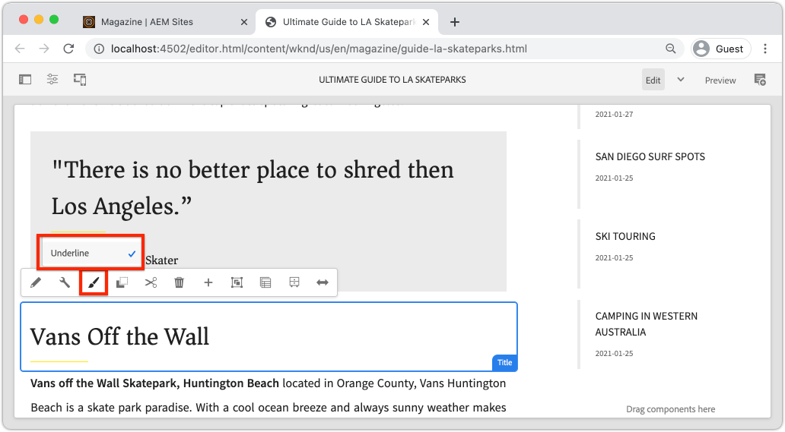

*Underline style available to use for Title Component*

## Background {#background}

The [Style System](https://experienceleague.adobe.com/docs/experience-manager-65/authoring/siteandpage/style-system.html) allows developers and template editors to create multiple visual variations of a component. Authors can then in turn decide which style to use when composing a page. The Style System is used throughout the rest of the tutorial to achieve several unique styles while using Core Components in a low code approach.

The general idea with the Style System is that authors can choose various styles of how a component should look. The "styles" are backed by additional CSS classes that are injected into the outer div of a component. In the client libraries CSS rules are added based on these style classes so that the component changes appearance.

You can find [detailed documentation for Style System here](https://experienceleague.adobe.com/docs/experience-manager-cloud-service/content/sites/authoring/features/style-system.html). There is also a great [technical video for understanding the Style System](https://experienceleague.adobe.com/docs/experience-manager-learn/sites/developing/style-system-technical-video-understand.html).

## Underline Style - Title {#underline-style}

The [Title Component](https://experienceleague.adobe.com/docs/experience-manager-core-components/using/wcm-components/title.html) has been proxied into the project under `/apps/wknd/components/title` as part of the **ui.apps** module. The default styles of Heading elements (`H1`, `H2`, `H3`...) have already been implemented in the **ui.frontend** module.

The [WKND Article designs](assets/pages-templates/wknd-article-design.xd) contain a unique style for the Title component with an underline. Instead of creating two components or modifying the component dialog, the Style System can be used to allow authors the option to add an underline style.

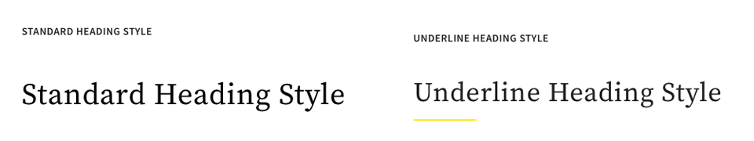

### Add a Title Policy

Let's add a policy for the Title components to allow content authors to choose the Underline style to apply to specific components. This is done using the Template Editor within AEM.

1. Navigate to the **Article Page** template from: [http://localhost:4502/editor.html/conf/wknd/settings/wcm/templates/article-page/structure.html](http://localhost:4502/editor.html/conf/wknd/settings/wcm/templates/article-page/structure.html)

1. In **Structure** mode, in the main **Layout Container**, select the **Policy** icon next to the **Title** component listed under *Allowed Components*:

    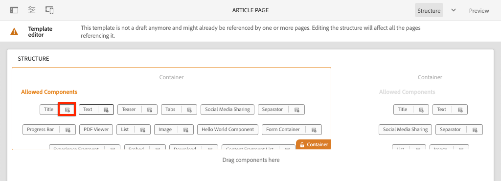

1. Create a policy for the Title component with the following values:

    *Policy Title &#42;*: **WKND Title**

    *Properties* &gt; *Styles Tab* &gt; *Add a new style*

    **Underline** : `cmp-title--underline`

   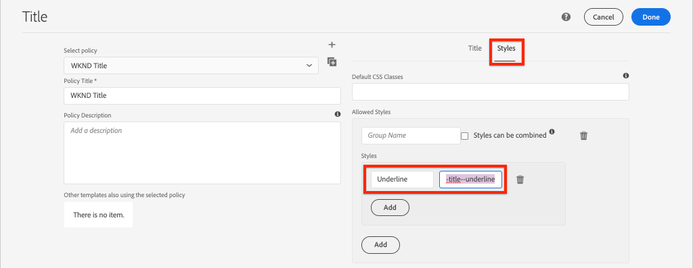

    Click **Done** to save the changes to the Title policy.

    >[!NOTE]
    >
    > The value `cmp-title--underline` populates the CSS class on the outer div of the component's HTML markup.

### Apply the Underline Style

Being an author let's apply the underline style to certain Title Components.

1. Navigate to the **La Skateparks** article in the AEM Sites editor at: [http://localhost:4502/editor.html/content/wknd/us/en/magazine/guide-la-skateparks.html](http://localhost:4502/editor.html/content/wknd/us/en/magazine/guide-la-skateparks.html)
1. In **Edit** mode, choose a Title component. Click the **paintbrush** icon and select the **Underline** style:

    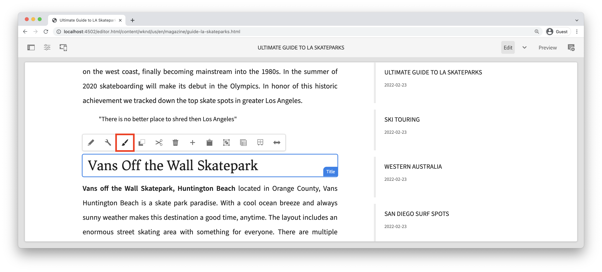

    >[!NOTE]
    >
    > At this point, no visible change occurs as the `underline` style has not been implemented. In the next exercise, this style is implemented.

1. Click the **Page Information** icon &gt; **View as Published** to inspect the page outside of AEM's editor.
1. Use your browser developer tools to verify that the markup around the Title component has the CSS class `cmp-title--underline` applied to the outer div.

    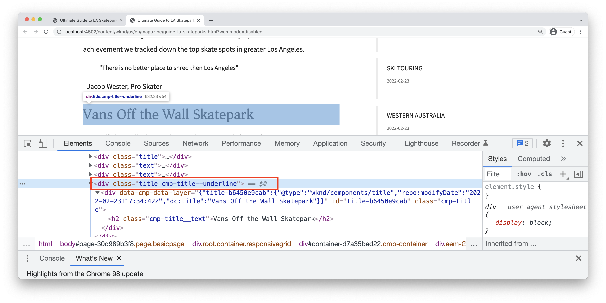

    ```html
    <div class="title cmp-title--underline">
        <div data-cmp-data-layer="{&quot;title-b6450e9cab&quot;:{&quot;@type&quot;:&quot;wknd/components/title&quot;,&quot;repo:modifyDate&quot;:&quot;2022-02-23T17:34:42Z&quot;,&quot;dc:title&quot;:&quot;Vans Off the Wall Skatepark&quot;}}" 
        id="title-b6450e9cab" class="cmp-title">
            <h2 class="cmp-title__text">Vans Off the Wall Skatepark</h2>
        </div>
    </div>
    ```

### Implement the Underline Style - ui.frontend

Next, implement the Underline style using the **ui.frontend** module of the AEM project. The webpack development server that is bundled with the **ui.frontend** module to preview the styles *before* deploying to a local instance of AEM is used.

1. Start the `watch` process from within the **ui.frontend** module:

    ```shell
    $ cd ~/code/aem-guides-wknd/ui.frontend/
    $ npm run watch
    ```

    This starts a process that monitors changes in the `ui.frontend` module and sync the changes to the AEM instance.


1. Return your IDE and open the file `_title.scss` from: `ui.frontend/src/main/webpack/components/_title.scss`.
1. Introduce a new rule targeting the `cmp-title--underline` class:

    ```scss
    /* Default Title Styles */
    .cmp-title {}
    .cmp-title__text {}
    .cmp-title__link {}
    
    /* Add Title Underline Style */
    .cmp-title--underline {
        .cmp-title__text {
            &:after {
            display: block;
                width: 84px;
                padding-top: 8px;
                content: '';
                border-bottom: 2px solid $brand-primary;
            }
        }
    }
    ```

    >[!NOTE]
    >
    >It is considered a best practice to always tightly scope styles to the target component. This ensures that extra styles don't affect other areas of the page.
    >
    >All Core Components adhere to **[BEM notation](https://github.com/adobe/aem-core-wcm-components/wiki/css-coding-conventions)**. It is a best practice to target the outer CSS class when creating a default style for a component. Another best practice is to target class names specified by the Core Component BEM notation rather than HTML elements.

1. Return to the browser and the AEM page. You should see that the Underline style added:

    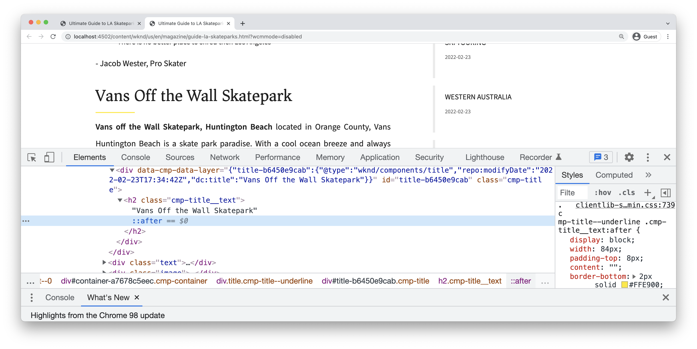

1. In the AEM Editor, you should now be able to toggle on and off the **Underline** style and see that the changes reflected visually.

## Quote block Style - Text {#text-component}

Next, repeat similar steps to apply a unique style to the [Text Component](https://experienceleague.adobe.com/docs/experience-manager-core-components/using/wcm-components/text.html). The Text component has been proxied into the project under `/apps/wknd/components/text` as part of the **ui.apps** module. The default styles of paragraph elements have already been implemented in the **ui.frontend**.

The [WKND Article designs](assets/pages-templates/wknd-article-design.xd) contain a unique style for the Text component with a quote block:

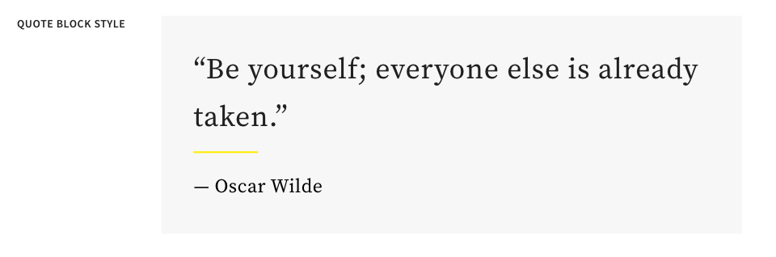

### Add a Text Policy

Next add a policy for the Text components.

1. Navigate to the **Article Page Template** from: [http://localhost:4502/editor.html/conf/wknd/settings/wcm/templates/article-page/structure.html](http://localhost:4502/editor.html/conf/wknd/settings/wcm/templates/article-page/structure.html).

1. In **Structure** mode, in the main **Layout Container**, select the **Policy** icon next to the **Text** component listed under *Allowed Components*:

    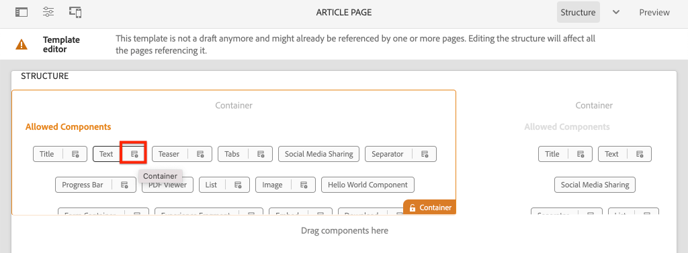

1. Update the Text component policy with the following values:

    *Policy Title &#42;*: **Content Text**

    *Plugins* &gt; *Paragraph Styles* &gt; *Enable paragraph styles*

    *Styles Tab* &gt; *Add a new style*

    **Quote Block** : `cmp-text--quote`

    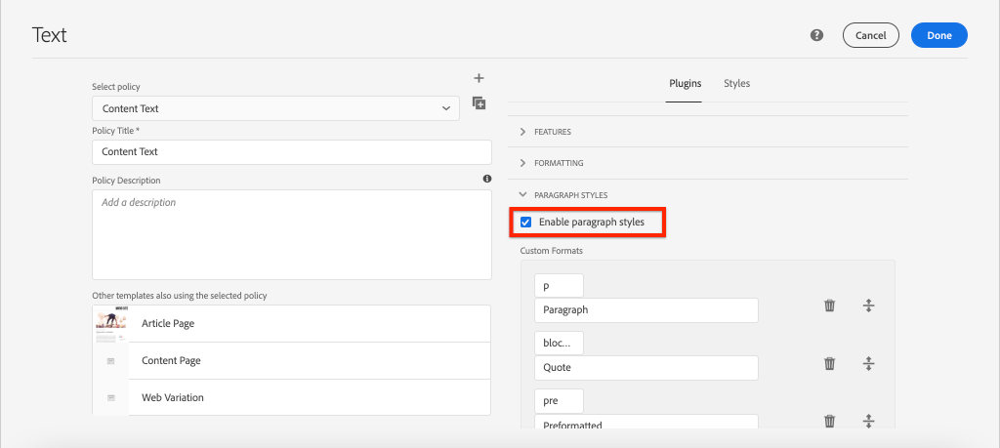

    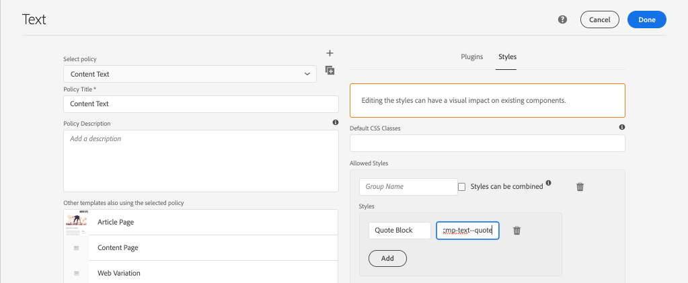

    Click **Done** to save the changes to the Text policy.

### Apply the Quote Block Style

1. Navigate to the **La Skateparks** article in the AEM Sites editor at: [http://localhost:4502/editor.html/content/wknd/us/en/magazine/guide-la-skateparks.html](http://localhost:4502/editor.html/content/wknd/us/en/magazine/guide-la-skateparks.html)
1. In **Edit** mode, choose a Text component. Edit the component to include a quote element:

    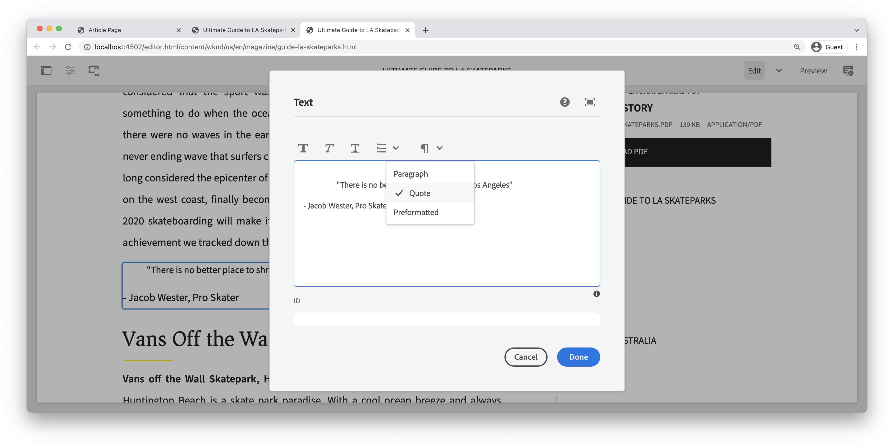

1. Select the text component and click the **paintbrush** icon and select the **Quote Block** style:

    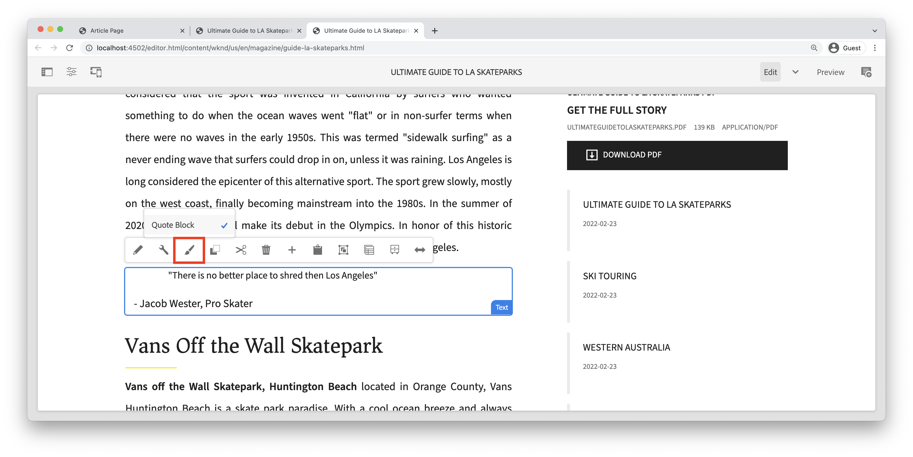

1. Use the browser's developer tools to inspect the markup. You should see the class name `cmp-text--quote` has been added to the outer div of the component:

    ```html
    <!-- Quote Block style class added -->
    <div class="text cmp-text--quote">
        <div data-cmp-data-layer="{&quot;text-60910f4b8d&quot;:{&quot;@type&quot;:&quot;wknd/components/text&quot;,&quot;repo:modifyDate&quot;:&quot;2022-02-24T00:55:26Z&quot;,&quot;xdm:text&quot;:&quot;<blockquote>&amp;nbsp; &amp;nbsp; &amp;nbsp;&amp;quot;There is no better place to shred then Los Angeles&amp;quot;</blockquote>\r\n<p>- Jacob Wester, Pro Skater</p>\r\n&quot;}}" id="text-60910f4b8d" class="cmp-text">
            <blockquote>&nbsp; &nbsp; &nbsp;"There is no better place to shred then Los Angeles"</blockquote>
            <p>- Jacob Wester, Pro Skater</p>
        </div>
    </div>
    ```

### Implement the Quote Block Style - ui.frontend

Next let's implement the Quote Block style using the **ui.frontend** module of the AEM project.

1. If not already running, start the `watch` process from within the **ui.frontend** module:

    ```shell
    $ npm run watch
    ```

1. Update the file `text.scss` from: `ui.frontend/src/main/webpack/components/_text.scss`:

    ```css
    /* Default text style */
    .cmp-text {}
    .cmp-text__paragraph {}
    
    /* WKND Text Quote style */
    .cmp-text--quote {
        .cmp-text {
            background-color: $brand-third;
            margin: 1em 0em;
            padding: 1em;

            blockquote {
                border: none;
                font-size: $font-size-large;
                font-family: $font-family-serif;
                padding: 14px 14px;
                margin: 0;
                margin-bottom: 0.5em;

                &:after {
                    border-bottom: 2px solid $brand-primary; /*yellow border */
                    content: '';
                    display: block;
                    position: relative;
                    top: 0.25em;
                    width: 80px;
                }
            }
            p {
                font-family:  $font-family-serif;
            }
        }
    }
    ```

    >[!CAUTION]
    >
    > In this case raw HTML elements are targeted by the styles. This is because the Text component provides a Rich Text Editor for content authors. Creating styles directly against RTE content should be done with care and it is even more important to tightly scope the styles.

1. Return to the browser once more and you should see that the Quote block style added:

    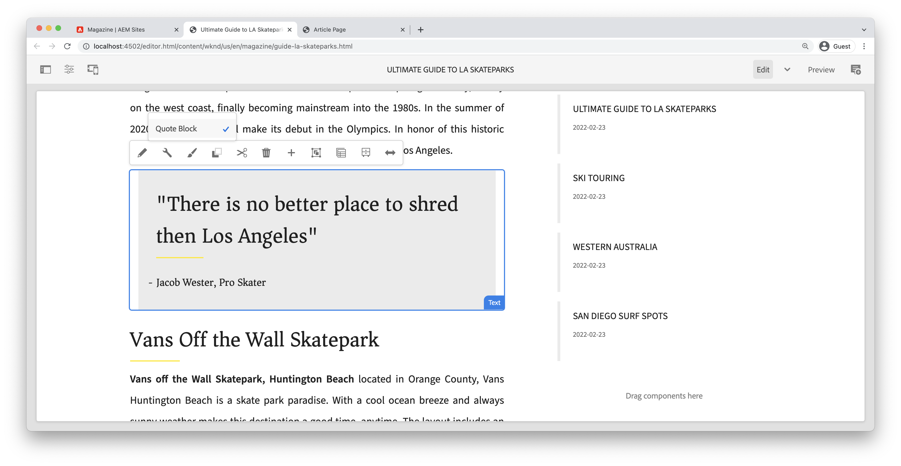

1. Stop the webpack development server.

## Fixed Width - Container (Bonus) {#layout-container}

Container components have been used to create the basic structure of the Article Page Template and provide the drop zones for content authors to add content on a page. Containers can also use the Style System, providing content authors with even more options for designing layouts.

The **Main Container** of the Article Page template contains the two author-able containers and has a fixed width.

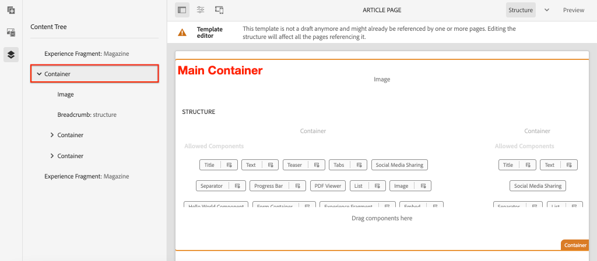

*Main Container in the Article Page Template*.

The policy of the **Main Container** sets the default element as `main`:

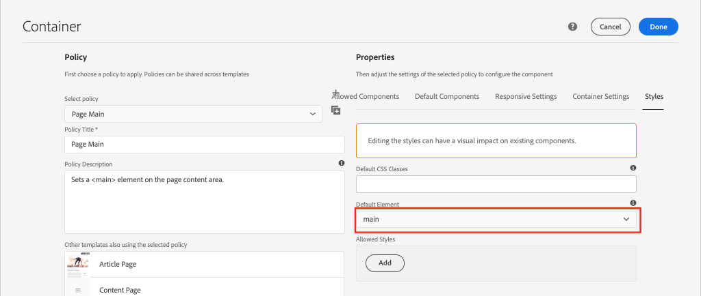

The CSS that makes the **Main Container** fixed is set in the **ui.frontend** module at `ui.frontend/src/main/webpack/site/styles/container_main.scss` :

```SCSS
main.container {
    padding: .5em 1em;
    max-width: $max-content-width;
    float: unset!important;
    margin: 0 auto!important;
    clear: both!important;
}
```

Instead of targeting the `main` HTML element, the Style System could be used to create a **Fixed width** style as part of the Container policy. The Style System could give users the option of toggling between **Fixed width** and **Fluid width** containers.

1. **Bonus Challenge** - use lessons learned from the previous exercises and use the Style System to implement a **Fixed width** and **Fluid width** styles for the Container component.

## Congratulations! {#congratulations}

Congratulations, the Article Page is nearly styled and you gained hands-on experience using the AEM Style System.

### Next Steps {#next-steps}

Learn the end-to-end steps to create a [custom AEM Component](custom-component.md) that displays content authored in a Dialog, and explores developing a Sling Model to encapsulate business logic that populates the component's HTL.

View the finished code on [GitHub](https://github.com/adobe/aem-guides-wknd) or review and deploy the code locally at on the Git branch `tutorial/style-system-solution`.

1. Clone the [github.com/adobe/aem-wknd-guides](https://github.com/adobe/aem-guides-wknd) repository.
1. Check out the `tutorial/style-system-solution` branch.
