# Unit Testing {#unit-testing}

This tutorial covers the implementation of a unit test that validates the behavior of the Byline component's Sling Model, created in the [Custom Component](./custom-component.md) tutorial.

## Prerequisites {#prerequisites}

Review the required tooling and instructions for setting up a [local development environment](overview.md#local-dev-environment).

_If both Java 8 and Java 11 are installed on the system, the VS Code test runner may pick the lower Java runtime when executing the tests, resulting in test failures. If this occurs, uninstall Java 8._

### Starter Project

>[!NOTE]
>
> If you successfully completed the previous chapter you can re-use the project and skip the steps for checking out the starter project.

Check out the base-line code the tutorial builds on:

1. Check out the `tutorial/unit-testing-start` branch from [GitHub](https://github.com/adobe/aem-guides-wknd)

    ```shell
    $ cd aem-guides-wknd
    $ git checkout tutorial/unit-testing-start
    ```

1. Deploy code base to a local AEM instance using your Maven skills:

    ```shell
    $ mvn clean install -PautoInstallSinglePackage
    ```

    >[!NOTE]
    >
    > If using AEM 6.5 or 6.4, append the `classic` profile to any Maven commands.

    ```shell
    $ mvn clean install -PautoInstallSinglePackage -Pclassic
    ```

You can always view the finished code on [GitHub](https://github.com/adobe/aem-guides-wknd/tree/tutorial/unit-testing-start) or check the code out locally by switching to the branch `tutorial/unit-testing-start`.

## Objective

1. Understand the basics of unit testing.
1. Learn about frameworks and tools commonly used to test AEM code.
1. Understand options for mocking or simulating AEM resources when writing unit tests.

## Background {#unit-testing-background}

In this tutorial, we'll explore how to write [Unit Tests](https://en.wikipedia.org/wiki/Unit_testing) for our Byline component's [Sling Model](https://sling.apache.org/documentation/bundles/models.html) (created in the [Creating a custom AEM Component](custom-component.md)). Unit tests are build-time tests written in Java that verify expected behavior of Java code. Each unit tests is typically small, and validates the output of a method (or units of work) against expected results.

We will be using AEM best practices, and use:

* [JUnit 5](https://junit.org/junit5/)
* [Mockito Testing Framework](https://site.mockito.org/)
* [wcm.io Test Framework](https://wcm.io/testing/) (which builds on [Apache Sling Mocks](https://sling.apache.org/documentation/development/sling-mock.html))

## Unit Testing and Adobe Cloud Manager {#unit-testing-and-adobe-cloud-manager}

[Adobe Cloud Manager](https://experienceleague.adobe.com/docs/experience-manager-cloud-manager/using/introduction-to-cloud-manager.html) integrates unit test execution and [code coverage reporting](https://experienceleague.adobe.com/docs/experience-manager-cloud-manager/using/how-to-use/understand-your-test-results.html#code-quality-testing) into its CI/CD pipeline to help encourage and promote the best practice of unit testing AEM code.

While unit testing code is a good practice for any code base, when using Cloud Manager it is important to take advantage of its code quality testing and reporting facilities by providing unit tests for Cloud Manager to run.

## Update the test Maven dependencies {#inspect-the-test-maven-dependencies}

The first step is to inspect Maven dependencies to support writing and running the tests. There are four dependencies required:

1. JUnit5
1. Mockito Test Framework
1. Apache Sling Mocks
1. AEM Mocks Test Framework (by io.wcm)

The **JUnit5**, **Mockito** and **AEM Mocks** test dependencies are automatically added to the project during setup using the [AEM Maven archetype](project-setup.md).

1. To view these dependencies, open the Parent Reactor POM at **aem-guides-wknd/pom.xml**, navigate to the `<dependencies>..</dependencies>` and view the dependencies for JUnit, Mockito, Apache Sling Mocks, and AEM Mock Tests by io.wcm under `<!-- Testing -->`.
1. Ensure that `io.wcm.testing.aem-mock.junit5` is set to **4.1.0**:

    ```xml
    <dependency>
        <groupId>io.wcm</groupId>
        <artifactId>io.wcm.testing.aem-mock.junit5</artifactId>
        <version>4.1.0</version>
        <scope>test</scope>
    </dependency>
    ```

    >[!CAUTION]
    >
    > Archetype **35** generates the project with `io.wcm.testing.aem-mock.junit5` version **4.1.8**. Please downgrade to **4.1.0** to follow the rest of this chapter.

1. Open **aem-guides-wknd/core/pom.xml** and view that the corresponding testing dependencies are available.

    A parallel source folder in the **core** project will contain the unit tests and any supporting test files. This **test** folder provides separation of test classes from the source code but allows the tests to act as if they live in the same packages as the source code.

## Creating the JUnit test {#creating-the-junit-test}

Unit tests typically map 1-to-1 with Java classes. In this chapter, we'll write a JUnit test for the **BylineImpl.java**, which is the Sling Model backing the Byline component.

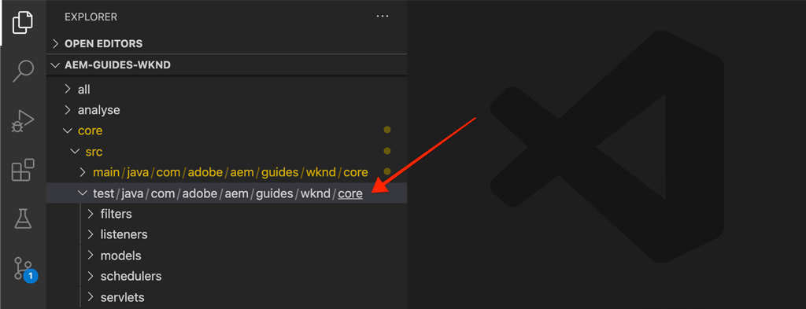

*Location where Unit tests are stored.*

1. Create a unit test for the `BylineImpl.java` by making a new Java class under `src/test/java` in a Java package folder structure that mirrors the location of the the Java class to be tested.

    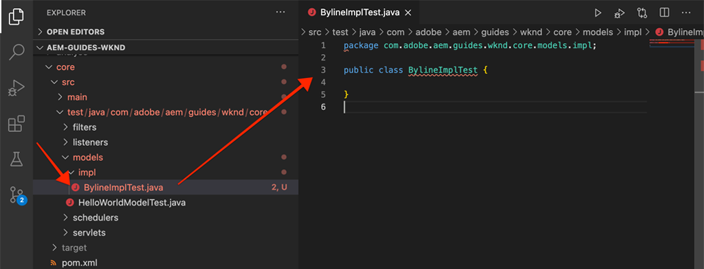

    Since we are testing 

    * `src/main/java/com/adobe/aem/guides/wknd/core/models/impl/BylineImpl.java`

    create a corresponding unit test Java class at 

    * `src/test/java/com/adobe/aem/guides/wknd/core/models/impl/BylineImplTest.java`

    The `Test` suffix on the unit test file, `BylineImplTest.java` is a convention, that allows us to 

    1. Easily identify it as the test file _for_ `BylineImpl.java` 
    1. But also, differentiate the test file _from_ the class being tested, `BylineImpl.java`

## Reviewing BylineImplTest.java {#reviewing-bylineimpltest-java}

At this point, the JUnit test file is an empty Java class. 

1. Update the file with the following code:

    ```java
    package com.adobe.aem.guides.wknd.core.models.impl;

    import static org.junit.jupiter.api.Assertions.*;

    import org.junit.jupiter.api.BeforeEach;
    import org.junit.jupiter.api.Test;

    public class BylineImplTest {

        @BeforeEach
        void setUp() throws Exception {

        }

        @Test 
        void testGetName() { 
            fail("Not yet implemented");
        }
        
        @Test 
        void testGetOccupations() { 
            fail("Not yet implemented");
        }

        @Test 
        void testIsEmpty() { 
            fail("Not yet implemented");
        }
    }
    ```

1. The first method `public void setUp() { .. }` is annotated with JUnit's `@BeforeEach`, which instructs the JUnit test runner to execute this method before running each test method in this class. This provides a handy place to initialize common testing state required by all tests.

1. The subsequent methods are the test methods, whose names are prefixed with `test` by convention, and marked with the `@Test` annotation. Notice that by default, all our tests are set to fail, as we have not implemented them yet.

    To begin, we start with a single test method for each public method on the class we're testing, so:

    | BylineImpl.java   |              | BylineImplTest.java |
    | ------------------|--------------|---------------------|
    | getName()         | is tested by | testGetName()       |
    | getOccupations()  | is tested by | testGetOccupations()|
    | isEmpty()         | is tested by | testIsEmpty()       |

    These methods can be expanded on as needed, as we'll see later on in this chapter.

   When this JUnit test class (also known as a JUnit Test Case) is run, each method marked with the `@Test` will execute as a test which can either pass or fail.

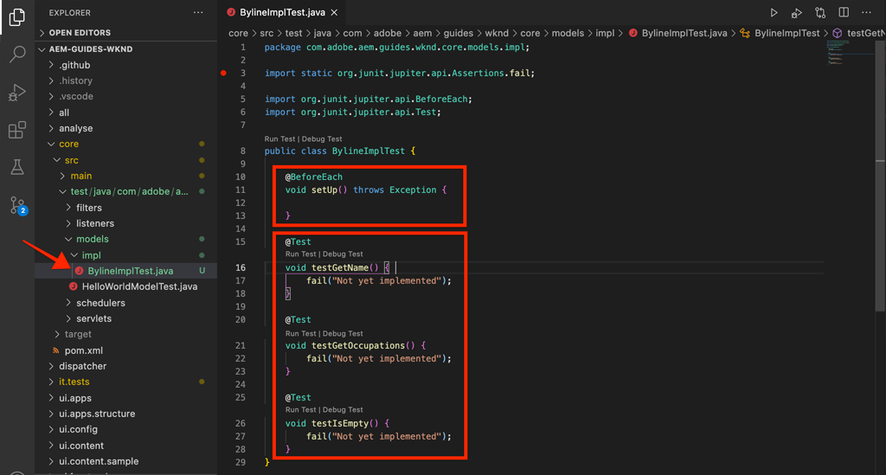

*`core/src/test/java/com/adobe/aem/guides/wknd/core/models/impl/BylineImplTest.java`*

1. Run the JUnit Test Case by right-clicking on the `BylineImplTest.java` file, and tapping **Run**.
   As expected, all tests fail, as they have not been implemented yet.

    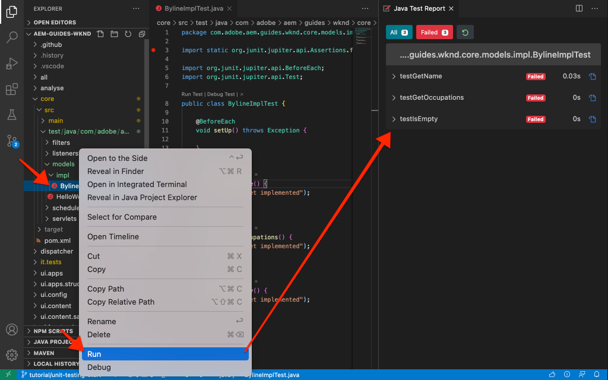

    *Right-click on BylineImplTests.java > Run*

## Reviewing BylineImpl.java {#reviewing-bylineimpl-java}

When writing unit tests, there are two primary approaches:

* [TDD or Test Driven Development](https://en.wikipedia.org/wiki/Test-driven_development), which involves writing the unit tests incrementally, immediately before the implementation is developed; write a test, write the implementation to make the test pass.
* Implementation-first Development, which involves developing working code first and then writing tests that validate said code.

In this tutorial, the latter approach is used (as we've already created a working **BylineImpl.java** in a previous chapter). Because of this, we must review and understand its public methods' behaviors, but also some of its implementation details. This may sound contrary, as a good test should only care about the inputs and outputs, however when working in AEM, there are a variety of implementation considerations that are required to be understood in order to construct working tests.

TDD in the context of AEM requires a level of expertise and is best adopted by AEM developers proficient in AEM development and unit testing of AEM code.

## Setting up AEM test context  {#setting-up-aem-test-context}

Most code written for AEM relies on JCR, Sling or AEM APIs, which in turn, require the context of a running AEM to execute properly.

Since unit tests are executed at build, outside the context of a running AEM instance, there is no such context. To facilitate this, [wcm.io's AEM Mocks](https://wcm.io/testing/aem-mock/usage.html) creates mock context that allows these APIs to _mostly_ act as if they are running in AEM.

1. Create an AEM context using **wcm.io's** `AemContext` in **BylineImplTest.java** by adding it as a JUnit extension decorated with `@ExtendWith` to the **BylineImplTest.java** file. The extension takes care of all initialization and cleanup tasks required. Create a class variable for `AemContext` that can be used for all of the test methods.

    ```java
    import org.junit.jupiter.api.extension.ExtendWith;
    import io.wcm.testing.mock.aem.junit5.AemContext;
    import io.wcm.testing.mock.aem.junit5.AemContextExtension;
    ...

    @ExtendWith(AemContextExtension.class)
    class BylineImplTest {

        private final AemContext ctx = new AemContext();

    ```

    This variable, `ctx`, exposes a mock AEM context that provides a number of AEM and Sling abstractions:

    * The BylineImpl Sling Model will be registered into this context
    * Mock JCR content structures are created in this context
    * Custom OSGi services can be registered in this context
    * Provides a variety of common required mock objects and helpers such as SlingHttpServletRequest objects, a variety of mock Sling and AEM OSGi services such as ModelFactory, PageManager, Page, Template, ComponentManager, Component, TagManager, Tag, etc.
        * *Note that not all methods for these objects are implemented!*
    * And [much more](https://wcm.io/testing/aem-mock/usage.html)!

   The **`ctx`** object will act as the entry point for most of our mock context.

1. In the `setUp(..)` method, which is executed prior to each `@Test` method, define a common mock testing state:

    ```java
    @BeforeEach
    public void setUp() throws Exception {
        ctx.addModelsForClasses(BylineImpl.class);
        ctx.load().json("/com/adobe/aem/guides/wknd/core/models/impl/BylineImplTest.json", "/content");
    }
    ```

    * **`addModelsForClasses`** registers the Sling Model to be tested, into the mock AEM Context, so it can be instantiated in the `@Test` methods.
    * **`load().json`** loads resource structures into the mock context, allowing the code to interact with these resources as if they were provided by a real repository. The resource definitions in the file **`BylineImplTest.json`** are loaded into the mock JCR context under **/content**.
    * **`BylineImplTest.json`** does not yet, exist, so let's create it and define the JCR resource structures that are needed for the test.

1. The JSON files that represent the mock resource structures are stored under **core/src/test/resources** following the same package pathing as the JUnit Java test file.

    Create a new JSON file at `core/test/resources/com/adobe/aem/guides/wknd/core/models/impl` named **BylineImplTest.json** with the following content:

    ```json
    {
        "byline": {
        "jcr:primaryType": "nt:unstructured",
        "sling:resourceType": "wknd/components/content/byline"
        }
    }
    ```

    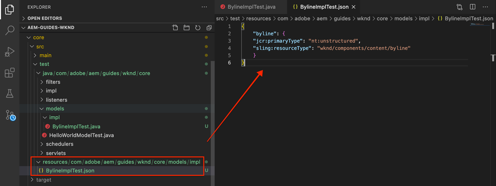

    This JSON defines a mock resource (JCR node) for the Byline component unit test. At this point, the JSON has the minimum set of properties required to represent a Byline component content resource, the `jcr:primaryType` and `sling:resourceType`.

    A general rule when working with unit tests is to create the minimal set of mock content, context, and code required to satisfy each test. Avoid the temptation of building out complete mock context before writing the tests, as it often results in unneeded artifacts.

    Now with the existence of **BylineImplTest.json**, when `ctx.json("/com/adobe/aem/guides/wknd/core/models/impl/BylineImplTest.json", "/content")` is executed, the mock resource definitions are loaded into the context at the path **/content.**

## Testing getName() {#testing-get-name}

Now that we have a basic mock context setup, let's write our first test for **BylineImpl's getName()**. This test must ensure the method **getName()** returns the correct authored name stored at the resource's "**name"** property.

1. Update the **testGetName**() method in **BylineImplTest.java** as follows:

    ```java
    import com.adobe.aem.guides.wknd.core.models.Byline;
    ...
    @Test
    public void testGetName() {
        final String expected = "Jane Doe";

        ctx.currentResource("/content/byline");
        Byline byline = ctx.request().adaptTo(Byline.class);

        String actual = byline.getName();

        assertEquals(expected, actual);
    }

    ```

    * **`String expected`** sets the expected value. We will set this to "**Jane Done**".
    * **`ctx.currentResource`** sets the context of the mock resource to evaluate the code against, so this is set to **/content/byline** as that is where the mock byline content resource is loaded.
    * **`Byline byline`** instantiates the Byline Sling Model by adapting it from the mock Request object.
    * **`String actual`** invokes the method we're testing, `getName()`, on the Byline Sling Model object.
    * **`assertEquals`** asserts the expected value matches the value returned by the byline Sling Model object. If these values are not equal, the test will fail.

1. Run the test... and it fails with a `NullPointerException`.

    Note that this test does NOT fail because we never defined a `name` property in the mock JSON, that will cause the test to fail however the test execution hasn't gotten to that point! This test fails due to a `NullPointerException` on the byline object itself.

1. In the `BylineImpl.java`, if `@PostConstruct init()` throws an exception it prevents the Sling Model from instantiating, and causing that Sling Model object to be null.

    ```java
    @PostConstruct
    private void init() {
        image = modelFactory.getModelFromWrappedRequest(request, request.getResource(), Image.class);
    }
    ```

    It turns out that while the ModelFactory OSGi service is provided via the `AemContext` (by way of the Apache Sling Context), not all methods are implemented, including `getModelFromWrappedRequest(...)` which is called in the BylineImpl's `init()` method. This results in an [AbstractMethodError](https://docs.oracle.com/en/java/javase/11/docs/api/java.base/java/lang/AbstractMethodError.html), which in term causes `init()` to fail, and the resulting adaption of the `ctx.request().adaptTo(Byline.class)` is a null object.

    Since the provided mocks cannot accommodate our code, we must implement the mock context ourselves For this, we can use Mockito to create a mock ModelFactory object, that returns a mock Image object when `getModelFromWrappedRequest(...)` is invoked upon it.

    Since in order to even instantiate the Byline Sling Model, this mock context must be in place, we can add it to the `@Before setUp()` method. We also need to add the `MockitoExtension.class` to the `@ExtendWith` annotation above the **BylineImplTest** class.

    ```java
    package com.adobe.aem.guides.wknd.core.models.impl;

    import org.mockito.junit.jupiter.MockitoExtension;
    import org.mockito.Mock;

    import com.adobe.aem.guides.wknd.core.models.Byline;
    import com.adobe.cq.wcm.core.components.models.Image;

    import io.wcm.testing.mock.aem.junit5.AemContext;
    import io.wcm.testing.mock.aem.junit5.AemContextExtension;

    import org.apache.sling.models.factory.ModelFactory;
    import org.junit.jupiter.api.BeforeEach;
    import org.junit.jupiter.api.Test;
    import org.junit.jupiter.api.extension.ExtendWith;

    import static org.junit.jupiter.api.Assertions.*;
    import static org.mockito.Mockito.*;
    import org.apache.sling.api.resource.Resource;

    @ExtendWith({ AemContextExtension.class, MockitoExtension.class })
    public class BylineImplTest {

        private final AemContext ctx = new AemContext();

        @Mock
        private Image image;

        @Mock
        private ModelFactory modelFactory;

        @BeforeEach
        public void setUp() throws Exception {
            ctx.addModelsForClasses(BylineImpl.class);

            ctx.load().json("/com/adobe/aem/guides/wknd/core/models/impl/BylineImplTest.json", "/content");

            lenient().when(modelFactory.getModelFromWrappedRequest(eq(ctx.request()), any(Resource.class), eq(Image.class)))
                    .thenReturn(image);

            ctx.registerService(ModelFactory.class, modelFactory, org.osgi.framework.Constants.SERVICE_RANKING,
                    Integer.MAX_VALUE);
        }

        @Test
        void testGetName() { ...
    }
    ```

    * **`@ExtendWith({AemContextExtension.class, MockitoExtension.class})`** marks the Test Case class to be run with the [Mockito JUnit Jupiter Extension](https://www.javadoc.io/page/org.mockito/mockito-junit-jupiter/latest/org/mockito/junit/jupiter/MockitoExtension.html) which allows for the use of the @Mock annotations to define mock objects at the Class level.
    * **`@Mock private Image`** creates a mock object of type `com.adobe.cq.wcm.core.components.models.Image`. Note that this is defined at the class level so that, as needed, `@Test` methods can alter its behavior as needed.
    * **`@Mock private ModelFactory`** creates a mock object of type ModelFactory. Note that this is a pure Mockito mock and has no methods implemented on it. Note that this is defined at the class level so that, as needed, `@Test`methods can alter its behavior as needed.
    * **`when(modelFactory.getModelFromWrappedRequest(..)`** registers mock behavior for when `getModelFromWrappedRequest(..)` is called on the mock ModelFactory object. The result defined in `thenReturn (..)` is to return the mock Image object. Note that this behavior is only invoked when: the 1st parameter is equal to the `ctx`'s  request object, the 2nd param is any Resource object, and the 3rd param must be the Core Components Image class. We accept any Resource because throughout our tests we will be setting the `ctx.currentResource(...)` to various mock resources defined in the **BylineImplTest.json**. Note that we add the **lenient()** strictness because we will later want to override this behavior of the ModelFactory.
    * **`ctx.registerService(..)`.** registers the mock ModelFactory object into the AemContext, with the highest service ranking. This is required since the ModelFactory used in the BylineImpl's `init()` is injected via the `@OSGiService ModelFactory model` field. In order for the AemContext to inject **our** mock object, which handles calls to `getModelFromWrappedRequest(..)`, we must register it as the highest ranking Service of that type (ModelFactory).

1. Re-run the test, and again it fails, but this time the message is clear why its failed.

    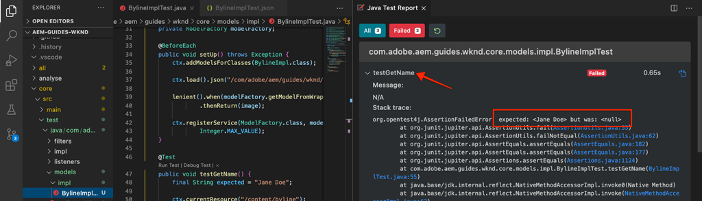

    *testGetName() failure due to assertion*

    We receive an **AssertionError** which means the assert condition in the test failed, and it tells us the **expected value is "Jane Doe"** but the **actual value is null**. This makes sense because the "**name"** property has not been added to mock **/content/byline** resource definition in **BylineImplTest.json**, so let's add it:

1. Update **BylineImplTest.json** to define `"name": "Jane Doe".`

    ```json
    {
        "byline": {
        "jcr:primaryType": "nt:unstructured",
        "sling:resourceType": "wknd/components/content/byline",
        "name": "Jane Doe"
        }
    }
    ```

1. Re-run the test, and **`testGetName()`** now passes!

   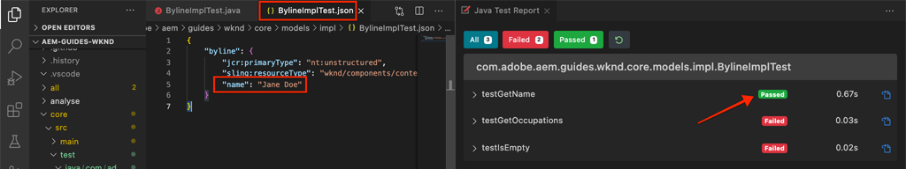


## Testing getOccupations() {#testing-get-occupations}

Ok great! Our first test has passed! Let's move on and test `getOccupations()`. Since the initialization of the mock context was does in the `@Before setUp()`method, this will be available to all `@Test` methods in this Test Case, including `getOccupations()`.

Remember that this method must return an alphabetically sorted list of occupations (descending) stored in the occupations property.

1. Update **`testGetOccupations()`** as follows:

    ```java
    import java.util.List;
    import com.google.common.collect.ImmutableList;
    ...
    @Test
    public void testGetOccupations() {
        List<String> expected = new ImmutableList.Builder<String>()
                                .add("Blogger")
                                .add("Photographer")
                                .add("YouTuber")
                                .build();

        ctx.currentResource("/content/byline");
        Byline byline = ctx.request().adaptTo(Byline.class);

        List<String> actual = byline.getOccupations();

        assertEquals(expected, actual);
    }
    ```

    * **`List<String> expected`** define the expected result.
    * **`ctx.currentResource`** sets the current resource to evaluate the context against to the mock resource definition at /content/byline. This ensures the **BylineImpl.java** executes in the context of our mock resource.
    * **`ctx.request().adaptTo(Byline.class)`** instantiates the Byline Sling Model by adapting it from the mock Request object.
    * **`byline.getOccupations()`** invokes the method we're testing, `getOccupations()`, on the Byline Sling Model object.
    * **`assertEquals(expected, actual)`** asserts expected list is the same as the actual list.

1. Remember, just like **`getName()`** above, the **BylineImplTest.json** does not define occupations, so this test will fail if we run it, since `byline.getOccupations()` will return an empty list.

    Update **BylineImplTest.json** to include a list of occupations, and they will be set in non-alphabetical order to ensure that our tests validate that the occupations are sorted alphabetically by **`getOccupations()`**.

    ```json
    {
        "byline": {
        "jcr:primaryType": "nt:unstructured",
        "sling:resourceType": "wknd/components/content/byline",
        "name": "Jane Doe",
        "occupations": ["Photographer", "Blogger", "YouTuber"]
        }
    }
    ```

1. Run the test, and again we pass! Looks like getting the sorted occupations works!

    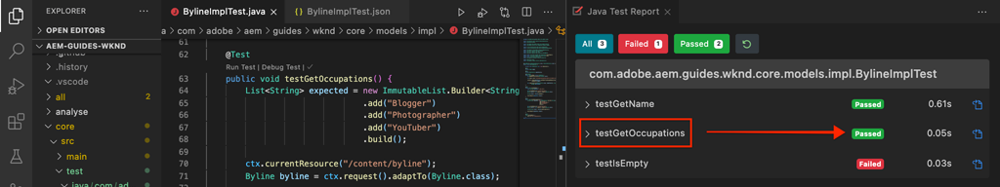

    *testGetOccupations() passes*

## Testing isEmpty() {#testing-is-empty}

The last method to test **`isEmpty()`**.

Testing `isEmpty()` is interesting as it requires testing for a variety of conditions. Reviewing **BylineImpl.java**'s `isEmpty()` method the following conditions must be tested:

* Return true when the name is empty
* Return true when occupations are null or empty
* Return true when the image is null or has no src URL
* Return false when the name, occupations, and Image (with  a src  URL) are present

For this, we need to create new test methods, each testing a specific condition as well as new mock resource structures in `BylineImplTest.json` to drive these tests.

Note that this check allowed us to skip testing for when `getName()`, `getOccupations()` and `getImage()` are empty since the expected behavior of that state is tested via `isEmpty()`.

1. The first test will test the condition of a brand new component, that has no properties set.

   Add a new resource definition to `BylineImplTest.json`, giving it the semantic name "**empty**"

    ```json
    {
        "byline": {
            "jcr:primaryType": "nt:unstructured",
            "sling:resourceType": "wknd/components/content/byline",
            "name": "Jane Doe",
            "occupations": ["Photographer", "Blogger", "YouTuber"]
        },
        "empty": {
            "jcr:primaryType": "nt:unstructured",
            "sling:resourceType": "wknd/components/content/byline"
        }
    }
    ```

    **`"empty": {...}`** define a new resource definition named "empty" that only has a `jcr:primaryType` and `sling:resourceType`.

    Remember we load `BylineImplTest.json` into `ctx` before the execution of each test method in `@setUp`, so this new resource definition is immediately available to us in tests at **/content/empty.**

1. Update `testIsEmpty()` as follows, setting the current resource to the new "**empty**" mock resource definition.

    ```java
    @Test
    public void testIsEmpty() {
        ctx.currentResource("/content/empty");
        Byline byline = ctx.request().adaptTo(Byline.class);

        assertTrue(byline.isEmpty());
    }
    ```

    Run the test and ensure it passes.

1. Next, create a set of methods to ensure that if any of the required data points (name, occupations, or image) are empty, `isEmpty()` returns true.

    For each test, a discrete mock resource definition is used, update **BylineImplTest.json** with the additional resource definitions for **without-name** and **without-occupations**.

    ```json
    {
        "byline": {
            "jcr:primaryType": "nt:unstructured",
            "sling:resourceType": "wknd/components/content/byline",
            "name": "Jane Doe",
            "occupations": ["Photographer", "Blogger", "YouTuber"]
        },
        "empty": {
            "jcr:primaryType": "nt:unstructured",
            "sling:resourceType": "wknd/components/content/byline"
        },
        "without-name": {
            "jcr:primaryType": "nt:unstructured",
            "sling:resourceType": "wknd/components/content/byline",
            "occupations": "[Photographer, Blogger, YouTuber]"
        },
        "without-occupations": {
            "jcr:primaryType": "nt:unstructured",
            "sling:resourceType": "wknd/components/content/byline",
            "name": "Jane Doe"
        }
    }
    ```

    Create the following test methods to test the each of these states.

    ```java
    @Test
    public void testIsEmpty() {
        ctx.currentResource("/content/empty");

        Byline byline = ctx.request().adaptTo(Byline.class);

        assertTrue(byline.isEmpty());
    }

    @Test
    public void testIsEmpty_WithoutName() {
        ctx.currentResource("/content/without-name");

        Byline byline = ctx.request().adaptTo(Byline.class);

        assertTrue(byline.isEmpty());
    }

    @Test
    public void testIsEmpty_WithoutOccupations() {
        ctx.currentResource("/content/without-occupations");

        Byline byline = ctx.request().adaptTo(Byline.class);

        assertTrue(byline.isEmpty());
    }

    @Test
    public void testIsEmpty_WithoutImage() {
        ctx.currentResource("/content/byline");

        lenient().when(modelFactory.getModelFromWrappedRequest(eq(ctx.request()),
            any(Resource.class),
            eq(Image.class))).thenReturn(null);

        Byline byline = ctx.request().adaptTo(Byline.class);

        assertTrue(byline.isEmpty());
    }

    @Test
    public void testIsEmpty_WithoutImageSrc() {
        ctx.currentResource("/content/byline");

        when(image.getSrc()).thenReturn("");

        Byline byline = ctx.request().adaptTo(Byline.class);

        assertTrue(byline.isEmpty());
    }
    ```

    **`testIsEmpty()`** tests against the empty mock resource definition, and asserts that `isEmpty()` is true.

    **`testIsEmpty_WithoutName()`** tests against a mock resource definition that has occupations but no name.

    **`testIsEmpty_WithoutOccupations()`** tests against a mock resource definition that has a name but no occupations.

    **`testIsEmpty_WithoutImage()`** tests against a mock resource definition with a name and occupations but sets the mock Image to return to null. Note that we want to override the `modelFactory.getModelFromWrappedRequest(..)`behavior defined in `setUp()` to ensure the Image object returned by this call is null. The Mockito stubs feature is strict and does not want duplicitous code. Therefore we set the mock with **`lenient`** settings to explicitly note we are overriding the behavior in the `setUp()` method.

    **`testIsEmpty_WithoutImageSrc()`** tests against a mock resource definition with a name and occupations, but sets the mock Image to return a blank string when `getSrc()` is invoked.

1. Lastly, write a test to ensure that **isEmpty()** returns false when the component is properly configured. For this condition, we can re-use **/content/byline** which represents a fully configured Byline component.

    ```java
    @Test
    public void testIsNotEmpty() {
        ctx.currentResource("/content/byline");
        when(image.getSrc()).thenReturn("/content/bio.png");

        Byline byline = ctx.request().adaptTo(Byline.class);

        assertFalse(byline.isEmpty());
    }
    ```

1. Now run all the unit tests in in the BylineImplTest.java file, and review the Java Test Report output.

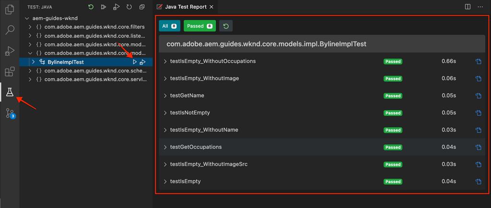

## Running unit tests as part of the build {#running-unit-tests-as-part-of-the-build}

Unit tests are executed are required to pass as part of the maven build. This ensures that all tests successfully pass before an application be be deployed. Executing Maven goals such as package or install automatically invoke and require the passing of all unit tests in the project.

```shell
$ mvn package
```

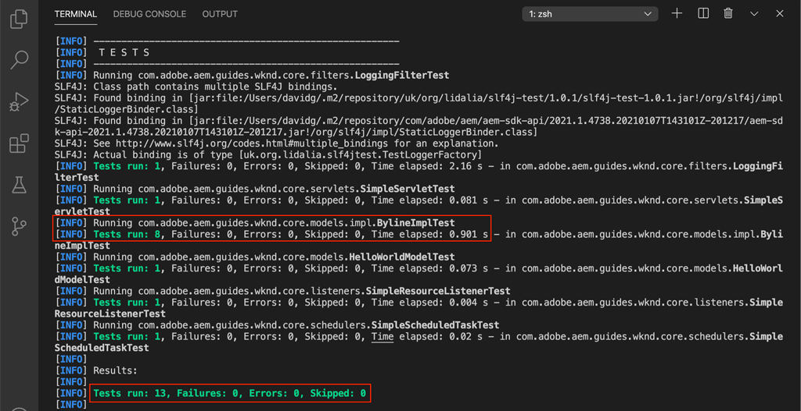

```shell
$ mvn package
```

Likewise, if we change a test method to fail, the build fails and reports which test failed and why.

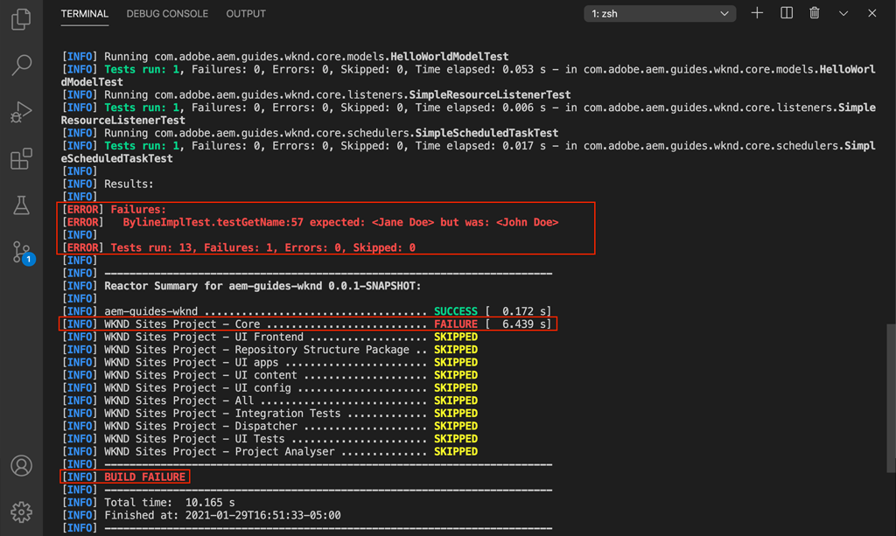

## Review the code {#review-the-code}

View the finished code on [GitHub](https://github.com/adobe/aem-guides-wknd) or review and deploy the code locally at on the Git brach `tutorial/unit-testing-solution`.
