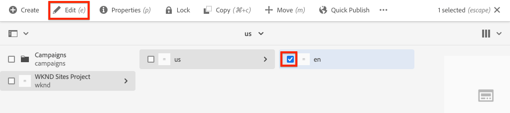
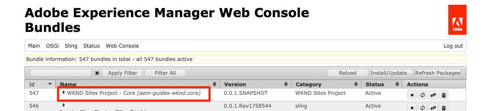
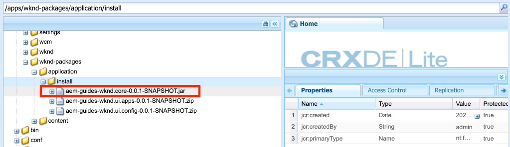
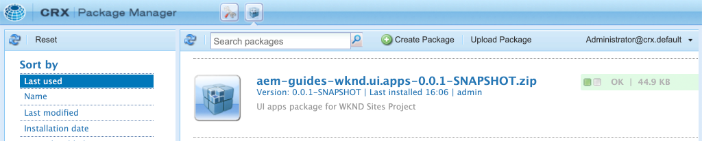

# Project Setup {#project-setup}

This tutorial covers the creation of a Maven Multi Module Project to manage the code and configurations for an Adobe Experience Manager Site.

## Prerequisites {#prerequisites}

Review the required tooling and instructions for setting up a [local development environment](overview.md#local-dev-environment). Ensure that you have a fresh instance of Adobe Experience Manager available locally and that no additional sample/demo packages have been installed (other than required Service Packs).

## Objective {#objective}

1. Learn how to generate a new AEM project using a Maven archetype.
1. Understand the different modules generated by the AEM Project Archetype and how they work together.
1. Understand how AEM Core Components are included in an AEM Project.

## What you will build {#what-build}

>[!VIDEO](https://video.tv.adobe.com/v/30152/?quality=12&learn=on)

In this chapter, you will generate a new Adobe Experience Manager project using the [AEM Project Archetype](https://github.com/adobe/aem-project-archetype). Your AEM project contains all of the code, content, and configurations used for a Sites implementation. The project generated in this chapter will serve as the basis for an implementation of the WKND Site and will be built upon in future chapters.

## Background {#background}

**What is a Maven project?** - [Apache Maven](https://maven.apache.org/) is a software management tool to build projects. *All Adobe Experience Manager* implementations use Maven projects to build, manage and deploy custom code on top of AEM.

**What is a Maven archetype?** - A [Maven archetype](https://maven.apache.org/archetype/index.html) is a template or pattern for generating new projects. The AEM Project archetype allows us to generate a new project with a custom namespace and include a project structure that follows best practices, greatly accelerating our project.

## Create the project {#create}

There are a  couple  options for creating a Maven Multi-module project for AEM. This tutorial will leverage the [Maven AEM Project Archetype **22**](https://github.com/adobe/aem-project-archetype). Cloud Manager also [provides a UI wizard](https://docs.adobe.com/content/help/en/experience-manager-cloud-manager/using/getting-started/create-an-application-project.html) to initiate the creation of an AEM application project. The underlying project generated by the Cloud Manager UI results in the same structure as using the archetype directly.

>[!NOTE]
>
>For the purposes of following this tutorial please use version **22** of the archetype. However, it is always a best practice to use the **latest** version of the archetype to generate a new project.

The next series of steps will take place using a UNIX based command line  terminal, but should be similar if using a Windows terminal.

1. Open up a command line terminal and verify that Maven has been installed and added to the command line path:

    ```shell
    $ mvn --version
    Apache Maven 3.6.2
    Maven home: /Library/apache-maven-3.6.2
    Java version: 11.0.4, vendor: Oracle Corporation, runtime: /Library/Java/JavaVirtualMachines/jdk-11.0.4.jdk/Contents/Home
    ```

1. Verify that the **adobe-public** profile is active by running the following command:

    ```shell
    $ mvn help:effective-settings
        ...
    <activeProfiles>
        <activeProfile>adobe-public</activeProfile>
    </activeProfiles>
    <pluginGroups>
        <pluginGroup>org.apache.maven.plugins</pluginGroup>
        <pluginGroup>org.codehaus.mojo</pluginGroup>
    </pluginGroups>
    </settings>
    [INFO] ------------------------------------------------------------------------
    [INFO] BUILD SUCCESS
    [INFO] ------------------------------------------------------------------------
    [INFO] Total time:  0.856 s
    ```

    If you do **not** see the **adobe-public** it is an indication that the Adobe repo is not properly referenced in your `~/.m2/settings.xml` file. Please revisit the steps to install and configure Apache Maven in [a local development environment](https://docs.adobe.com/content/help/en/experience-manager-learn/foundation/development/set-up-a-local-aem-development-environment.html#install-apache-maven).

1. Navigate to a directory in which you want to generate the AEM project. This can be any directory in which you want to maintain your project's source code. For example a directory named `code` beneath the user's home directory:

    ```shell
    $ cd ~/code
    ```

1. Paste the following into the command line to [generate the project in batch mode](https://maven.apache.org/archetype/maven-archetype-plugin/examples/generate-batch.html):

    ```shell
    $ mvn archetype:generate -B \
        -DarchetypeGroupId=com.adobe.granite.archetypes \
        -DarchetypeArtifactId=aem-project-archetype \
        -DarchetypeVersion=22 \
        -DgroupId=com.adobe.aem.guides \
        -Dversion=0.0.1-SNAPSHOT \
        -DappsFolderName=wknd \
        -DartifactId=aem-guides-wknd \
        -Dpackage=com.adobe.aem.guides.wknd \
        -DartifactName="WKND Sites Project" \
        -DcomponentGroupName=WKND \
        -DconfFolderName=wknd \
        -DcontentFolderName=wknd \
        -DcssId=wknd \
        -DisSingleCountryWebsite=n \
        -Dlanguage_country=en_us \
        -DoptionAemVersion=6.5.0 \
        -DoptionDispatcherConfig=none \
        -DoptionIncludeErrorHandler=n \
        -DoptionIncludeExamples=y \
        -DoptionIncludeFrontendModule=y \
        -DpackageGroup=wknd \
        -DsiteName="WKND Site"
    ```

    >[!NOTE]
    >
    >By default generating a project from the Maven archetype uses interactive mode. To avoid fat-fingering any values we have you generate using the batch mode. It is also possible to create the Maven AEM project using the [AEM Developer Tools plugin for Eclipse](https://helpx.adobe.com/experience-manager/6-5/sites/developing/using/aem-eclipse.html).

    >[!CAUTION]
    >
    >If you receive an error like the following: *Failed to execute goal org.apache.maven.plugins:maven-archetype-plugin:3.1.1:generate (default-cli) on project standalone-pom: The desired archetype does not exist*. It is an indication that the Adobe repo is not properly referenced in your `~/.m2/settings.xml` file. Please revisit the earlier steps and verify that the settings.xml file references the Adobe repo.

    The following table lists the values used for this tutorial:

    | Name                        | Values | Description |
    |-----------------------------|---------|--------------------|
    | groupId                     | com.adobe.aem.guides       | Base Maven groupId |
    | artifactId                  | aem-guides-wknd            | Base Maven ArtifactId |
    | version                     | 0.0.1-SNAPSHOT             | Version |
    | package                     | com.adobe.aem.guides.wknd  | Java Source Package |
    | appsFolderName              | wknd                       | /apps folder name |
    | artifactName                | WKND Sites Project         | Maven Project Name |
    | componentGroupName          | WKND                       | AEM component group name |
    | contentFolderName           | wknd                       | /content folder name |
    | confFolderName              | wknd                       | /conf folder name |
    | cssId                       | wknd                       | prefix used in generated css |
    | packageGroup                | wknd                       | Content Package Group name |
    | siteName                    | WKND Site                  | AEM site name |
    | optionAemVersion            | 6.5.0                      | Target AEM version |
    | language_country            | en_us                      | language / country code to create the content structure from (e.g. en_us) |
    | optionIncludeExamples       | y                          | Include a Component Library example site |
    | optionIncludeErrorHandler   | n                          | Include a custom 404 response page |
    | optionIncludeFrontendModule | y                          | Include a dedicated frontend module |
    | isSingleCountryWebsite      | n                          | Create language-master structure in example content |
    | optionDispatcherConfig      | none                       | Generate a dispatcher configuration module |

1. The following folder and file structure will be generated by the Maven archetype on your local file system:

    ```plain
     ~/code/
        |--- aem-guides-wknd/
            |--- all/
            |--- core/
            |--- ui.apps/
            |--- ui.content/
            |--- ui.frontend /
            |--- it.launcher/
            |--- it.tests/
            |--- pom.xml
            |--- README.md
            |--- .gitignore
    ```

## Build the project {#build}

Now that we have generated a new project, we can deploy the project code to a local instance of AEM.

1. Ensure you have an instance of AEM running locally on port **4502**.
1. From the command line navigate into the `aem-guides-wknd` project directory.

    ```shell
    $ cd aem-guides-wknd
    ```

1. Run the following command to build and deploy the entire project to AEM:

    ```shell
    $ mvn -PautoInstallSinglePackage clean install
    ...
    [INFO] ------------------------------------------------------------------------
    [INFO] Reactor Summary for aem-guides-wknd 0.0.1-SNAPSHOT:
    [INFO]
    [INFO] aem-guides-wknd .................................... SUCCESS [  0.394 s]
    [INFO] WKND Sites Project - Core .......................... SUCCESS [  7.299 s]
    [INFO] WKND Sites Project - UI Frontend ................... SUCCESS [ 31.938 s]
    [INFO] WKND Sites Project - Repository Structure Package .. SUCCESS [  0.736 s]
    [INFO] WKND Sites Project - UI apps ....................... SUCCESS [  4.025 s]
    [INFO] WKND Sites Project - UI content .................... SUCCESS [  1.447 s]
    [INFO] WKND Sites Project - All ........................... SUCCESS [  0.881 s]
    [INFO] WKND Sites Project - Integration Tests Bundles ..... SUCCESS [  1.052 s]
    [INFO] WKND Sites Project - Integration Tests Launcher .... SUCCESS [  1.239 s]
    [INFO] ------------------------------------------------------------------------
    [INFO] BUILD SUCCESS
    [INFO] ------------------------------------------------------------------------
    ```

    The Maven profile `autoInstallSinglePackage` compiles the individual modules of the project and deploys a single package to the AEM instance. By default this package will be deployed to an AEM instance running locally on port **4502** and with the credentials of `admin:admin`.

1. Navigate to Package Manager on your local AEM instance: [http://localhost:4502/crx/packmgr/index.jsp](http://localhost:4502/crx/packmgr/index.jsp). You should see three packages for `aem-guides-wknd.ui.apps`, `aem-guides-wknd.ui.content`, and `aem-guides-wknd.all`.

    You should also see multiple packages for [AEM Core Components](https://docs.adobe.com/content/help/en/experience-manager-core-components/using/introduction.html) which are included in the project by the archetype. This will be covered later in the tutorial.

1. Navigate to the Sites console: [http://localhost:4502/sites.html/content](http://localhost:4502/sites.html/content). The WKND Site will be one of the sites. It will include a site structure with a US and Language Masters hierarchy. This site hierarchy is based on the values for `language_country` and `isSingleCountryWebsite` when generating the project using the archetype.

1. Open the **US** `>` **English** page by selecting the page and clicking the **Edit** button in the menu bar:

    

1. Some content is already created and several components are available to be added to a page. Experiment with these components to get an idea of the functionality. How this page and components are configured will be explored in detail later in the tutorial.

## Inspect the project {#project-structure}

The AEM archetype is made up of individual Maven modules:

* [core](https://docs.adobe.com/content/help/en/experience-manager-core-components/using/developing/archetype/core.html) - Java bundle containing all core functionality like OSGi services, listeners or schedulers, as well as component-related Java code such as servlets or request filters.
* [ui.apps](https://docs.adobe.com/content/help/en/experience-manager-core-components/using/developing/archetype/uiapps.html) - contains the /apps parts of the project, ie JS&CSS clientlibs, components, and OSGi configs
* [ui.content](https://docs.adobe.com/content/help/en/experience-manager-core-components/using/developing/archetype/uicontent.html) - contains structural content and configurations like editable templates, metadata schemas (/content, /conf)
* ui.tests - Java bundle containing JUnit tests that are executed server-side. This bundle is not to be deployed onto production.
* ui.launcher - contains glue code that deploys the ui.tests bundle (and dependent bundles) to the server and triggers the remote JUnit execution
* [ui.frontend](https://docs.adobe.com/content/help/en/experience-manager-core-components/using/developing/archetype/uifrontend.html) - (optional) contains the artifacts required to use the Webpack-based front-end build module.
* all - this is an empty Maven module that combines the above modules into a single package that can be deployed to an AEM environment.


See the [AEM Project Archetype documentation](https://docs.adobe.com/content/help/en/experience-manager-core-components/using/developing/archetype/overview.html) to learn more details of the Maven modules.

## Advanced Maven commands {#advanced-maven-commands}

During development you may be working with just one of the modules and want to avoid building the entire project in order to save time. You may also want to deploy directly to an AEM Publish instance or perhaps to an instance of AEM not running on port 4502.

Next we will look at some additional Maven profiles and commands you can use for greater flexibility during development.

### Core module {#core-module}

The **[core](https://docs.adobe.com/content/help/en/experience-manager-core-components/using/developing/archetype/core.html)** module contains all of the Java code associated with the project. When built it deploys an OSGi bundle to AEM. To build just this module:

1. Navigate into the `core` folder (beneath `aem-guides-wknd`):

    ```shell
    $ cd core/
    ```

1. Run the following command:

    ```shell
    $ mvn -PautoInstallBundle clean install
    ...
    [INFO] --- sling-maven-plugin:2.4.0:install (install-bundle) @ aem-guides-wknd.core ---
    [INFO] Installing Bundle aem-guides-wknd.core(~/code/aem-guides-wknd/core/target/aem-guides-wknd.core-0.0.1-SNAPSHOT.jar) to http://localhost:4502/system/console via WebConsole
    [INFO] Bundle installed
    [INFO] ------------------------------------------------------------------------
    [INFO] BUILD SUCCESS
    [INFO] ------------------------------------------------------------------------
    [INFO] Total time:  8.558 s
    [INFO] Finished at: 2019-12-06T13:40:21-08:00
    [INFO] ------------------------------------------------------------------------
    ```

1. Navigate to [http://localhost:4502/system/console/bundles](http://localhost:4502/system/console/bundles). This is the OSGi Web console and contains information about all of the bundles installed on the AEM instance.

1. Toggle the **Id** sort column and you should see the WKND bundle installed and active.

    

1. You can see the 'physical' location of the jar in [CRXDE-Lite](http://localhost:4502/crx/de/index.jsp#/apps/wknd/install/wknd-sites-guide.core-0.0.1-SNAPSHOT.jar):

    

### Ui.apps and Ui.content modules {#apps-content-module}

The **[ui.apps](https://docs.adobe.com/content/help/en/experience-manager-core-components/using/developing/archetype/uiapps.html)** maven module contains all of the rendering code needed for the site beneath `/apps`. This includes CSS/JS that will be stored in an AEM format called [clientlibs](https://helpx.adobe.com/experience-manager/6-5/sites/developing/using/clientlibs.html). This also includes [HTL](https://docs.adobe.com/docs/en/htl/overview.html) scripts for rendering dynamic HTML. You can think of the **ui.apps** module as a map to the structure in the JCR but in a format that can be stored on a file system and committed to source control. The **ui.apps** module only contains code.

To build the just this module:

1. From the command line. Navigate into the `ui.apps` folder (beneath `aem-guides-wknd`):

    ```shell
    $ cd ../ui.apps
    ```

1. Run the following command:

    ```shell
    $ mvn -PautoInstallPackage clean install
    ...
    Package installed in 122ms.
    [INFO] ------------------------------------------------------------------------
    [INFO] BUILD SUCCESS
    [INFO] ------------------------------------------------------------------------
    [INFO] Total time:  6.972 s
    [INFO] Finished at: 2019-12-06T14:44:12-08:00
    [INFO] ------------------------------------------------------------------------
    ```

1. Navigate to [http://localhost:4502/crx/packmgr/index.jsp](http://localhost:4502/crx/packmgr/index.jsp). You should see the `ui.apps` package as the first installed package and it should have a more recent timestamp then any of the other packages.

    

1. Return to the command line and run the following command (within the `ui.apps` folder):

    ```shell
    $ mvn -PautoInstallPackagePublish clean install
    ...
    [INFO] --- content-package-maven-plugin:1.0.2:install (install-package-publish) @ aem-guides-wknd.ui.apps ---
    [INFO] Installing aem-guides-wknd.ui.apps (/Users/dgordon/code/aem-guides-wknd/ui.apps/target/aem-guides-wknd.ui.apps-0.0.1-SNAPSHOT.zip) to http://localhost:4503/crx/packmgr/service.jsp
    [INFO] I/O exception (java.net.ConnectException) caught when processing request: Connection refused (Connection refused)
    [INFO] Retrying request
    [INFO] I/O exception (java.net.ConnectException) caught when processing request: Connection refused (Connection refused)
    [INFO] Retrying request
    [INFO] I/O exception (java.net.ConnectException) caught when processing request: Connection refused (Connection refused)
    [INFO] Retrying request
    [INFO] ------------------------------------------------------------------------
    [INFO] BUILD FAILURE
    [INFO] ------------------------------------------------------------------------
    [INFO] Total time:  6.717 s
    [INFO] Finished at: 2019-12-06T14:51:45-08:00
    [INFO] ------------------------------------------------------------------------
    ```

    The profile `autoInstallPackagePublish` is intended to deploy the package to a Publish environment running on port **4503**. The above error is expected if an AEM instance running on http://localhost:4503 cannot be found.

1. Finally run the following command to deploy the `ui.apps` package on port **4504**:

    ```shell
    $ mvn -PautoInstallPackage clean install -Daem.port=4504
    ...
    [INFO] --- content-package-maven-plugin:1.0.2:install (install-package) @ aem-guides-wknd.ui.apps ---
    [INFO] Installing aem-guides-wknd.ui.apps (/Users/dgordon/code/aem-guides-wknd/ui.apps/target/aem-guides-wknd.ui.apps-0.0.1-SNAPSHOT.zip) to http://localhost:4504/crx/packmgr/service.jsp
    [INFO] I/O exception (java.net.ConnectException) caught when processing request: Connection refused (Connection refused)
    [INFO] Retrying request
    [INFO] I/O exception (java.net.ConnectException) caught when processing request: Connection refused (Connection refused)
    [INFO] Retrying request
    [INFO] I/O exception (java.net.ConnectException) caught when processing request: Connection refused (Connection refused)
    [INFO] Retrying request
    [INFO] ------------------------------------------------------------------------
    [INFO] BUILD FAILURE
    [INFO] --------------------------------------------------------------------
    ```

    Again a build failure is expected to occur if no AEM instance running on port **4504** is available. The parameter `aem.port` is defined in the POM file at `aem-guides-wknd/pom.xml`.

The **[ui.content](https://docs.adobe.com/content/help/en/experience-manager-core-components/using/developing/archetype/uicontent.htm)** module is structured the same way as the **ui.apps** module. The only difference is that the **ui.content** module contains what is known as **mutable** content. **Mutable** content essentially refers to non-code configurations like Templates, Policies, or folder structures that is stored in source-control **but** could be modified on an AEM instance directly. This will be explored in much more detail in the chapter on Pages and Templates. For now the important takeaway is that the same Maven commands used to build the **ui.apps** module can be used to build the **ui.content** module. Feel free to repeat the above steps from within the **ui.content** folder.

### Ui.frontend module {#ui-frontend-module}

The **[ui.frontend](https://docs.adobe.com/content/help/en/experience-manager-core-components/using/developing/archetype/uifrontend.html)** module is a Maven module that is actually a [webpack](https://webpack.js.org/) project. This module is set up to be a dedicated front-end build system that outputs JavaScript and CSS files, which are in turn deployed to AEM. The **ui.frontend** module allows developers to code with languages like [Sass](https://sass-lang.com/), [TypeScript](https://www.typescriptlang.org/), use [npm](https://www.npmjs.com/) modules and integrate the output directly into AEM.

The **ui.frontend** module will be covered in far more detail in the chapter on client-side libraries and front-end development. For now let's look at how it is integrated into the project.

1. From the command line. Navigate into the `ui.frontend` folder (beneath `aem-guides-wknd`):

    ```shell
    $ cd ../ui.frontend
    ```

1. Run the following command:

    ```shell
    $ mvn clean install
    ...
    [INFO] write clientlib asset txt file (type: js): ../ui.apps/src/main/content/jcr_root/apps/wknd/clientlibs/clientlib-site/js.txt
    [INFO] copy: dist/clientlib-site/site.js ../ui.apps/src/main/content/jcr_root/apps/wknd/clientlibs/clientlib-site/js/site.js
    [INFO]
    [INFO] write clientlib asset txt file (type: css): ../ui.apps/src/main/content/jcr_root/apps/wknd/clientlibs/clientlib-site/css.txt
    [INFO] copy: dist/clientlib-site/site.css ../ui.apps/src/main/content/jcr_root/apps/wknd/clientlibs/clientlib-site/css/site.css
    [INFO]
    [INFO] --- maven-assembly-plugin:3.1.1:single (default) @ aem-guides-wknd.ui.frontend ---
    [INFO] Reading assembly descriptor: assembly.xml
    [INFO] Building zip: /Users/dgordon/code/aem-guides-wknd/ui.frontend/target/aem-guides-wknd.ui.frontend-0.0.1-SNAPSHOT.zip
    [INFO]
    [INFO] --- maven-install-plugin:2.5.2:install (default-install) @ aem-guides-wknd.ui.frontend ---
    [INFO] Installing /Users/dgordon/code/aem-guides-wknd/ui.frontend/pom.xml to /Users/dgordon/.m2/repository/com/adobe/aem/guides/aem-guides-wknd.ui.frontend/0.0.1-SNAPSHOT/aem-guides-wknd.ui.frontend-0.0.1-SNAPSHOT.pom
    [INFO] Installing /Users/dgordon/code/aem-guides-wknd/ui.frontend/target/aem-guides-wknd.ui.frontend-0.0.1-SNAPSHOT.zip to /Users/dgordon/.m2/repository/com/adobe/aem/guides/aem-guides-wknd.ui.frontend/0.0.1-SNAPSHOT/aem-guides-wknd.ui.frontend-0.0.1-SNAPSHOT.zip
    [INFO] ------------------------------------------------------------------------
    [INFO] BUILD SUCCESS
    [INFO] ------------------------------------------------------------------------
    [INFO] Total time:  13.520 s
    [INFO] Finished at: 2019-12-06T15:26:16-08:00
    ```

    Notice the lines like `copy: dist/clientlib-site/site.js ../ui.apps/src/main/content/jcr_root/apps/wknd/clientlibs/clientlib-site/js/site.js`. This indicates the compiled CSS and JS are being copied into the `ui.apps` folder.

1. View the modified timestamp for the file `aem-guides-wknd/ui.apps/src/main/content/jcr_root/apps/wknd/clientlibs/clientlib-site/css.txt`. It should be more recently updated then the other files in the `ui.apps` module.

    Unlike the other modules we looked at, the **ui.frontend** module does not deploy directly to AEM. Instead the CSS and JS is copied into the **ui.apps** module and then the **ui.apps** module is deployed to AEM. If you look at the build order from the very first Maven command, you will see that **ui.frontend** is always built *before* **ui.apps**.

    Later in the tutorial we will look at the advanced features of the **ui.frontend** module and the embedded webpack development server for rapid development.

## Inclusion of Core Components {#core-components}

The archetype automatically embeds [AEM Core Components](https://docs.adobe.com/content/help/en/experience-manager-core-components/using/introduction.html) in the project. Earlier, when inspecting the deployed packages to AEM, multiple packages related to Core Components were included. Core Components are a set of base components designed to accelerate the development of an AEM Sites project. Core Components are open source and available on [GitHub](https://github.com/adobe/aem-core-wcm-components). More information about how Core Components are [included in the project can be found here](https://docs.adobe.com/content/help/en/experience-manager-core-components/using/developing/archetype/overview.html#core-components).

1. Using your favorite text editor open `aem-guides-wknd/pom.xml`.

1. Search for `core.wcm.components.version`. This will show you which version of Core Components is included:

    ```xml
        <core.wcm.components.version>2.x.x</core.wcm.components.version>
    ```

    >[!NOTE]
    >
    > The AEM Project Archetype will include a version of AEM Core Components, however these projects have different release cycles, and thus the included version of Core Components may not be the latest. As a best practice, you should always look to leverage the latest version of Core Components. New features and bug fixes are updated frequently. The latest [release information can be found on GitHub](https://github.com/adobe/aem-core-wcm-components/releases).

1. If you scroll down to the `dependencies` section you should see the individual Core Component dependencies:

    ```xml
    <dependency>
        <groupId>com.adobe.cq</groupId>
        <artifactId>core.wcm.components.core</artifactId>
        <version>${core.wcm.components.version}</version>
    </dependency>
    <dependency>
        <groupId>com.adobe.cq</groupId>
        <artifactId>core.wcm.components.content</artifactId>
        <type>zip</type>
        <version>${core.wcm.components.version}</version>
    </dependency>
    <dependency>
        <groupId>com.adobe.cq</groupId>
        <artifactId>core.wcm.components.config</artifactId>
        <type>zip</type>
        <version>${core.wcm.components.version}</version>
    </dependency>
    <dependency>
        <groupId>com.adobe.cq</groupId>
        <artifactId>core.wcm.components.examples</artifactId>
        <type>zip</type>
        <version>${core.wcm.components.version}</version>
    </dependency>
    ```

## Source Control Management {#source-control}

It is always a good idea to use some form of source control to manage the code in your application. This tutorial uses git and GitHub. There are several files that get generated by Maven and/or the IDE of choice that should be ignored by the SCM.

Maven will create a target folder whenever you build and install the code package. The target folder and contents should be excluded from SCM.

Beneath ui.apps you will also notice many .content.xml files that are created. These XML files map the node types and properties of content installed in the JCR. These files are critical and should **not** be ignored.

The AEM project archetype will generates a sample `.gitignore` file that can be used as a starting point for which files can be safely ignored. The file is generated at `<src>/aem-guides-wknd/.gitignore`.

## Review {#chapter-review}

>[!VIDEO](https://video.tv.adobe.com/v/30153/?quality=12&learn=on)

## Congratulations! {#congratulations}

Congratulations, you have just created your first AEM Project!

### Next Steps {#next-steps}

Understand the underlying technology of an Adobe Experience Manager (AEM) Sites Component through a simple `HelloWorld` example with the [Component Basics](component-basics.md) tutorial.
