# Introduction to authoring and publishing {#author-content-publish}

It is important to understand how a user will update content for the website. In this chapter we will adopt the persona of a **Content Author** and make some editorial updates to the site generated in the previous chapter. At the end of the chapter, we will publish the changes to understand how the live site gets updated.

## Prerequisites {#prerequisites}

This is a multi-part tutorial and it is assumed that the steps outlined in the [Create a site](./create-site.md) chapter have been completed.

## Objective {#objective}

1. Understand the concepts of **Pages** and **Components** in AEM Sites.
1. Learn how to update content of the website.
1. Learn how to publish changes to the live site.

## Create a new page {#create-page}

A website is typically broken into pages to form a multi-page experience. AEM structures content in the same way. Next, create a new page for the site.

1. Log in to the AEM **Author** Service used in the previous chapter.
1. From the AEM Start screen click **Sites** > **WKND Site** > **English** > **Article**
1. In the upper right-hand corner click **Create** > **Page**.

    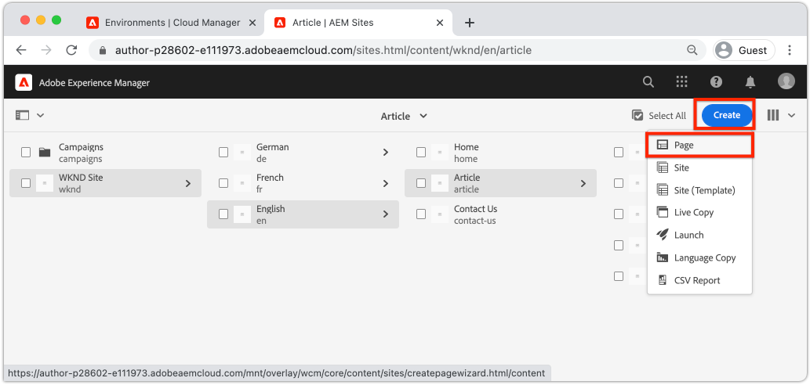

    This will bring up the **Create Page** wizard.

1. Choose the **Article Page** template and click **Next**.

    Pages in AEM are created based off of a Page Template. Page Templates are explored in detail in the [Page Templates](page-templates.md) chapter.

1. Under **Properties** enter a **Title** of "Hello World".
1. Set the **Name** to be `hello-world` and click **Create**.

    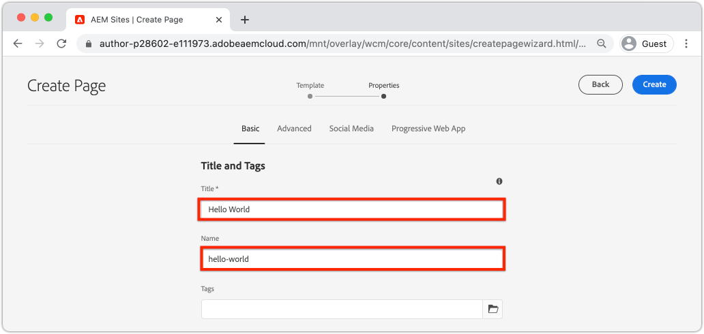

1. In the dialog pop-up click **Open** to open the newly created page.

## Author a Component {#author-component}

AEM Components can be thought of as small modular building blocks of a web page. By breaking the UI into logical chunks or Components, it makes it much easier to manage. In order to re-use components, the components must be configurable. This is accomplished via the author dialog.

AEM provides a set of [Core Components](https://experienceleague.adobe.com/docs/experience-manager-core-components/using/introduction.html) that are production ready to use. The **Core Components** range from basic elements like [Text](https://experienceleague.adobe.com/docs/experience-manager-core-components/using/components/text.html) and [Image](https://experienceleague.adobe.com/docs/experience-manager-core-components/using/components/image.html) to more complex UI elements like a [Carousel](https://experienceleague.adobe.com/docs/experience-manager-core-components/using/components/carousel.html).

Next, author a few components using the AEM Page Editor.

1. Navigate to the **Hello World** page created in the previous exercise.
1. Ensure that you are in **Edit** mode and in the left side-rail click the **Components** icon.

    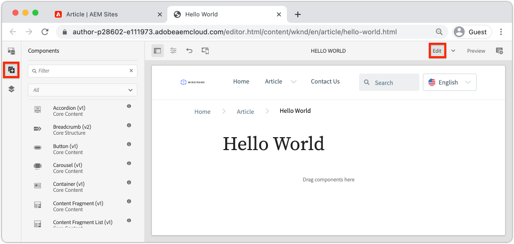

    This will open up the Component library and list the available Components that can be used on the page.

1. Scroll down and **Drag+Drop** a **Text (v2)** component on to the main editable region of the page.

    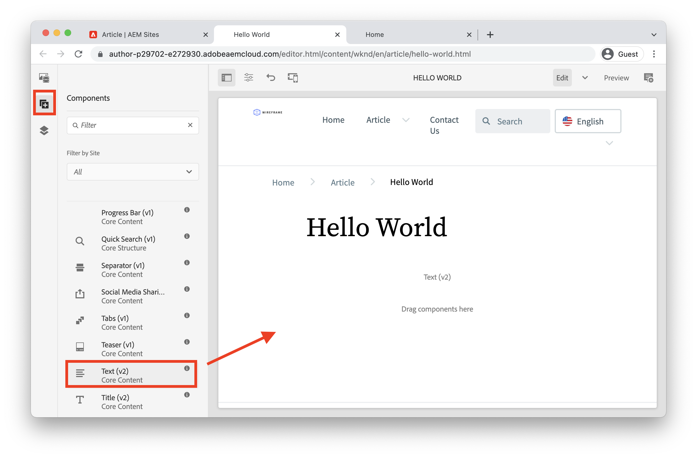

1. Click the **Text** component to highlight and then click the **wrench** icon  to open the Component's dialog. Enter some text and save the changes to the dialog.

    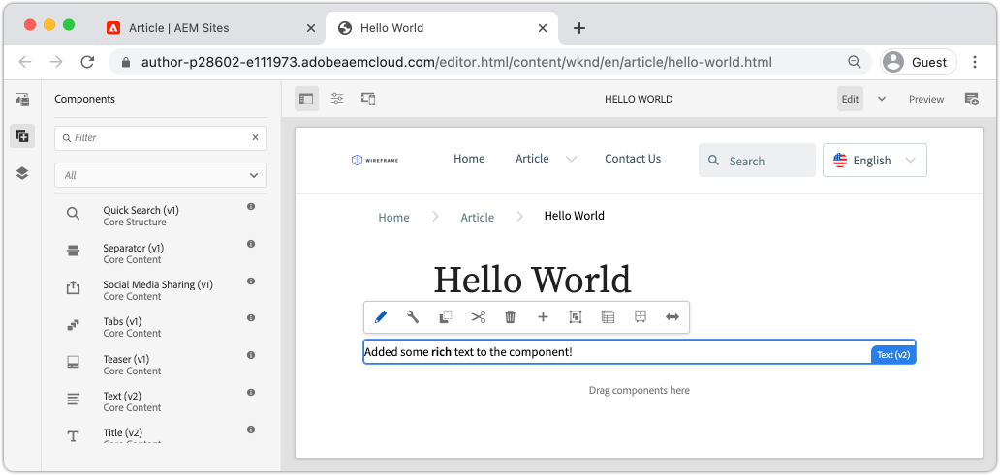

    The **Text** component should now display the rich text on the page.

1. Repeat the above steps, except drag an instance of the **Image(v2)** component on to the page. Open the **Image** component's dialog.

1. In the left rail, switch to the **Asset finder** by clicking the **Assets** icon .
1. **Drag+Drop** an image into the Component's dialog and click **Done** to save the changes.

    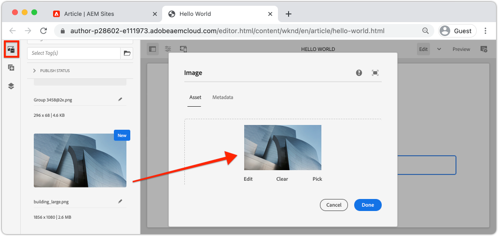

1. Observe that there are components on the page, like the **Title**, **Navigation**, **Search** that are fixed. These areas are configured as part of the Page Template and cannot be modified on an individual page. This is explored more in the next chapter.

Feel free to experiment with some of the other components. Documentation about each [Core Component can be found here](https://experienceleague.adobe.com/docs/experience-manager-core-components/using/introduction.html). A detailed video series about [Page authoring can be found here](https://experienceleague.adobe.com/docs/experience-manager-learn/sites/page-authoring/aem-sites-authoring-overview.html).

## Publish updates {#publish-updates}

AEM environments are split between an **Author Service** and a **Publish Service**. In this chapter we have made several modifications to the site on the **Author Service**. In order for site visitors to view the changes we need to publish them to the **Publish Service**.

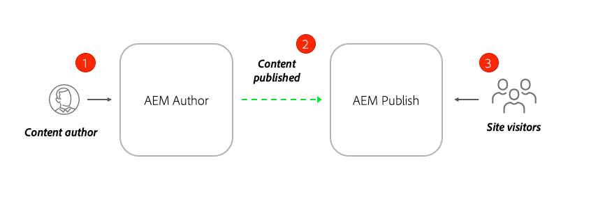

*High level flow of content from Author to Publish*

**1.** Content authors make updates to the site content. The updates can be previewed, reviewed and approved to be pushed live.

**2.** Content is published. Publication can be performed on-demand or scheduled for a future date.

**3.** Site visitors will see the changes reflected on the Publish service.

### Publish the changes

Next, let's publish the changes.

1. From the AEM Start screen navigate to **Sites** and select the **WKND Site**.
1. Click the **Manage Publication** in the menu bar.

    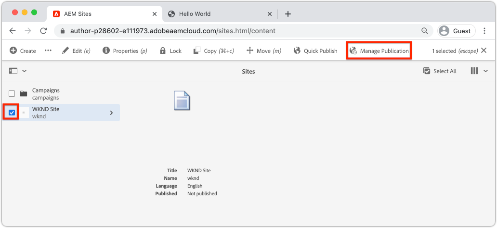

    Since this a brand new site, we want to publish all of the pages and can use the Manage Publication wizard to define exactly what needs to be published.

1. Under **Options** leave the default settings to **Publish** and schedule it for **Now**. Click **Next**.
1. Under **Scope**, select the **WKND Site** and click **Include Children Settings**. In the dialog, check **Include children**. Un-check the rest of the boxes to ensure the entire site is published.

    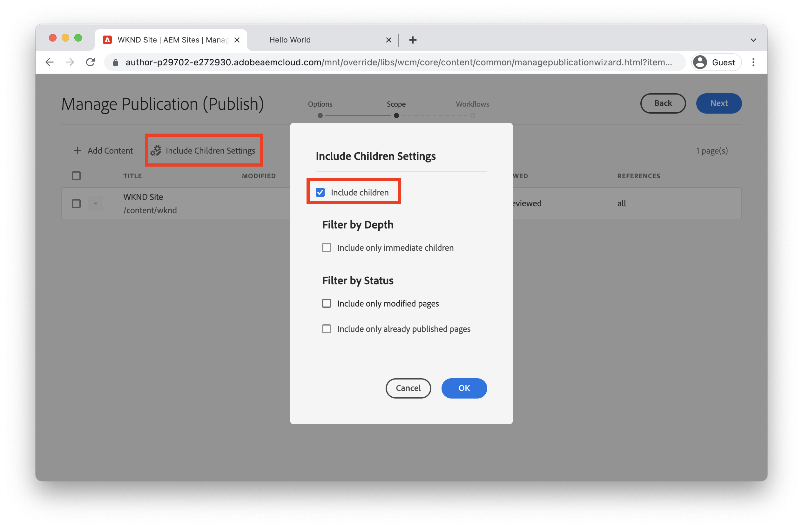

1. Click the **Published References** button. In the dialog, verify that everything is checked. This will include the **Standard Site Template** and several configurations generated by the Site Template. Click **Done** to update.

    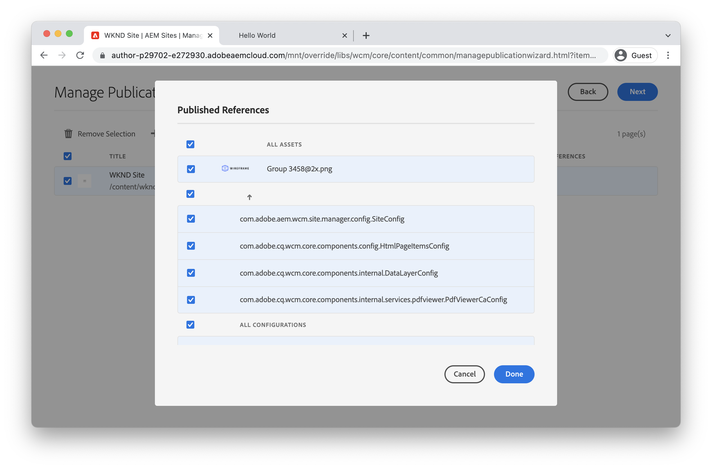

1. Finally, check the box next to **WKND Site** and click **Next** in the upper right-hand corner.
1. In the **Workflows** step, enter a **Workflow title**. This can be any text and can be useful as part of an audit trail later. Enter "Initial publish" and click **Publish**.

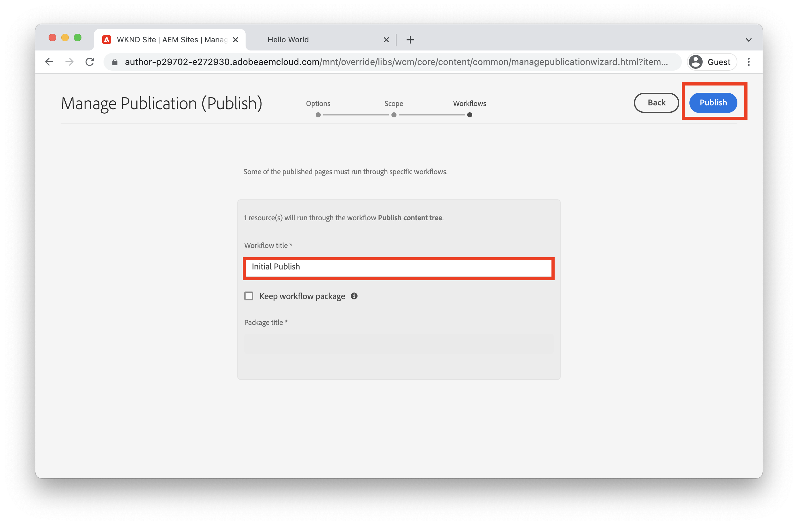

## View published content {#publish}

Next, navigate to the Publish service to view the changes.

1. An easy way to get the URL of the Publish Service is to copy the Author url and replace the `author` word with `publish`. For example:

    * **Author URL** - `https://author-pYYYY-eXXXX.adobeaemcloud.com/`
    * **Publish URL** - `https://publish-pYYYY-eXXXX.adobeaemcloud.com/`

1. Add `/content/wknd.html` to the Publish URL so that the final URL looks like: `https://publish-pYYYY-eXXXX.adobeaemcloud.com/content/wknd.html`.

    >[!NOTE]
    >
    > Change `wknd.html` to match the name of your site, if you provided a unique name during [site creation](create-site.md).

1. Navigating to the Publish URL you should see the site, without any of the AEM authoring functionality.

    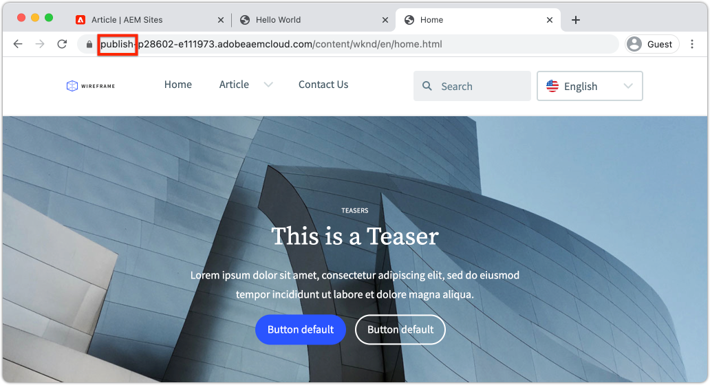

1. Using the **Navigation** menu click **Article** > **Hello World** to navigate to the Hello World page created earlier.
1. Return to the **AEM Author Service** and make some additional content changes in the Page Editor.
1. Publish these changes directly from within the page editor by clicking the **Page Properties** icon > **Publish Page**

    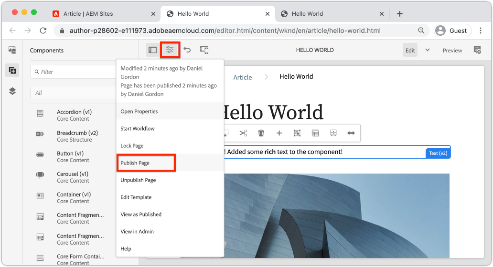

1. Return to the **AEM Publish Service** to view the changes. Most likely you will **not** immediately see the updates. This is because the **AEM Publish Service** includes [caching via an Apache web server and CDN](https://experienceleague.adobe.com/docs/experience-manager-cloud-service/implementing/content-delivery/caching.html). By default HTML content is cached for ~5 minutes.

1. To bypass the cache for testing/debugging purposes simply add a query parameter like `?nocache=true`. The URL would look like `https://publish-pYYYY-eXXXX.adobeaemcloud.com/content/wknd/en/article/hello-world.html?nocache=true`. More details about the caching strategy and configurations available [can be found here](https://experienceleague.adobe.com/docs/experience-manager-cloud-service/implementing/content-delivery/overview.html).

1. You can also find the URL to the Publish Service in Cloud Manager. Navigate to the **Cloud Manager Program** > **Environments** > **Environment**.

    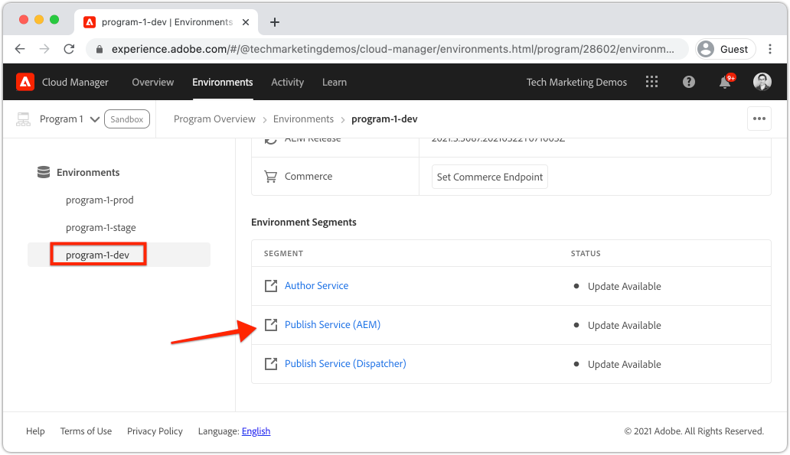

    Under **Environment Segments** you can find links to the **Author** and **Publish** services.

## Congratulations! {#congratulations}

Congratulations, you have just authored and published changes to your AEM Site!

### Next Steps {#next-steps}

In a real-world implementation planning a site with mockups and UI designs typically precedes Site creation. Learn how Adobe XD UI Kits can be used to design and accelerate your Adobe Experience Manager Sites implementation in [UI planning with Adobe XD](./ui-planning-adobe-xd.md).

Want to continue to explore AEM Sites capabilities? Feel free to jump right in to the chapter on [Page Templates](./page-templates.md) to understand the relationship between a Page Template and a Page.

