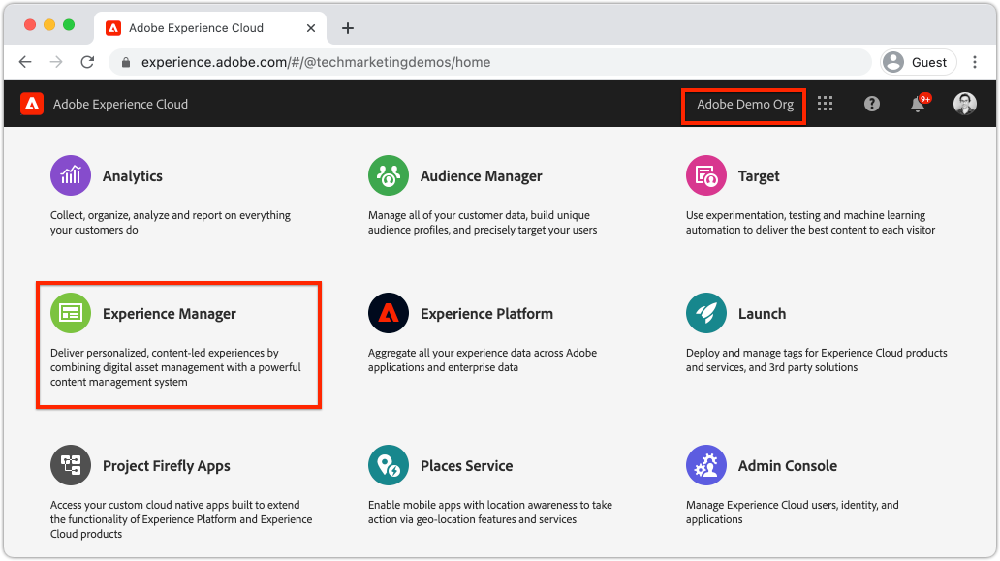
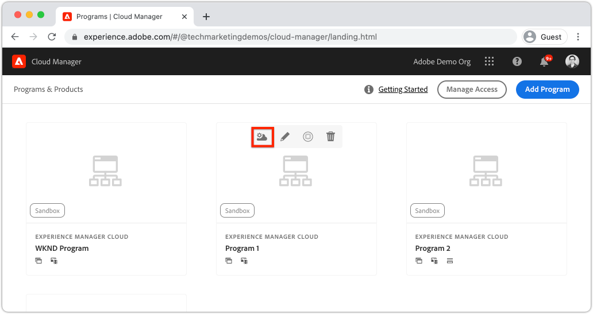
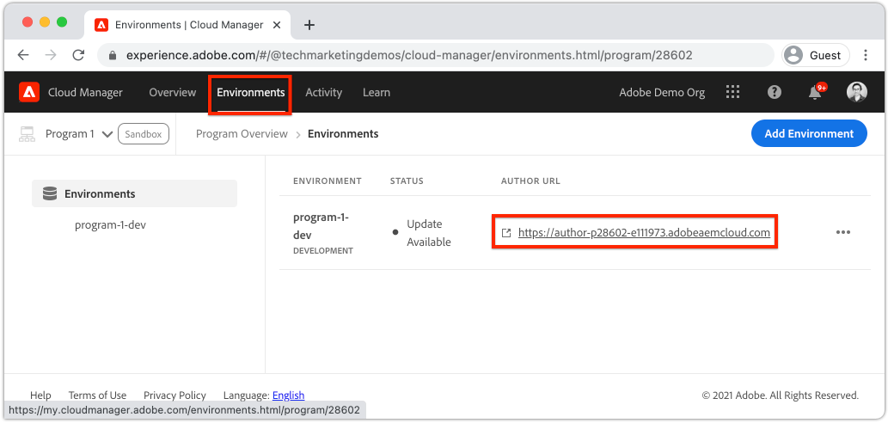
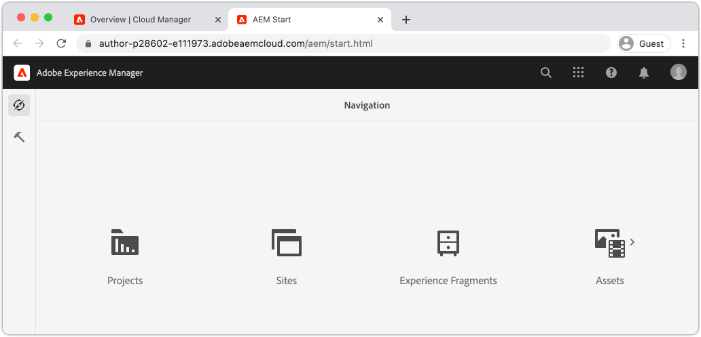
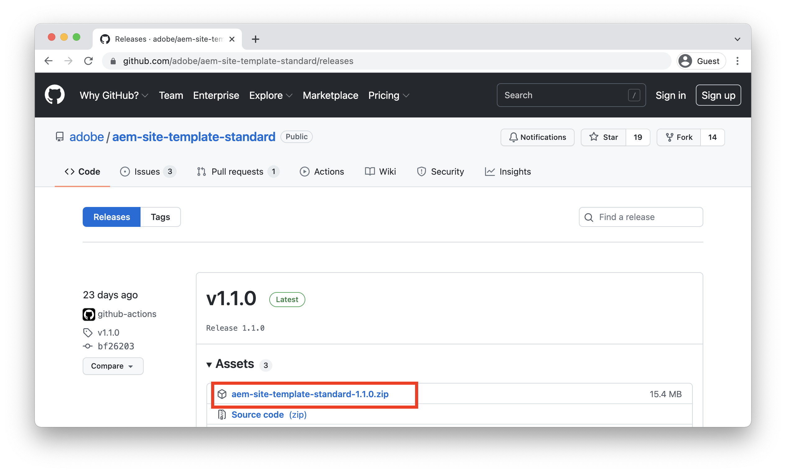
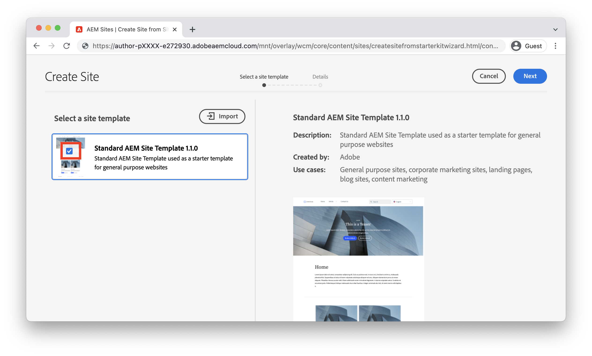
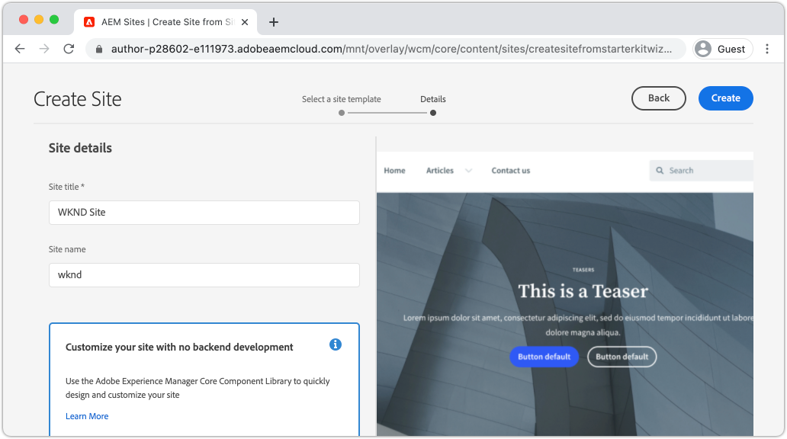
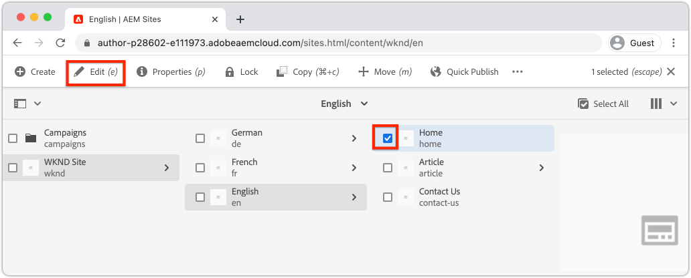
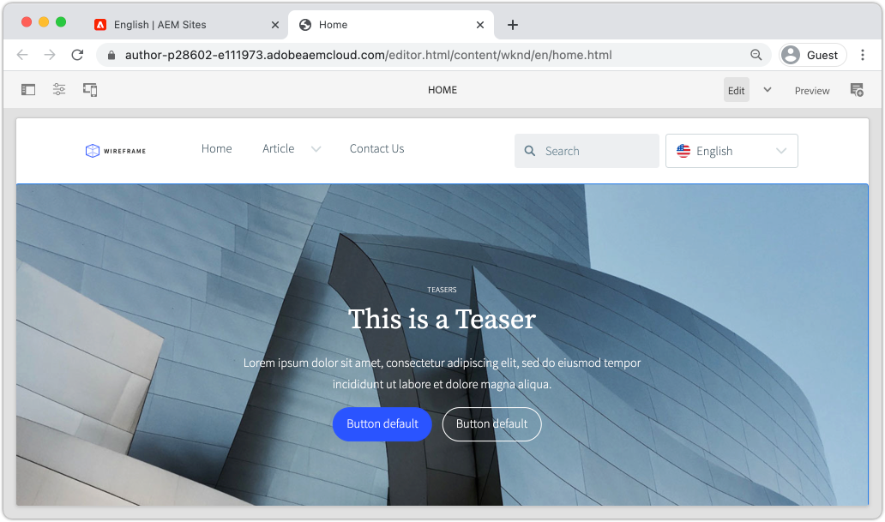

# Create a site {#create-site}

As part of Quick Site Creation use the Site Creation Wizard in Adobe Experience Manager, AEM, to generate a new website. The Standard Site Template provided by Adobe, is used as a starting point for the new site.

## Prerequisites {#prerequisites}

The steps in this chapter will take place in an Adobe Experience Manager as a Cloud Service environment. Ensure that you have administrative access to the AEM environment. It is recommended to use a [Sandbox program](https://experienceleague.adobe.com/docs/experience-manager-cloud-service/onboarding/getting-access/sandbox-programs/introduction-sandbox-programs.html) and [Development environment](https://experienceleague.adobe.com/docs/experience-manager-cloud-service/implementing/using-cloud-manager/manage-environments.html) when completing this tutorial.

Review the [onboarding documentation](https://experienceleague.adobe.com/docs/experience-manager-cloud-service/onboarding/home.html) for more details.

## Objective {#objective}

1. Learn to use the Site Creation Wizard to generate a new site.
1. Understand the role of Site Templates.
1. Explore the generated AEM site.

## Log in to Adobe Experience Manager Author {#author}

As a first step, log in to your AEM as a Cloud Service environment. AEM environments are split between an **Author Service** and a **Publish Service**.

* **Author Service** - where site content is created, managed and updated. Typically only internal users have access to the **Author Service** and is behind a login screen.
* **Publish Service** - hosts the live website. This is the service that end-users will see and is typically publicly available.

A majority of the tutorial will take place using the **Author Service**.

1. Navigate to the Adobe Experience Cloud [https://experience.adobe.com/](https://experience.adobe.com/). Log in using your Personal Account or a Company/School Account.
1. Ensure that the correct Organization is selected in menu and click **Experience Manager**.

    

1. Under **Cloud Manager** click **Launch**.
1. Hover over the Program you wish to use and click the **Cloud Manager Program** icon.

    

1. In the top menu click **Environments** to view the provisioned environments.

1. Find the environment you wish to use and click the **Author URL**.

    

    >[!NOTE]
    >
    >It is recommended to use a **Development** environment for this tutorial.

1. A new tab will be launched to the AEM **Author Service**. Click **Sign in with Adobe** and you should be logged in automatically with the same Experience Cloud credentials.

1. After being redirected and authenticated you should now see the AEM start screen.

    

>[!NOTE]
>
> Having trouble accessing Experience Manager? Review the [onboarding documentation](https://experienceleague.adobe.com/docs/experience-manager-cloud-service/onboarding/home.html)

## Download the Basic Site Template

A Site Template provides a starting point for a new site. A Site Template includes some basic theming, page templates, configurations and sample content. Exactly what is included in the Site Template is up to the developer. Adobe provides a **Basic Site Template** to accelerate new implementations.

1. Open a new browser tab and navigate to the Basic Site Template project on GitHub: [https://github.com/adobe/aem-site-template-standard](https://github.com/adobe/aem-site-template-standard). The project is open-sourced and licensed to be used by anyone.
1. Click **Releases** and navigate to the [latest release](https://github.com/adobe/aem-site-template-standard/releases/latest).
1. Expand the **Assets** dropdown and download the template zip file:

    

    This zip file will be used in the next exercise.

    >[!NOTE]
    >
    > This tutorial is written using version **1.1.0** of the Basic Site Template. When starting a new project for production use, it is always recommended to use the latest version.

## Create a new site

Next, generate a new site using the Site Template from the previous exercise.

1. Return to the AEM environment. From the AEM Start screen navigate to **Sites**.
1. In the upper right-hand corner click **Create** > **Site (Template)**. This will bring up the **Create Site Wizard**.
1. Under **Select a site template** click the **Import** button.

    Upload the **.zip** template file downloaded from the previous exercise.

1. Select the **Basic AEM Site Template** and click **Next**.

    

1. Under **Site Details** > **Site title** enter `WKND Site`.

    In a real-world implementation "WKND Site" would be replaced by the brand name of your company or organization. In this tutorial, we are simulating the creation of a site for a ficticious lifestyle brand "WKND".

1. Under **Site name** enter `wknd`.

    

    >[!NOTE]
    >
    > If using a shared AEM environment, append a unique identifier to the **Site Name**. For example `wknd-site-johndoe`. This will ensure that multiple users can complete the same tutorial, without any collisions.

1. Click **Create** to generate the Site. Click **Done** in the **Success** dialog when AEM has finished creating the web site.

## Explore the new site

1. Navigate to the AEM Sites console, if not already there.
1. A new **WKND Site** has been generated. It will include a site structure with a multi-lingual hierarchy.
1. Open the **English** > **Home** page by selecting the page and clicking the **Edit** button in the menu bar:

    

1. Starter content has already been created and several components are available to be added to a page. Experiment with these components to get an idea of the functionality. You will learn the basics of a component in the next chapter.

    

    *Sample content provided by the Site Template*

## Congratulations! {#congratulations}

Congratulations, you have just created your first AEM Site!

### Next Steps {#next-steps}

Use the Page editor in Adobe Experience Manager, AEM, to update content of the site in the [Author content and publish](author-content-publish.md) chapter. Learn how atomic Components can be configured to update content. Understand the difference between an AEM Author and Publish environments and learn how to publish updates to the live site.
