# Developing with the Style System {#developing-with-the-style-system}

Learn how to implement individual styles and re-use Core Components using Experience Manager's Style System. This tutorial covers developing for the Style System to extend Core Components with brand-specific CSS and advanced policy configurations of the Template Editor.

## Prerequisites {#prerequisites}

Review the required tooling and instructions for setting up a [local development environment](overview.md#local-dev-environment).

It is also recommended to review the [Client-side Libraries and Front-end Workflow](client-side-libraries.md) tutorial to understand the fundamentals of client-side libraries and the various front-end tools built into the AEM project.

### Starter Project

Check out the base-line code the tutorial builds on:

1. Clone the [github.com/adobe/aem-guides-wknd](https://github.com/adobe/aem-guides-wknd) repository.
2. Check out the `style-system/start` branch

   ```shell
   $ git clone git@github.com:adobe/aem-guides-wknd.git ~/code/aem-guides-wknd
   $ cd ~/code/aem-guides-wknd
   $ git checkout style-system/start
   ```

3. Deploy code base to a local AEM instance using your Maven skills:

   ```shell
   $ cd ~/code/aem-guides-wknd
   $ mvn clean install -PautoInstallSinglePackage
   ```

You can always view the finished code on [GitHub](https://github.com/adobe/aem-guides-wknd/tree/style-system/solution) or check the code out locally by switching to the branch `style-system/solution`.

## Objective

1. Understand how to use the Style System to apply brand-specific CSS to AEM Core Components.
2. Learn about BEM notation and how it can be used to carefully scope styles.
3. Apply advanced policy configurations with Editable Templates.

## What you will build {#what-you-will-build}

In this chapter we will use the [Style System feature](https://docs.adobe.com/content/help/en/experience-manager-learn/sites/page-authoring/style-system-feature-video-use.html) to create several variations of components used on the Article page. We will also use the Style System to create variations for structural elements like the Header/Footer and Layout Container.

>[!VIDEO](https://video.tv.adobe.com/v/30386/?quality=12)

## Background {#background}

The [Style System](https://docs.adobe.com/content/help/en/experience-manager-65/developing/components/style-system.html) allows developers and template editors to create multiple visual variations of a component. Authors can then in turn decide which style to use when composing a page. We will leverage the Style System throughout the rest of the tutorial to achieve several unique styles, while leveraging Core Components in a low code approach.

The general idea with the Style System is that authors can choose various styles of how a component should look. The "styles" are backed by additional CSS classes that are injected into the outer div of a component. In the client libraries CSS rules are added based on these style classes so that the component changes appearance.

You can find [detailed documentation for Style System here](https://docs.adobe.com/content/help/en/experience-manager-65/developing/components/style-system.html). There is also a great [technical video for understanding the Style System](https://docs.adobe.com/content/help/en/experience-manager-learn/sites/developing/style-system-technical-video-understand.html).

## Title Component Style {#title-component}

At this point the [Title Component](https://docs.adobe.com/content/help/en/experience-manager-core-components/using/components/title.html) has been proxied into the project under `/apps/wknd/components/content/title` as part of the **ui.apps** module. The default styles of Heading elements (`H1`, `H2`, `H3`...) have already been implemented in the **ui.frontend** module in the `_elements.scss` file under `ui.frontend/src/main/webpack/base/sass/_elements.scss`.

### Underline Style

The [WKND Article designs](assets/pages-templates/wknd-article-design.xd) contain a unique style for the Title component with an underline. Instead of creating two components or modifying the component dialog, the Style System can be used to allow authors the option to add an underline style.

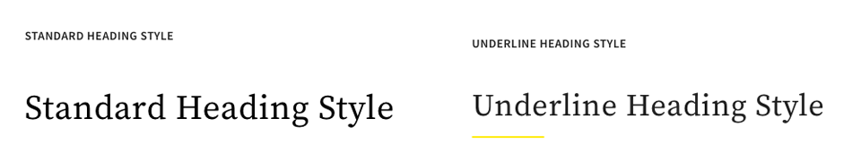

### Inspect Title Component Markup

As a front-end developer the first step to styling a Core Component is to understand the markup generated by the component.

As part of the generated project, the archetype embedded **Core Component Examples** project. For developers and content authors this contains an easy reference to understand all of the features available with Core Components. A live version is also [available](http://opensource.adobe.com/aem-core-wcm-components/library.html).

1. Open a new browser and view the Title component:
    * Local AEM instance: [http://localhost:4502/editor.html/content/core-components-examples/library/title.html](http://localhost:4502/editor.html/content/core-components-examples/library/title.html)
    * Live example: [https://opensource.adobe.com/aem-core-wcm-components/library/title.html](https://opensource.adobe.com/aem-core-wcm-components/library/title.html)

2. Below is the markup for the Title component:

    ```html
    <div class="cmp-title">
        <h1 class="cmp-title__text">Lorem Ipsum</h1>
    </div>
    ```

    The BEM notation of the Title Compponent:

    ```plain
    BLOCK cmp-title
        ELEMENT cmp-title__text
    ```

3. The Style system adds a CSS class to the outer div surrounding the component. Therefore the markup we will be targeting will resemble something like the following:

    ```html
    <div class="STYLE-SYSTEM-CLASS-HERE"> <!-- Custom CSS class - implementation gets to define this -->
        <div class="cmp-title">
            <h1 class="cmp-title__text">Lorem Ipsum</h1>
        </div>
    </div>
    ```

### Implement the Underline Style - ui.frontend

Next we will implement the Underline style using the **ui.frontend** module of our project. We will use the webpack development server that is bundled with the **ui.frontend** module to preview the styles *before* deploying to a local instance of AEM.

1. Start the webpack dev server by running the following command from within the **ui.frontend** module:

    ```shell
    $ cd ~/code/aem-guides-wknd/ui.frontend/
    $ npm start

    > aem-maven-archetype@1.0.0 start code/aem-guides-wknd/ui.frontend
    > webpack-dev-server --open --config ./webpack.dev.js
    ```

    This should open a browser at [http://localhost:8080](http://localhost:8080).

    >[!NOTE]
    >
    > If images appear broken, ensure that the starter project has been deployed to a local instance of AEM (running on port 4502) and the browser used has also logged into the local AEM instance.

    

2. In Eclipse or the IDE of your choice open the file `index.html` located at: `ui.frontend/src/main/webpack/static/index.html`. This is the static markup used by the webpack development server.
3. In `index.html` find an instance of the Title Component to add the underline style to by searching the document for *cmp-title*. Choose the Title component with the text *"Vans off the Wall Skatepark"* (line 218). Add the class `cmp-title--underline` to the surrounding div:

    ```html
    <!-- before -->
    <div class="title aem-GridColumn aem-GridColumn--default--8">
        <div class="cmp-title">
            <h2 class="cmp-title__text">Vans off the Wall Skatepark</h2>
        </div>
    </div>
    ```

     ```html
    <!-- After -->
    <div class="cmp-title--underline title aem-GridColumn aem-GridColumn--default--8">
        <div class="cmp-title">
            <h2 class="cmp-title__text">Vans off the Wall Skatepark</h2>
        </div>
    </div>
    ```

4. Return to the browser and verify that the extra class is reflected in the markup.
5. Return to the **ui.frontend** module and update the file `title.scss` located at: `ui.frontend/src/main/webpack/components/content/title/scss/title.scss`:

    ```css
    /* Add Title Underline Style */
    .cmp-title--underline {

        .cmp-title {
        }

        .cmp-title__text {
            &:after {
            display: block;
                width: 84px;
                padding-top: 8px;
                content: '';
                border-bottom: 2px solid $brand-primary;
            }
        }
    }
    ```

    >[!NOTE]
    >
    >It is considered a best practice to always tightly scope styles to the target component. This ensures that extra styles don't affect other areas of the page.
    >
    >All Core Components adhere to **[BEM notation](https://github.com/adobe/aem-core-wcm-components/wiki/css-coding-conventions)**. It is a best practice to target the outer CSS class when creating a default style for a component. Another best practice is to target class names specified by the Core Component BEM notation rather than HTML elements.

6. Return to the browser once more and you should see the Underline style added:

    

7. Stop the webpack development server.

### Add a Title Policy

Next we need to add a new policy for Title components to allow content authors to choose the Underline style to apply to specific components. This is done using the Template Editor within AEM.

1. Deploy code base to a local AEM instance using your Maven skills:

   ```shell
   $ cd ~/code/aem-guides-wknd
   $ mvn clean install -PautoInstallSinglePackage
   ```

2. Navigate to the **Article Page Template** located at: [http://localhost:4502/editor.html/conf/wknd/settings/wcm/templates/article-page-template/structure.html](http://localhost:4502/editor.html/conf/wknd/settings/wcm/templates/article-page-template/structure.html).

3. In **Structure** mode, in the main **Layout Container**, select the **Policy** icon next to the **Title** component listed under *Allowed Components*:

    

4. Create a new policy for the Title component with the following values:

    *Policy Title &#42;*: **WKND Title**

   *Properties* &gt; *Styles Tab* &gt; *Add a new style*

   **Underline** : `cmp-title--underline` 

   

    Click **Done** to save the changes to the Title policy. 
    >[!NOTE]
    >
    > The value `cmp-title--underline` matches the CSS class we targeted earlier when developing in the **ui.frontend** module.

### Apply the Underline Style

Finally, as an author, we can choose to apply the underline style to certain Title Components.

1. Navigate to the **La Skateparks** article in the AEM Sites editor at: [http://localhost:4502/editor.html/content/wknd/us/en/magazine/guide-la-skateparks.html](http://localhost:4502/editor.html/content/wknd/us/en/magazine/guide-la-skateparks.html)
2. In **Edit** mode, choose a Title component. Click the **paintbrush** icon and select the **Underline** style:

    

    As an author you should be able to toggle on/off the style.

3. Click the **Page Information** icon &gt; **View as Published** to inspect the page outside of AEM's editor.

    

    Use your browser developer tools to verify the markup around the Title component has the CSS class `cmp-title--underline` applied to the outer div.

## Text Component Style {#text-component}

Next, we will repeat similar steps to apply a unique style to the [Text Component](https://docs.adobe.com/content/help/en/experience-manager-core-components/using/components/text.html). The Text component has been proxied into the project under `/apps/wknd/components/content/text` as part of the **ui.apps** module. The default styles of paragraph elements have already been implemented in the **ui.frontend** module in the `_elements.scss` file under `ui.frontend/src/main/webpack/base/sass/_elements.scss`.

### Quote Block Style

The [WKND Article designs](assets/pages-templates/wknd-article-design.xd) contain a unique style for the Text component with a quote block:


### Inspect Text Component Markup

Once again we will inspect the Text component's markup.

1. Open a new browser and view the Text component as part of the Core Component Library:
    * Local AEM instance: [http://localhost:4502/editor.html/content/core-components-examples/library/text.html](http://localhost:4502/editor.html/content/core-components-examples/library/text.html)
    * Live example: [https://opensource.adobe.com/aem-core-wcm-components/library/text.html](https://opensource.adobe.com/aem-core-wcm-components/library/text.html)

2. Below is the markup for the Text component:

    ```html
    <div class="cmp-text">
        <p><b>Bold </b>can be used to emphasize a word or phrase, as can <u>underline</u> and <i>italics.&nbsp;</i><sup>Superscript</sup> and <sub>subscript</sub> are useful for mathematical (E = mc<sup>2</sup>) or scientific (h<sub>2</sub>O) expressions. Paragraph styles can provide alternative renderings, such as quote sections:</p>
        <blockquote>"<i>Be yourself; everyone else is already taken"</i></blockquote>
        <b>- Oscar Wilde</b>
    </div>
    ```

    The BEM notation of the Title Compponent:

    ```plain
    BLOCK cmp-text
        ELEMENT
    ```

3. The Style system adds a CSS class to the outer div surrounding the component. Therefore the markup we will be targeting will resemble something like the following:

    ```html
    <div class="STYLE-SYSTEM-CLASS-HERE"> <!-- Custom CSS class - implementation gets to define this -->
        <div class="cmp-text">
            <p><b>Bold </b>can be used to emphasize a word or phrase, as can <u>underline</u> and <i>italics.&nbsp;</i><sup>Superscript</sup> and <sub>subscript</sub> are useful for mathematical (E = mc<sup>2</sup>) or scientific (h<sub>2</sub>O) expressions. Paragraph styles can provide alternative renderings, such as quote sections:</p>
            <blockquote>"<i>Be yourself; everyone else is already taken"</i></blockquote>
            <b>- Oscar Wilde</b>
        </div>
    </div>
    ```

### Implement the Quote Block Style - ui.frontend

Next we will implement the Quote Block style using the **ui.frontend** module of our project.

1. Start the webpack dev server by running the following command from within the **ui.frontend** module:

    ```shell
    $ cd ~/code/aem-guides-wknd/ui.frontend/
    $ npm start

    > aem-maven-archetype@1.0.0 start code/aem-guides-wknd/ui.frontend
    > webpack-dev-server --open --config ./webpack.dev.js
    ```

2. In Eclipse or the IDE of your choice open the file `index.html` located at: `ui.frontend/src/main/webpack/static/index.html`. This is the static markup used by the webpack development server.
3. In `index.html` find an instance of the Text Component by searching for the text *"Jacob Wester"* (line 210). Add the class `cmp-text--quote` to the surrounding div:

    ```html
    <!-- before -->
    <div class="text aem-GridColumn aem-GridColumn--default--8">
        <div class="cmp-text">
            <blockquote>"There is no better place to shred then Los Angeles"</blockquote>
            <p>Jacob Wester - Pro Skater</p>
        </div>
    </div>
    ```

     ```html
    <!-- After -->
    <div class="cmp-text--quote text aem-GridColumn aem-GridColumn--default--8">
        <div class="cmp-text">
            <blockquote>"There is no better place to shred then Los Angeles"</blockquote>
            <p>Jacob Wester - Pro Skater</p>
        </div>
    </div>
    ```

4. Return to the browser and verify that the extra class is reflected in the markup.
5. Return to the **ui.frontend** module and update the file `text.scss` located at: `ui.frontend/src/main/webpack/components/content/text/scss/text.scss`:

    ```css
    /* WKND Text Quote style */

    .cmp-text--quote {

        .cmp-text {
            background-color: $brand-third;
            margin: 1em 0em;
            padding: 1em;

            blockquote {
                border: none;
                font-size: $font-size-h2;
                font-family: $font-family-serif;
                padding: 14px 14px;
                margin: 0;
                margin-bottom: 0.5em;

                &:after {
                    border-bottom: 2px solid $brand-primary; /*yellow border */
                    content: '';
                    display: block;
                    position: relative;
                    top: 0.25em;
                    width: 80px;
                }
            }

            p {
                font-size:    $font-size-large;
                font-family:  $font-family-serif;
            }
        }
    }
    ```

    >[!CAUTION]
    >
    > In this case raw HTML elements are targeted by the styles. This is because the Text component provides a Rich Text Editor for content authors. Creating styles directly against RTE content should be done with care and it is even more important to tightly scope the styles.

6. Return to the browser once more and you should see the Quote block style added:

    

7. Stop the webpack development server.

### Add a Text Policy

Next add a new policy for the Text components.

1. Deploy code base to a local AEM instance using your Maven skills:

   ```shell
   $ cd ~/code/aem-guides-wknd
   $ mvn clean install -PautoInstallSinglePackage
   ```

2. Navigate to the **Article Page Template** located at: [http://localhost:4502/editor.html/conf/wknd/settings/wcm/templates/article-page-template/structure.html](http://localhost:4502/editor.html/conf/wknd/settings/wcm/templates/article-page-template/structure.html).

3. In **Structure** mode, in the main **Layout Container**, select the **Policy** icon next to the **Text** component listed under *Allowed Components*:

    

4. Create a new policy for the Text component with the following values:

    *Policy Title &#42;*: **WKND Text**

    *Plugins* &gt; *Paragraph Styles* &gt; *Enable paragraph styles*

    *Styles Tab* &gt; *Add a new style*

   **Quote Block** : `cmp-text--quote`

   

   

    Click **Done** to save the changes to the Text policy.

### Apply the Quote Block Style

1. Navigate to the **La Skateparks** article in the AEM Sites editor at: [http://localhost:4502/editor.html/content/wknd/us/en/magazine/guide-la-skateparks.html](http://localhost:4502/editor.html/content/wknd/us/en/magazine/guide-la-skateparks.html)
2. In **Edit** mode, choose a Text component. Edit the component to include a quote element:

    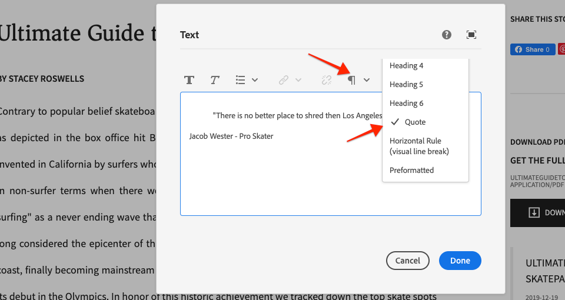

3. Select the text component and click the **paintbrush** icon and select the **Quote Block** style:

    

    As an author you should be able to toggle on/off the style.

## Layout Container {#layout-container}

Layout Containers have been used to create the basic structure of the Article Page Template and provide the drop zones for content authors to add content on a page. Layout Containers can also leverage the Style System, providing content authors with even more options for designing layouts.

Currently a CSS rule is applied to the entire page enforcing a fixed width. Instead, a more flexible approach is to create a **Fixed Width** style that content authors can toggle on/off.

### Implement the Fixed Width Style - ui.frontend

We will start implementing the Fixed Width style in the **ui.frontend** module of our project.

1. Start the webpack dev server by running the following command from within the **ui.frontend** module:

    ```shell
    $ cd ~/code/aem-guides-wknd/ui.frontend/
    $ npm start
    ```

2. Open the file `index.html` located at: `ui.frontend/src/main/webpack/static/index.html`.
3. We want to make the body of our Article Page Template fixed width, leaving the Header and Footer free to expand wider. Therefore we want to target the 2nd `<div class='responsivegrid aem-GridColumn aem-GridColumn--default--12'` (Layout Container) in between the two experience Fragments (line 136)

    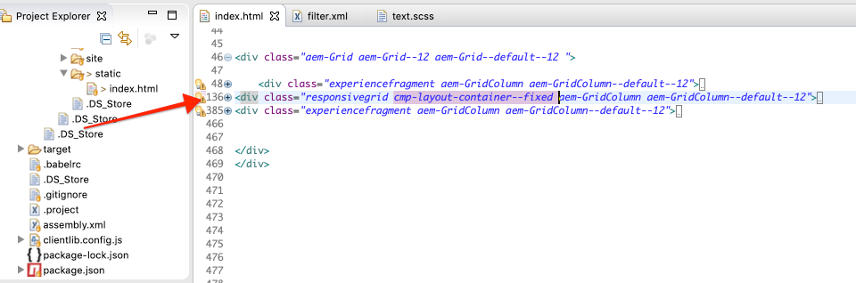

4. Add the class `cmp-layout-container--fixed` to the `div` identified in the previous setp.

    ```html
    <!-- Experience Fragment Header -->
    <div class="experiencefragment aem-GridColumn aem-GridColumn--default--12">
        ...
    </div>
    <!-- Main body Layout Container -->
    <div class="responsivegrid cmp-layout-container--fixed aem-GridColumn aem-GridColumn--default--12">
        ...
    </div>
    <!-- Experience Fragment Footer -->
    <div class="experiencefragment aem-GridColumn aem-GridColumn--default--12">
        ...
    </div>
    ```

5. Update the file `container.scss` located at: `ui.frontend/src/main/webpack/components/content/container/scss/container.scss`:

    ```css

    /* WKND Layout Container - Fixed Width */

    .cmp-layout-container--fixed {
        @media (min-width: $screen-medium + 1) {
            display:block;
            max-width:  $max-width !important;
            float: unset !important;
            margin: 0 auto !important;
            padding: 0 $gutter-padding;
            clear: both !important; 
        }
    }
    ```

6. Update the file `_elements.scss` located at: `ui.frontend/src/main/webpack/base/sass/_elements.scss` and change the `.root` rule to have a new max width set to the variable `$max-body-width`.

     ```css
    /* Before */
    body {
        ...

        .root {
            max-width: $max-width;
            margin: 0 auto;
            padding-top: 12px;
        }
    }
    ```

    ```css
    /* After */
    body {
        ...

        .root {
            max-width: $max-body-width;
            margin: 0 auto;
            padding-top: 12px;
        }
    }
    ```

    >[!NOTE]
    >
    > The full list of variables and values can be found at: `ui.frontend/src/main/webpack/base/sass/_variables.scss`.

7. Returning to the browser you should see that the main content of the page appears the same but the Header and Footer stretch much wider. This is expected.

    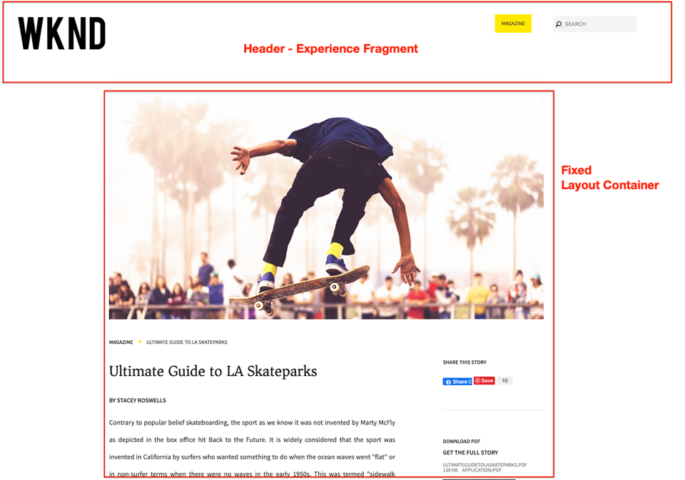

### Update the Layout Container Policy

Next we will add the Fixed Width style by updating the Layout Container policies in AEM.

1. Deploy code base to a local AEM instance using your Maven skills:

   ```shell
   $ cd ~/code/aem-guides-wknd
   $ mvn clean install -PautoInstallSinglePackage
   ```

2. Navigate to the **Article Page Template** located at: [http://localhost:4502/editor.html/conf/wknd/settings/wcm/templates/article-page-template/structure.html](http://localhost:4502/editor.html/conf/wknd/settings/wcm/templates/article-page-template/structure.html).

3. In **Structure** mode, select the main **Layout Container** (in between the Experience Fragment Header and Footer ), and select the **Policy** icon.

    

4. Update the **WKND Site Default** policy to include an additional style for **Fixed Width** with a value of `cmp-layout-container--fixed`:

    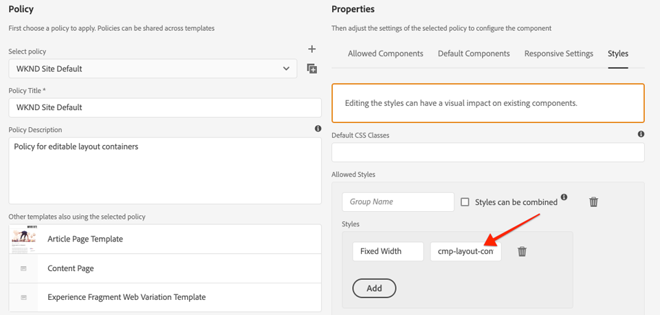

    Save your changes and referesh the Article Page Template page.

5. Again select the main **Layout Container** (in between the Experience Fragment Header and Footer). This time the **paintbrush** icon should appear and you can select **Fixed Width** from the style drop down.

    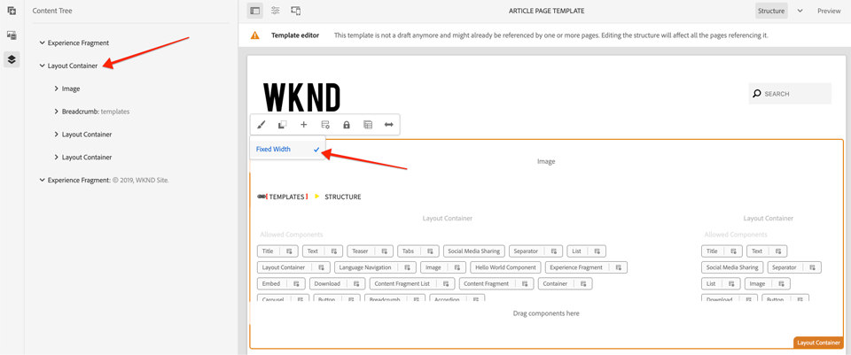

    You should be able to toggle on/off the styles.

6. Navigate to the **La Skateparks** article in the AEM Sites editor at: [http://localhost:4502/editor.html/content/wknd/us/en/magazine/guide-la-skateparks.html](http://localhost:4502/editor.html/content/wknd/us/en/magazine/guide-la-skateparks.html). You should see the fixed-width container in action.

## Header/Footer - Experience Fragment {#experience-fragment}

Next, we'll add styles to the Header and Footer to finish out the Article Page Template. Both the Header and Footer have been implemented as an Experience Fragment, which is a grouping of components inside a container. We can apply a unique CSS class to Experience Fragment components, just like other Core Components componens with the Style System.

### Implement the Header Style - ui.frontend

The components within the Header component are already styled to match the [AdobeXD designs](assets/pages-templates/wknd-article-design.xd), only some small layout modifications are needed.

1. Start the webpack dev server by running the following command from within the **ui.frontend** module:

    ```shell
    $ cd ~/code/aem-guides-wknd/ui.frontend/
    $ npm start
    ```

2. Open the file `index.html` located at: `ui.frontend/src/main/webpack/static/index.html`.
3. Find the **first** instance of the Experience Fragment component by searching for *class="experiencefragment* (Line 48).
4. Add the class `cmp-experiencefragment--header` to the `div` identified in the previous setp.

    ```html
        ...
        <div class="root responsivegrid">
            <div class="aem-Grid aem-Grid--12 aem-Grid--default--12 ">

            <!-- add cmp-experiencefragment--header -->
            <div class="experiencefragment cmp-experiencefragment--header aem-GridColumn aem-GridColumn--default--12">
                ...
    ```

5. Open the file `experiencefragment.scss` located at: `ui.frontend/src/main/webpack/components/content/experiencefragment/scss/experiencefragment.scss`. Append the following styles to the file:

    ```css
    /* Header Style */
    .cmp-experiencefragment--header {

        .cmp-experiencefragment {
            max-width: $max-width;
            margin: 0 auto;
        }

        /* Logo Image */
        .cmp-image__image {
            max-width: 8rem;
            margin-top: $gutter-padding / 2;
            margin-bottom: $gutter-padding / 2;
        }

        @media (max-width: $screen-medium) {

            .cmp-experiencefragment {
                padding-top: 1rem;
                padding-bottom: 1rem;
            }
            /* Logo Image */
            .cmp-image__image {
                max-width: 6rem;
                margin-top: .75rem;
            }
        }
    }
    ```

    >[!CAUTION]
    >
    > We are taking a bit of a shortcut here to style the Logo within the header. The Logo is really just an Image component that happens to be inside the Experience Fragment. Lets say later, we needed to add another image to the header, we would not be able to differentiate between the two. If needed, a "logo" class could always be added to the Image component here.

6. Return to the browser and view the webpack dev server. You should see the Header styles updated to be more aligned to the rest of the content. When shrinking the browser to a tablet/mobile device width, you should also notice that the logo is sized more appropriately.

    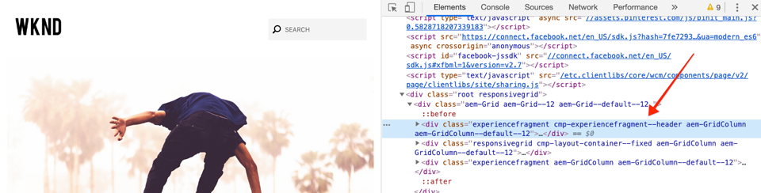

### Implement the Footer Style - ui.frontend

The Footer in the [AdobeXD designs](assets/pages-templates/wknd-article-design.xd) includes a black background with light text. We will need to style the content within our Experience Fragment Footer to reflect this.

1. Open the file `index.html` located at: `ui.frontend/src/main/webpack/static/index.html`.
2. Find the **second** instance of the Experience Fragment component by searching for *class="experiencefragment* (Line 385).
3. Add the class `cmp-experiencefragment--footer` to the `div` identified in the previous setp.

    ```html
    <!-- add cmp-experiencefragment--footer -->
    <div class="experiencefragment cmp-experiencefragment--footer aem-GridColumn aem-GridColumn--default--12">
    ```

4. Re-open the file `experiencefragment.scss` located at: `ui.frontend/src/main/webpack/components/content/experiencefragment/scss/experiencefragment.scss`. **Append** the following styles to the file:

    ```css
    /* Footer Style */
    .cmp-experiencefragment--footer {

        background-color: $black;
        color: $gray-light;
        margin-top: 5rem;

        p {
            font-size: $font-size-small;
        }

        .cmp-experiencefragment {
            max-width: $max-width;
            margin: 0 auto;
            padding-bottom: 0rem;
        }

        /* Separator */
        .cmp-separator {
            margin-top: 2rem;
            margin-bottom: 2rem;
        }

        .cmp-separator__horizontal-rule {
            border: 0;
        }

        /* Navigation */
        .cmp-navigation__item-link {
            color: $nav-link-inverse;
            &:hover,
            &:focus {
                background-color: unset;
                text-decoration: underline;
            }
        }

        .cmp-navigation__item--level-1.cmp-navigation__item--active .cmp-navigation__item-link {
            background-color: unset;
            color: $gray-lighter;
            text-decoration: underline;
        }

    }
    ```

    >[!CAUTION]
    >
    > Again we are taking a bit of a shortcut by overriding the default styles of the Navigation component from within our Experience Fragment footer CSS. It is unlikely that there would ever be multiple Navigation components within the footer and equally unlikely that a content author would want to toggle a navigation style. A better practice would be to create a footer style just for the Navigation component.

5. Return to the browser and webpack dev server. You should see the footer styles updated to match closer the XD designs.

    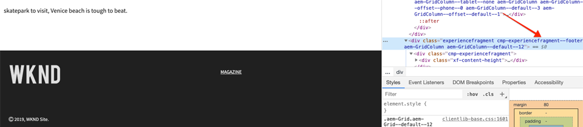

6. Stop the webpack development server.

### Update Experience Fragment Policy

Next we will add the Header and Footer styles by updating the Experience Fragment component policy in AEM.

1. Deploy code base to a local AEM instance using your Maven skills:

   ```shell
   $ cd ~/code/aem-guides-wknd
   $ mvn clean install -PautoInstallSinglePackage
   ```

2. Navigate to the **Article Page Template** located at: [http://localhost:4502/editor.html/conf/wknd/settings/wcm/templates/article-page-template/structure.html](http://localhost:4502/editor.html/conf/wknd/settings/wcm/templates/article-page-template/structure.html).

3. In **Structure** mode, select Header **Experience Fragment**, and select the **Policy** icon.

    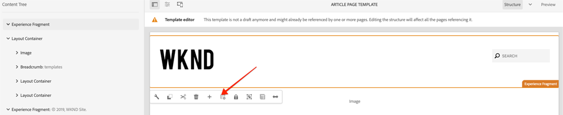

4. Update the **WKND Site Experience Fragment - Header** policy to add a **Default CSS Class** with a value of `cmp-experiencefragment--header`:

    

    Save your changes and you should now see the proper Header CSS styles applied.

    >[!NOTE]
    >
    > Since there is no need to toggle the Header style other than on the template, we can simply set it as the Default CSS style.

5. Next select the Footer **Experience Fragment** and click its **Policy** icon to open the Policy configuration.

6. Update the **WKND Site Experience Fragment - Footer** policy to add a **Default CSS Class** with a value of `cmp-experiencefragment--footer`:

    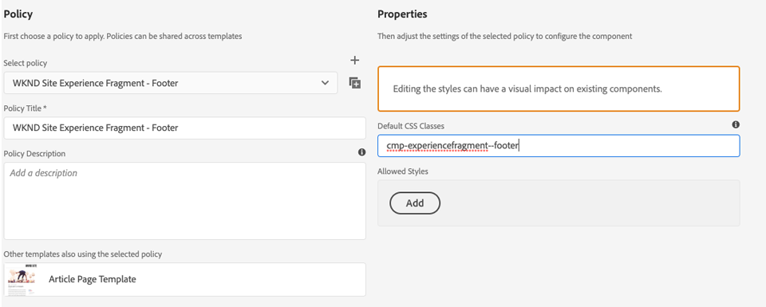

    Save your changes and you should see the Footer CSS styles applied.

    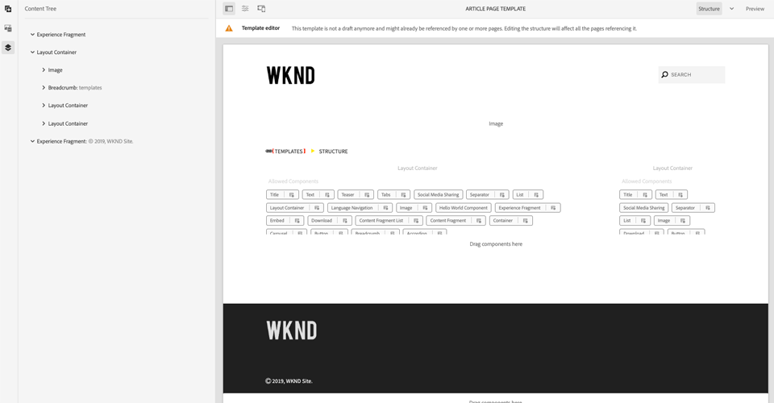

7. Navigate to the **La Skateparks** article in the AEM Sites editor at: [http://localhost:4502/editor.html/content/wknd/us/en/magazine/guide-la-skateparks.html](http://localhost:4502/editor.html/content/wknd/us/en/magazine/guide-la-skateparks.html). You should see the updated Header and Footer applied.

## Review {#review}

Review the Styles and features implemented as part of the chapter.

>[!VIDEO](https://video.tv.adobe.com/v/30378/?quality=12)

## Congratulations! {#congratulations}

Congratulations, the Article Page is nearly completely styled and you gained hands-on experience using the AEM Style System.

### Next Steps {#next-steps}

Learn the steps end-to-end to create a [custom AEM Component](custom-component.md) that displays content authored in a Dialog, and explores developing a Sling Model to encapsulate business logic that populates the component's HTL.

View the finished code on [GitHub](https://github.com/adobe/aem-guides-wknd) or review and deploy the code locally at on the Git brach `style-system/solution`.

1. Clone the [github.com/adobe/aem-wknd-guides](https://github.com/adobe/aem-guides-wknd) repository.
2. Check out the `style-system/solution` branch.
