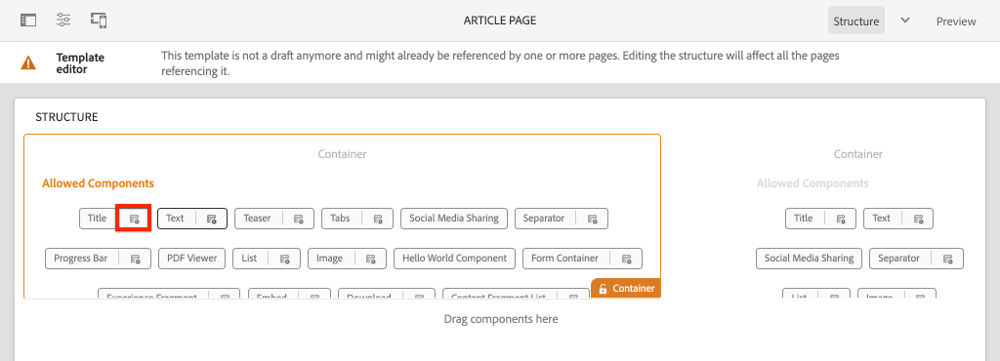
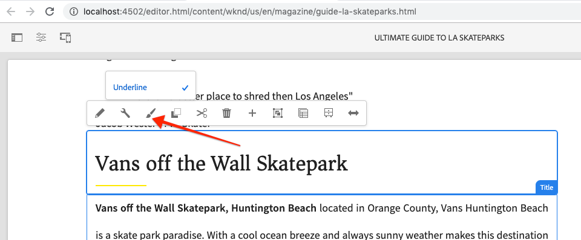
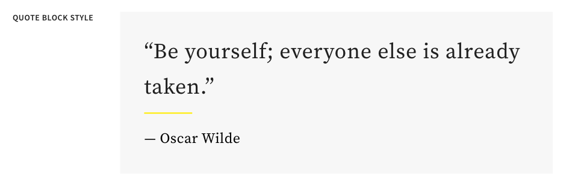
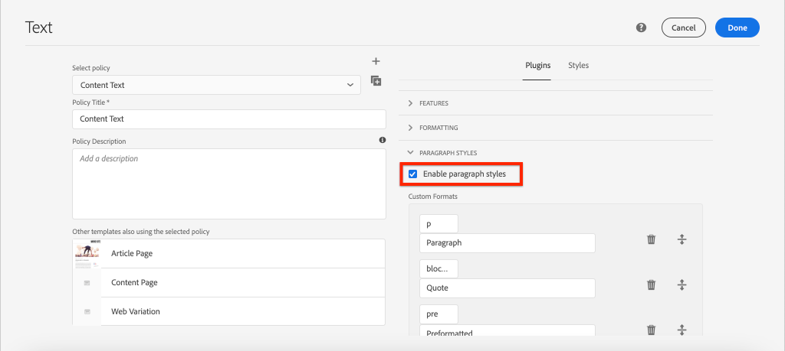
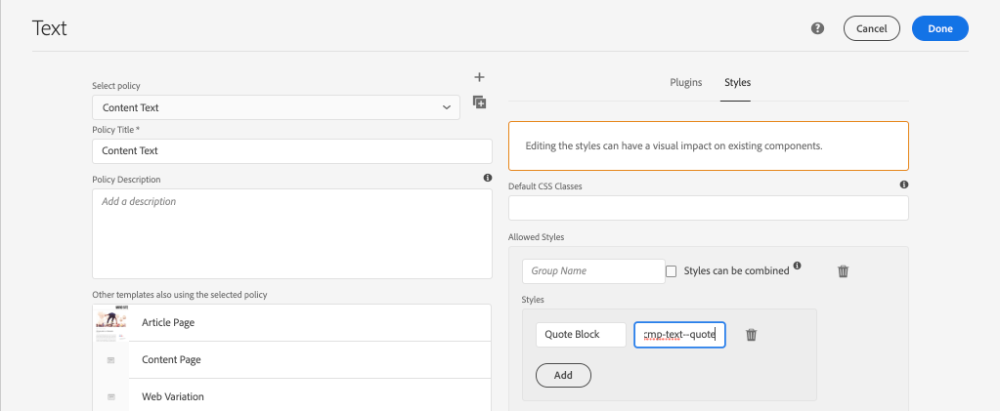
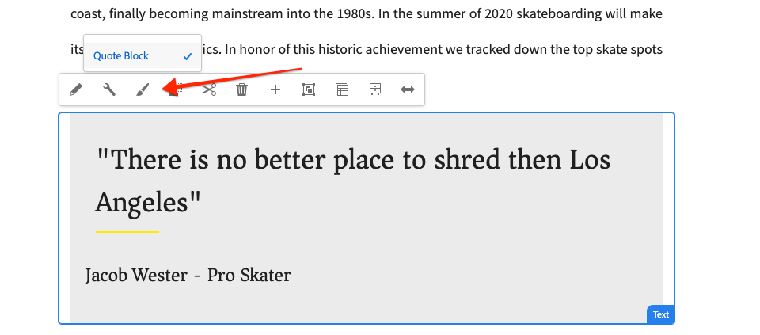
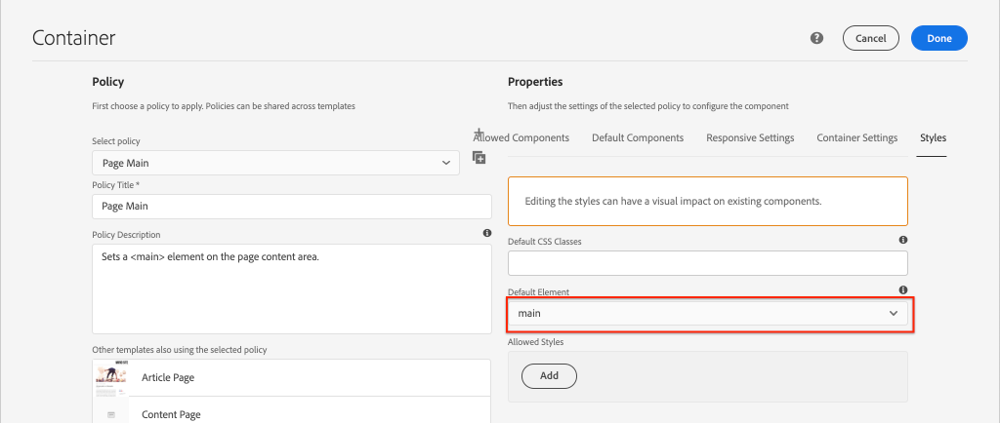

# Developing with the Style System {#developing-with-the-style-system}

Learn how to implement individual styles and re-use Core Components using Experience Manager's Style System. This tutorial covers developing for the Style System to extend Core Components with brand-specific CSS and advanced policy configurations of the Template Editor.

## Prerequisites {#prerequisites}

Review the required tooling and instructions for setting up a [local development environment](overview.md#local-dev-environment).

It is also recommended to review the [Client-side Libraries and Front-end Workflow](client-side-libraries.md) tutorial to understand the fundamentals of client-side libraries and the various front-end tools built into the AEM project.

### Starter Project

>[!NOTE]
>
> If you successfully completed the previous chapter you can re-use the project and skip the steps for checking out the starter project.

Check out the base-line code the tutorial builds on:

1. Check out the `tutorial/style-system-start` branch from [GitHub](https://github.com/adobe/aem-guides-wknd)

    ```shell
    $ cd aem-guides-wknd
    $ git checkout tutorial/style-system-start
    ```

1. Deploy code base to a local AEM instance using your Maven skills:

    ```shell
    $ mvn clean install -PautoInstallSinglePackage
    ```

    >[!NOTE]
    >
    > If using AEM 6.5 or 6.4, append the `classic` profile to any Maven commands.

    ```shell
    $ mvn clean install -PautoInstallSinglePackage -Pclassic
    ```

You can always view the finished code on [GitHub](https://github.com/adobe/aem-guides-wknd/tree/tutorial/style-system-solution) or check the code out locally by switching to the branch `tutorial/style-system-solution`.

## Objective

1. Understand how to use the Style System to apply brand-specific CSS to AEM Core Components.
1. Learn about BEM notation and how it can be used to carefully scope styles.
1. Apply advanced policy configurations with Editable Templates.

## What you will build {#what-you-will-build}

In this chapter we will use the [Style System feature](https://docs.adobe.com/content/help/en/experience-manager-learn/sites/page-authoring/style-system-feature-video-use.html) to create variations of the **Title** and **Text** components used on the Article page.


*Underline style available to use for Title Component*

## Background {#background}

The [Style System](https://docs.adobe.com/content/help/en/experience-manager-65/developing/components/style-system.html) allows developers and template editors to create multiple visual variations of a component. Authors can then in turn decide which style to use when composing a page. We will leverage the Style System throughout the rest of the tutorial to achieve several unique styles, while leveraging Core Components in a low code approach.

The general idea with the Style System is that authors can choose various styles of how a component should look. The "styles" are backed by additional CSS classes that are injected into the outer div of a component. In the client libraries CSS rules are added based on these style classes so that the component changes appearance.

You can find [detailed documentation for Style System here](https://experienceleague.adobe.com/docs/experience-manager-cloud-service/sites/authoring/features/style-system.html). There is also a great [technical video for understanding the Style System](https://experienceleague.adobe.com/docs/experience-manager-learn/sites/developing/style-system-technical-video-understand.html).

## Underline Style - Title {#underline-style}

The [Title Component](https://experienceleague.adobe.com/docs/experience-manager-core-components/using/components/title.html) has been proxied into the project under `/apps/wknd/components/title` as part of the **ui.apps** module. The default styles of Heading elements (`H1`, `H2`, `H3`...) have already been implemented in the **ui.frontend** module.

The [WKND Article designs](assets/pages-templates/wknd-article-design.xd) contain a unique style for the Title component with an underline. Instead of creating two components or modifying the component dialog, the Style System can be used to allow authors the option to add an underline style.


### Inspect Title markup

As a front-end developer the first step to styling a Core Component is to understand the markup generated by the component.

1. Open a new browser and view the Title component on the AEM Core Component Library site: [https://www.aemcomponents.dev/content/core-components-examples/library/page-authoring/title.html](https://www.aemcomponents.dev/content/core-components-examples/library/page-authoring/title.html)

1. Below is the markup for the Title component:

    ```html
    <div class="cmp-title">
        <h1 class="cmp-title__text">Lorem Ipsum</h1>
    </div>
    ```

    The BEM notation of the Title Component:

    ```plain
    BLOCK cmp-title
        ELEMENT cmp-title__text
    ```

1. The Style system adds a CSS class to the outer div surrounding the component. Therefore the markup we will be targeting will resemble something like the following:

    ```html
    <div class="STYLE-SYSTEM-CLASS-HERE"> <!-- Custom CSS class - implementation gets to define this -->
        <div class="cmp-title">
            <h1 class="cmp-title__text">Lorem Ipsum</h1>
        </div>
    </div>
    ```

### Implement the Underline Style - ui.frontend

Next, implement the Underline style using the **ui.frontend** module of our project. We will use the webpack development server that is bundled with the **ui.frontend** module to preview the styles *before* deploying to a local instance of AEM.

1. Start the webpack dev server by running the following command from within the **ui.frontend** module:

    ```shell
    $ cd ~/code/aem-guides-wknd/ui.frontend/
    $ npm start

    > aem-maven-archetype@1.0.0 start code/aem-guides-wknd/ui.frontend
    > webpack-dev-server --open --config ./webpack.dev.js
    ```

    This should open a browser at [http://localhost:8080](http://localhost:8080).

    >[!NOTE]
    >
    > If images appear broken, ensure that the starter project has been deployed to a local instance of AEM (running on port 4502) and the browser used has also logged into the local AEM instance.

    

1. In the IDE open the file `index.html` located at: `ui.frontend/src/main/webpack/static/index.html`. This is the static markup used by the webpack development server.
1. In `index.html` find an instance of the Title Component to add the underline style to by searching the document for *cmp-title*. Choose the Title component with the text *"Vans off the Wall Skatepark"* (line 218). Add the class `cmp-title--underline` to the surrounding div:

   ```diff
   - <div class="title aem-GridColumn--phone--12 aem-GridColumn aem-GridColumn--default--8">
   + <div class="cmp-title--underline title aem-GridColumn--phone--12 aem-GridColumn aem-GridColumn--default--8">
        <div data-cmp-data-layer="{&#34;title-8bea562fa0&#34;:{&#34;@type&#34;:&#34;wknd/components/title&#34;,&#34;repo:modifyDate&#34;:&#34;2021-01-22T18:54:20Z&#34;,&#34;dc:title&#34;:&#34;Vans Off the Wall&#34;}}" id="title-8bea562fa0" class="cmp-title">
            <h2 class="cmp-title__text">Vans Off the Wall</h2>
        </div>
    </div>
   ```

1. Return to the browser and verify that the extra class is reflected in the markup.
1. Return to the **ui.frontend** module and update the file `title.scss` located at: `ui.frontend/src/main/webpack/components/_title.scss`:

    ```css
    /* Add Title Underline Style */
    .cmp-title--underline {
        .cmp-title__text {
            &:after {
            display: block;
                width: 84px;
                padding-top: 8px;
                content: '';
                border-bottom: 2px solid $brand-primary;
            }
        }
    }
    ```

    >[!NOTE]
    >
    >It is considered a best practice to always tightly scope styles to the target component. This ensures that extra styles don't affect other areas of the page.
    >
    >All Core Components adhere to **[BEM notation](https://github.com/adobe/aem-core-wcm-components/wiki/css-coding-conventions)**. It is a best practice to target the outer CSS class when creating a default style for a component. Another best practice is to target class names specified by the Core Component BEM notation rather than HTML elements.

1. Return to the browser once more and you should see the Underline style added:

    

1. Stop the webpack development server.

### Add a Title Policy

Next we need to add a new policy for Title components to allow content authors to choose the Underline style to apply to specific components. This is done using the Template Editor within AEM.

1. Deploy the code base to a local AEM instance using your Maven skills:

    ```shell
    $ cd ~/code/aem-guides-wknd
    $ mvn clean install -PautoInstallSinglePackage
    ```

1. Navigate to the **Article Page** template located at: [http://localhost:4502/editor.html/conf/wknd/settings/wcm/templates/article-page/structure.html](http://localhost:4502/editor.html/conf/wknd/settings/wcm/templates/article-page/structure.html)

1. In **Structure** mode, in the main **Layout Container**, select the **Policy** icon next to the **Title** component listed under *Allowed Components*:

    

1. Create a new policy for the Title component with the following values:

    *Policy Title &#42;*: **WKND Title**

    *Properties* &gt; *Styles Tab* &gt; *Add a new style*

    **Underline** : `cmp-title--underline`

   

    Click **Done** to save the changes to the Title policy.

    >[!NOTE]
    >
    > The value `cmp-title--underline` matches the CSS class we targeted earlier when developing in the **ui.frontend** module.

### Apply the Underline Style

Finally, as an author, we can choose to apply the underline style to certain Title Components.

1. Navigate to the **La Skateparks** article in the AEM Sites editor at: [http://localhost:4502/editor.html/content/wknd/us/en/magazine/guide-la-skateparks.html](http://localhost:4502/editor.html/content/wknd/us/en/magazine/guide-la-skateparks.html)
1. In **Edit** mode, choose a Title component. Click the **paintbrush** icon and select the **Underline** style:

    

    As an author you should be able to toggle on/off the style.

1. Click the **Page Information** icon &gt; **View as Published** to inspect the page outside of AEM's editor.

    

    Use your browser developer tools to verify the markup around the Title component has the CSS class `cmp-title--underline` applied to the outer div.

## Quote block Style - Text {#text-component}

Next, repeat similar steps to apply a unique style to the [Text Component](https://experienceleague.adobe.com/docs/experience-manager-core-components/using/components/text.html). The Text component has been proxied into the project under `/apps/wknd/components/text` as part of the **ui.apps** module. The default styles of paragraph elements have already been implemented in the **ui.frontend**.

The [WKND Article designs](assets/pages-templates/wknd-article-design.xd) contain a unique style for the Text component with a quote block:



### Inspect Text Component Markup

Once again we will inspect the Text component's markup.

1. Review the markup for the Text component at: [https://www.aemcomponents.dev/content/core-components-examples/library/page-authoring/text.html](https://www.aemcomponents.dev/content/core-components-examples/library/page-authoring/text.html)

1. Below is the markup for the Text component:

    ```html
    <div class="text">
        <div class="cmp-text" data-cmp-data-layer="{&quot;text-2d9d50c5a7&quot;:{&quot;@type&quot;:&quot;core/wcm/components/text/v2/text&quot;,&quot;repo:modifyDate&quot;:&quot;2019-01-22T11:56:17Z&quot;,&quot;xdm:text&quot;:&quot;<p>Lorem ipsum dolor sit amet, consectetur adipiscing elit, sed do eiusmod tempor incididunt ut labore et dolore magna aliqua. Eu mi bibendum neque egestas congue quisque egestas. Varius morbi enim nunc faucibus a pellentesque. Scelerisque eleifend donec pretium vulputate sapien nec sagittis.</p>\n&quot;}}" id="text-2d9d50c5a7">
            <p>Lorem ipsum dolor sit amet, consectetur adipiscing elit, sed do eiusmod tempor incididunt ut labore et dolore magna aliqua. Eu mi bibendum neque egestas congue quisque egestas. Varius morbi enim nunc faucibus a pellentesque. Scelerisque eleifend donec pretium vulputate sapien nec sagittis.</p>
        </div>
    </div>
    ```

    The BEM notation of the Text Compponent:

    ```plain
    BLOCK cmp-text
        ELEMENT
    ```

1. The Style system adds a CSS class to the outer div surrounding the component. Therefore the markup we will be targeting will resemble something like the following:

    ```html
    <div class="text STYLE-SYSTEM-CLASS-HERE"> <!-- Custom CSS class - implementation gets to define this -->
        <div class="cmp-text" data-cmp-data-layer="{&quot;text-2d9d50c5a7&quot;:{&quot;@type&quot;:&quot;core/wcm/components/text/v2/text&quot;,&quot;repo:modifyDate&quot;:&quot;2019-01-22T11:56:17Z&quot;,&quot;xdm:text&quot;:&quot;<p>Lorem ipsum dolor sit amet, consectetur adipiscing elit, sed do eiusmod tempor incididunt ut labore et dolore magna aliqua. Eu mi bibendum neque egestas congue quisque egestas. Varius morbi enim nunc faucibus a pellentesque. Scelerisque eleifend donec pretium vulputate sapien nec sagittis.</p>\n&quot;}}" id="text-2d9d50c5a7">
            <p>Lorem ipsum dolor sit amet, consectetur adipiscing elit, sed do eiusmod tempor incididunt ut labore et dolore magna aliqua. Eu mi bibendum neque egestas congue quisque egestas. Varius morbi enim nunc faucibus a pellentesque. Scelerisque eleifend donec pretium vulputate sapien nec sagittis.</p>
        </div>
    </div>
    ```

### Implement the Quote Block Style - ui.frontend

Next we will implement the Quote Block style using the **ui.frontend** module of our project.

1. Start the webpack dev server by running the following command from within the **ui.frontend** module:

    ```shell
    $ cd ~/code/aem-guides-wknd/ui.frontend/
    $ npm start
    ```

1. In the IDE, open the file `index.html` located at: `ui.frontend/src/main/webpack/static/index.html`.
1. In `index.html` find an instance of the Text Component by searching for the text *"Jacob Wester"* (line 210). Add the class `cmp-text--quote` to the surrounding div:

   ```diff
   - <div class="text aem-GridColumn--phone--12 aem-GridColumn aem-GridColumn--default--8">
   + <div class="cmp-text--quote text aem-GridColumn--phone--12 aem-GridColumn aem-GridColumn--default--8">
        <div data-cmp-data-layer="{&#34;text-a15f39a83a&#34;:{&#34;@type&#34;:&#34;wknd/components/text&#34;,&#34;repo:modifyDate&#34;:&#34;2021-01-22T00:23:27Z&#34;,&#34;xdm:text&#34;:&#34;&lt;blockquote>&amp;quot;There is no better place to shred then Los Angeles.”&lt;/blockquote>\r\n&lt;p>- Jacob Wester, Pro Skater&lt;/p>\r\n&#34;}}" id="text-a15f39a83a" class="cmp-text">
            <blockquote>&quot;There is no better place to shred then Los Angeles.”</blockquote>
            <p>- Jacob Wester, Pro Skater</p>
        </div>
    </div>
   ```

1. Update the file `text.scss` located at: `ui.frontend/src/main/webpack/components/_text.scss`:

    ```css
    /* WKND Text Quote style */
    .cmp-text--quote {
        .cmp-text {
            background-color: $brand-third;
            margin: 1em 0em;
            padding: 1em;

            blockquote {
                border: none;
                font-size: $font-size-large;
                font-family: $font-family-serif;
                padding: 14px 14px;
                margin: 0;
                margin-bottom: 0.5em;

                &:after {
                    border-bottom: 2px solid $brand-primary; /*yellow border */
                    content: '';
                    display: block;
                    position: relative;
                    top: 0.25em;
                    width: 80px;
                }
            }
            p {
                font-family:  $font-family-serif;
            }
        }
    }
    ```

    >[!CAUTION]
    >
    > In this case raw HTML elements are targeted by the styles. This is because the Text component provides a Rich Text Editor for content authors. Creating styles directly against RTE content should be done with care and it is even more important to tightly scope the styles.

1. Return to the browser once more and you should see the Quote block style added:

    

1. Stop the webpack development server.

### Add a Text Policy

Next add a new policy for the Text components.

1. Deploy code base to a local AEM instance using your Maven skills:

   ```shell
   $ cd ~/code/aem-guides-wknd
   $ mvn clean install -PautoInstallSinglePackage
   ```

1. Navigate to the **Article Page Template** located at: [http://localhost:4502/editor.html/conf/wknd/settings/wcm/templates/article-page/structure.html](http://localhost:4502/editor.html/conf/wknd/settings/wcm/templates/article-page/structure.html)).

1. In **Structure** mode, in the main **Layout Container**, select the **Policy** icon next to the **Text** component listed under *Allowed Components*:

    

1. Update the Text component policy with the following values:

    *Policy Title &#42;*: **Content Text**

    *Plugins* &gt; *Paragraph Styles* &gt; *Enable paragraph styles*

    *Styles Tab* &gt; *Add a new style*

    **Quote Block** : `cmp-text--quote`

    

    

    Click **Done** to save the changes to the Text policy.

### Apply the Quote Block Style

1. Navigate to the **La Skateparks** article in the AEM Sites editor at: [http://localhost:4502/editor.html/content/wknd/us/en/magazine/guide-la-skateparks.html](http://localhost:4502/editor.html/content/wknd/us/en/magazine/guide-la-skateparks.html)
1. In **Edit** mode, choose a Text component. Edit the component to include a quote element:

    

1. Select the text component and click the **paintbrush** icon and select the **Quote Block** style:

    

    As an author you should be able to toggle on/off the style.

## Fixed Width - Container (Bonus) {#layout-container}

Container components have been used to create the basic structure of the Article Page Template and provide the drop zones for content authors to add content on a page. Containers can also leverage the Style System, providing content authors with even more options for designing layouts.

The **Main Container** of the Article Page template contains the two author-able containers and has a fixed width.


*Main Container in the Article Page Template*.

The policy of the **Main Container** sets the default element as `main`:



The CSS that makes the **Main Container** fixed is set in the **ui.frontend** module at `ui.frontend/src/main/webpack/site/styles/container_main.scss` :

```SCSS
main.container {
    padding: .5em 1em;
    max-width: $max-content-width;
    float: unset!important;
    margin: 0 auto!important;
    clear: both!important;
}
```

Instead of targeting the `main` HTML element, the Style System could be used to create a **Fixed width** style as part of the Container policy. The Style System could give users the option of toggling between **Fixed width** and **Fluid width** containers.

1. **Bonus Challenge** - use lessons learned from the previous exercises and use the Style System to implement a **Fixed width** and **Fluid width** styles for the Container component.

## Congratulations! {#congratulations}

Congratulations, the Article Page is nearly completely styled and you gained hands-on experience using the AEM Style System.

### Next Steps {#next-steps}

Learn the steps end-to-end to create a [custom AEM Component](custom-component.md) that displays content authored in a Dialog, and explores developing a Sling Model to encapsulate business logic that populates the component's HTL.

View the finished code on [GitHub](https://github.com/adobe/aem-guides-wknd) or review and deploy the code locally at on the Git brach `tutorial/style-system-solution`.

1. Clone the [github.com/adobe/aem-wknd-guides](https://github.com/adobe/aem-guides-wknd) repository.
1. Check out the `tutorial/style-system-solution` branch.
