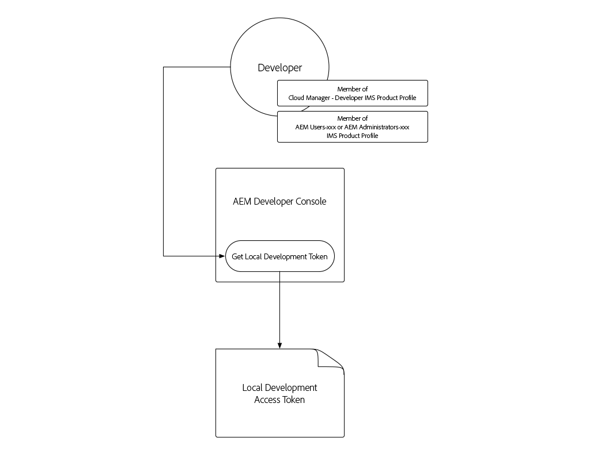
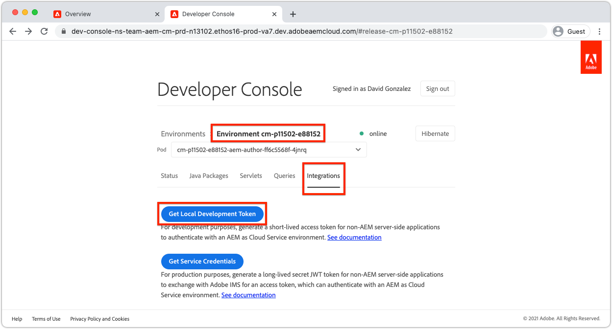
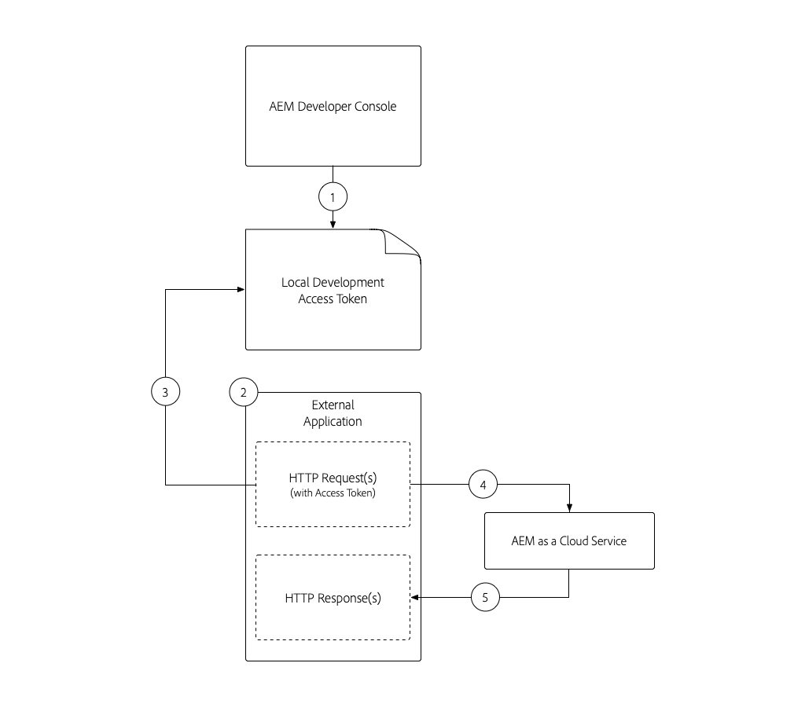
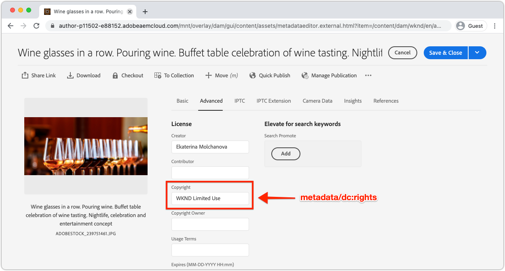

# Local Development Access Token

Developers building integrations that require programmatic access to AEM as a Cloud Service need a simple, quick way to obtain temporary access tokens for AEM to facilitate local development activities. To satisfy this need, AEM's Developer Console allows developers to self-generate temporary access tokens that can be used to programmatically access AEM.

>[!VIDEO](https://video.tv.adobe.com/v/330477?quality=12&learn=on)

## Generate a Local Development Access Token



The Local Development Access Token provides access to AEM Author and Publish services as the user who generated the token, along with their permissions. Despite this being a development token, do not share this token, or store in source control.

1. In [Adobe Admin Console](https://adminconsole.adobe.com/) ensure you, the developer, are a member of:
    + __Cloud Manager - Developer__ IMS Product Profile (grants access to AEM Developer Console)
    + Either the __AEM Administrators__ or __AEM Users__ IMS Product Profile for the AEM environment's service the access token integrates with
    + Sandbox AEM as a Cloud Service environment only require membership in either the __AEM Administrators__ or __AEM Users__ Product Profile
1. Log in to [Adobe Cloud Manager](https://my.cloudmanager.adobe.com)
1. Open the Program containing the AEM as a Cloud Service environment to integrate with
1. Tap the __ellipsis__ next to the environment in the __Environments__ section, and select __Developer Console__
1. Tap in the __Integrations__ tab
1. Tap the __Local token__ tab
1. Tap __Get Local Development Token__ button
1. Tap on the __download button__ in the top-left corner to download the JSON file containing `accessToken` value, and save the JSON file to a safe location on your development machine.
    + This is your 24 hour, developer access token to the AEM as a Cloud Service environment. 



## Used the Local Development Access Token{#use-local-development-access-token}



1. Download the temporary Local Development Access Token from AEM Developer Console
    + The Local Development Access Token expires every 24 hours, so developers need to do download new access tokens daily
1. An External Application is being developed that programmatically interacts with AEM as a Cloud Service
1. The External Application reads in the Local Development Access Token
1. The External Application constructs HTTP requests to AEM as a Cloud Service, adding the Local Development Access Token as a Bearer token to the HTTP requests' Authorization header
1. AEM as a Cloud Service receives the HTTP request, authenticates the request, and performs the work requested by the HTTP request, and returns an HTTP response back to the External Application

### The Sample External Application

We'll create a simple external JavaScript application to illustrate how to programmatically access AEM as a Cloud Service over HTTPS using the local developer access token. This illustrates how _any_ application or system running outside of AEM, regardless of framework or language, can use the access token to programmatically authenticate to, and access, AEM as a Cloud Service. In the [next section](./service-credentials.md), we'll update this application code to support the approach for generating a token for production use.

This sample application is run from the command line, and updates AEM asset metadata using AEM Assets HTTP APIs, using the following flow:

1. Reads in parameters from the command line (`getCommandLineParams()`)
1. Obtains the access token used to authenticate to AEM as a Cloud Service (`getAccessToken(...)`)
1. Lists all assets in a AEM asset folder specified in a command-line parameters (`listAssetsByFolder(...)`)
1. Update listed assets' metadata with values specified in command-line parameters (`updateMetadata(...)`)

The key element in programmatically authenticating to AEM using the access token is adding an Authorization HTTP request header to all HTTP requests made to AEM, in the following format:

+ `Authorization: Bearer ACCESS_TOKEN`

## Running the External Application

1. Ensure that [Node.js](/help/cloud-service/local-development-environment/development-tools.md?lang=en#node-js) is installed on your local development machine, which is used to run the external application
1. Download and unzip the [sample external application](./assets/aem-guides_token-authentication-external-application.zip)
1. From the command line, in this project's folder, run `npm install`
1. Copy the [downloaded the Local Development Access Token](#download-local-development-access-token) to a file named `local_development_token.json` in the root of the project
    + But remember, never commit any credentials to Git!
1. Open `index.js` and review the external application code and comments. 

    ```javascript
    const fetch = require('node-fetch');
    const fs = require('fs');
    const auth = require('@adobe/jwt-auth');

    // The root context of the Assets HTTP API
    const ASSETS_HTTP_API = '/api/assets';

    // Command line parameters
    let params = { };

    /**
    * Application entry point function
    */
    (async () => {
        console.log('Example usage: node index.js aem=https://author-p1234-e5678.adobeaemcloud.com propertyName=metadata/dc:rights "propertyValue=WKND Limited Use" folder=/wknd-shared/en/adventures/napa-wine-tasting file=credentials-file.json' );

        // Parse the command line parameters
        params = getCommandLineParams();
        
        // Set the access token to be used in the HTTP requests to be local development access token
        params.accessToken = await getAccessToken(params.developerConsoleCredentials);

        // Get a list of all the assets in the specified assets folder
        let assets = await listAssetsByFolder(params.folder);

        // For each asset, update it's metadata
        await assets.forEach(asset => updateMetadata(asset, { 
            [params.propertyName]: params.propertyValue 
        }));
    })();

    /**
    * Returns a list of Assets HTTP API asset URLs that reference the assets in the specified folder.
    * 
    * https://experienceleague.adobe.com/docs/experience-manager-cloud-service/assets/admin/mac-api-assets.html?lang=en#retrieve-a-folder-listing
    * 
    * @param {*} folder the Assets HTTP API folder path (less the /content/dam path prefix)
    */
    async function listAssetsByFolder(folder) {
        return fetch(`${params.aem}${ASSETS_HTTP_API}${folder}.json`, {
                method: 'get',
                headers: { 
                    'Content-Type': 'application/json',
                    'Authorization': 'Bearer ' + params.accessToken // Provide the AEM access token in the Authorization header
                },
            })
            .then(res => {
                console.log(`${res.status} - ${res.statusText} @ ${params.aem}${ASSETS_HTTP_API}${folder}.json`);
                
                // If success, return the JSON listing assets, otherwise return empty results
                return res.status === 200 ? res.json() : { entities: [] };
            })
            .then(json => { 
                // Returns a list of all URIs for each non-content fragment asset in the folder
                return json.entities
                    .filter((entity) => entity['class'].indexOf('asset/asset') === -1 && !entity.properties.contentFragment)
                    .map(asset => asset.links.find(link => link.rel.find(r => r === 'self')).href);
            });
    }

    /**
    * Update the metadata of an asset in AEM
    * 
    * https://experienceleague.adobe.com/docs/experience-manager-cloud-service/assets/admin/mac-api-assets.html?lang=en#update-asset-metadata
    * 
    * @param {*} asset the Assets HTTP API asset URL to update
    * @param {*} metadata the metadata to update the asset with
    */
    async function updateMetadata(asset, metadata) {        
        await fetch(`${asset}`, {
                method: 'put',
                headers: { 
                    'Content-Type': 'application/json',
                    'Authorization': 'Bearer ' + params.accessToken // Provide the AEM access token in the Authorization header
                },
                body: JSON.stringify({
                    class: 'asset',
                    properties: metadata
                })
            })
            .then(res => { 
                console.log(`${res.status} - ${res.statusText} @ ${asset}`);
            });
    }

    /**
    * Parse and return the command line parameters. Expected params are:
    * 
    * - aem = The AEM as a Cloud Service hostname to connect to.
    *              Example: https://author-p12345-e67890.adobeaemcloud.com
    * - folder = The asset folder to update assets in. Note that the Assets HTTP API do NOT use the JCR `/content/dam` path prefix.
    *              Example: '/wknd-shared/en/adventures/napa-wine-tasting'
    * - propertyName = The asset property name to update. Note this is relative to the [dam:Asset]/jcr:content node of the asset.
    *              Example: metadata/dc:rights
    * - propertyValue = The value to update the asset property (specified by propertyName) with.
    *              Example: "WKND Free Use"
    * - file = The path to the JSON file that contains the credentials downloaded from AEM Developer Console
    *              Example: local_development_token_cm_p1234-e5678.json 
    */
    function getCommandLineParams() {
        let parameters = {};

        // Parse the command line params, splitting on the = delimiter
        for (let i = 2; i < process.argv.length; i++) {
            let key = process.argv[i].split('=')[0];
            let value = process.argv[i].split('=')[1];

            parameters[key] = value;
        };

        // Read in the credentials from the provided JSON file
        if (parameters.file) {
            parameters.developerConsoleCredentials = JSON.parse(fs.readFileSync(parameters.file));
        }

        console.log(parameters);

        return parameters;
    }

    async function getAccessToken(developerConsoleCredentials) {s
        if (developerConsoleCredentials.accessToken) {
            // This is a Local Development access token
            return developerConsoleCredentials.accessToken;
        } 
    }
    ```

    Review the `fetch(..)` invocations in the `listAssetsByFolder(...)` and `updateMetadata(...)`, and notice `headers` define the `Authorization` HTTP request header with a value of `Bearer ACCESS_TOKEN`. This is how the HTTP request originating from the external application authenticates to AEM as a Cloud Service.

    ```javascript
    ...
    return fetch(`${params.aem}${ASSETS_HTTP_API}${folder}.json`, {
                method: 'get',
                headers: { 
                    'Content-Type': 'application/json',
                    'Authorization': 'Bearer ' + params.accessToken // Provide the AEM access token in the Authorization header
                },
    })...
    ```

    Any HTTP requests to AEM as a Cloud Service, must set the Bearer access token in the Authorization header. Remember, each AEM as a Cloud Service environment requires its own access token. Development's access token does not work on Stage or Production, Stage's does not work on Development or Production, and Production's does not work on Development or Stage!

1. Using the command line, from the root of the project execute the application, passing in the following parameters:

    ```shell
    $ node index.js \
        aem=https://author-p1234-e5678.adobeaemcloud.com \
        folder=/wknd-shared/en/adventures/napa-wine-tasting \
        propertyName=metadata/dc:rights \
        propertyValue="WKND Limited Use" \
        file=local_development_token.json
    ```

    The following parameters are passed in:

    + `aem`: The scheme and host name of the AEM as a Cloud Service environment the application interacts with (ex. `https://author-p1234-e5678.adobeaemcloud.com`).
    + `folder`: The asset folder path whose assets are updated with the `propertyValue`; do NOT add the `/content/dam` prefix (ex. `/wknd-shared/en/adventures/napa-wine-tasting`)
    + `propertyName`: The asset property name to update, relative to `[dam:Asset]/jcr:content` (ex. `metadata/dc:rights`).
    + `propertyValue`: The value to set the `propertyName` to; values with spaces need to be encapsulated with `"` (ex. `"WKND Limited Use"`)
    + `file`: The relative file path to the JSON file downloaded from AEM Developer Console.

    A successful execution of the application results output for each asset updated:

   ```shell
   200 - OK @ https://author-p1234-e5678.adobeaemcloud.com/api/assets/wknd-shared/en/adventures/napa-wine-tasting.json
   200 - OK @ https://author-p1234-e5678.adobeaemcloud.com/api/assets/wknd-shared/en/adventures/napa-wine-tasting/AdobeStock_277654931.jpg.json
   200 - OK @ https://author-p1234-e5678.adobeaemcloud.com/api/assets/wknd-shared/en/adventures/napa-wine-tasting/AdobeStock_239751461.jpg.json
   200 - OK @ https://author-p1234-e5678.adobeaemcloud.com/api/assets/wknd-shared/en/adventures/napa-wine-tasting/AdobeStock_280313729.jpg.json
   200 - OK @ https://author-p1234-e5678.adobeaemcloud.com/api/assets/wknd-shared/en/adventures/napa-wine-tasting/AdobeStock_286664352.jpg.json
   ```

### Verify metadata update in AEM

Verify that the metadata has been updated, by logging in to the AEM as a Cloud Service environment (ensure the same host passed into the `aem` command-line parameter is accessed).

1. Log into the AEM as a Cloud Service environment that the external application interacted with (use the same host provided in the `aem` command-line parameter)
1. Navigate to the __Assets__ > __Files__
1. Navigate it the asset folder specified by the `folder` command-line parameter, for example __WKND__ > __English__ > __Adventures__ > __Napa Wine Tasting__
1. Open the __Properties__ for any (non-Content Fragment) asset in the folder
1. Tap to the __Advanced__ tab
1. Review the value of the updated property, for example __Copyright__ which is mapped to the updated `metadata/dc:rights` JCR property, which reflects the value provided in the `propertyValue` parameter, for example __WKND Limited Use__



## Next steps

Now that we've programmatically accessed AEM as a Cloud Service using the local development token. Next we need to update the application to handle using Service Credentials, so this application can be used in a production context.

+ [How to use Service Credentials](./service-credentials.md)
