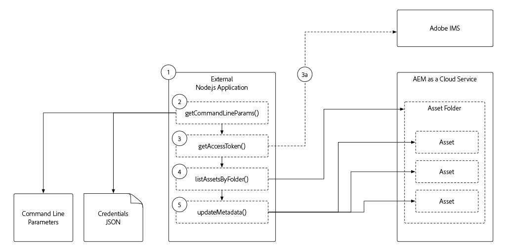

# Token-based authentication to AEM as a Cloud Service

AEM exposes a variety of HTTP endpoints that can be interacted with in a headless manner, from GraphQL, AEM Content Services to Assets HTTP API. Often, these headless consumers may need to authenticate to AEM in order to access protected content or actions. To facilitate this, AEM supports token-based authentication of HTTP requests from external applications, services or systems.

In this tutorial well explore how an external application can programmatically authenticate and interact with to AEM as a Cloud Service over HTTP using access tokens. 

>[!VIDEO](https://video.tv.adobe.com/v/330460/?quality=12&learn=on)

## Pre-requisites

Ensure the following are in place before following along with this tutorial: 

1. Access to am AEM as a Cloud Service environment (preferably a Development environment or a Sandbox program)
1. Membership in the AEM as a Cloud Service environment's Author services AEM Administrator Product Profile
1. Membership in, or access, to your Adobe IMS Org Administrator (they will have to perform a one-time initialization of the [Service Credentials](./service-credentials.md))
1. The latest [WKND Site](https://github.com/adobe/aem-guides-wknd) deployed to your Cloud Service environment

## External Application overview

This tutorial uses a [simple Node.js application](./assets/aem-guides_token-authentication-external-application.zip) run from the command line to update asset metadata on AEM as a Cloud Service using [Assets HTTP API](https://experienceleague.adobe.com/docs/experience-manager-cloud-service/assets/admin/mac-api-assets.html).

The execution flow of the Node.js application is as follows:

1. The Node.js application is invoked from the command line
1. Command line parameters define:
    + The AEM as a Cloud Service Author service host to connect to (`aem`)
    + The AEM asset folder whose assets are updated (`folder`)
    + The metadata property and value to update (`propertyName` and `propertyValue`)
    + The local path to the file providing the credentials required to access AEM as a Cloud Service (`file`)
1. The access token used to authenticate to AEM is derived from the JSON file provided via command line parameter `file`
    
    a. If Service Credentials used for non-local development are provided in the JSON file (`file`), the access token is retrieved from Adobe IMS APIs
1. The application uses the access token to access AEM and list all assets in the folder specified in the command line parameter `folder`
1. For each asset in the folder, the application updates its metadata based on the property name and value specified in the command line parameters `propertyName` and `propertyValue`

While this example application is Node.js, these interactions can be developed using different programming languages and executed from other external systems.

## Local Development Access Token

Local Development Access Tokens are generated for a specific AEM as a Cloud Service environment and providing access to Author and Publish services.  These access tokens are temporary, and are only to be used during the development of external applications or systems that interact with AEM over HTTP. Instead of a developer having to obtain and manage bonafide Service Credentials, they can quickly and easily self-generate a temporary access token allowing them to develop their integration.

+ [How to use Local Development Access Token](./local-development-access-token.md)

## Service Credentials

Service Credentials are the bonafide credentials used in any non-development scenarios - most obviously production - that facilitate an external application or system's ability to authenticate to, and interact with, AEM as a Cloud Service over HTTP. Service Credentials themselves are not sent to AEM for authentication, instead the external application uses these to generate a JWT, which is exchanged with Adobe IMS's APIs _for_ an access token, which can then be used to authenticate HTTP requests to AEM as a Cloud Service.

+ [How to use Service Credentials](./service-credentials.md)

## Additional resources

+ [Download the example application](./assets/aem-guides_token-authentication-external-application.zip)
+ Other code samples of JWT creation and exchange
    + [Node.js, Java, Python, C#.NET, and PHP code samples](https://developer.adobe.com/developer-console/docs/guides/authentication/JWT/samples/)
    + [JavaScript/Axios-based code sample](https://github.com/adobe/aemcs-api-client-lib)
