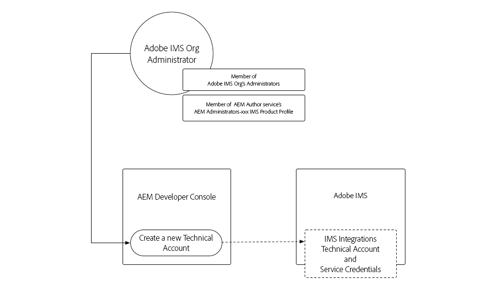
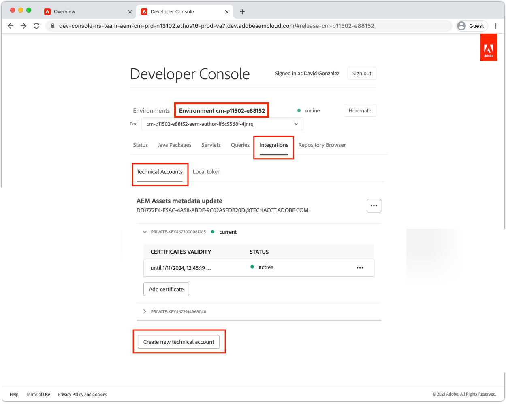
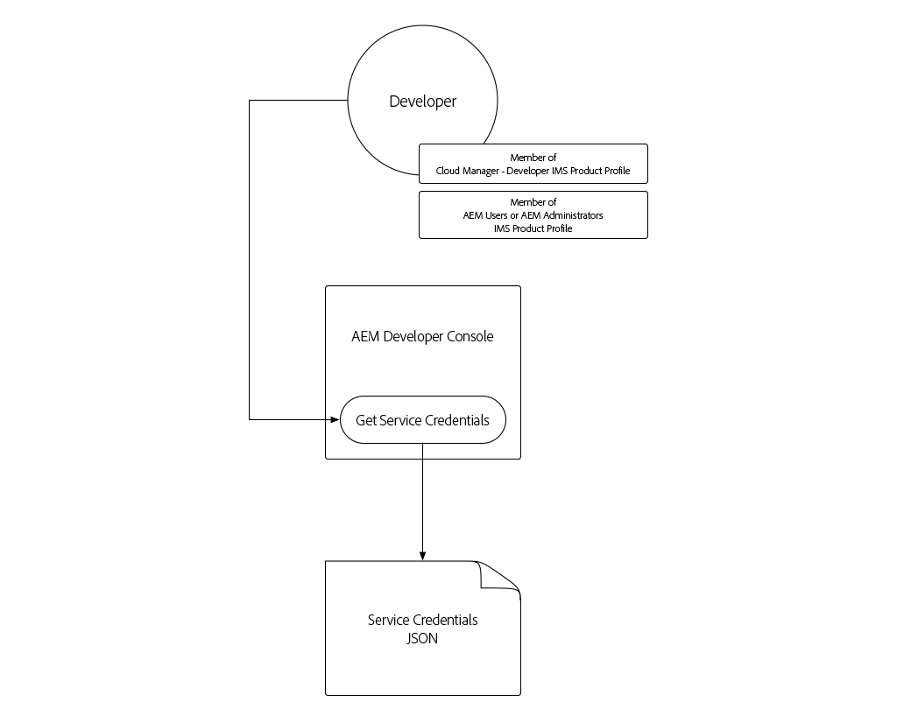
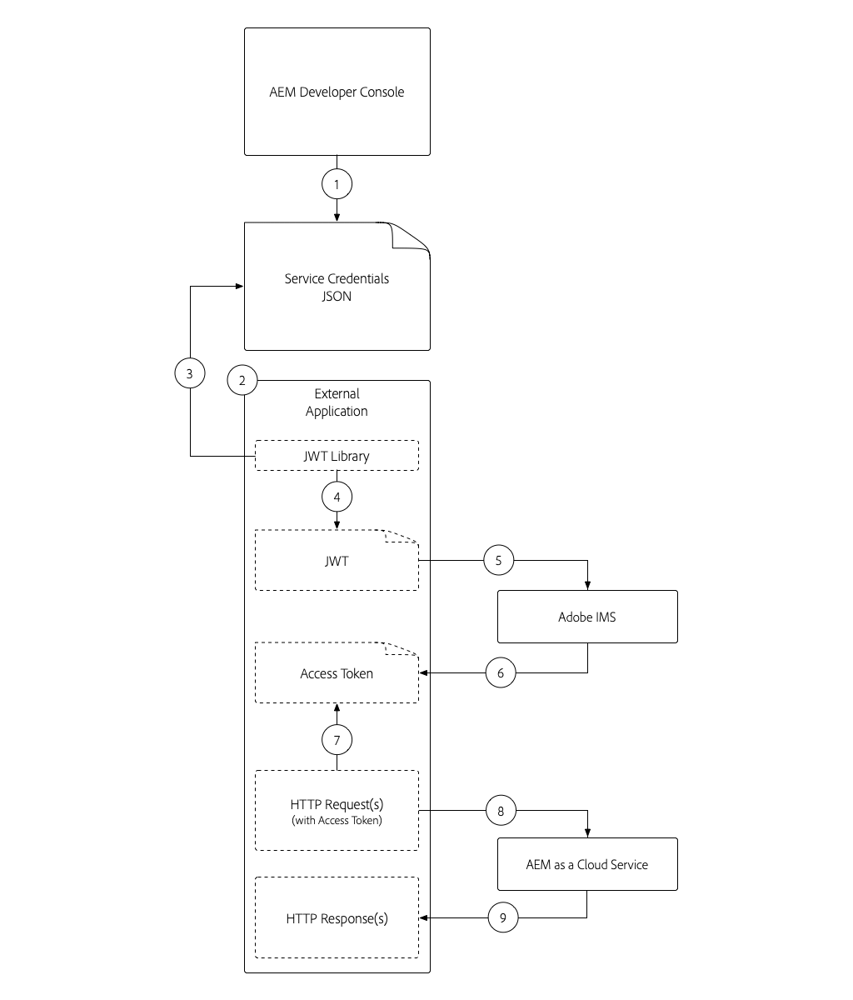
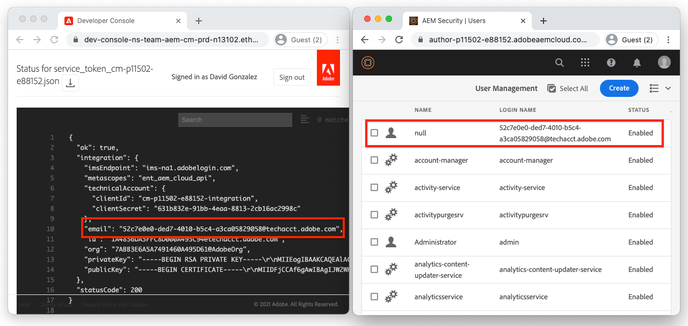
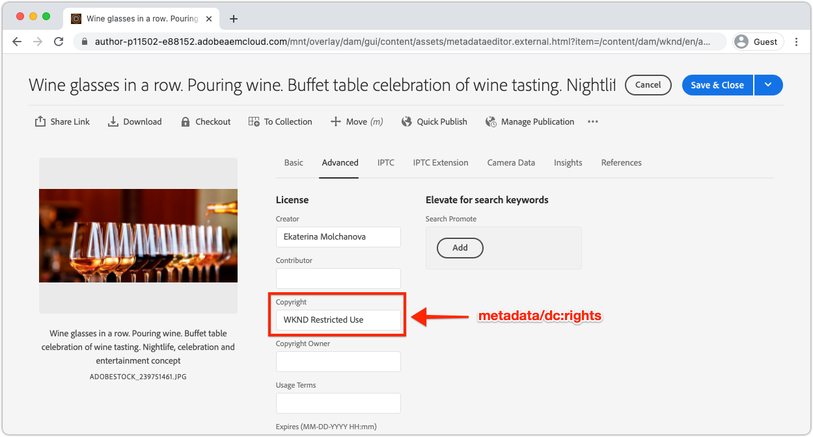

# Service Credentials

Integrations with AEM as a Cloud Service must be able to securely authenticate to AEM. AEM's Developer Console grants access to Service Credentials, which are used to facilitate external applications, systems and services to programmatically interact with AEM Author or Publish services over HTTP.

>[!VIDEO](https://video.tv.adobe.com/v/330519/?quality=12&learn=on)

Service Credentials may appear similar [Local Development Access Tokens](./local-development-access-token.md) but are different in a few key ways:

+ Service Credentials are _not_ access tokens, rather they are credentials that are used to _obtain_ access tokens.
+ Service Credentials are more permanent (expire every 365 days), and do not change unless revoked, whereas Local Development Access Tokens expire daily.
+ Service Credentials for an AEM as a Cloud Service environment map to a single AEM technical account user, whereas Local Development Access Tokens authenticate as the AEM user who generated the access token.

Both Service Credentials and the access tokens they generate, as well as Local Development Access Tokens should be kept secret, as all three can be used to obtain access to their respective AEM as a Cloud Service environments

## Generate Service Credentials

Service Credentials generation is broken into two steps:

1. A one-time Service Credentials initialization by an Adobe IMS Org administrator
1. The download and use of the Service Credentials JSON

### Service Credentials initialization

Service Credentials, unlike Local Development Access Tokens, require a _one-time initialization_ by your Adobe Org IMS Administrator before they can be downloaded. 



__This is a one-time initialization per AEM as a Cloud Service environment__

1. Ensure you are logged in as:
    + Your Adobe IMS Org's Administrator
    + Member of the __Cloud Manager - Developer__ IMS Product Profile
    + Member of the __AEM User__ or __AEM Administrators__ IMS Product Profile on __AEM Author__
1. Log in to [Adobe Cloud Manager](https://my.cloudmanager.adobe.com)
1. Open the Program containing the AEM as a Cloud Service environment to integrate set up the Service Credentials for
1. Tap the ellipsis next to the environment in the __Environments__ section, and select __Developer Console__
1. Tap in the __Integrations__ tab
1. Tap __Get Service Credentials__ button
1. The Service Credentials will be initialized and displayed as JSON 



Once the AEM as Cloud Service environment's Service Credentials have been initialized, other AEM developers in your Adobe IMS Org can download them.

### Download Service Credentials



Downloading the Service Credentials follows the same steps as the initialization. If the initialization has not yet occurred, the user will be presented with an error with tapping the __Get Service Credentials__ button.

1. Ensure you are logged in as a:
    + Member of the __Cloud Manager - Developer__ IMS Product Profile (which grants access to AEM Developer Console)
        + Sandbox AEM as a Cloud Service environments do not require this  __Cloud Manager - Developer__ membership
    + Member of the __AEM User__ or __AEM Administrators__ IMS Product Profile on __AEM Author__
1. Log in to [Adobe Cloud Manager](https://my.cloudmanager.adobe.com)
1. Open the Program containing the AEM as a Cloud Service environment to integrate with
1. Tap the ellipsis next to the environment in the __Environments__ section, and select __Developer Console__
1. Tap in the __Integrations__ tab
1. Tap __Get Service Credentials__ button
1. Tap on the download button in the top left corner to download the JSON file containing the Service Credentials value, and save the file to a safe location.
   + _If Service Credentials are compromised, immediately contact Adobe Support to have have them revoked_

## Install the Service Credentials

The Service Credentials provide the details needed to generate a JWT, which is exchanged for an access token used to authenticate with AEM as a Cloud Service. The Service Credentials must be stored in a secure location accessible by the external applications, systems or services that use it to access AEM. How and where the Service Credentials are managed will be unique per customer.

For simplicity, this tutorial passes the Service Credentials in via the command line, however, work with your IT Security team to understand how to store and access these credentials in accordance to your organization's security guidelines.

1. Copy the [downloaded the Service Credentials JSON](#download-service-credentials) to a file named `service_token.json` in the root of the project
    + But remember, never commit any credentials to Git!

## Use Service Credentials 

The Service Credentials, a fully formed JSON object, are not the same as the JWT nor the access token. Instead the Service Credentials (which contain a private key), are used to generate a JWT, which is exchanged with Adobe IMS APIs for an access token.



1. Download the Service Credentials from AEM Developer Console to a secure location
1. An External Application needs to programmatically interacts with AEM as a Cloud Service environments
1. The External Application reads in the Service Credentials from a secure location
1. The External Application uses information from the Service Credentials to construct a JWT Token
1. The JWT Token is sent to Adobe IMS to exchange for an access token
1. Adobe IMS returns an access token that can be used to access AEM as a Cloud Service
    + Access tokens can have an expiry requested. It is best to keep the access token's life short, and refresh when needed. 
1. The External Application makes HTTP requests to AEM as a Cloud Service, adding the access token as a Bearer token to the HTTP requests' Authorization header
1. AEM as a Cloud Service receives the HTTP request, authenticates the request, and performs the work requested by the HTTP request, and returns an HTTP response back to the External Application

### Updates to the External Application

To access AEM as a Cloud Service using the Service Credentials our external application must be updated in 3 ways:

1. Read in the Service Credentials
   + For simplicity, we'll read these from the downloaded JSON file, however in real-use scenarios, Service Credentials must be securely stored in accordance to your organization's security guidelines
1. Generate a JWT from the Service Credentials
1. Exchange the JWT for an access token
   + When Service Credentials are present, our external application uses this access token instead of the Local Development Access Token, when accessing AEM as a Cloud Service

In this tutorial, Adobe's `@adobe/jwt-auth` npm module is used to both, (1) generate the JWT from the Service Credentials, and (2) exchange it for an access token, in a single function call. If your application is not JavaScript based, please review the [sample code in other languages](https://www.adobe.io/authentication/auth-methods.html#!AdobeDocs/adobeio-auth/master/JWT/samples/samples.md) for how to create a JWT from the Service Credentials, and exchange it for an access token with Adobe IMS.

## Read the Service Credentials

Review the `getCommandLineParams()` and see that we can read in the Service Credentials JSON files using the same code used to read in the Local Development Access Token JSON. 

```javascript
function getCommandLineParams() {
    ...

    // Read in the credentials from the provided JSON file
    // Since both the Local Development Access Token and Service Credentials files are JSON, this same approach can be re-used
    if (parameters.file) {
        parameters.developerConsoleCredentials = JSON.parse(fs.readFileSync(parameters.file));
    }

    ...
    return parameters;
}
```

## Create a JWT and exchange for an Access Token

Once the Service Credentials are read, they are used to generate a JWT which is then exchanged with Adobe IMS APIs for an access token, which can then be used to access AEM as a Cloud Service.

This example application is Node.js-based, so it's best to use [@adobe/jwt-auth](https://www.npmjs.com/package/@adobe/jwt-auth) npm module to facilitate the (1) JWT generation and (20 exchange with Adobe IMS. If your application is developed using another language please review [the appropriate code samples](https://www.adobe.io/authentication/auth-methods.html#!AdobeDocs/adobeio-auth/master/JWT/samples/samples.md) on how to construct the HTTP request to Adobe IMS using other programming languages.

1. Update the `getAccessToken(..)` to inspect the JSON file contents and determine if it represents a Local Development Access Token or Service Credentials. This can be easily achieved by checking for the existence of the `.accessToken` property, which only exists for Local Development Access Token JSON.

    If Service Credentials are provided, the application generates a JWT and exchanges it with Adobe IMS for an access token. We'll use the [@adobe/jwt-auth](https://www.npmjs.com/package/@adobe/jwt-auth)'s `auth(...)` function which both generates a JWT and exchanges it for an access token in a single function call.  The parameters to `auth(..)` is a [JSON object comprised of specific information](https://www.npmjs.com/package/@adobe/jwt-auth#config-object) available from the Service Credentials JSON, as described below in code.

   ```javascript
   
    async function getAccessToken(developerConsoleCredentials) {

        if (developerConsoleCredentials.accessToken) {
            // This is a Local Development access token
            return developerConsoleCredentials.accessToken;
        } else {
            // This is the Service Credentials JSON object that must be exchanged with Adobe IMS for an access token
            let serviceCredentials = developerConsoleCredentials.integration;

            // Use the @adobe/jwt-auth library to pass the service credentials generated a JWT and exchange that with Adobe IMS for an access token.
            // If other programming languages are used, please see these code samples: https://www.adobe.io/authentication/auth-methods.html#!AdobeDocs/adobeio-auth/master/JWT/samples/samples.md
            let { access_token } = await auth({
                clientId: serviceCredentials.technicalAccount.clientId, // Client Id
                technicalAccountId: serviceCredentials.id,              // Technical Account Id
                orgId: serviceCredentials.org,                          // Adobe IMS Org Id
                clientSecret: serviceCredentials.technicalAccount.clientSecret, // Client Secret
                privateKey: serviceCredentials.privateKey,              // Private Key to sign the JWT
                metaScopes: serviceCredentials.metascopes.split(','),   // Meta Scopes defining level of access the access token should provide
                ims: `https://${serviceCredentials.imsEndpoint}`,       // IMS endpoint used to obtain the access token from
            });

            return access_token;
        }
    }
   ```

    Now, depending on which JSON file - either the Local Development Access Token JSON or the Service Credentials JSON - is passed in via tha `file` command line parameter, the application will derive an access token.

    Remember, that while the Service Credentials expire every 365 days, the JWT and corresponding access token expire frequently, and need to be refreshed before they expire. This can be done by using a `refresh_token` [provided by Adobe IMS](https://www.adobe.io/authentication/auth-methods.html#!AdobeDocs/adobeio-auth/master/OAuth/OAuth.md#access-tokens).

1. With these changes in place, and the Service Credentials JSON downloaded from the AEM Developer Console (and for simplicity, saved as `service_token.json` the same folder as this `index.js`), execute the application replacing the command line parameter `file` with `service_token.json`, and update the `propertyValue` to a new value so the effects are apparent in AEM.

   ```shell
   $ node index.js \
       aem=https://author-p1234-e5678.adobeaemcloud.com \
       folder=/wknd/en/adventures/napa-wine-tasting \
       propertyName=metadata/dc:rights \
       propertyValue="WKND Restricted Use" \
       file=service_token.json
   ```

   The output to the terminal will look like:

   ```shell
   200 - OK @ https://author-p1234-e5678.adobeaemcloud.com/api/assets/wknd/en/adventures/napa-wine-tasting.json
   403 - Forbidden @ https://author-p1234-e5678.adobeaemcloud.com/api/assets/wknd/en/adventures/napa-wine-tasting/AdobeStock_277654931.jpg.json
   403 - Forbidden @ https://author-p1234-e5678.adobeaemcloud.com/api/assets/wknd/en/adventures/napa-wine-tasting/AdobeStock_239751461.jpg.json
   403 - Forbidden @ https://author-p1234-e5678.adobeaemcloud.com/api/assets/wknd/en/adventures/napa-wine-tasting/AdobeStock_280313729.jpg.json
   403 - Forbidden @ https://author-p1234-e5678.adobeaemcloud.com/api/assets/wknd/en/adventures/napa-wine-tasting/AdobeStock_286664352.jpg.json
   ```

   The __403 - Forbidden__ lines, indicate errors in the HTTP API calls to AEM as a Cloud Service. These 403 Forbidden errors occur when attempting to update the assets' metadata.

   The reason for this is the Service Credentials-derived access token authenticates the request to AEM using a auto-created technical account AEM user, that by default, only has read access. To provide the application write access to AEM, the technical account AEM user associated with the access token must be granted permission in AEM.

## Configure access in AEM

The Service Credentials-derived access token uses an technical account AEM User that has membership in the Contributors AEM user group. 



Once the technical account AEM user exists in AEM (after first HTTP request with the access token), this AEM user's permissions can be managed the same as other AEM users.

   1. First, locate the technical account's AEM login name by opening the Service Credentials JSON downloaded from AEM Developer Console, and locate the `integration.email` value, which should look similar to: `12345678-abcd-9000-efgh-0987654321c@techacct.adobe.com`.
   1. Log in to the corresponding AEM environment's Author service as an AEM Administrator
   1. Navigate to __Tools__ > __Security__ > __Users__ 
   1. Locate the AEM user with the __Login Name__ identified in Step 1, and open its __Properties__
   1. Navigate to the __Groups__ tab, and add the __DAM Users__ group (whom as write access to assets)
   1. Tap __Save and Close__

With the technical account permissioned in AEM to have write permissions on assets, re-run the application: 

```shell
$ node index.js \
    aem=https://author-p1234-e5678.adobeaemcloud.com \
    folder=/wknd/en/adventures/napa-wine-tasting \
    propertyName=metadata/dc:rights \
    propertyValue="WKND Restricted Use" \
    file=service_token.json
```

The output to the terminal will look like:

```
200 - OK @ https://author-p1234-e5678.adobeaemcloud.com/api/assets/wknd/en/adventures/napa-wine-tasting.json
200 - OK @ https://author-p1234-e5678.adobeaemcloud.com/api/assets/wknd/en/adventures/napa-wine-tasting/AdobeStock_277654931.jpg.json
200 - OK @ https://author-p1234-e5678.adobeaemcloud.com/api/assets/wknd/en/adventures/napa-wine-tasting/AdobeStock_286664352.jpg.json
200 - OK @ https://author-p1234-e5678.adobeaemcloud.com/api/assets/wknd/en/adventures/napa-wine-tasting/AdobeStock_239751461.jpg.json
200 - OK @ https://author-p1234-e5678.adobeaemcloud.com/api/assets/wknd/en/adventures/napa-wine-tasting/AdobeStock_280313729.jpg.json
```

## Verify the changes

1. Log into the AEM as a Cloud Service environment that has been updated (using the same host name provided in the `aem` command line parameter)
1. Navigate to the __Assets__ > __Files__
1. Navigate it the asset folder specified by the `folder` command line parameter, for example __WKND__ > __English__ > __Adventures__ > __Napa Wine Tasting__
1. Open the __Properties__ for any asset in the folder
1. Navigate to the __Advanced__ tab
1. Review the value of the updated property, for example __Copyright__ which is mapped to the updated `metadata/dc:rights` JCR property, which now reflects the value provided in the `propertyValue` parameter, for example __WKND Restricted Use__



## Congratulations!

Now that we've programmatically accessed AEM as a Cloud Service using an local development access token, as well as a production-ready service-to-service access token!
