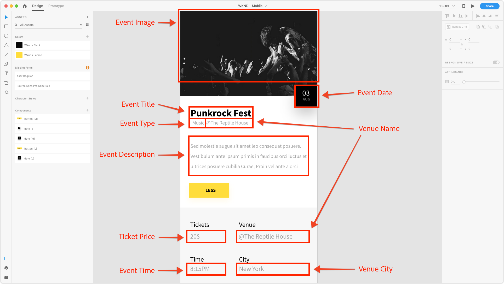
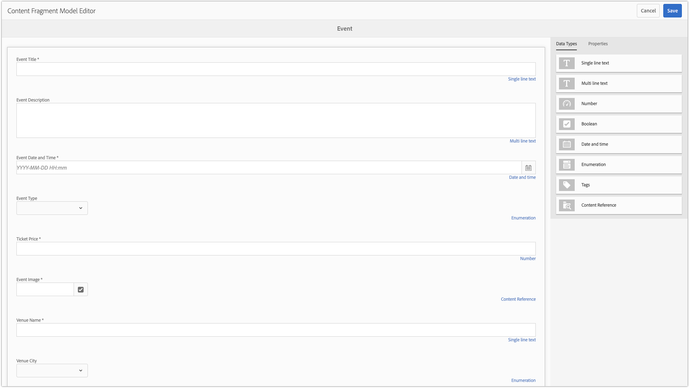

# Chapter 2 - Using Content Fragment Models

AEM Content Fragment Models define content schemas which can be used to templatize the creation of raw content by AEM authors. This approach is similar to scaffolding or forms-based authoring. The key concept with Content Fragments, is the authored content is presentation-agnostic, meaning its intended for multi-channel use where the consuming application, be that AEM, a single page application, or a Mobile app, controls how the content is displayed to the user.

The primary concern of the Content Fragment is to ensure:

1. The correct content is collected from the author
2. The content can be exposed in a structured, well-understood format to consuming applications.

This chapter covers enabling and defining Content Fragment Models used to define a normalized data structure and authoring interface for modeling and creating "Events".

## Enable Content Fragment Models

Content Fragment Models **must** be enabled via **AEM's [!UICONTROL Configuration Browser]**.

If Content Fragment Models are **not** enabled for a configuration, the **[!UICONTROL Create] &gt; [!UICONTROL Content Fragment]** button will not appear for the relevant AEM configuration.

>[!NOTE]
>
>AEM's configurations represent a set of [context-aware tenant configurations](https://sling.apache.org/documentation/bundles/context-aware-configuration/context-aware-configuration.html) stored under `/conf`. Typically AEM configurations correlate with a particular Web site managed in AEM Sites or a business unit responsible for a sub-set of content (assets, pages, etc.) in AEM.
>
>In order for a configuration to affect a content hierarchy, the configuration must be referenced via the `cq:conf` property on that content hierarchy. (This is achieved for the [!DNL WKND Mobile] configuration in **Step 5** below).
>
>When the `global` configuration is used, the configuration applies to all content, and `cq:conf` does not need to be set.

1. Log in to AEM Author as a user with appropriate permissions to modify the relevant configuration.
   * For this tutorial, the **admin** user can be used.
1. Navigate to **[!UICONTROL Tool] > [!UICONTROL General] > [!UICONTROL Configuration Browser]**
1. Tap the **folder icon** next to **[!DNL WKND Mobile]** to select, and then tap the **[!UICONTROL Edit] button** in the top left.
1. Select **[!UICONTROL Content Fragment Models]**, and tap **[!UICONTROL Save & Close]** in the top right.

   This enables of Content Fragment Models on Asset Folder content trees that have the [!DNL WKND Mobile] configuration applied.

   >[!NOTE]
   >
   >This configuration change is not reversible from the [!UICONTROL AEM Configuration] Web UI. To undo this configuration:
   >    
   >    1. Open [CRXDE Lite](http://localhost:4502/crx/de)
   >    1. Navigate to `/conf/wknd-mobile/settings/dam/cfm`
   >    1. Delete the `models` node
   >    
   >Any existing Content Fragment Models created under this configuration will be deleted as well as their definitions are stored under `/conf/wknd-mobile/settings/dam/cfm/models`.

1. Apply the **[!DNL WKND Mobile]** configuration to the **[!DNL WKND Mobile] Assets Folder** to allow Content Fragments from Content Fragment Models to be created within that Assets folder hierarchy:

    1. Navigate to **[!UICONTROL AEM] > [!UICONTROL Assets] > [!UICONTROL Files]**
    1. Select the **[!UICONTROL WKND Mobile] folder**
    1. Tap the **[!UICONTROL Properties]** button in the top action bar to open [!UICONTROL Folder Properties]
    1. In [!UICONTROL Folder Properties], tap the **[!UICONTROL Cloud Services]** tab
    1. Verify the **[!UICONTROL Cloud Configuration]** field is set to **/conf/wknd-mobile**
    1. Tap **[!UICONTROL Save & Close]** in the upper-right to persist changes

>[!VIDEO](https://video.tv.adobe.com/v/28336/?quality=12&learn=on)

## Understanding the Content Fragment Model to Create

Before defining out Content Fragment model, let's review the experience we'll be driving to ensure we are capturing all the necessary data points. For this, we'll review out Mobile applications design and map the design elements to content-to-collect.

We can break out the data points that define an Event as follows:

Armed with the mapping we can define out Content Fragment that will be used to collect and ultimately expose the Event data.

## Creating the Content Fragment Model

1. Navigate to **[!UICONTROL Tools] > [!UICONTROL Assets] > [!UICONTROL Content Fragment Models]**.  
1. Tap the **[!DNL WKND Mobile]** folder to open.  
1. Tap **[!UICONTROL Create]** to open the Content Fragment Model creation wizard.  
1. Enter **[!DNL Event]** as the **[!UICONTROL Model Title]** *(description is optional)* and tap **[!UICONTROL Create]** to save.

>[!VIDEO](https://video.tv.adobe.com/v/28337/?quality=12&learn=on)

## Defining the structure of the Content Fragment Model

1. Navigate to **[!UICONTROL Tools] > [!UICONTROL Assets] > [!UICONTROL Content Fragment Models] > [!DNL WKND]**.
1. Select the **[!DNL Event]** Content Fragment Model and tap **[!UICONTROL Edit]** in the top action bar.
1. From the **[!UICONTROL Data Types] tab** on the right, drag the **[!UICONTROL Single line text input]** into the left drop-zone to define the **[!DNL Question]** field.
1. Ensure the new **[!UICONTROL Single line text input]** is selected on the left, and the **[!UICONTROL Properties] tab** is selected on the right. Populate the Properties fields as follows:

    * [!UICONTROL Render As] : `textfield`
    * [!UICONTROL Field Label] : `Event Title`
    * [!UICONTROL Property Name] : `eventTitle`
    * [!UICONTROL Max Length] : 25
    * [!UICONTROL Required] : `Yes`

Repeat these steps using the input definitions defined below to create the rest of the Event Content Fragment Model.

>[!NOTE]
>
> The **Property Name** fields MUST match exactly, as the Android application is programmed to key off these names.

### Event Description

* [!UICONTROL Data Type] : `Multi-line text`
* [!UICONTROL Field Label] : `Event Description`
* [!UICONTROL Property Name] : `eventDescription`
* [!UICONTROL Default Type] : `Rich text`

### Event Date and Time

* [!UICONTROL Data Type] : `Date and time`
* [!UICONTROL Field Label] : `Event Date and Time`
* [!UICONTROL Property Name] : `eventDateAndTime`
* [!UICONTROL Required] : `Yes`

### Event Type

* [!UICONTROL Data Type] : `Enumeration`
* [!UICONTROL Field Label] : `Event Type`
* [!UICONTROL Property Name] : `eventType`
* [!UICONTROL Options] : `Art,Music,Performance,Photography`

### Ticket Price

* [!UICONTROL Data Type] : `Number`
* [!UICONTROL Render As] : `numberfield`
* [!UICONTROL Field Label] : `Ticket Price`
* [!UICONTROL Property Name] : `eventPrice`
* [!UICONTROL Type] : `Integer`
* [!UICONTROL Required] : `Yes`

### Event Image

* [!UICONTROL Data Type] : `Content Reference`
* [!UICONTROL Render As] : `contentreference`
* [!UICONTROL Field Label] : `Event Image`
* [!UICONTROL Property Name] : `eventImage`
* [!UICONTROL Root Path] : `/content/dam/wknd-mobile/images`
* [!UICONTROL Required] : `Yes`

### Venue Name

* [!UICONTROL Data Type] : `Single-line text`
* [!UICONTROL Render As] : `textfield`
* [!UICONTROL Field Label] : `Venue Name`
* [!UICONTROL Property Name] : `venueName`
* [!UICONTROL Max Length] : 20
* [!UICONTROL Required] : `Yes`

### Venue City

* [!UICONTROL Data Type] : `Enumeration`
* [!UICONTROL Field Label] : `Venue City`
* [!UICONTROL Property Name] : `venueCity`
* [!UICONTROL Options] : `Basel,London,Los Angeles,Paris,New York,Tokyo`

>[!VIDEO](https://video.tv.adobe.com/v/28335/?quality=12&learn=on)

>[!NOTE]
>
>The **[!UICONTROL Property Name]** denotes the **both** the JCR property name where this value will be stored as well as the key in the JSON file . This should be a semantic name that is will not change over the life of the Content Fragment Model.

After completing creating of the Content Fragment Model, you should end up with a definition that looks like:

## Next step

Optionally, install the [com.adobe.aem.guides.wknd-mobile.content.chapter-2.zip](https://github.com/adobe/aem-guides-wknd-mobile/releases/latest) content package on AEM Author via [AEM's Package Manager](http://localhost:4502/crx/packmgr/index.jsp). This package contains the configurations and content outlined in this part of the tutorial.

* [Chapter 3 - Authoring Event Content Fragments](./chapter-3.md)
