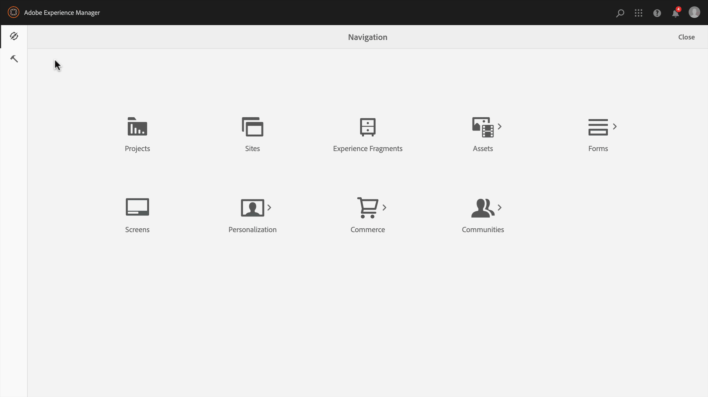
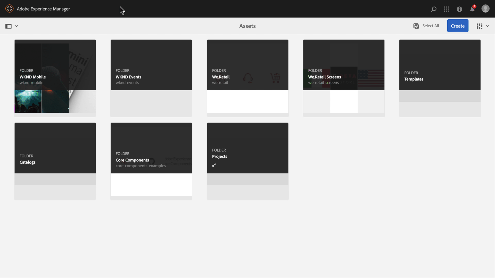

# Chapter 2 - Using Content Fragment Models

AEM Content Fragment Models define content schemas which can be used to templatize the creation of raw content by AEM authors. This approach is similar to scaffolding or forms-based authoring. The key concept with Content Fragments, is the authored content is presentation-agnostic, meaning its intended for multi-channel use where the consuming application, be that AEM, a single page application, or a Mobile app, controls how the content is displayed to the user.

The primary concern of the Content Fragment is to ensure:

1. The correct content is collected from the author
2. The content can be exposed in a structured, well-understood format to consuming applications.

This chapter covers enabling and defining Content Fragment Models used to define a normalized data structure and authoring interface for modeling and creating Events.

## Enable Content Fragment Models

Content Fragment Models **must** be enabled via **AEM's Configuration Browser**.

If Content Fragment Models are **not** enabled for a configuration, the **Create > Content Fragment** button will not appear for the relevant AEM configuration.

>[!NOTE]
>
>AEM's configurations represent a set of [context-aware tenant configurations](https://sling.apache.org/documentation/bundles/context-aware-configuration/context-aware-configuration.html) stored under `/conf`. Typically AEM configurations correlate with a particular Web site managed in AEM Sites or a business unit responsible for a sub-set of content (assets, pages, etc.) in AEM.
>
>In order for a configuration to affect a content hierarchy, the configuration must be referenced via the `cq:conf` property on that content hierarchy. (This is achieved for the We.Retail configuration in **Step 5** below).
>
>When the `global` configuration is used, the configuration applies to all content, and `cq:conf` does not need to be set.

1. Log in to AEM Author as a user with appropriate permissions to modify the relevant Configuration.
   * For this tutorial, the **admin** user can be used.
1. Navigate to **Tool > General > Configuration Browser.**
1. Tap the **folder icon** next to **WKND Mobile** to select, and then tap the **Edit button** in the top left.
1. Select **Content Fragment Models**, and tap **Save & Close** in the top right.

   This enables of Content Fragment Models on Asset Folder content trees that have the WKND Mobile configuration applied.

   >[!NOTE]
   >
   >This configuration change is not reversible from the AEM Configuration Web UI. To undo this configuration:
   >    
   >    1. Open [CRXDE Lite](http://localhost:4502/crx/de)
   >    1. Navigate to `/conf/wknd-mobile/settings/dam/cfm`
   >    1. Delete the `models` node
   >    
   >Any existing Content Fragment Models created under this configuration will be deleted as well as their definitions are stored under `/conf/wknd-mobile/settings/dam/cfm/models`.

1. Apply the **WKND Mobile** configuration to the **WKND Mobile Assets Folder** to allow Content Fragments from Content Fragment Models to be created within that Assets folder hierarchy:

    1. Navigate to **AEM > Assets > Files**
    1. Select the **WKND Mobile folder**
    1. Tap the **Properties** button in the top action bar to open Folder Properties
    1. In Folder Properties, tap the **Cloud Services** tab
    1. Verify the **Cloud Configuration** field is set to **/conf/wknd-mobile**
    1. Tap **Save & Close** in the upper-right to persist changes

## Understanding the Content Fragment Model to Create

Before defining out Content Fragment model, let's review the experience we'll be driving to ensure we are capturing all the necessary data points. For this, we'll review out Mobile applications design and map the design elements to content-to-collect.

We can break out the data points that define an Event as follows:

Armed with the mapping we can define out Content Fragment that will be used to collect and ultimately expose the Event data.

## Creating the Content Fragment Model

1. Navigate to **Tools > Assets > Content Fragment Models**.  
1. Tap the **WKND Mobile** folder to open.  
1. Tap **Create** to open the Content Fragment Model creation wizard.  
1. Enter **Event** as the **Model Title** *(description is optional)* and tap **Create** to save.

## Defining the structure of the Content Fragment Model

1. Navigate to **Tools > Assets > Content Fragment Models > WKND**.
1. Select the **Event** Content Fragment Model and tap **Edit** in the top action bar.
1. From the **Data Types tab** on the right, drag the **Single line text input** into the left drop-zone to define the **Question** field.
1. Ensure the new **Single line text input** is selected on the left, and the **Properties tab** is selected on the right. Populate the Properties fields as follows:

    * Render As: `textfield`
    * Field Label: `Event Title`
    * Property Name: `eventTitle`
    * Max Length: 25
    * Required: `Yes`

Repeat these steps using the input definitions defined below to create the rest of the Event Content Fragment Model.

>![NOTE]
>
> The **Property Name** fields MUST match exactly, as the Android application is programmed to key off these names.

### Event Description

    * Data Type: `Multi-line text`
    * Field Label: `Event Description`
    * Property Name: `eventDescription`
    * Default Type: `Rich text`

### Event Date and Time

    * Data Type: `Date and time`
    * Field Label: `Event Date and Time`
    * Property Name: `eventDateAndTime`
    * Required: `Yes`

### Event Type

    * Data Type: `Enumeration`
    * Field Label: `Event Type`
    * Property Name: `eventType`
    * Options: `Art,Music,Performance,Photography`

### Ticket Price

    * Data Type: `Number`
    * Render As: `numberfield`
    * Field Label: `Ticket Price`
    * Property Name: `eventPrice`
    * Type: `Integer`
    * Required: `Yes`

### Event Image

    * Data Type: `Content Reference`
    * Render As: `contentreference`
    * Field Label: `Event Image`
    * Property Name: `eventImage`
    * Root Path: `/content/dam/wknd-mobile/images`
    * Required: `Yes`

### Venue Name

    * Data Type: `Single-line text`
    * Render As: `textfield`
    * Field Label: `Venue Name`
    * Property Name: `venueName`
    * Max Length: 20
    * Required: `Yes`

### Venue City

    * Data Type: `Enumeration`
    * Field Label: `Venue City`
    * Property Name: `venueCity`
    * Options: `Basel,London,Los Angeles,Paris,New York,Tokyo`

>[!NOTE]
>
>The **Property Name** denotes the **both** the JCR property name where this value will be stored as well as the key in the JSON file . This should be a semantic name that is will not change over the life of the Content Fragment Model.

After completing creating of the Content Fragment Model, you should end up with a definition that looks like:

## Next step

Optionally, install the [com.adobe.aem.guides.wknd-mobile.content.chapter-2.zip](https://github.com/adobe/aem-guides-wknd-mobile/releases/latest) content package on AEM Author via [AEM's Package Manager](http://localhost:4502/crx/packmgr/index.jsp). This package contains the configurations and content outlined in this part of the tutorials.

[Chapter 3 - Authoring Event Content Fragments](./chapter-3.md)
