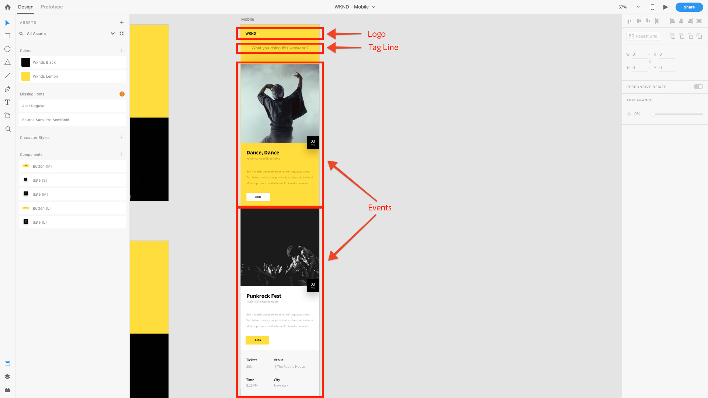

# Chapter 4 - Defining Content Services Templates

Chapter 4 of the AEM Headless tutorial covers the role of AEM Editable Templates in the context of AEM Content Services. Editable Templates are used to define the JSON content structure AEM Content Services exposes to clients via the composition of Content Services enabled AEM Components.

## Understanding the role of Templates in AEM Content Services

AEM Editable Templates are used to define the HTTP end-points that is accessed to expose the Event content as JSON.

Traditionally AEM's Editable Templates are used to define Web pages, however this use is simply convention. Editable Templates can be used to compose **any** set of content; how that content is accessed: as a HTML in a browser, as JSON consumed by JavaScript (AEM SPA Editor) or a Mobile App is a function of the how that page is requested.

In AEM Content Services, editable templates are used to define how the JSON data is exposed.

For the [!DNL WKND Mobile] App, we'll create a single Editable Template which is used to drive a single API endpoint. While this example is simple to illustrate the concepts of AEM Headless, you can create multiple Pages (or Endpoints) each exposing different sets of content to create a more complex, and better organized API.

## Understanding the API End-point

To understand how to compose our API endpoint, and understand what content should be exposed to our [!DNL WKND Mobile] App, let us revisit the design.

As we can see, we have three logical sets of content to provide to the mobile app.

1. The **Logo**
2. The **Tag Line**
3. The list of **Events**

To do this, we can map these requirements to AEM Components (and in our case, AEM WCM Core Components) in order to expose the requisite content as JSON.

1. The **Logo** is surfaced via an **Image component**
2. The **Tag Line** is surfaced via a **Text component**
3. The list of **Events** is surfaced via a **Content Fragment List component** that in turn, references a set of Event Content Fragments.

>[!NOTE]
>
>To support AEM Content Service's JSON export of Pages and Components, the Pages and Components must **derive from AEM WCM Core Components**.
>
>[AEM's WCM Core Components](https://github.com/Adobe-Marketing-Cloud/aem-core-wcm-components) have built-in functionality to support a normalized JSON schema of exported Pages and Components. All of the WKND Mobile components used in this tutorial (Page, Image, Text, and Content Fragment List) are derived from AEM's WCM Core Components.

## Defining the Events API Template

1. Navigate to **[!UICONTROL Tools] > [!UICONTROL General] > [!UICONTROL Templates] > [!DNL WKND Mobile]**.

1. Create the **[!DNL Events API]** template:

    1. Tap **[!UICONTROL Create]** in the top action bar
    1. Select the **[!DNL WKND Mobile - Empty Page]** template
    1. Tap **[!UICONTROL Next]** in the top action bar
    1. Enter **[!DNL Events API]** in the [!UICONTROL Template Title] field
    1. Tap **[!UICONTROL Create]** in the top action bar
    1. Tap **[!UICONTROL Open]** open the new template for editing

1. First, we allow the three identified AEM Components we need to model the content by editing the [!UICONTROL Policy] of the Root [!UICONTROL Layout Container]. Ensure the **[!UICONTROL Structure]** mode is active, select the **[!DNL Layout Container \[Root\]]**, and tap the **[!UICONTROL Policy]** button.
1. Under **[!UICONTROL Properties] > [!UICONTROL Allowed Components]** search for **[!DNL WKND Mobile]**. Allow the following components from the [!DNL WKND Mobile] component group  so they can be used on the [!DNL Events] API page.

    * **[!DNL WKND Mobile > Image]**

        * The logo for the the app

    * **[!DNL WKND Mobile > Text]**

        * The app's introductory text

    * **[!DNL WKND Mobile > Content Fragment List]**

        * The list of Event categories available for display in the app

1. Tap the **[!UICONTROL Done]** check-mark in the upper right corner when complete.
1. **Refresh** the browser window to see newly [!UICONTROL Allowed Components] list in the left rail.
1. From the Components finder in the left rail, drag in the following AEM Components:
    1. **[!DNL Image]** for the Logo
    2. **[!DNL Text]** for the Tag Line
    3. **[!DNL Content Fragment List]** for the events
1. **For each of the above components**, select them and press the **unlock** button.
1. However, ensure the **layout container** is **locked** to prevent other components from being added, or these three components from being removed.
1. Tap **[!UICONTROL Page Information] > [!UICONTROL View in Admin]** to return to the [!DNL WKND Mobile] templates listing. Select the newly created **[!DNL Events API]** template and tap **[!UICONTROL Enable]** in the top action bar.

>[!VIDEO](https://video.tv.adobe.com/v/28342?quality=12&learn=on)

>[!NOTE]
>
> Notice that the components used to surface the content are added to the Template itself, and locked down. This is to allow authors to edit the pre-defined components, but not arbitrarily add or remove components since changing the API itself could break assumptions around the JSON structure and break consuming apps. All APIs need to be stable.

## Next steps

Optionally, install the [com.adobe.aem.guides.wknd-mobile.content.chapter-4.zip](https://github.com/adobe/aem-guides-wknd-mobile/releases/latest) content package on AEM Author  via [AEM's Package Manager](http://localhost:4502/crx/packmgr/index.jsp). This package contains the configurations and content outlined in this and preceding chapters of the tutorial.

* [Chapter 5 - Authoring Content Services Pages](./chapter-5.md)
