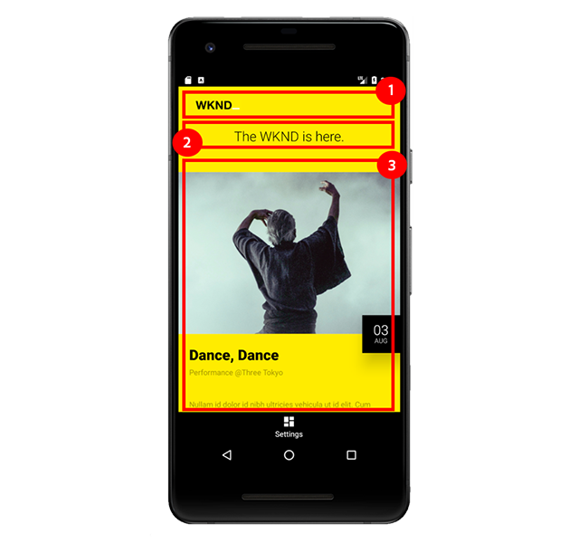

# Chapter 7 - Consuming AEM Content Services from a Mobile App

Chapter 7 of the tutorial uses a native Android Mobile App to consume content from AEM Content Services.

## The Android Mobile App

This tutorial uses a **simple native Android Mobile App** to consume and display Event content exposed by AEM Content Services.

The use of [Android](https://developer.android.com/) is largely unimportant, and the consuming mobile app could be written in any framework for any mobile platform, for example iOS.

Android is used for tutorial due to the ability to run an Android Emulator on Windows, macOs and Linux, its popularity, and that it can be written as Java, a language well understand by AEM developers.

*The tutorial's Android Mobile App is **not** intended to instruct how to build Android Mobile apps or convey Android development best practices, but rather to illustrate how AEM Content Services can be consumed from a Mobile Application.*

### How AEM Content Services drives the Mobile App experience



1. The **logo** as defined by the [!DNL Events API] page's **Image component**.
1. The **tag line** as defined on the [!DNL Events API] page's **Text component**.
1. This **Event list** is derived from the serialization of the Event Content Fragments, exposed via the configured **Content Fragment List component**.

## Mobile App demonstration

>[!VIDEO](https://video.tv.adobe.com/v/28345?quality=12&learn=on)

### Configuring the Mobile App for non-localhost use

If AEM Publish is not being run on **http://localhost:4503** the host and port can be updated in the Mobile App's [!DNL Settings] to point to the property AEM Publish host/port.

>[!VIDEO](https://video.tv.adobe.com/v/28344?quality=12&learn=on)

## Running the Mobile App locally

1. Download and install the [Android Studio](https://developer.android.com/studio/install) to install the Android Emulator.
1. **Download** the Android [!DNL APK] file [GitHub > Assets >  wknd-mobile.x.x.xapk](https://github.com/adobe/aem-guides-wknd-mobile/releases/latest)
1. Open **Android Studio**
    * On the initial launch of Android Studio, a prompt to install the [!DNL Android SDK] will present. Accept the defaults and finish the installation.
1. Open Android Studio and select **Profile or Debug APK**
1. Select the APK file (**wknd-mobile.x.x.x.apk**) downloaded in Step 2 and click **OK**
   * If prompted to **Create a New Folder**, or **Use Existing**, select **Use Existing**.
1. On the initial launch of Android Studio, right-click on the **wknd-mobile.x.x.x** in the Projects list, and select **Open Module Settings**. 
    * Under **Modules > wknd-mobile.x.x.x > Dependencies tab**, select **Android API 29 Platform**. Tap OK to close and save changes.
    * If you do not do this, you will see an "Please select Android SDK" error when trying to launch the emulator.
1. Open the **AVD Manager** by selecting **Tools > AVD Manager** or tapping the **AVD Manager** icon in the top bar.
1. In the **AVD Manager** window, click **+ Create Virtual Device...** if you do not already have device registered.
    1. In the left, select the **Phone** category.
    1. Select a **Pixel 2**.
    1. Click the **Next** button.
    1. Select **Q** with **API Level 29**.
        * Upon the initial launch of AVD Manager, you are asked to Download the versioned API. Click the Download link next to the "Q" release, and complete download and installation.
    1. Click the **Next** button.
    1. Click the **Finish** button.
1. Close the **AVD Manager** window.
1. In the top menu bar select **wknd-mobile.x.x.x** from the **Run/Edit Configurations** drop down.
1. Tap the **Run** button next to the selected **Run/Edit Configuration**
1. In the pop-up, select the newly created **[!DNL Pixel 2 API 29]** virtual device and tap **OK**
1. If the [!DNL WKND Mobile] app doesn't immediately load, find and tap on the **[!DNL WKND]** icon from the Android home screen in the emulator.
    * If the emulator launches but the emulator's screen remains black, tap the **power** button in the emulator's tools window next to the emulator window.
    * To scroll within the virtual device, click-and-hold and drag.
    * To refresh the content from AEM, pull down from the top until the Refresh icon 
    displays, and release.

>[!VIDEO](https://video.tv.adobe.com/v/28341?quality=12&learn=on)

## The Mobile App Code

This section highlights the Android Mobile App code that most interacts and depends on AEM Content Services and it's JSON output.

Upon load, the Mobile App makes `HTTP GET` to `/content/wknd-mobile/en/api/events.model.json` which is the AEM Content Services end-point configured to provide the content to drive the Mobile App.

Because the Editable Template of the Events API (`/content/wknd-mobile/en/api/events.model.json`) is locked, the Mobile App can be coded to look for specific information in specific locations in the JSON response.

### High-level Code Flow

1. Opening the [!DNL WKND Mobile] App invokes a `HTTP GET` request to the AEM Publish at `/content/wknd-mobile/en/api/events.model.json` to collect the content to populate the Mobile App's UI.
2. Upon receiving the content from AEM, each of the three view elements of the Mobile App, the **logo, tag line and event list**, are initialized with the content from AEM.
    * To bind to the AEM content to the Mobile App's view element, the JSON representing each AEM component, is object mapped to a Java POJO, which in turn is bound to the Android View element.
        * Image Component JSON &rarr; Logo POJO &rarr; Logo ImageView
        * Text Component JSON &rarr; TagLine POJO &rarr; Text ImageView
        * Content Fragment List JSON &rarr; Events POJO &rarr;Events RecyclerView
    * *The Mobile App code is able to map the JSON to the POJOs because of the well known locations within the greater JSON response. Remember, the JSON keys of "image", "text" and "contentfragmentlist" are dictated by the backing AEM Components' node names. If these node names change, then the Mobile App will break as it will not know how to source the requisite content from the JSON data.*

#### Invoking the AEM Content Services End-point

The following is a distillation of the code in the Mobile App's `MainActivity` responsible for invoking AEM Content Services to collect the content that drives the Mobile App experience.

```
protected void onCreate(Bundle savedInstanceState) {
    ...
    // Create the custom objects that will map the JSON -> POJO -> View elements
    final List<ViewBinder> viewBinders = new ArrayList<>();

    viewBinders.add(new LogoViewBinder(this, getAemHost(), (ImageView) findViewById(R.id.logo)));
    viewBinders.add(new TagLineViewBinder(this, (TextView) findViewById(R.id.tagLine)));
    viewBinders.add(new EventsViewBinder(this, getAemHost(), (RecyclerView) findViewById(R.id.eventsList)));
    ...
    initApp(viewBinders);
}

private void initApp(final List<ViewBinder> viewBinders) {
    final String aemUrl = getAemUrl(); // -> http://localhost:4503/content/wknd-mobile/en/api/events.mobile.json
    JsonObjectRequest request = new JsonObjectRequest(aemUrl, null,
        new Response.Listener<JSONObject>() {
            @Override
            public void onResponse(JSONObject response) {
                for (final ViewBinder viewBinder : viewBinders) {
                    viewBinder.bind(response);
                }
            }
        },
        ...
    );
}
```

`onCreate(..)` is the initialization hook for the Mobile App, and registers the 3 custom `ViewBinders` responsible for parsing the JSON and binding the values to the `View` elements.

`initApp(...)` is then called which makes the HTTP GET request to the AEM Content Services end-point on AEM Publish to collect the content. Upon receiving a valid JSON Response, the JSON response is passed to each `ViewBinder` which is responsible for parsing the JSON and binding it to the mobile `View` elements.

#### Parsing the JSON Response

Next we'll look at the `LogoViewBinder`, which is simple, but highlights several important considerations.

```
public class LogoViewBinder implements ViewBinder {
    ...
    public void bind(JSONObject jsonResponse) throws JSONException, IOException {
        final JSONObject components = jsonResponse.getJSONObject(":items").getJSONObject("root").getJSONObject(":items");

        if (components.has("image")) {
            final Image image = objectMapper.readValue(components.getJSONObject("image").toString(), Image.class);

            final String imageUrl = aemHost + image.getSrc();
            Glide.with(context).load(imageUrl).into(logo);
        } else {
            Log.d("WKND", "Missing Logo");
        }
    }
}
```

The first line of `bind(...)` navigates down the JSON Response via the keys **:items &rarr; root &rarr; :items** which represents the AEM Layout Container the components were added to.

From here a check is made for a key named **image**, which represents the Image component (again, it is important this node name &rarr; JSON key is stable). If this object exists, it read and mapped to the [custom Image POJO](#image-pojo) via the Jackson `ObjectMapper` library. The Image POJO is explored below.

Finally, the logo's `src` is loaded into the Android ImageView using the [!DNL Glide] helper library.

Notice that we must provide the AEM schema, host and port (via `aemHost`) to the AEM Publish instance as AEM Content Services will only provide the JCR path (ie. `/content/dam/wknd-mobile/images/wknd-logo.png`) to the referenced content.

#### The Image POJO{#image-pojo}

While optional, the use of the [Jackson ObjectMapper](https://fasterxml.github.io/jackson-databind/javadoc/2.9/com/fasterxml/jackson/databind/ObjectMapper.html) or similar capabilities provided by other libraries like Gson, helps map complex JSON structures to Java POJOs without the tedium of dealing directly with the native JSON objects themselves. In this simple case we map the `src` key from the `image` JSON object, to the `src` attribute in the Image POJO directly via the `@JSONProperty` annotation.

```
package com.adobe.aem.guides.wknd.mobile.android.models;

import com.fasterxml.jackson.annotation.JsonProperty;

public class Image {
    @JsonProperty(value = "src")
    private String src;

    public String getSrc() {
        return src;
    }
}
```

The Event POJO, which requires selecting many more data points from the JSON object, benefits from this technique more than the simple Image, which all we want is the `src`.

## Explore the Mobile App Experience

Now that you have an understanding of how AEM Content Services can drive native Mobile experience, use what you've learned to perform the following steps and see your changes reflected in the Mobile App.

After each step, pull-to-refresh the Mobile App and verify the update to the mobile experience.

1. Create and publish **new [!DNL Event] Content Fragment**
1. Unpublish an **existing [!DNL Event] Content Fragment**
1. Publish an update to the **Tag Line**

## Congratulations

**You've completed with the AEM Headless tutorial!**

To learn more about AEM Content Services and AEM as a Headless CMS, visit Adobe's other documentation and enablement materials:

* [Using Content Fragments](https://experienceleague.adobe.com/docs/experience-manager-learn/sites/content-fragments/understand-content-fragments-and-experience-fragments.html)
* [AEM WCM Core Components User Guide](https://experienceleague.adobe.com/docs/experience-manager-core-components/using/introduction.html)
* [AEM WCM Core Components Component Library](https://opensource.adobe.com/aem-core-wcm-components/library.html)
* [AEM WCM Core Components GitHub Project](https://github.com/adobe/aem-core-wcm-components)
* [Code Sample of Component Exporter](https://github.com/Adobe-Consulting-Services/acs-aem-samples/blob/master/core/src/main/java/com/adobe/acs/samples/models/SampleComponentExporter.java)
