# Author Content Fragments

In the [previous chapter](/help/headless-tutorial/graphql/advanced-graphql/create-content-fragment-models.md), you created five Content Fragment Models: Person, Team, Location, Address, and Contact Info. This chapter walks you through the steps to create Content Fragments based on those models. It also explores how to create folder policies to limit what Content Fragment Models can be used in the folder.

## Prerequisites {#prerequisites}

This document is part of a multi-part tutorial. Please ensure that the previous chapters have been completed before proceeding with this chapter.

## Objectives {#objectives}

In this chapter, learn how to:

* Create folders and set limits using folder policies
* Create fragment references directly from the Content Fragment editor
* Use Tab, Date, and JSON Object data types
* Insert content and fragment references into the multi-line text editor
* Add multiple fragment references
* Nest Content Fragments

## Install sample content {#sample-content}

Install an AEM package that contains several folders and sample images used to accelerate the tutorial.

1. Download [Advanced-GraphQL-Tutorial-Starter-Package-1.0.zip](/help/headless-tutorial/graphql/advanced-graphql/assets/tutorial-files/Advanced-GraphQL-Tutorial-Starter-Package-1.0.zip)
1. In AEM, navigate to **Tools** > **Deployment** > **Packages** to access **Package Manager**.
1. Upload and install the package (zip file) downloaded in the previous step.

    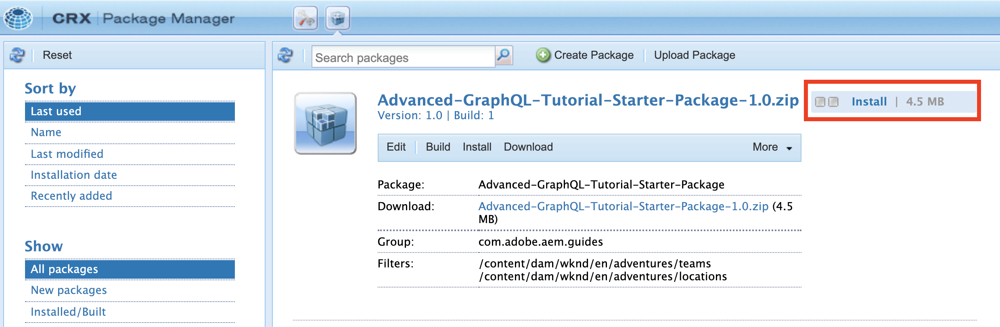

## Create folders and set limits using folder policies

From the AEM homepage, select **Assets** > **Files** > **WKND Site** > **English**. Here you can see the various Content Fragment categories, including Adventures and Contributors that were explored in the previous [multi-step GraphQL tutorial](../multi-step/overview.md).

### Create folders {#create-folders}

Navigate into the **Adventures** folder. You can see that folders for Teams and Locations have already been created to store Teams and Locations Content Fragments.

Create a folder for Instructors Content Fragments that are based on the Person Content Fragment Model.

1. From the Adventures page, select **Create** > **Folder** in the top-right corner.

    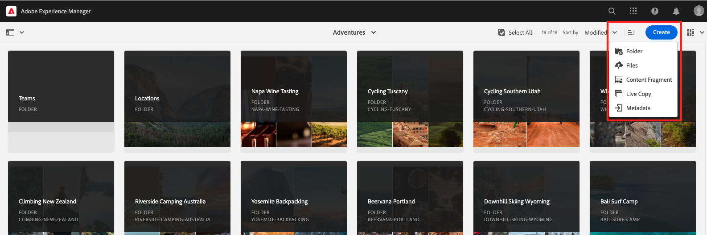

1. In the Create Folder modal that appears, enter "Instructors" in the **Title** field. Note the 's' at the end. Titles of the folders that contain many fragments must be plural. Select **Create**.

    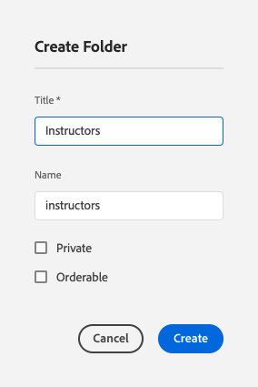

    You have now created a folder to store Adventure Instructors.

### Set limits using folder policies

AEM allows you to define permissions and policies for Content Fragment folders. By using permissions, you can grant only certain users (authors) or groups of authors access to certain folders. By using folder policies, you can limit what Content Fragment Models authors can use in those folders. In this example, let's limit a folder to the Person and Contact Info models. To configure a folder policy:

1. Select the **Instructors** folder that you have created, then select **Properties** from the top navigation bar.

    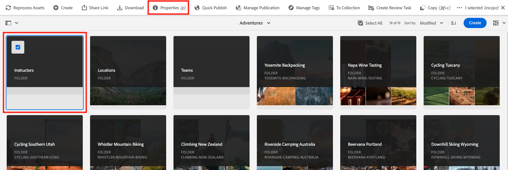

1. Select the **Policies** tab, then de-select **Inherited from /content/dam/wknd**. In the **Allowed Content Fragment Models by Path** field, select the folder icon.

    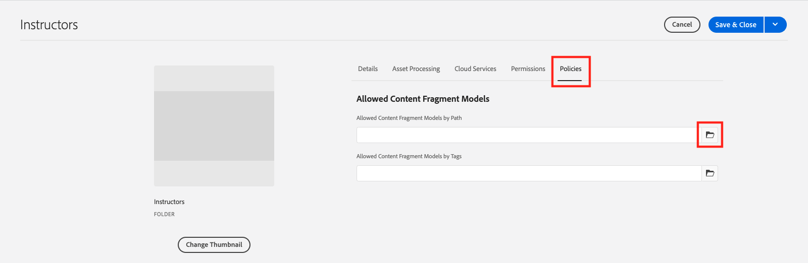

1. In the Select Path dialog that opens, follow the path **conf** > **WKND Site**. The Person Content Fragment Model, created in the previous chapter, contains a reference to the Contact Info Content Fragment Model. Both Person and Contact Info models must be allowed in the Instructors folder in order to create an Instructor Content Fragment. Select **Person** and **Contact Info**, then press **Select** to close the dialog.

    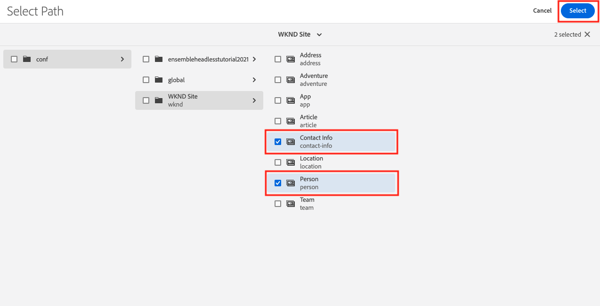

1. Select **Save and Close** and select **OK** in the success dialog that appears.

1. You have now configured a folder policy for the Instructors folder. Navigate into the **Instructors** folder and select **Create** > **Content Fragment**. The only models that you can now select are **Person** and **Contact Info**.

    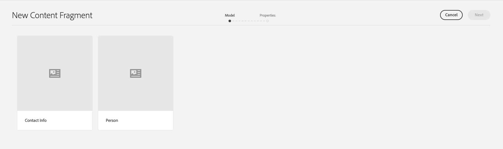

## Author Content Fragments for Instructors

Navigate into the **Instructors** folder. From here, let's create a nested folder to store the Instructors' contact information. 

Follow the steps outlined in the section on [creating folders](#create-folders) to create a folder titled "Contact Info". Note that the nested folder inherits folder policies of the parent folder. Feel free to configure more specific policies so the newly created folder only allows the Contact Info model to be used.

### Create an Instructor Content Fragment

Let's create four people that can be added to a team of Adventure Instructors. Reuse the images and names of the Contributors Content Fragments that were created in the previous [multi-step GraphQL tutorial](../multi-step/author-content-fragments.md). While the previous tutorial outlined how to create basic Content Fragments, this tutorial focuses on more advanced features.

1. From the Instructors folder, create a new Content Fragment based on the Person Content Fragment Model and give it a title of "Jacob Wester".

    The newly created Content Fragment looks like the following:

    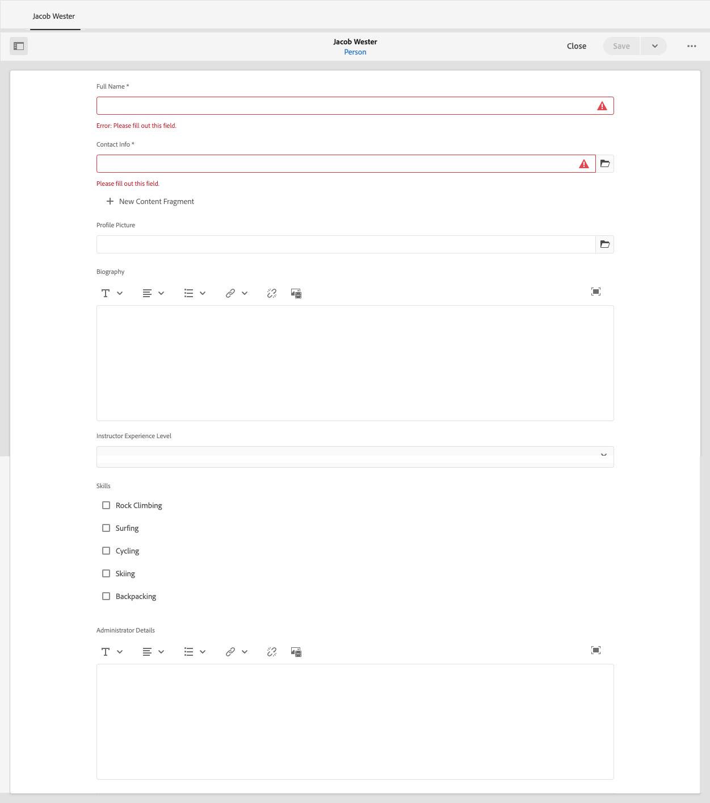

1. Enter the following content into the fields:

    * **Full Name**: Jacob Wester
    * **Biography**: Jacob Wester has been a hiking instructor for ten years and has loved every minute of it! He's an adventure seeker with a talent for rock climbing and backpacking. Jacob is the winner of climbing competitions, including the Battle of the Bay bouldering competition. He currently lives in California.
    * **Instructor Experience Level**: Expert
    * **Skills**: Rock Climbing, Surfing, Backpacking
    * **Administrator Details**: Jacob Wester has been coordinating backpacking adventures for 3 years.

1. In the **Profile Picture** field, add a content reference to an image. Browse to **WKND Site** > **English** > **Contributors** > **jacob_wester.jpg** to create a path to the image.

### Create a new fragment reference from the Content Fragment editor {#fragment-reference-from-editor}

AEM allows you to create a fragment reference directly from the Content Fragment editor. Let's create a reference to Jacob's contact information. 

1. Select **New Content Fragment** below the **Contact Info** field.

    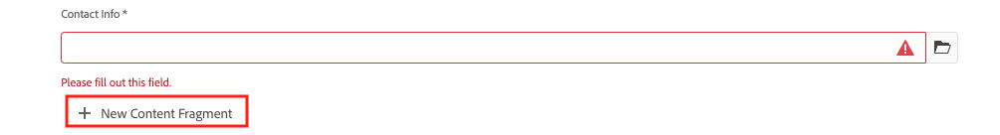

1. The New Content Fragment modal opens. Under the Select Destination tab, follow the path **Adventures** > **Instructors** and select the checkbox beside the **Contact Info** folder. Select **Next** to proceed to the Properties tab.

    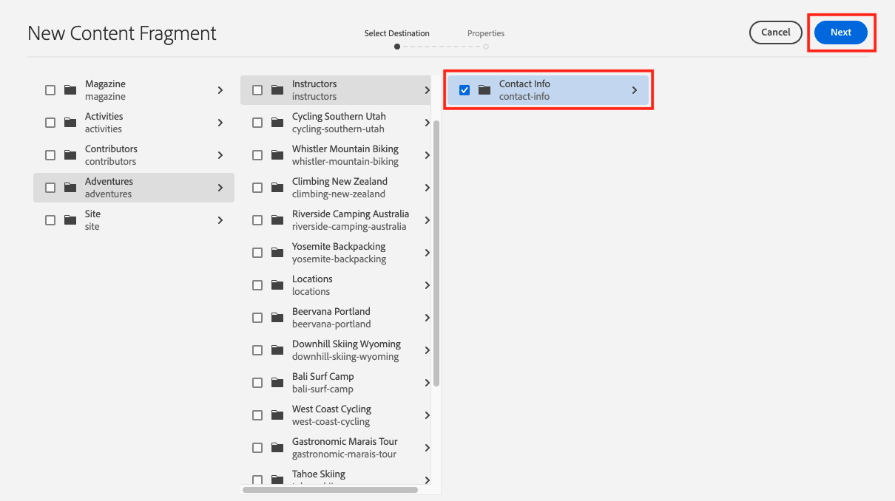

1. Under the Properties tab, enter "Jacob Wester Contact Info" in the **Title** field. Select **Create**, then press **Open** in the success dialog that appears.

    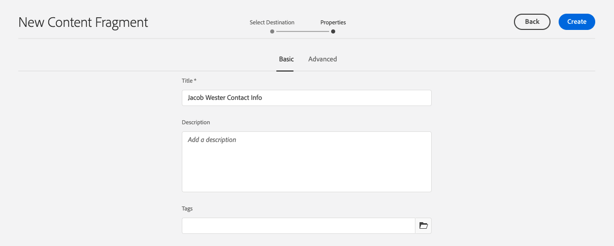

    New fields appear that allow you to edit the Contact Info Content Fragment.

    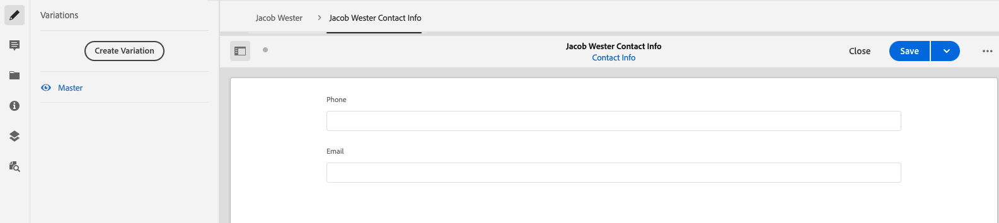

1. Enter the following content into the fields:

    * **Phone**: 209-888-0000
    * **Email**: jwester@wknd.com

    When completed, select **Save**. You have now created a new Contact Info Content Fragment.

1. To navigate back to the Instructor Content Fragment, select **Jacob Wester** in the top-left corner of the editor.

    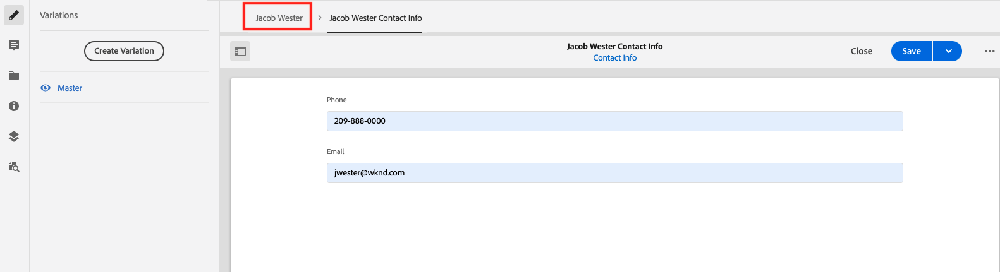

    The **Contact Info** field now contains the path to the referenced Contact Info fragment. This is a nested fragment reference. The finished Instructor Content Fragment looks like this:

    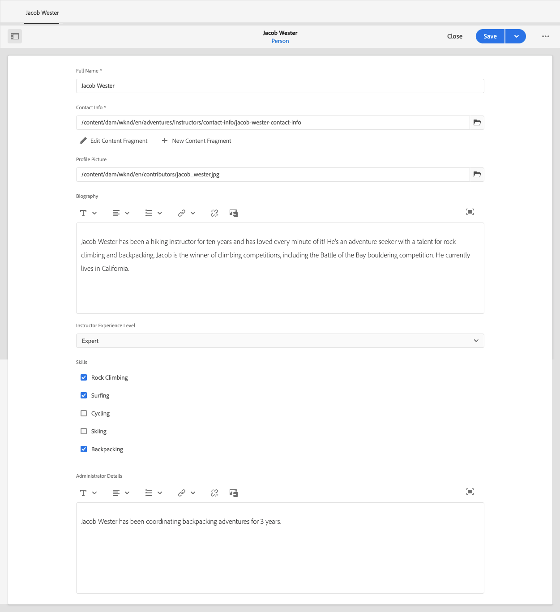

1. Select **Save and Close** to save the Content Fragment. You now have a new Instructor Content Fragment.

### Create additional fragments

Follow through the same process as outlined in the [previous section](#fragment-reference-from-editor) to create three more Instructors Content Fragments and three Contact Info Content Fragments for these Instructors. Add the following content in the Instructors fragments:

**Stacey Roswells**

| Fields | Values|
| --- | --- |
| Content Fragment Title | Stacey Roswells |
| Full Name | Stacey Roswells |
| Contact Info | /content/dam/wknd/en/adventures/instructors/contact-info/stacey-roswells-contact-info |
| Profile Picture | /content/dam/wknd/en/contributors/stacey-roswells.jpg |
| Biography | Stacey Roswells is an accomplished rock climber and alpine adventurer. Born in Baltimore, Maryland, Stacey is the youngest of six children. Her father was a lieutenant colonel in the US Navy and her mother was a modern dance instructor. Her family moved frequently with her father’s duty assignments, and she took her first pictures when he was stationed in Thailand. This is also where Stacey learned to rock climb. |
| Instructor Experience Level | Advanced |
| Skills | Rock Climbing &#124; Skiing &#124; Backpacking |

**Kumar Selvaraj**

| Fields | Values|
| --- | --- |
| Content Fragment Title | Kumar Selvaraj |
| Full Name | Kumar Selvaraj |
| Contact Info | /content/dam/wknd/en/adventures/instructors/contact-info/kumar-selvaraj-contact-info |
| Profile Picture | /content/dam/wknd/en/contributors/Kumar_Selvaraj.JPG |
| Biography | Kumar Selvaraj is an experienced AMGA Certified professional instructor whose main goal is to help students enhance their climbing and hiking skills. |
| Instructor Experience Level | Advanced |
| Skills | Rock Climbing &#124; Backpacking |

**Ayo Ogunseinde**

| Fields | Values|
| --- | --- |
| Content Fragment Title | Ayo Ogunseinde |
| Full Name | Ayo Ogunseinde |
| Contact Info | /content/dam/wknd/en/adventures/instructors/contact-info/ayo-ogunseinde-contact-info |
| Profile Picture | /content/dam/wknd/en/contributors/ayo-ogunseinde-237739.jpg |
| Biography | Ayo Ogunseinde is a professional climber and backpacking instructor living in Fresno, Central California. Her goal is to guide hikers on their most epic national park adventures. |
| Instructor Experience Level | Advanced |
| Skills | Rock Climbing &#124; Cycling &#124; Backpacking |

Leave the **Additional Information** field empty.

Add the following information in the Contact Info fragments:

| Content Fragment Title | Phone | Email |
| ------- | -------- | -------- |
| Stacey Roswells Contact Info | 209-888-0011 | sroswells@wknd.com |
| Kumar Selvaraj Contact Info | 209-888-0002 | kselvaraj@wknd.com |
| Ayo Ogunseinde Contact Info | 209-888-0304 | aogunseinde@wknd.com |

You are now ready to create a Team!

## Author Content Fragments for Locations

Navigate into the **Locations** folder. Here, you see two nested folders that have already been created: Yosemite National Park and Yosemite Valley Lodge. 

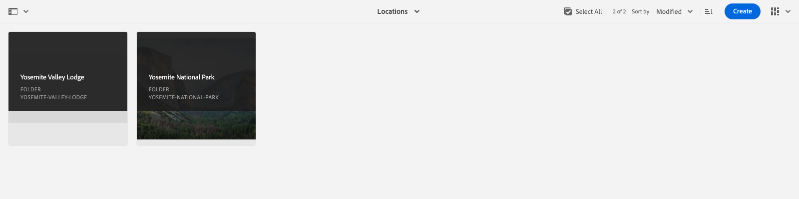

Ignore the Yosemite Valley Lodge folder for now. We will return to it later in this section when we create a new location that will act as a Home Base for our team of instructors.

Navigate into the **Yosemite National Park** folder. Currently, it only contains a picture of Yosemite National Park. Let's create a new Content Fragment using the Location Content Fragment Model and title it "Yosemite National Park".

### Tab Placeholders

AEM allows you to use tab placeholders to group different types of content and make your Content Fragments easier to read and manage. In the previous chapter, you added tab placeholders to the Location model. As a result, the Location Content Fragment now has two tab sections: **Location Details** and **Location Address**.

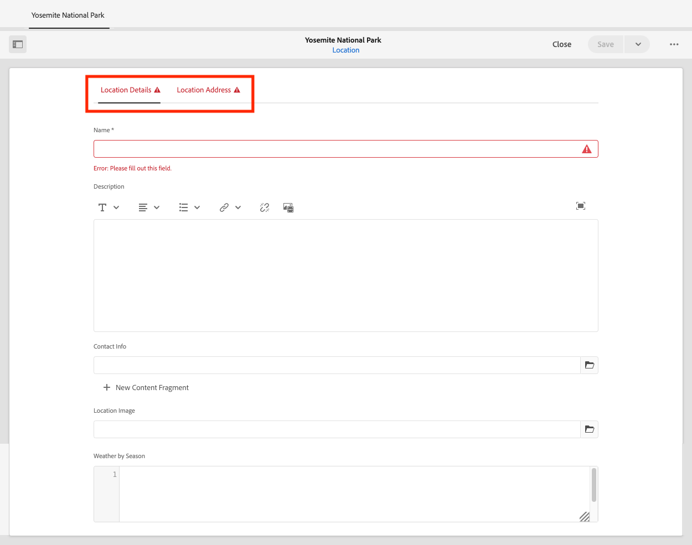

The **Location Details** tab contains the **Name**, **Description**, **Contact Info**, **Location Image**, and **Weather by Season** fields, while the **Location Address** tab contains a reference to an Address Content Fragment. The tabs make it clear what types of content must be filled in, so authoring content is easier to manage.

### JSON Object data type

The **Weather by Season** field is a JSON Object data type, which means that it accepts data in JSON format. This data type is flexible and can be used for any data you want to include in your content.

You can see the field description that was created in the previous chapter by hovering over the information icon on the right of the field.

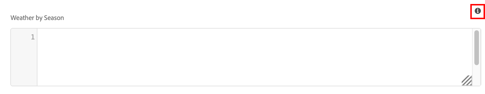

In this case, we need to provide the average weather for the location. Enter the following data:

```json
{
    "summer": "81 / 89°F",
    "fall": "56 / 83°F",
    "winter": "46 / 51°F",
    "spring": "57 / 71°F"
}
```

The **Weather by Season** field should now look like this:

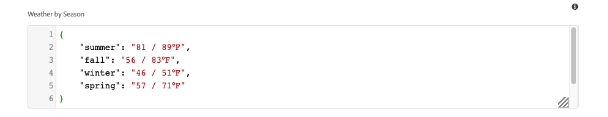

### Add content

Let's add the rest of the content to the Location Content Fragment in order to query the information with GraphQL in the next chapter.

1. In the **Location Details** tab, enter the following information into the fields:

    * **Name**: Yosemite National Park
    * **Description**: Yosemite National Park is in California’s Sierra Nevada mountains. It’s famous for its gorgeous waterfalls, giant sequoia trees, and iconic views of El Capitan and Half Dome cliffs. Hiking and camping are the best ways to experience Yosemite. Numerous trails provide endless opportunities for adventure and exploration.

1. From the **Contact Info** field, create a new Content Fragment based on the Contact Info model and title it "Yosemite National Park Contact Info". Follow the same process as outlined in the previous section on [creating a new fragment reference from the editor](#fragment-reference-from-editor) and enter the following data into the fields:

    * **Phone**: 209-999-0000
    * **Email**: yosemite@wknd.com

1. From the **Location Image** field, browse to **Adventures** > **Locations** > **Yosemite National Park** > **yosemite-national-park.jpeg** to create a path to the image.

    Remember that in the previous chapter you configured the image validation, so the Location image's dimensions must be less than 2560 x 1800, and its file size must be less than 3 MB.

1. With all information added, the **Location Details** tab now looks like this:

    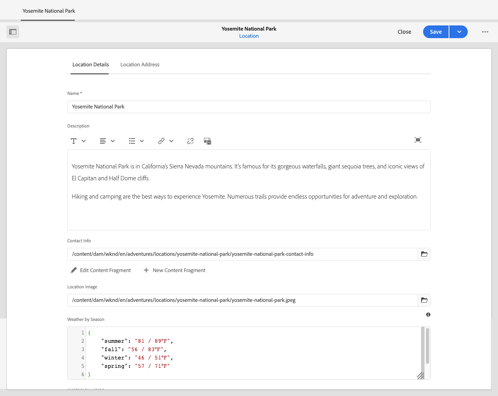

1. Navigate into the **Location Address** tab. From the **Address** field, create a new Content Fragment titled "Yosemite National Park Address" using the Address Content Fragment Model that you created in the previous chapter. Follow the same process as outlined in the section on [creating a new fragment reference from the editor](#fragment-reference-from-editor) and enter the following data into the fields:

    * **Street Address**: 9010 Curry Village Drive
    * **City**: Yosemite Valley
    * **State**: CA
    * **ZIP Code**: 95389
    * **Country**: United States

1. The completed **Location Address** tab of the Yosemite National Park fragment looks like this:

    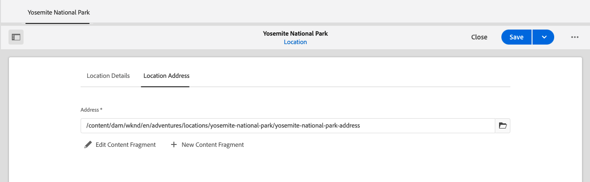

1. Select **Save and Close**.

### Create an additional fragment

1. Navigate into the **Yosemite Valley Lodge** folder. Create a new Content Fragment using the Location Content Fragment Model and title it "Yosemite Valley Lodge".

1. In the **Location Details** tab, enter the following information into the fields:

    * **Name**: Yosemite Valley Lodge
    * **Description**: Yosemite Valley Lodge is a hub for group meetings and all sorts of activities, such as shopping, dining, fishing, hiking, and many more.

1. From the **Contact Info** field, create a new Content Fragment based on the Contact Info model and title it "Yosemite Valley Lodge Contact Info". Follow the same process as outlined in the section on [creating a new fragment reference from the editor](#fragment-reference-from-editor) and enter the following data into the fields of the new Content Fragment:

    * **Phone**: 209-992-0000
    * **Email**: yosemitelodge@wknd.com

    Save the newly created Content Fragment.

1. Navigate back to **Yosemite Valley Lodge** and go to the **Location Address** tab. From the **Address** field, create a new Content Fragment titled "Yosemite Valley Lodge Address" using the Address Content Fragment Model that you created in the previous chapter. Follow the same process as outlined in the section on [creating a new fragment reference from the editor](#fragment-reference-from-editor) and enter the following data into the fields:

    * **Street Address**: 9006 Yosemite Lodge Drive
    * **City**: Yosemite National Park
    * **State**: CA
    * **ZIP Code**: 95389
    * **Country**: United States

    Save the newly created Content Fragment.

1. Navigate back to **Yosemite Valley Lodge**, then select **Save and Close**. The **Yosemite Valley Lodge** folder now contains three Content Fragments: Yosemite Valley Lodge, Yosemite Valley Lodge Contact Info, and Yosemite Valley Lodge Address.

    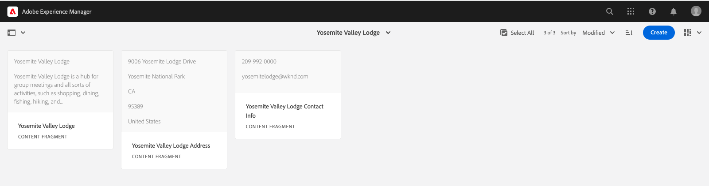

## Author a Team Content Fragment

Browse folders to **Teams** > **Yosemite Team**. You can see that the Yosemite Team folder currently only contains the team logo.

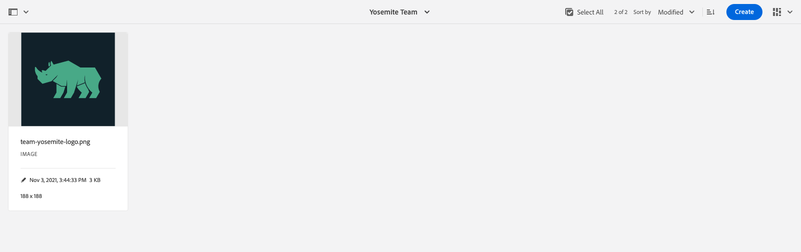

Let's create a new Content Fragment using the Team Content Fragment Model and title it "Yosemite Team".

### Content and fragment references in the multi-line text editor

AEM allows you to add content and fragment references directly into the multi-line text editor and retrieve them later using GraphQL queries. Let's add both content and fragment references into the **Description** field.

1. First, add the following text into the **Description** field: "The team of professional adventurers and hiking instructors working in Yosemite National Park."

1. To add a content reference, select the **Insert asset** icon in the toolbar of the multi-line text editor.

    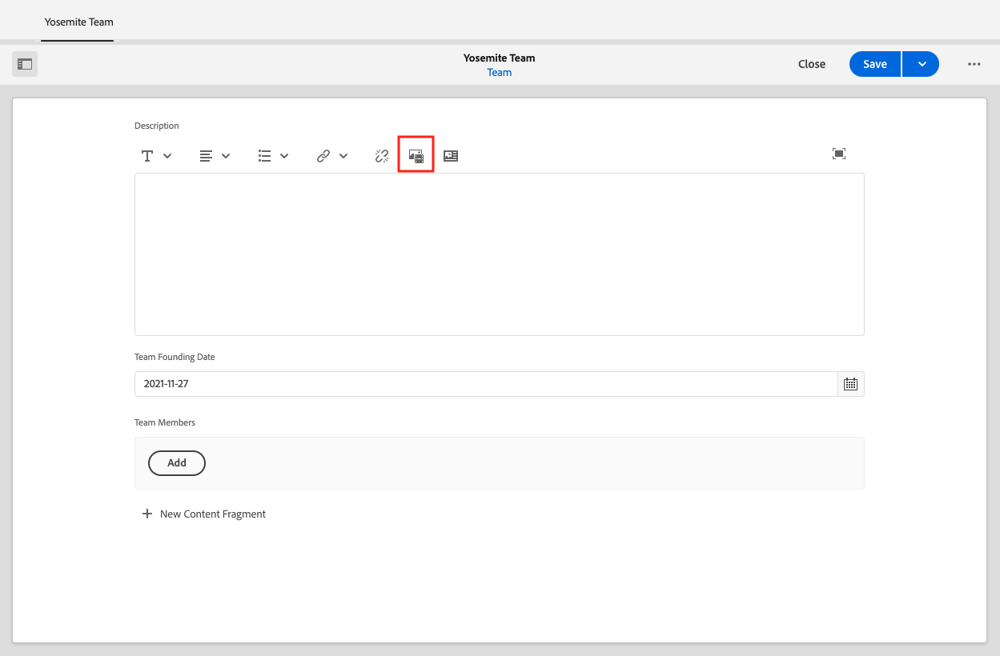

1. In the modal that appears, select **team-yosemite-logo.png** and press **Select**.

    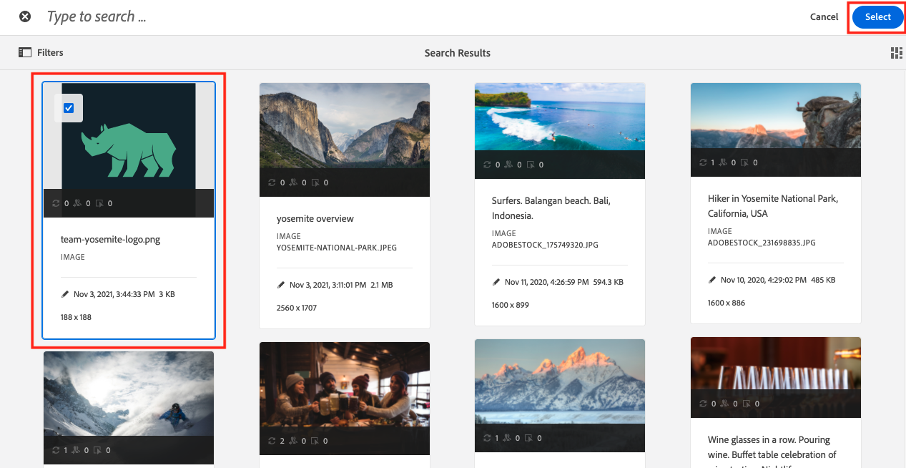

    The content reference is now added into the **Description** field.

Remember that in the previous chapter you allowed fragment references to be added to the **Description** field. Let's add one here.

1. Select the **Insert Content Fragment** icon in the toolbar of the multi-line text editor.

    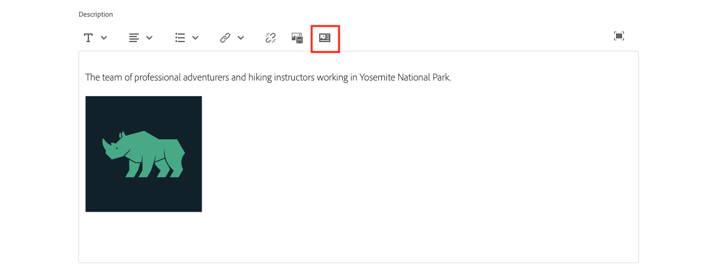

1. Browse to **WKND Site** > **English** > **Adventures** > **Locations** > **Yosemite Valley Lodge** > **Yosemite Valley Lodge**. Press **Select** to insert the Content Fragment.

    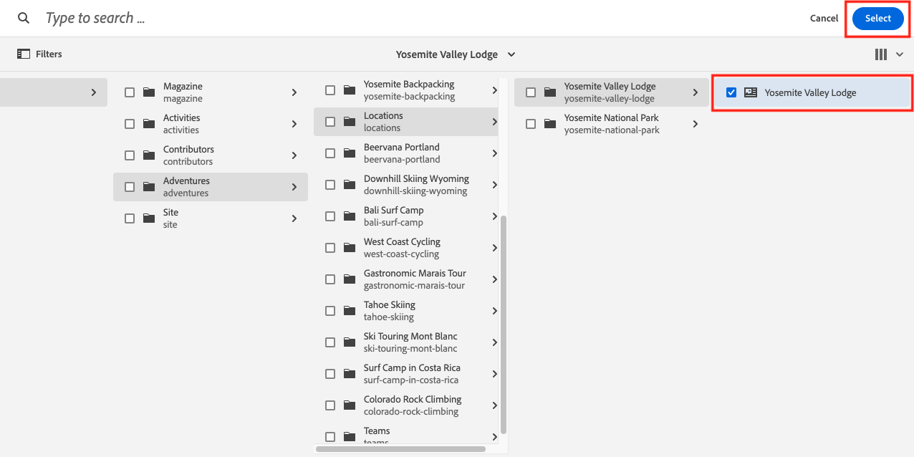

    The **Description** field now looks like the following:

    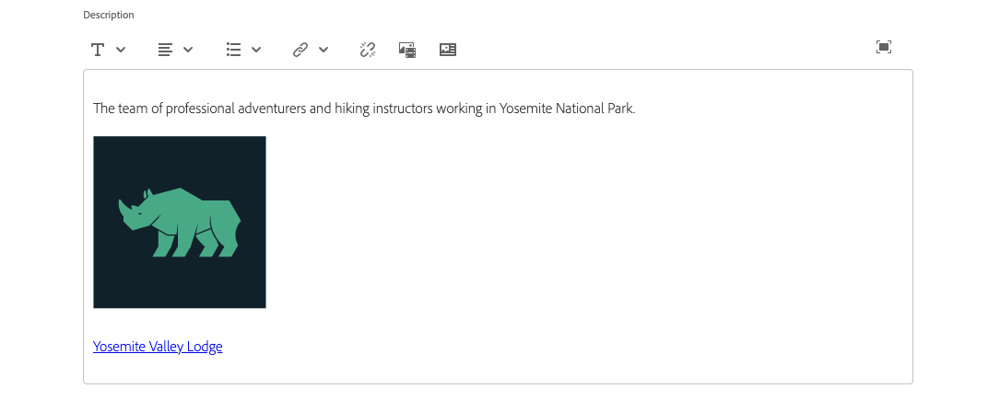

You have now added the content and fragment references directly into the multi-line text editor.

### Date and Time data type

Let's look at the Date and Time data type. Select the **Calendar** icon on the right side of the **Team Founding Date** field to open the calendar view.

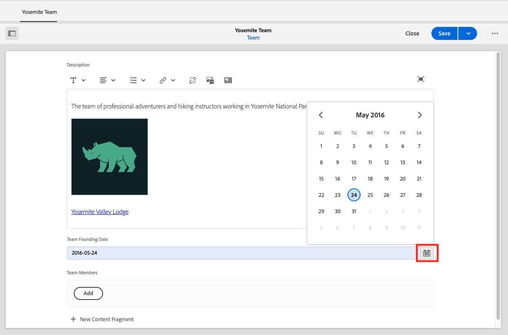

Past or future dates can be set using the forward and back arrows on either side of the month. Let's say the Yosemite team was founded on May 24, 2016, so we'll set the date for then.

### Add multiple fragment references

Let's add Instructors to the Team Members fragment reference. 

1. Select **Add** in the **Team Members** field.

    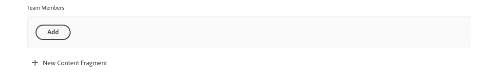

1. In the new field that appears, select the folder icon to open the Select Path modal. Browse through folders to **WKND Site** > **English** > **Adventures** > **Instructors**, then select the checkbox beside **jacob-wester**. Press **Select** to save the path.

    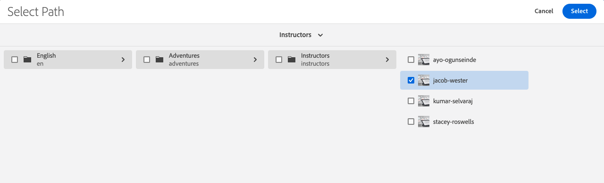

1. Select the **Add** button three more times. Use the new fields to add the remaining three Instructors to the team. The **Team Members** field now looks like this:

    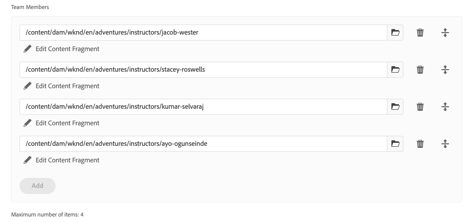

1. Select **Save and Close** to save the Team Content Fragment.

### Add fragment references to an Adventure Content Fragment

Finally, let's add our newly created Content Fragments to an Adventure. 

1. Navigate to **Adventures** > **Yosemite Backpacking** and open the Yosemite Backpacking Content Fragment. At the bottom of the form, you can see the three fields that you have created in the previous chapter: **Location**, **Instructor Team**, and **Administrator**.

1. Add the fragment reference in the **Location** field. The Location path should reference the Yosemite National Park Content Fragment that you created: `/content/dam/wknd/en/adventures/locations/yosemite-national-park/yosemite-national-park`.

1. Add the fragment reference in the **Instructor Team** field. The Team path should reference the Yosemite Team Content Fragment that you created: `/content/dam/wknd/en/adventures/teams/yosemite-team/yosemite-team`. This is a nested fragment reference. The Team Content Fragment contains a reference to the Person model that references Contact Info and Address models. Therefore, you have nested content fragments three levels down.

1. Add the fragment reference in the **Administrator** field. Let's say that Jacob Wester is an Administrator for the Yosemite Backpacking Adventure. The path should lead to the Jacob Wester Content Fragment and appear as follows: `/content/dam/wknd/en/adventures/instructors/jacob-wester`. 

1. You have now added three fragment references to an Adventure Content Fragment. The fields look like this:

    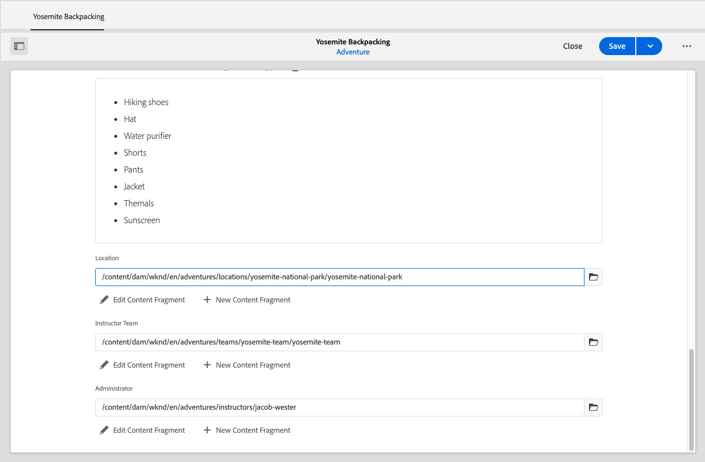

1. Select **Save and Close** to save your content.

## Congratulations!

Congratulations! You have now created Content Fragments based on the advanced Content Fragment Models created in the previous chapter. You have also created a folder policy to limit what Content Fragment Models can be selected within a folder.

## Next steps

In the [next chapter](/help/headless-tutorial/graphql/advanced-graphql/explore-graphql-api.md), you will learn about sending advanced GraphQL queries using the GraphiQL Integrated Development Environment (IDE). These queries will allow us to view the data created in this chapter and eventually add these queries to the WKND app.

While it is optional for this tutorial, make sure to publish all content in real-world production situations. More details about the Author and Publish environments can be found in the [headless video series](/help/headless-tutorial/graphql/video-series/author-publish-architecture.md)
