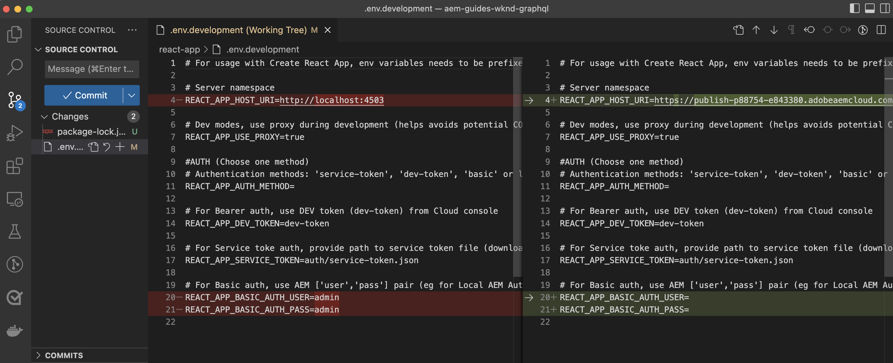
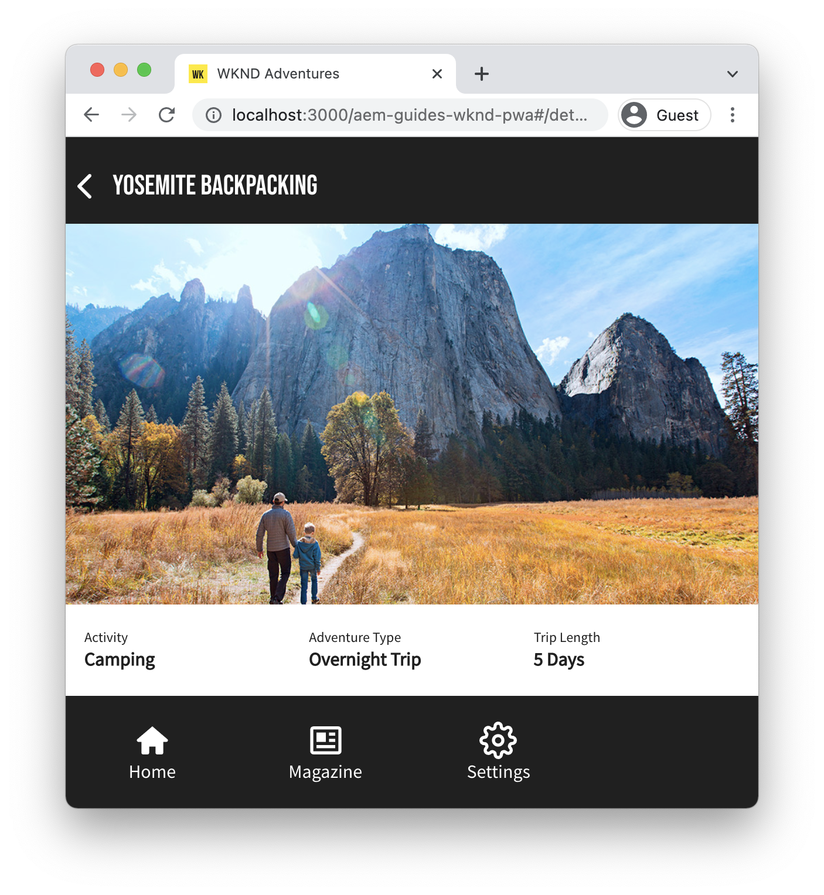
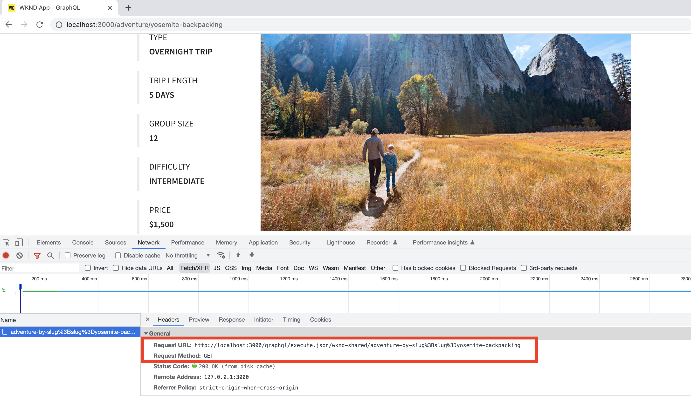
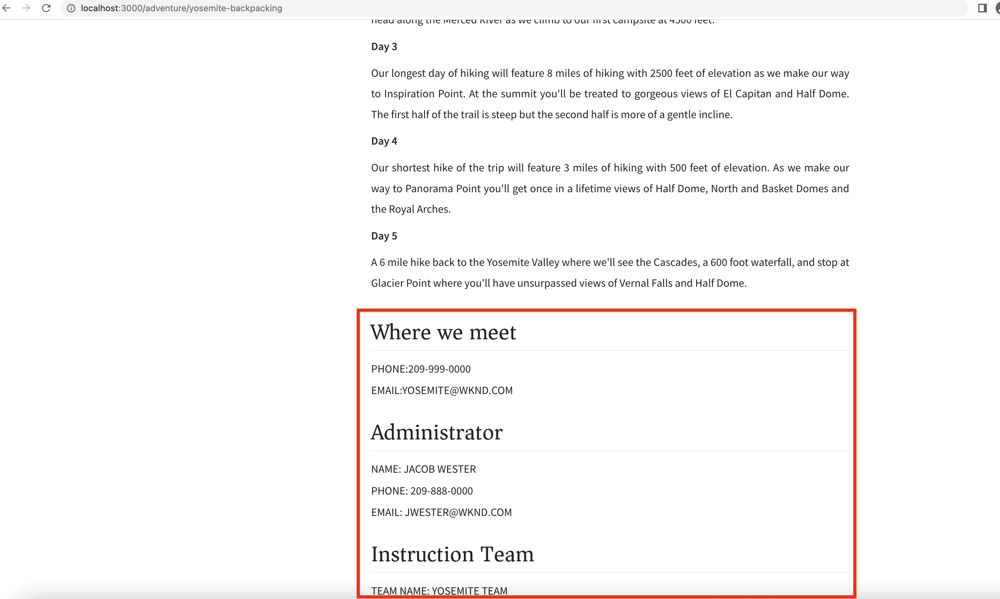

# Client Application Integration

In the previous chapter, you created and updated persisted queries using GraphiQL Explorer. 

This chapter walks you through the steps to integrate the persisted queries with the WKND client application (aka WKND App) using HTTP GET requests within existing **React components**. It also provides an optional challenge to apply your AEM Headless learnings, coding expertise to enhance the WKND client application.

## Prerequisites {#prerequisites}

This document is part of a multi-part tutorial. Please ensure that the previous chapters have been completed before proceeding with this chapter. The WKND client application connects to AEM publish service, so it is important that you **published the following to the AEM publish service**.

* Project Configurations
* GraphQL endpoints
* Content Fragment Models
* Authored Content Fragments
* GraphQL persisted queries

The _IDE screenshots in this chapter come from [Visual Studio Code](https://code.visualstudio.com/)_

### Chapter 1-4 Solution Package (optional) {#solution-package}

A solution package is available to be installed that completes the steps in the AEM UI for chapters 1-4. This package is **not needed** if the previous chapters have been completed.

1. Download [Advanced-GraphQL-Tutorial-Solution-Package-1.2.zip](/help/headless-tutorial/graphql/advanced-graphql/assets/tutorial-files/Advanced-GraphQL-Tutorial-Solution-Package-1.2.zip).
1. In AEM, navigate to **Tools** > **Deployment** > **Packages** to access **Package Manager**.
1. Upload and install the package (zip file) downloaded in the previous step.
1. Replicate the package to the AEM Publish service

## Objectives {#objectives}

In this tutorial, you learn how to integrate the requests for persisted queries into the sample WKND GraphQL React app using the [AEM Headless Client for JavaScript](https://github.com/adobe/aem-headless-client-js).

## Clone and run the sample client application {#clone-client-app}

To accelerate the tutorial a starter React JS app is provided. 

1.  Clone the [adobe/aem-guides-wknd-graphql](https://github.com/adobe/aem-guides-wknd-graphql) repository:

    ```shell
    $ git clone git@github.com:adobe/aem-guides-wknd-graphql.git
    ```

1.  Edit the `aem-guides-wknd-graphql/advanced-tutorial/.env.development` file and set `REACT_APP_HOST_URI` to point at your target AEM publish service. 

    Update the authentication method if connecting to an author instance.

    ```plain
    # Server namespace
    REACT_APP_HOST_URI=https://publish-pxx-eyy.adobeaemcloud.com
    
    #AUTH (Choose one method)
    # Authentication methods: 'service-token', 'dev-token', 'basic' or leave blank to use no authentication
    REACT_APP_AUTH_METHOD=

    # For Bearer auth, use DEV token (dev-token) from Cloud console
    REACT_APP_DEV_TOKEN=

    # For Service toke auth, provide path to service token file (download file from Cloud console)
    REACT_APP_SERVICE_TOKEN=auth/service-token.json

    # For Basic auth, use AEM ['user','pass'] pair (eg for Local AEM Author instance)
    REACT_APP_BASIC_AUTH_USER=
    REACT_APP_BASIC_AUTH_PASS=
    ```

    


    >[!NOTE]
    > 
    > The above instructions are to connect the React app to the **AEM Publish service**, however to connect to the **AEM Author service** obtain a local development token for your target AEM as a Cloud Service environment. 
    >
    > It is also possible to connect the app to a [local Author instance using the AEMaaCS SDK](/help/headless-tutorial/graphql/quick-setup/local-sdk.md) using basic authentication.
    

1.  Open a terminal and run the commands:

    ```shell
    $ cd aem-guides-wknd-graphql/advanced-tutorial
    $ npm install
    $ npm start
    ```

1.  A new browser window should load on [http://localhost:3000](http://localhost:3000)


1.  Tap **Camping** > **Yosemite Backpacking** to view the Yosemite Backpacking adventure details.

    

1.  Open the browser's developer tools and inspect the `XHR` request

    

    You should see `GET` requests to the GraphQL endpoint with project config name (`wknd-shared`), persisted query name (`adventure-by-slug`), variable name (`slug`), value (`yosemite-backpacking`), and special characters encodings.

>[!IMPORTANT]
>
>    If you are wondering why the GraphQL API request is made against the `http://localhost:3000` and NOT against the AEM Publish Service domain, review [Under The Hood](../multi-step/graphql-and-react-app.md#under-the-hood) from Basic Tutorial.


## Review the Code

In the [Basic Tutorial - Build a React app that uses AEM's GraphQL APIs](https://experienceleague.adobe.com/docs/experience-manager-learn/getting-started-with-aem-headless/graphql/multi-step/graphql-and-react-app.html#review-the-aemheadless-object) step we had reviewed and enhanced few key files to get hands-on expertise. Before enhancing the WKND App, review the key files.

*   [Review the AEMHeadless object](https://experienceleague.adobe.com/docs/experience-manager-learn/getting-started-with-aem-headless/graphql/multi-step/graphql-and-react-app.html#review-the-aemheadless-object)

*   [Implement to run AEM GraphQL persisted queries](https://experienceleague.adobe.com/docs/experience-manager-learn/getting-started-with-aem-headless/graphql/multi-step/graphql-and-react-app.html#implement-to-run-aem-graphql-persisted-queries)

### Review `Adventures` React Component

The WKND React app's main view is the list of all Adventures and you can filter these Adventures based on activity type like _Camping, Cycling_. This view is rendered by the `Adventures` component. Below are main implementation details:

*   The `src/components/Adventures.js` calls `useAllAdventures(adventureActivity)` hook and here `adventureActivity` argument is activity type.

*   The `useAllAdventures(adventureActivity)` hook is defined in the `src/api/usePersistedQueries.js` file. Based on `adventureActivity` value, it determines which persisted query to call. If not null value, it calls `wknd-shared/adventures-by-activity`, else gets all the available adventures `wknd-shared/adventures-all`.

*   The hook uses the main `fetchPersistedQuery(..)` function that delegates the query execution to `AEMHeadless` via `aemHeadlessClient.js`.

*   The hook also only returns the relevant data from the AEM GraphQL response at `response.data?.adventureList?.items`, allowing the `Adventures` React view components to be agnostic of the parent JSON structures.

*   Upon successful query execution, the `AdventureListItem(..)` render function from `Adventures.js` adds HTML element to display the _Image, Trip Length, Price, and Title_ information.

### Review `AdventureDetail` React Component

The `AdventureDetail` React component renders the details of the adventure. Below are main implementation details:

*   The `src/components/AdventureDetail.js` calls `useAdventureBySlug(slug)` hook and here `slug` argument is query parameter.

*   Like above, the `useAdventureBySlug(slug)` hook is defined in the `src/api/usePersistedQueries.js` file. It calls `wknd-shared/adventure-by-slug` persisted query by delegating to `AEMHeadless` via `aemHeadlessClient.js`.

*   Upon successful query execution, the `AdventureDetailRender(..)` render function from `AdventureDetail.js` adds HTML element to display the Adventure details.


## Enhance the Code 

### Use `adventure-details-by-slug` persisted query

In the previous chapter, we created the `adventure-details-by-slug` persisted query, it provides additional Adventure information such as _location, instructorTeam, and administrator_. Let's replace `adventure-by-slug` with `adventure-details-by-slug` persisted query to render this additional information.

1.  Open `src/api/usePersistedQueries.js`.

1.  Locate the function `useAdventureBySlug()` and update query as

   ```javascript
    ...

    // Call the AEM GraphQL persisted query named "wknd-shared/adventure-details-by-slug" with parameters
    response = await fetchPersistedQuery(
    "wknd-shared/adventure-details-by-slug",
    queryParameters
    );

    ...
   ```

### Display additional information

1.  To display additional adventure information, open `src/components/AdventureDetail.js`

1.  Locate the function `AdventureDetailRender(..)` and update return function as

    ```javascript
    ...

    return (<>
        <h1 className="adventure-detail-title">{title}</h1>
        <div className="adventure-detail-info">

            <LocationInfo {...location} />

            ...

            <Location {...location} />

            <Administrator {...administrator} />

            <InstructorTeam {...instructorTeam} />

        </div>
    </>); 
    
    ...
    ```

1.  Also define the corresponding render functions:

    **LocationInfo**
    
    ```javascript
    function LocationInfo({name}) {

        if (!name) {
            return null;
        }

        return (
            <>
                <div className="adventure-detail-info-label">Location</div>
                <div className="adventure-detail-info-description">{name}</div>
            </>
        );

    }
    ```

    **Location**
    
    ```javascript
    function Location({ contactInfo }) {

        if (!contactInfo) {
            return null;
        }

        return (
            <>
                <div className='adventure-detail-location'>
                    <h2>Where we meet</h2>
                    <hr />
                    <div className="adventure-detail-addtional-info">Phone:{contactInfo.phone}</div>
                    <div className="adventure-detail-addtional-info">Email:{contactInfo.email}</div>
                </div>
            </>);
    }
    ```

    **InstructorTeam**

    ```javascript
    function InstructorTeam({ _metadata }) {

        if (!_metadata) {
            return null;
        }

        return (
            <>
                <div className='adventure-detail-team'>
                    <h2>Instruction Team</h2>
                    <hr />
                    <div className="adventure-detail-addtional-info">Team Name: {_metadata.stringMetadata[0].value}</div>
                </div>
            </>);
    }
    ```

    **Administrator**
    
    ```javascript
    function Administrator({ fullName, contactInfo }) {

        if (!fullName || !contactInfo) {
            return null;
        }

        return (
            <>
                <div className='adventure-detail-administrator'>
                    <h2>Administrator</h2>
                    <hr />
                    <div className="adventure-detail-addtional-info">Name: {fullName}</div>
                    <div className="adventure-detail-addtional-info">Phone: {contactInfo.phone}</div>
                    <div className="adventure-detail-addtional-info">Email: {contactInfo.email}</div>
                </div>
            </>);
    }
    ```
    
### Define new styles 

1.  Open `src/components/AdventureDetail.scss` and add following class definitions

    ```CSS

    .adventure-detail-administrator,
    .adventure-detail-team,
    .adventure-detail-location {
    margin-top: 1em;
    width: 100%;
    float: right;
    }

    .adventure-detail-addtional-info {
    padding: 10px 0px 5px 0px;
    text-transform: uppercase;
    }

    ```

>[!TIP]
>
>The updated files are available under **AEM Guides WKND - GraphQL** project, see [Advanced Tutorial](https://github.com/adobe/aem-guides-wknd-graphql/tree/main/advanced-tutorial) section.


After completing the above enhancements the WKND App looks like below and browser's developer tools shows `adventure-details-by-slug` persisted query call.


    
## Enhancement Challenge (Optional)

The WKND React app's main view allows you to filter these Adventures based on activity type like _Camping, Cycling_. However WKND business team wants to have an extra _Location_ based filtering capability. The requirements are

* On WKND App's main view, in the top left or right corner add _Location_ filtering icon.
* Clicking _Location_ filtering icon should display list of locations.
* Clicking a desired location option from the list should only show matching Adventures.
* If there is only one matching Adventure, the Adventure Details view is shown.

## Congratulations

Congratulations! You have now completed integration and implementing the persisted queries into the sample WKND app.
