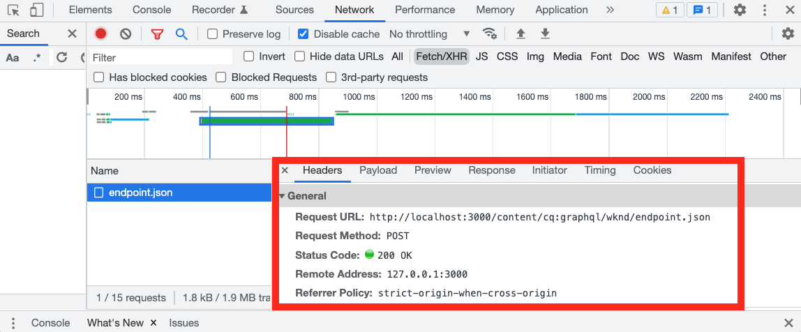
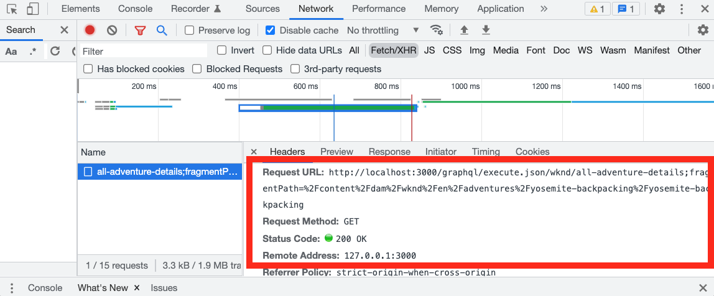
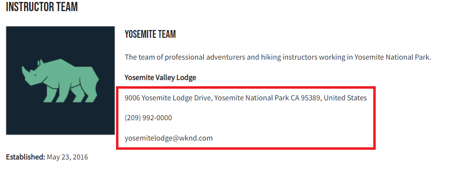
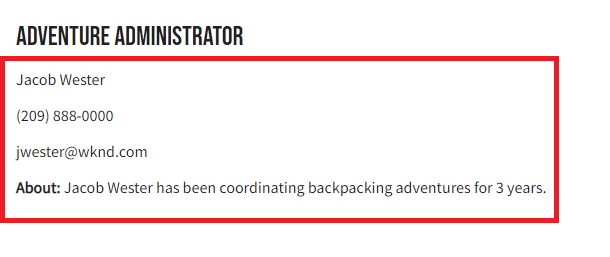

# Client Application Integration

In the previous chapter, you created and updated persisted queries using HTTP PUT and POST requests. 

This chapter walks you through the steps to integrate those persisted queries with the WKND app using HTTP GET requests within five React components: 

* Location 
* Address
* Instructors
* Administrator
* Team 

## Prerequisites {#prerequisites}

This document is part of a multi-part tutorial. Please ensure that the previous chapters have been completed before proceeding with this chapter. Completion of the [basic tutorial](/help/headless-tutorial/graphql/multi-step/overview.md) is recommended.

_IDE screenshots in this chapter come from [Visual Studio Code](https://code.visualstudio.com/)_

### Chapter 1-4 Solution Package (optional) {#solution-package}

A solution package is available to be installed that completes the steps in the AEM UI for chapters 1-4. This package is **not needed** if the previous chapters have been completed.

1. Download [Advanced-GraphQL-Tutorial-Solution-Package-1.1.zip](/help/headless-tutorial/graphql/advanced-graphql/assets/tutorial-files/Advanced-GraphQL-Tutorial-Solution-Package-1.1.zip).
1. In AEM, navigate to **Tools** > **Deployment** > **Packages** to access **Package Manager**.
1. Upload and install the package (zip file) downloaded in the previous step.

## Objectives {#objectives}

In this tutorial, you learn how to integrate the requests for persisted queries into the sample WKND GraphQl React app using the AEM Headless JavaScript [SDK](https://github.com/adobe/aem-headless-client-js).

## Install and run the sample client application {#install-client-app}

To accelerate the tutorial a starter React JS app is provided. 

>[!NOTE]
> 
> Below instructions are to connect the React app to an **Author** environment in AEM as a Cloud Service using a [local development access token](/help/headless-tutorial/authentication/local-development-access-token.md). It is also possible to connect the app to a [local Author instance using the AEMaaCS SDK](/help/headless-tutorial/graphql/quick-setup/local-sdk.md) using basic authentication.

1. Download **[aem-guides-wknd-headless-start-tutorial.zip](/help/headless-tutorial/graphql/advanced-graphql/assets/tutorial-files/aem-guides-wknd-headless-start-tutorial.zip)**.
1. Unzip the file and open the project in your IDE.
1. Obtain a [local development token](/help/headless-tutorial/authentication/local-development-access-token.md) for your target AEM environment.
1. In the project, open the file `.env.development`.
    1. Set `REACT_APP_DEV_TOKEN` equal to the `accessToken` value from the local development token. (Not the entire JSON file)
    1. Set `REACT_APP_HOST_URI` to the url of your AEM **Author** environment.

    
1. Open a new terminal and navigate into the project folder. Run the following commands:

    ```shell
    $ npm install
    $ npm start
    ```

1. A new browser should open at `http://localhost:3000/aem-guides-wknd-pwa`.
1. Tap **Camping** > **Yosemite Backpacking** to view the Yosemite Backpacking adventure details.

    

1. Open the browser's developer tools and inspect the `XHR` request

    

    You should see a `POST` to the GraphQL endpoint. Viewing the `Payload`, you can see the full GraphQL query that was sent. In the next sections, the app is updated to use **persisted** queries.


## Getting started 

In the basic tutorial, a parameterized GraphQl query is used to request a single Content Fragment and render the adventure details. Next, update the `adventureDetailQuery` to include new fields and use persisted queries created in the previous chapter.

Five components are created:

|React Component|Location|
|-------|------|
|Administrator|`src/components/Administrator.js`|
|Team|`src/components/Team.js`|
|Location|`src/components/Location.js`|
|Instructors|`src/components/Instructors.js`|
|Address|`src/components/Address.js`|

## Update useGraphQL hook

A custom [React Effect Hook](https://reactjs.org/docs/hooks-overview.html#effect-hook) was created that listens for changes to the app's `query`, and on change makes an HTTP POST request to the AEM GraphQL endpoint, and returns the JSON response to the app. 

Create a new hook to use **persisted** queries. The app can then make HTTP GET requests for Adventure details. The `runPersistedQuery` of the [AEM Headless Client SDK](https://github.com/adobe/aem-headless-client-js) is used to make executing a persisted query easier.

1. Open the file `src/api/useGraphQL.js`
1. Add a new hook for `useGraphQLPersisted`:

    ```javascript
    /**
    * Custom React Hook to perform a GraphQL query to a persisted query endpoint
    * @param persistedPath - the short path to the persisted query
    * @param fragmentPathParam - optional parameters object that can be passed in for parameterized persistent queries
    */
    export function useGraphQLPersisted(persistedPath, fragmentPathVariable) {
        let [data, setData] = useState(null);
        let [errors, setErrors] = useState(null);

        useEffect(() => {
            let queryVariables = {};

            // we pass in a primitive fragmentPathVariable (String) and then construct the object {fragmentPath: fragmentPathParam} to pass as query params to the persisted query
            // It is simpler to pass a primitive into a React hooks, as comparing the state of a dependent object can be difficult. see https://reactjs.org/docs/hooks-faq.html#can-i-skip-an-effect-on-updates
            if(fragmentPathVariable) {
                queryVariables = {fragmentPath: fragmentPathVariable};
            }

            // execute a persisted query using the given path and pass in variables (if needed)
            sdk.runPersistedQuery(persistedPath, queryVariables)
                .then(({ data, errors }) => {
                if (errors) setErrors(mapErrors(errors));
                if (data) setData(data);
            })
            .catch((error) => {
            setErrors(error);
            });
    }, [persistedPath, fragmentPathVariable]);

    return { data, errors }
    }
    ```
1. Save changes to the file.

## Update Adventure Details Component

The file `src/api/queries.js` contains the GraphQL queries used to power the application `adventureDetailQuery` returns details for an individual adventure using the standard POST GraphQL request. Next, update the `AdventureDetail` component to use the persisted `wknd/all-adventure-details` query.

1. Open `src/screens/AdventureDetail.js`.
1. First comment out the following line:

    ```javascript
    export default function AdventureDetail() {

        ...

        //const { data, errors } = useGraphQL(adventureDetailQuery(adventureFragmentPath));
    ```

    The above uses the standard GraphQL POST to retrieve adventure details based on a `adventureFragmentPath`

1. To use the `useGraphQLPersisted` hook, add the following line :

    ```javascript
    export default function AdventureDetail() {

       //const { data, errors } = useGraphQL(adventureDetailQuery(adventureFragmentPath));
        const {data, errors} = useGraphQLPersisted("wknd/all-adventure-details", adventureFragmentPath);
    ```

    Observe the path `wknd/all-adventure-details` is the path to the persisted query created in the previous chapter. 

    >[!CAUTION]
    >
    > For the updated query to work the `wknd/all-adventure-details` must be persisted on the target AEM environment. Review the steps in [Persisted GraphQL queries](/help/headless-tutorial/graphql/advanced-graphql/graphql-persisted-queries.md#cache-control-all-adventures) or install the [AEM solution package](/help/headless-tutorial/graphql/advanced-graphql/assets/tutorial-files/Advanced-GraphQL-Tutorial-Solution-Package-1.1.zip)

1. Return to the app running in the browser and use your browser's developer tools to inspect the request after navigating to an **Adventure Details** page.

    

    ```
    http://localhost:3000/graphql/execute.json/wknd/all-adventure-details;fragmentPath=/content/dam/wknd/en/adventures/yosemite-backpacking/yosemite-backpacking
    ```

    You should now see a `GET` request that is using the persisted query at `wknd/all-adventure-details`.

1. Navigate to other adventure details and observe that the same `GET` request is made but with different fragment paths. The application should continue to work as before.

Refer to `AdventureDetail.js` in the [aem-guides-wknd-headless-solution-tutorial.zip](/help/headless-tutorial/graphql/advanced-graphql/assets/tutorial-files/aem-guides-wknd-headless-solution-tutorial.zip) for a full example of the updated component.   

Next, create the **Location**, **Administrator**, and **Instructors** components to render location data. The **Address** component is referenced within the **Team** component.

## Develop the Location component

1. In the `AdventureDetail.js` file, add a reference to the `<Location>` component passing the location data from the `adventure` data object:

    ```javascript
    export default function AdventureDetail() {
        ...

        return (
            ...

            <Location data={adventure.location} />
    ```

1. Review the file at `src/components/Location.js`. The `Location` component renders the data for where to meet, contact info, information about the weather, and a location image from the **Location** Content Fragment Model. At a minimum, the `Location` component expects an `address` object to be passed.
1. Refer to `Location.js` in the [aem-guides-wknd-headless-solution-tutorial.zip](/help/headless-tutorial/graphql/advanced-graphql/assets/tutorial-files/aem-guides-wknd-headless-solution-tutorial.zip) for a full example of the updated component.  

Once the updates have been made, the rendered detail page should look as below:


## Develop the Team component

1. In the `AdventureDetail.js` file, add a reference to the `<Team>` component (beneath the `<Location>` component) passing the `instructorTeam` data from the `adventure` data object:

    ```javascript
    <Location data={adventure.location} />
    <Team data={adventure.instructorTeam} />
    ```

1. Review the file at `src/components/Team.js`. The `Team` component renders data about the team founding date, image, and description from the **Team** Content Fragment.

1. In `Team.js` note the inclusion of the `Address` component. 

    ```javascript
    export default function Team({data}) {
        ...
        {teamPath && <Address _path={teamPath}/>}
    ```

    Here a path to the current team is passed into the `Address` component, which in turn executes a query to get the address based on the team.

1. Refer to `Team.js` in the [aem-guides-wknd-headless-solution-tutorial.zip](/help/headless-tutorial/graphql/advanced-graphql/assets/tutorial-files/aem-guides-wknd-headless-solution-tutorial.zip) for a full example of the component.

Once the query is integrated, it should look like this:



## Develop the Address component

1. Review the file at `src/components/Address.js`. The `Address` component renders address information such as street address, city, state, zip code, country from the **Address** Content Fragment and phone and email from the **Contact Info** fragment reference.
1. The `Address` component is similar to the `AdventureDetails` component in that it makes a persisted call to retrieve data based on a path. The difference is that it uses `/wknd/team-location-by-location-path` to make the request.
1. Refer to `Address.js` in the [aem-guides-wknd-headless-solution-tutorial.zip](/help/headless-tutorial/graphql/advanced-graphql/assets/tutorial-files/aem-guides-wknd-headless-solution-tutorial.zip) for a full example of the component.

## Develop the Administrator component

1. In the `AdventureDetail.js` file, add a reference to the `<Adminstrator>` component (beneath the `<Team>` component) passing the `administrator` data from the `adventure` data object:

    ```javascript
    <Location data={adventure.location} />
    <Team data={adventure.instructorTeam} />
    <Administrator data={adventure.administrator} /> 
    ```

1. Review the file at `src/components/Administrator.js`. The `Administrator` component renders details such as their full name from the **Administrator** Content Fragment, and render phone and email from the **Contact Info** fragment reference.
1. Refer to `Administrator.js` in [aem-guides-wknd-headless-solution-tutorial.zip](/help/headless-tutorial/graphql/advanced-graphql/assets/tutorial-files/aem-guides-wknd-headless-solution-tutorial.zip) for a full example of the component.

After creating the Administrator component, you are ready to render the application. The output should match the image below:



## Develop the Instructors component

1. In the `AdventureDetail.js` file, add a reference to the `<Instructors>` component (beneath the `<Administrator>` component) passing the `instructorTeam` data from the `adventure` data object:

    ```javascript
    <Location data={adventure.location} />
    <Team data={adventure.instructorTeam}/>
    <Administrator data={adventure.administrator} />             
    <Instructors data={adventure.instructorTeam} />
    ```

1. Review the file at `src/components/Instructors.js`. The `Instructors` component renders data about each of the team members, including full name, biography, picture, phone number, experience level, and skills. The component iterates over an array to display each member. 
1. Refer to `Instructors.js` in [aem-guides-wknd-headless-solution-tutorial.zip](/help/headless-tutorial/graphql/advanced-graphql/assets/tutorial-files/aem-guides-wknd-headless-solution-tutorial.zip) for a full example of the component. 

Once you render the application, the output should match the image below:


## Finished sample WKND app

The finished app should look like this:


### Final Client Application

The final version of the app can be downloaded and used:
**[aem-guides-wknd-headless-solution-tutorial.zip](/help/headless-tutorial/graphql/advanced-graphql/assets/tutorial-files/aem-guides-wknd-headless-solution-tutorial.zip)**

## Congratulations

Congratulations! You have now completed integration and implementing the persisted queries into the sample WKND app.
