# Create Content Fragment Models {#create-content-fragment-models}

This chapter walks through the steps to create five Content Fragment Models: 

* **Contact Info**
* **Address**
* **Person**
* **Location**
* **Team**

Content fragment models allow defining relationships between content types and persisting such relationships as schemas. Use nested fragment references, various content data types, and the tab type for visual content organization. More advanced data types such as tab placeholders, fragment references, JSON objects, and the date-and-time data type. 

This chapter also covers how to enhance validation rules for content references such as images.

## Prerequisites {#prerequisites}

This is an advanced tutorial. Before proceeding with this chapter, please ensure that you have completed the [quick setup](../quick-setup/cloud-service.md). Make sure that you have also read through the previous [overview](../overview.md) chapter for more information on the setup for the advanced tutorial.

## Objectives {#objectives}

* Create Content Fragment Models.
* Add tab placeholders, date and time, JSON objects, fragment references, and content references to the models.
* Add validation to content references.

## Content Fragment Model Overview {#content-fragment-model-overview}

The following video provides a brief introduction to Content Fragment Models and how they are used in this tutorial. 

>[!VIDEO](https://video.tv.adobe.com/v/340037?quality=12&learn=on)

## Create Content Fragment Models {#create-models}

Let's create some Content Fragment Models for the WKND app. If you require a basic introduction to creating Content Fragment Models, please see the appropriate chapter in the [basic tutorial](../multi-step/content-fragment-models.md).

1. Navigate to **Tools** > **General** > **Content Fragment Models**.

    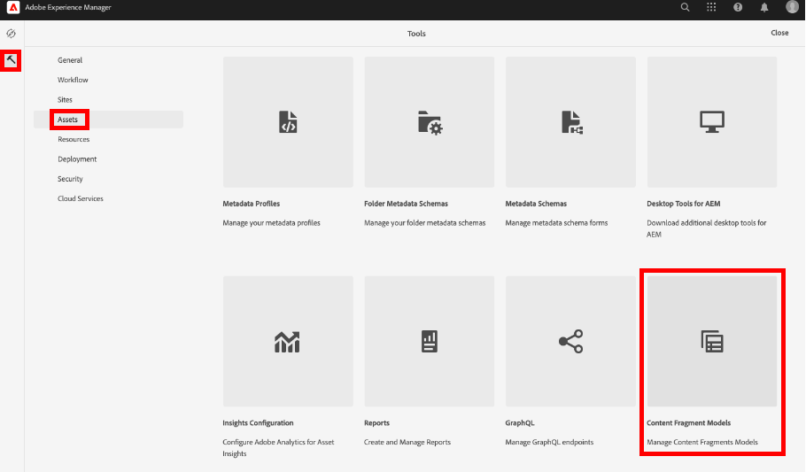

1. Select **WKND Shared** to view the list of existing Content Fragment Models for the site.

### Contact Info Model {#contact-info-model}

Next, create a model that contains the contact information for a person or location. 

1. Select **Create** in the top-right corner.

1. Give the model a title of "Contact Info", then select **Create**. In the success modal that appears, select **Open** to edit the newly created model. 

1. Start by dragging a **Single line text** field onto the model. Give it a **Field Label** of "Phone" in the **Properties** tab. The property name is automatically filled in as `phone`. Select the checkbox to make the field **Required**.

1. Navigate to the **Data Types** tab, then add another **Single line text** field below the "Phone" field. Give it a **Field Label** of "Email" and also set it to **Required**. 

Adobe Experience Manager comes with some built-in validation methods. These validation methods allow you to add governance rules to specific fields in your Content Fragment Models. In this case, let's add a validation rule to ensure that users can only enter valid email addresses when filling out this field. Under the **Validation Type** dropdown, select **E-mail**.

Your completed content fragment model should look like this:

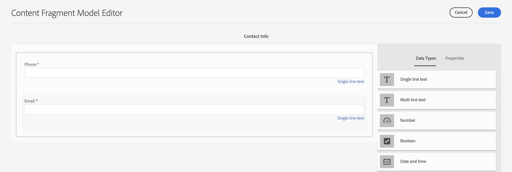

Once done, select **Save** to confirm your changes and close the Content Fragment Model Editor.

### Address Model {#address-model}

Next, create a model for an address. 

1. From the **WKND Shared**, select **Create** from the top-right corner. 

1. Enter a title of "Address" and then select **Create**. In the success modal that appears, select **Open** to edit the newly created model. 

1. Drag and drop a **Single line text** field onto the model and give it a **Field Label** of "Street Address." The property name is then filled in as `streetAddress`. Select the **Required** checkbox. 

1. Repeat the above steps and add four more "Single Line text" fields to the model. Use the following labels:

    * City
    * State
    * ZIP Code
    * Country

1. Select **Save** to save the changes to the Address model.

    The completed "Address" fragment model should look like this:
    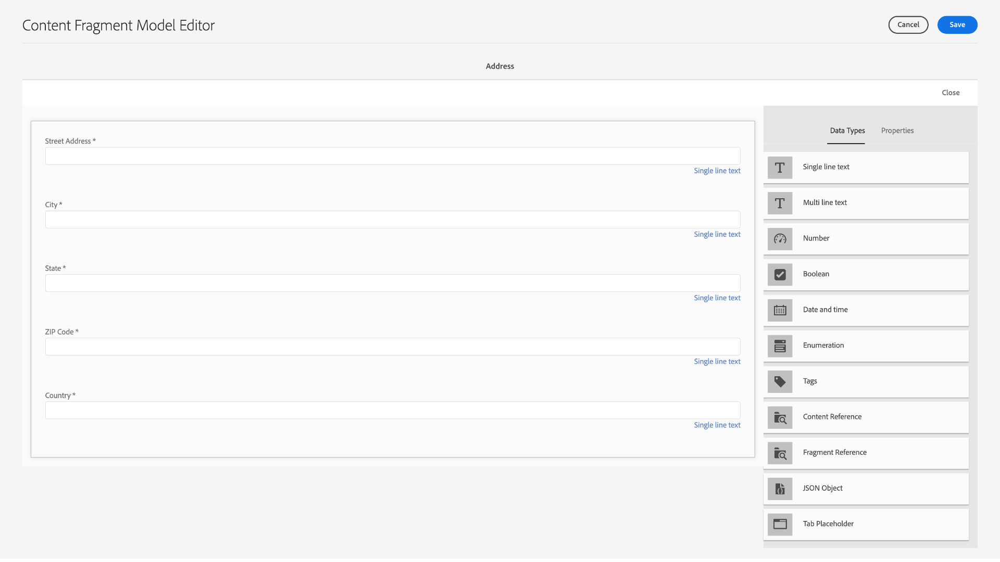

### Person Model {#person-model}

Next, create a model that contains information about a person. 

1. In the top-right corner, select **Create**.

1. Give the model a title of "Person", then select **Create**. In the success modal that appears, select **Open** to edit the newly created model.

1. Start by dragging a **Single line text** field onto the model. Give it a **Field Label** of "Full Name". The property name is automatically filled in as `fullName`. Select the checkbox to make the field **Required**.

    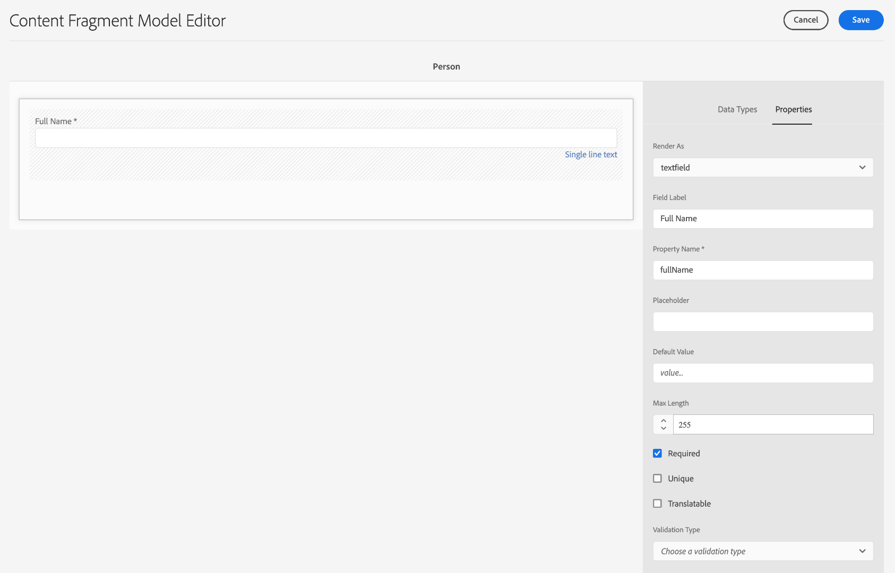

1. Content Fragment Models can be referred to in other models. Navigate to the **Data Types** tab, then drag and drop the **Fragment Reference** field and give it a label of "Contact Info". 

1. In the **Properties** tab, under the **Allowed Content Fragment Models** field, select the folder icon and then choose the **Contact Info** fragment model created earlier.

1. Add a **Content Reference** field and give it a **Field Label** of "Profile Picture." Select the folder icon under **Root Path** to open the path selection modal. Select a root path by selecting **content** > **Assets**, then selecting the checkbox for **WKND Shared**. Use the **Select** button at the top right to save the path. The final text path should read `/content/dam/wknd-shared`.

    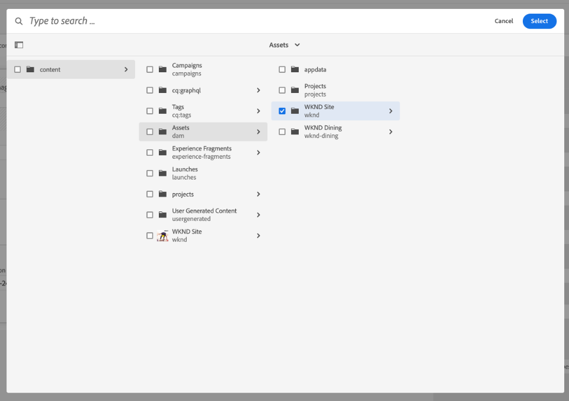

1. Under **Accept only specified content types**, select "Image".

    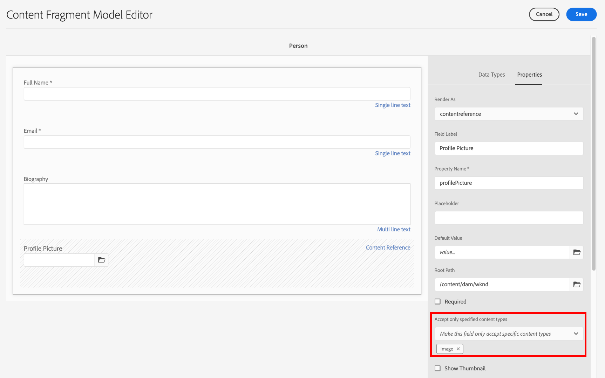

1. To limit the image file size and dimensions, let's look at some validation options for the content reference field.

    Under **Accept only specified file size**, select "Less than or equal to", and additional fields appear below.
    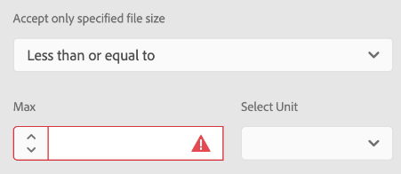

1. For **Max**, enter "5", and for **Select Unit**, select "Megabytes (MB)". This validation only allows images that are of the specified size to be chosen.

1. Under **Accept only specified image width**, select "Maximum Width". In the **Max (pixels)** field that appears, enter "10000". Select the same options for **Accept only a specified image height**.

    These validations ensure that added images do not exceed the specified values. The validation rules should now look like this:

    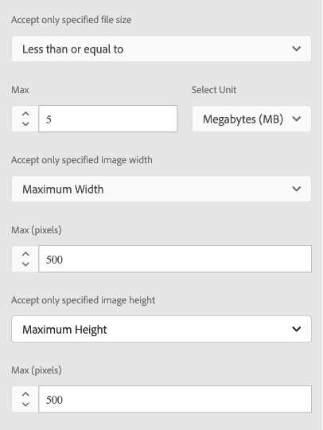

1. Add a **Multi line text** field and give it a **Field Label** of "Biography". Leave the **Default Type** dropdown as the default "Rich Text" option.

    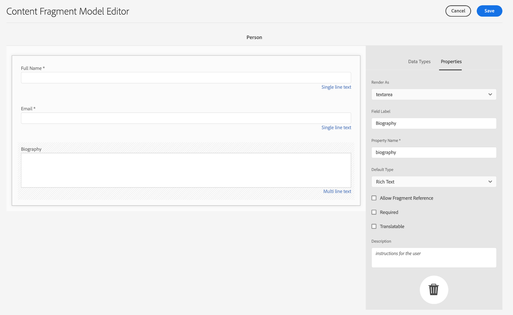

1. Navigate to the **Data Types** tab, then drag an **Enumeration** field underneath "Biography". Instead of the default **Render As** option, select **Dropdown** and give it a **Field Label** of "Instructor Experience Level". Enter a selection of instructor experience level options such as _Expert, Advanced, Intermediate_. 

1. Next, drag another **Enumeration** field under "Instructor Experience Level" and choose "checkboxes" under the **Render As** option. Give it a **Field Label** of "Skills". Enter different skills such as Rock Climbing, Surfing, Cycling, Skiing, and Backpacking. The option label and option value should match as below:

    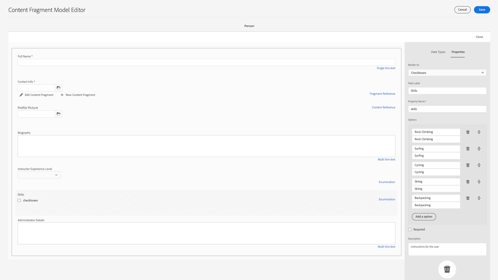

1. Lastly, create an "Administrator Details" field label using a **Multi-line text** field.

Select **Save** to confirm your changes and close the Content Fragment Model Editor.

### Location Model {#location-model}

The next Content Fragment Model describes a physical location. This model uses tab placeholders. Tab placeholders help organize your data types in the model editor and content in the fragment editor respectively, by categorizing the content. Each placeholder creates a tab, similar to a tab in an internet browser, in the Content Fragment editor. The Location model should have two tabs: Location Details and Location Address.

1. As previously, select **Create** to create another Content Fragment Model. For the Model Title, enter "Location." Select **Create** followed by **Open** in the success modal that appears.

1. Add a **Tab Placeholder** field to the model and label it "Location Details."

1. Drag and a drop a **Single Line Text** and label it "Name." Below this field label, add a **multi-line text** field and label it "Description."

1. Next, add a **Fragment Reference** field and label it "Contact Info." In the properties tab, under **Allowed Content Fragment Models**, select the **Folder Icon** and choose the "Contact Info" fragment model created earlier.

1. Add a **Content Reference** field under "Contact Info". Label it "Location Image". The **Root Path** should be `/content/dam/wknd-shared.` Under **Accept only specified content types**, select "Image".

1. Let's also add a **JSON Object** field under the "Location Image." As this data type is flexible, it can be used to display any data you want to include in your content. In this case, the JSON Object is used to display information about the weather. Label the JSON Object "Weather by Season". In the **Properties** tab, add a **Description** so it's clear to the user what data should be entered here: "JSON data regarding the event location weather by season (Spring, Summer, Fall, Winter)."

    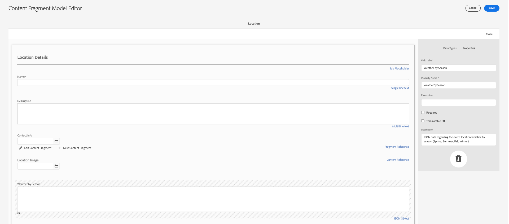

1. To create the Location Address tab, add a **Tab Placeholder** field to the model and label it "Location Address."

1. Drag and drop a **Fragment Reference** field and from the properties tab, label it as "Address", and under **Allowed Content Fragment Models**, select the **Address** model.

1. Select **Save** to confirm your changes and close the Content Fragment Model Editor. The completed Location model should appear as below:

    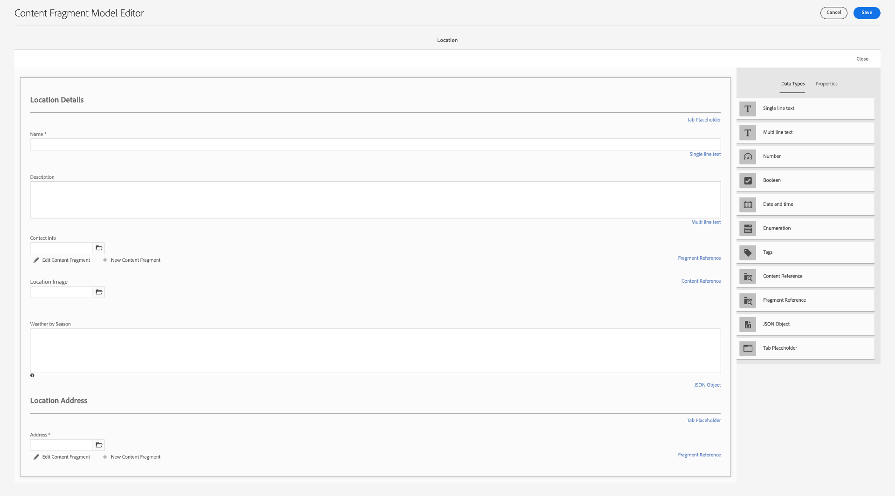

### Team Model {#team-model}

Finally, create a model that describes a team of people. 

1. From the **WKND Shared** page, select **Create** to make another Content Fragment Model. For the Model Title, enter "Team." As previously, select **Create** followed by **Open** in the success modal that appears.

1. Add a **Multi line text** field to the form. Under **Field Label**, enter "Description".

1. Add a **Date and Time** field to the model and label it "Team Founding Date". In this case, keep the default **Type** set to "Date", but note that it is also possible to use "Date & Time" or "Time".

    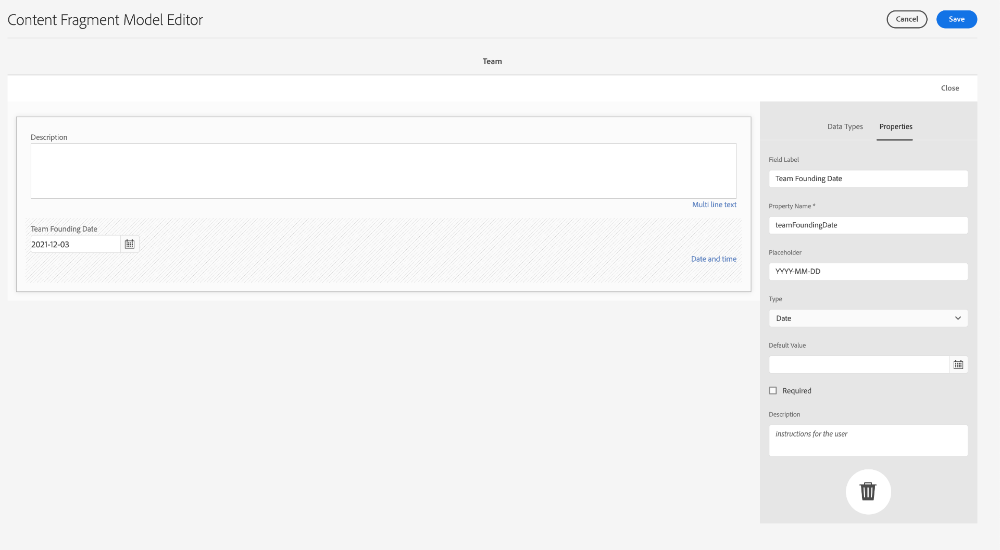

1. Navigate to the **Data Types** tab. Below the "Team Founding Date", add a **Fragment Reference**. In the **Render As** dropdown, select "multifield". For **Field Label**, enter "Team Members". This field links to the _Person_ model created previously. Since the data type is a multi-field, multiple Person fragments can be added, enabling the creation of a team of people.

    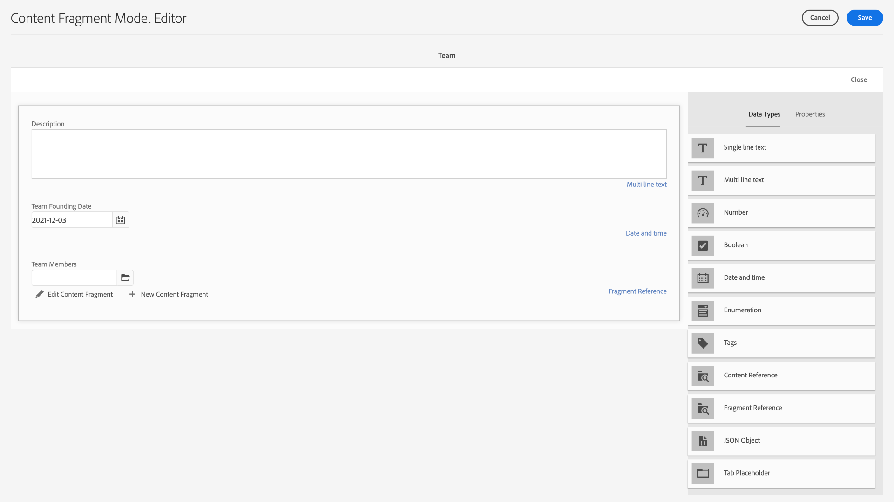

1. Under **Allowed Content Fragment Models**, use the folder icon to open the Select Path modal, then select the **Person** model. Use the **Select** button to save the path.

    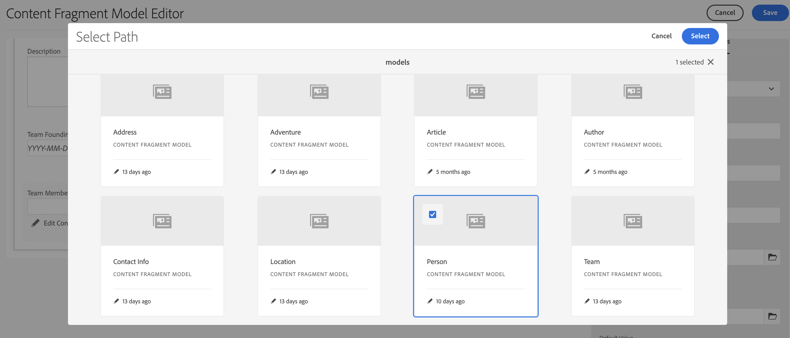

1. Select **Save** to confirm your changes and close the Content Fragment Model Editor.

## Add Fragment References to the Adventure Model {#fragment-references}

Similar to how the Team model has a fragment reference to the Person model, the Team and Location models must be referenced from the Adventure model to display these new models in the WKND app.

1. From the **WKND Shared** page, select the **Adventure** model, then select **Edit** from the top navigation.

    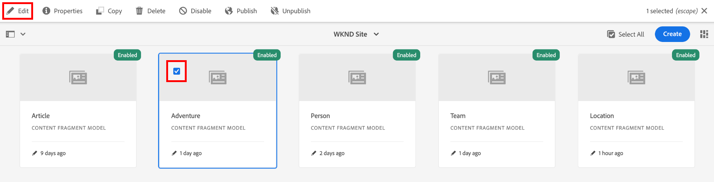

1. At the bottom of the form, underneath "What to Bring", add a **Fragment Reference** field. Enter a **Field Label** of "Location". Under **Allowed Content Fragment Models**, select the **Location** model.

    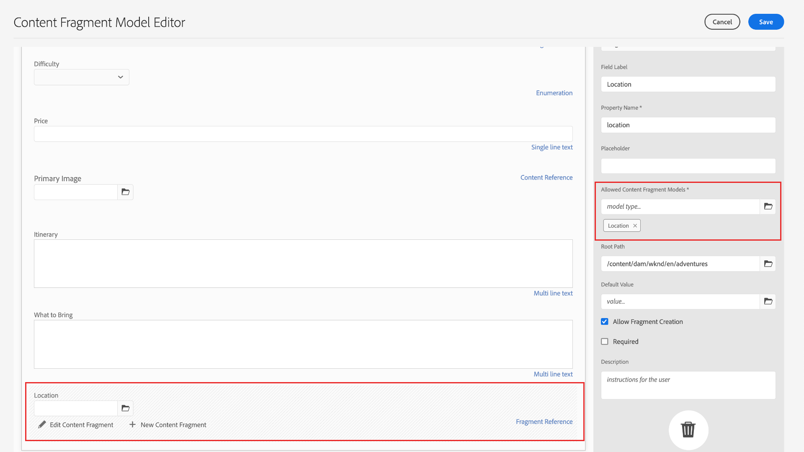

1. Add one more **Fragment Reference** field and label it "Instructor Team". Under **Allowed Content Fragment Models**, select the **Team** model.

    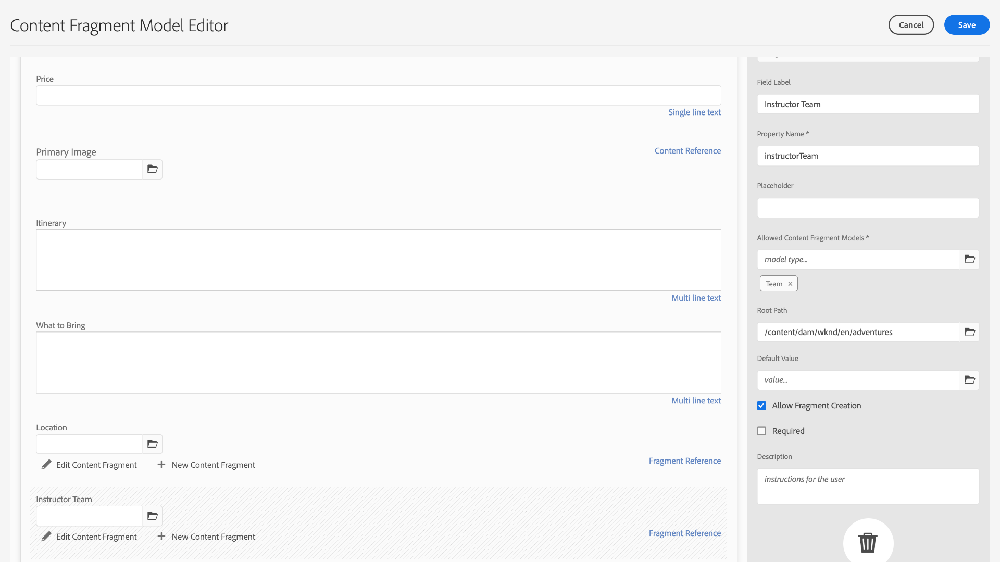

1. Add another **Fragment Reference** field and label it "Administrator."

    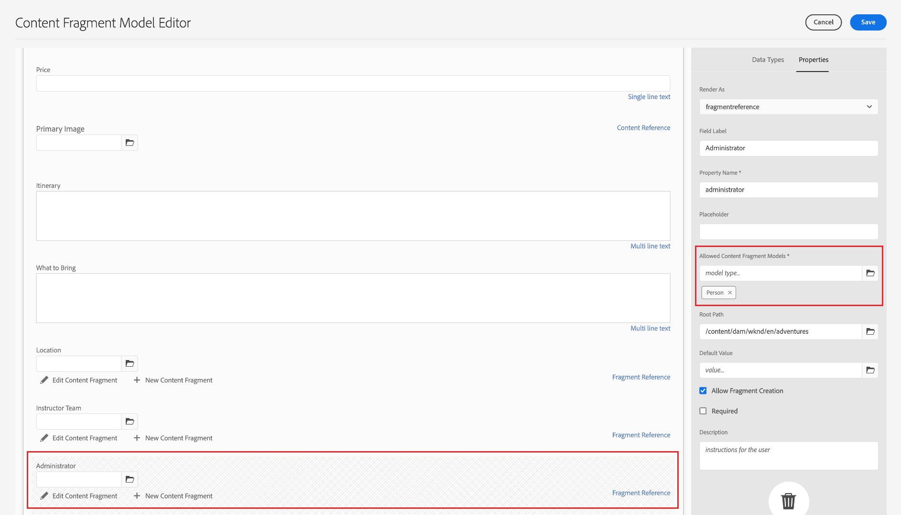

1. Select **Save** to confirm your changes and close the Content Fragment Model Editor.

## Best Practices {#best-practices}

There are a few best practices related to creating Content Fragment Models:

* Create models that map to UX components. For example, the WKND app has Content Fragment Models for adventures, articles, and location. You could also add headers, promotions, or disclaimers. Each of these examples makes up a specific UX component.

* Create as few models as possible. Limiting the number of models allows you to maximize reuse and simplify content management.

* Nest Content Fragment Models as deeply as needed but only as necessary. Recall that nesting is accomplished with fragment references or content references. Consider a maximum of five levels of nesting.

## Congratulations! {#congratulations}

Congratulations! You've now added tabs, used the date-and-time and JSON object data types, and learned more about fragment and content references. You've also added content reference validation rules.

## Next Steps {#next-steps}

The next chapter in this series will cover [authoring content fragments](/help/headless-tutorial/graphql/advanced-graphql/author-content-fragments.md) from the models you created in this chapter. Learn how to use the data types introduced in this chapter and create folder policies to limit what Content Fragment Models can be created in an asset folder.

While it is optional for this tutorial, make sure to publish all content in real-world production situations. For a review of Author and Publish environments in AEM, refer to the 
[AEM Headless and GraphQL video series](/help/headless-tutorial/graphql/video-series/author-publish-architecture.md).
