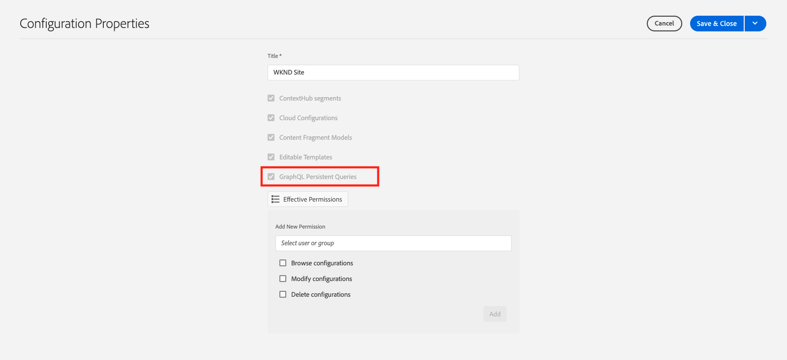
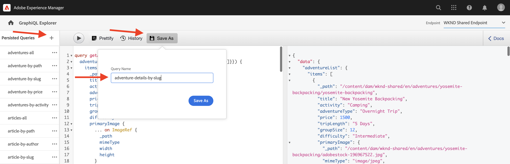
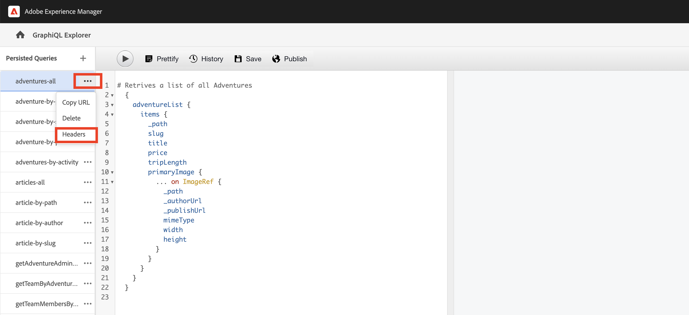
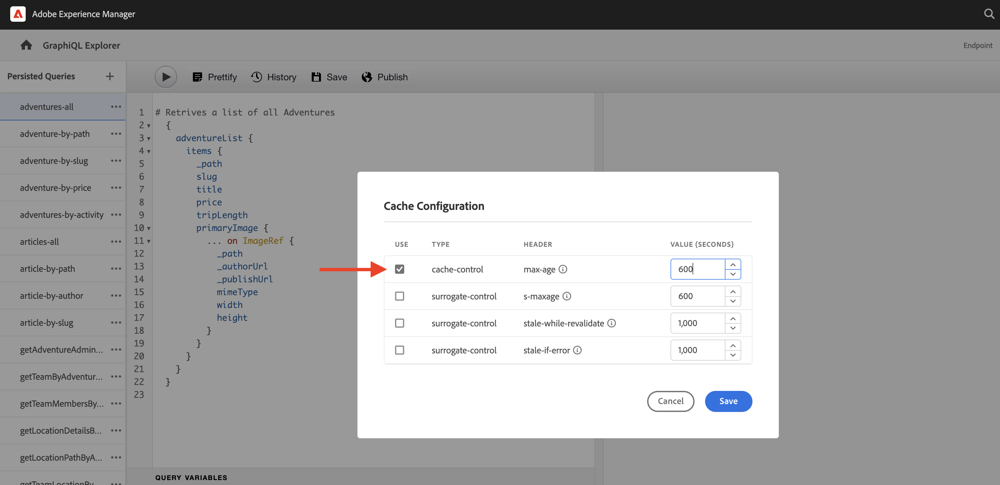

# Persisted GraphQL queries

Persisted queries are queries that are stored on the Adobe Experience Manager (AEM) server. Clients can send an HTTP GET request with the query name to execute it. The benefit of this approach is cacheability. While client-side GraphQL queries can also be executed using HTTP POST requests, which cannot be cached, persisted queries can be cached by HTTP caches or a CDN, improving performance. Persisted queries allow you to simplify your requests and improve security because your queries are encapsulated on the server and the AEM administrator has full control over them. It is **best practice and highly recommended** to use persisted queries when working with the AEM GraphQL API.

In the previous chapter, you have explored some advanced GraphQL queries to gather data for the WKND app. In this chapter, you persist the queries to AEM and learn how to use cache control on persisted queries.

## Prerequisites {#prerequisites}

This document is part of a multi-part tutorial. Please ensure that the [previous chapter](explore-graphql-api.md) has been completed before proceeding with this chapter.

## Objectives {#objectives}

In this chapter, learn how to:

* Persist GraphQL queries with parameters
* Use cache-control parameters with persisted queries

## Review _GraphQL Persisted Queries_ configuration setting 

Let's review that _GraphQL Persisted Queries_ are enabled for the WKND Site project in your AEM instance.

1.  Navigate to **Tools** > **General** > **Configuration Browser**. 

1.  Select **WKND Shared**, then select **Properties** in the top navigation bar to open configuration properties. On the Configuration Properties page, you should see that the **GraphQL Persistent Queries** permission is enabled.

    

## Persist GraphQL queries using builtin GraphiQL Explorer tool

In this section, let's persist the GraphQL query that is later used in the client application to fetch and render the Adventure Content Fragment data.

1. Enter the following query in the GraphiQL Explorer:

    ```graphql
    query getAdventureDetailsBySlug($slug: String!) {
    adventureList(filter: {slug: {_expressions: [{value: $slug}]}}) {
        items {
        _path
        title
        activity
        adventureType
        price
        tripLength
        groupSize
        difficulty
        primaryImage {
            ... on ImageRef {
            _path
            mimeType
            width
            height
            }
        }
        description {
            html
            json
        }
        itinerary {
            html
            json
        }
        location {
            _path
            name
            description {
            html
            json
            }
            contactInfo {
            phone
            email
            }
            locationImage {
            ... on ImageRef {
                _path
            }
            }
            weatherBySeason
            address {
            streetAddress
            city
            state
            zipCode
            country
            }
        }
        instructorTeam {
            _metadata {
            stringMetadata {
                name
                value
            }
            }
            teamFoundingDate
            description {
            json
            }
            teamMembers {
            fullName
            contactInfo {
                phone
                email
            }
            profilePicture {
                ... on ImageRef {
                _path
                }
            }
            instructorExperienceLevel
            skills
            biography {
                html
            }
            }
        }
        administrator {
            fullName
            contactInfo {
            phone
            email
            }
            biography {
            html
            }
        }
        }
        _references {
        ... on ImageRef {
            _path
            mimeType
        }
        ... on LocationModel {
            _path
            __typename
        }
        }
    }
    }
    ```

    Verify that the query works before saving it.

1.  Next tap Save As and enter `adventure-details-by-slug` as the Query Name.

    

## Executing persisted query with variables by encoding special characters

Let's understand how persisted queries with variables are executed by client-side application by encoding the special characters.

To execute a persisted query, the client application makes a GET request using the following syntax:

```
GET <AEM_HOST>/graphql/execute.json/<Project-Config-Name>/<Persisted-Query-Name>
```

To execute a persisted query _with a variable_, the above syntax changes to:

```
GET <AEM_HOST>/graphql/execute.json/<Project-Config-Name>/<Persisted-Query-Name>;variable1=value1;variable2=value2
```

The special characters like semicolons (;), equal sign (=), slashes (/), and space must be converted to use the corresponding UTF-8 encoding.

By running the `getAllAdventureDetailsBySlug` query from the command-line terminal, we review these concepts in action.

1.  Open the GraphiQL Explorer and click the **ellipses** (…) next to the persistent query `getAllAdventureDetailsBySlug`, then click **Copy URL**. Paste copied URL in a text pad, it looks like below:

    ```code
        http://<AEM_HOST>/graphql/execute.json/wknd-shared/getAllAdventureDetailsBySlug;slug=
    ```

1.  Add `yosemite-backpacking` as variable value

    ```code
        http://<AEM_HOST>/graphql/execute.json/wknd-shared/getAllAdventureDetailsBySlug;slug=yosemite-backpacking
    ```

1.  Encode the semicolons (;), and equal sign (=) special characters

    ```code
        http://<AEM_HOST>/graphql/execute.json/wknd-shared/getAllAdventureDetailsBySlug%3Bslug%3Dyosemite-backpacking
    ```

1.  Open a command-line terminal and using [Curl](https://curl.se/) run the query

    ```shell
    $ curl -X GET http://<AEM_HOST>/graphql/execute.json/wknd-shared/getAllAdventureDetailsBySlug%3Bslug%3Dyosemite-backpacking
    ```

>[!TIP]
>
>    If running the above query against the AEM Author environment, you have to send the credentials. See [Local Development Access Token](https://experienceleague.adobe.com/docs/experience-manager-learn/getting-started-with-aem-headless/authentication/local-development-access-token.html) for demonstration of it and [Calling the AEM API](https://experienceleague.adobe.com/docs/experience-manager-cloud-service/content/implementing/developing/generating-access-tokens-for-server-side-apis.html#calling-the-aem-api) for documentation details.

Also, review [How to execute a Persisted query](https://experienceleague.adobe.com/docs/experience-manager-cloud-service/content/headless/graphql-api/persisted-queries.html#execute-persisted-query), [Using query variables](https://experienceleague.adobe.com/docs/experience-manager-cloud-service/content/headless/graphql-api/persisted-queries.html#query-variables), and [Encoding the query URL for use by an app](https://experienceleague.adobe.com/docs/experience-manager-cloud-service/content/headless/graphql-api/persisted-queries.html#encoding-query-url) to learn persisted query execution by client applications.

## Update cache-control parameters in persisted queries {#cache-control-all-adventures}

The AEM GraphQL API allows you to update the default cache-control parameters to your queries in order to improve performance. The default cache-control values are:

*   60 seconds is the default (maxage=60) TTL for the client (for example, a browser) 

*   7200 seconds is the default (s-maxage=7200) TTL for the Dispatcher and CDN; also known as shared caches

Use the `adventures-all` query to update the cache-control parameters. The query response is large and it is useful to control its `age` in the cache. This persisted query is used later to update the [client application](/help/headless-tutorial/graphql/advanced-graphql/client-application-integration.md).

1.  Open the GraphiQL Explorer and click the **ellipses** (…) next to the persistent query, then click **Headers** to open **Cache Configuration** modal.

    


1.  In the **Cache Configuration** modal, update the `max-age` header value to `600 `seconds (10 mins), then click **Save**
    
    


Review [Caching your persisted queries](https://experienceleague.adobe.com/docs/experience-manager-cloud-service/content/headless/graphql-api/persisted-queries.html#caching-persisted-queries) for more information on default cache-control parameters.


## Congratulations!

Congratulations! You have now learned how to persist GraphQL queries with parameters, update persisted queries, and use cache-control parameters with persisted queries.

## Next steps

In the [next chapter](/help/headless-tutorial/graphql/advanced-graphql/client-application-integration.md), you will implement the requests for persisted queries in the WKND app.
