# Persisted GraphQL queries

Persisted queries are queries that are stored on the Adobe Experience Manager (AEM) server. Clients can send an HTTP GET request with the query name to execute it. The benefit of this approach is cacheability. While client-side GraphQL queries can also be executed using HTTP POST requests, which cannot be cached, persisted queries can be cached by HTTP caches or a CDN, improving performance. Persisted queries allow you to simplify your requests and improve security because your queries are encapsulated on the server and the AEM administrator has full control over them. It is best practice and highly recommended to use persisted queries when working with the AEM GraphQL API.

In the previous chapter, you have explored some advanced GraphQL queries to gather data for the WKND app. In this chapter, you will persist these queries to AEM, update them, and learn how to use cache control on persisted queries.

## Prerequisites {#prerequisites}

This document is part of a multi-part tutorial. Please ensure that the previous chapters have been completed before proceeding with this chapter.

This tutorial uses [Postman](https://www.postman.com/) to execute HTTP requests. Make sure that you are signed up with the service before starting this chapter. This tutorial also requires working knowledge of the Postman app, such as how to set up a collection, create variables, and make requests. See the Postman documentation on [building requests](https://learning.postman.com/docs/sending-requests/requests/) and [sending your first request](https://learning.postman.com/docs/getting-started/sending-the-first-request/) for more details on how to make API requests in the app.

In this chapter, queries explored in the previous chapter are persisted to AEM. You can download a text file with these standard GraphQL queries [here](assets/graphql-persisted-queries/advanced-concepts-aem-headless-graphql-queries.txt) for easy reference.

## Objectives {#objectives}

In this chapter, learn how to:

* Persist GraphQL queries with parameters
* Update persisted queries
* Use cache-control parameters with persisted queries

## Persisted queries overview

This video provides an overview of how to persist GraphQL queries, update them, and use cache control.

>[!VIDEO](https://video.tv.adobe.com/v/340036/?quality=12&learn=on)

## Enable persisted queries

First, make sure that persisted queries are enabled for the WKND Site project in your AEM instance. 

1. Navigate to **Tools** > **General** > **Configuration Browser**. 

1. Select **WKND Site**, then select **Properties** in the top navigation bar to open configuration properties.

    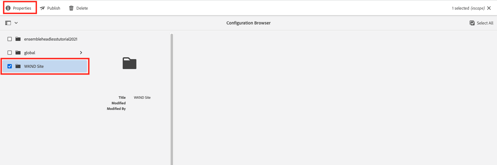

    On the Configuration Properties page, you should see that the **GraphQL Persistent Queries** permission is enabled.

    

## Import Postman Collection

To make it easier to follow the tutorial a Postman collection is provided. Alternatively command-line tools like `curl` could be used.

1. Download and install [Postman](https://www.postman.com/)
1. Download the [AdvancedConceptsofAEMHeadless.postman_collection.json](/help/headless-tutorial/graphql/advanced-graphql/assets/tutorial-files/AdvancedConceptsofAEMHeadless.postman_collection.json)
1. Open the Postman app
1. Select **File** > **Import** > **Upload File** and choose `AdvancedConceptsofAEMHeadless.postman_collection.json` to import the collection.

    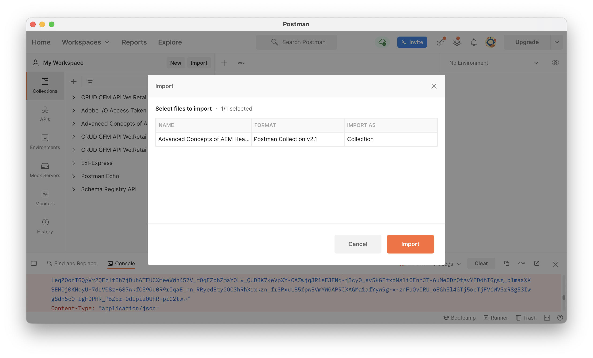

### Authentication

Authentication is required to send queries against an AEM author instance. This tutorial is based on the AEM as a Cloud Service environment and uses the Bearer authentication with a development token. To configure authentication for your Postman collection, use the following steps:

1. To get a development token, navigate to your Cloud Developer Console, open the **Integrations** tab, and select **Get Local Development Token**.

    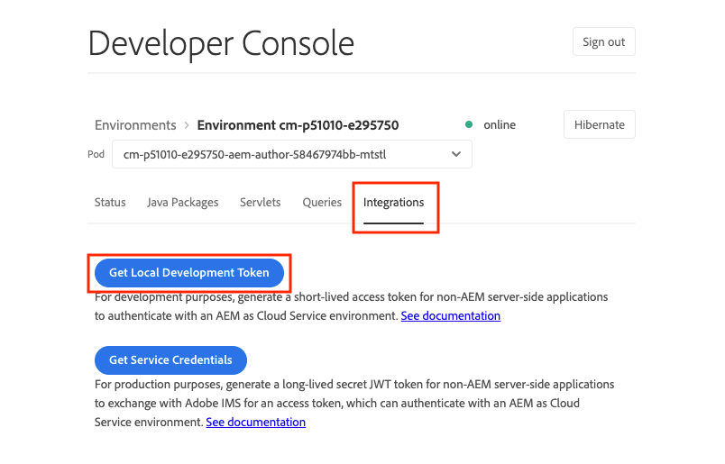

1. In your Postman collection, navigate to the **Authentication** tab and select **Bearer Token** in the **Type** dropdown menu.

    

1. Enter the development token into the **Token** field. You can pass the token through a variable, as explained in the next section.

    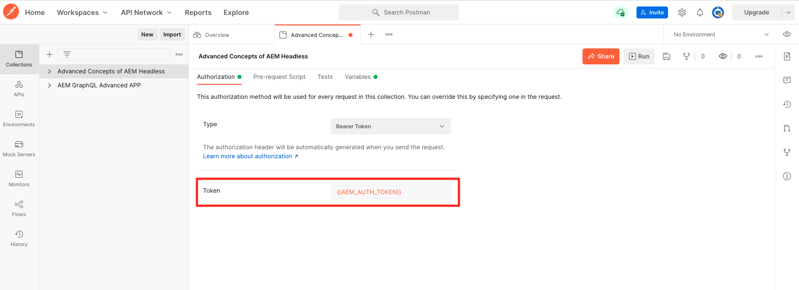

### Variables {#variables}
    
You can pass values like authentication tokens and URI components through variables within your Postman collection to simplify the process. For this tutorial, use the following steps to create variables:

1. Navigate to the **Variables** tab within your Postman collection and create the following variables:

    | Variable | Value |
    | --- | --- |
    | `AEM_SCHEME` | `https` |
    | `AEM_AUTH_TOKEN` | (Your development token) |
    | `AEM_HOST` | (The host name of your AEM instance)  |
    | `AEM_PROJECT` | `wknd` |

1. You can also add variables for each persisted query that you want to create. For this tutorial, persist the following queries: `getAdventureAdministratorDetailsByAdministratorName`, `getTeamByAdventurePath`, `getLocationDetailsByLocationPath`, `getTeamMembersByAdventurePath`, `getLocationPathByAdventurePath`, and `getTeamLocationByLocationPath`. 

    Create the following variables:

    * `AEM_GET_ADVENTURE_ADMINISTRATOR_DETAILS_BY_ADMINISTRATOR_NAME` : `adventure-administrator-details-by-administrator-name`
    * `AEM_GET_ADVENTURE_ADMINISTRATOR_DETAILS_BY_ADMINISTRATOR_NAME` : `adventure-administrator-details-by-administrator-name`
    * `AEM_GET_TEAM_LOCATION_BY_LOCATION_PATH` : `team-location-by-location-path`
    * `AEM_GET_TEAM_MEMBERS_BY_ADVENTURE_PATH` : `team-members-by-adventure-path`
    * `AEM_GET_LOCATION_DETAILS_BY_LOCATION_PATH` : `location-details-by-location-path`
    * `AEM_GET_LOCATION_PATH_BY_ADVENTURE_PATH` : `location-path-by-adventure-path`
    * `AEM_GET_TEAM_BY_ADVENTURE_PATH` : `team-by-adventure-path`

    Once complete, the **Variables** tab in your Postman collection should look similar to the following:

    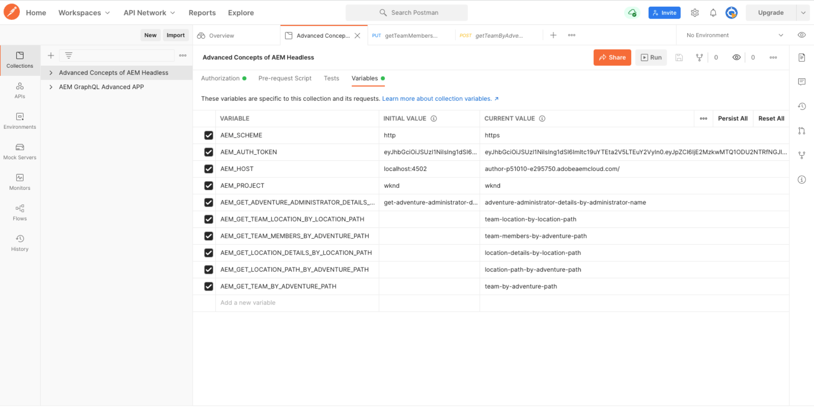

## Persist GraphQL queries with parameters

In the [AEM Headless and GraphQL video series](../video-series/graphql-persisted-queries.md), you learned how to create persisted GraphQL queries. In this section, let's persist and execute a GraphQL query with a parameter.

### Create a persisted query {#create-persisted-query}

For this example, let's persist the `getAdventureAdministratorDetailsByAdministratorName` query that you created in the previous chapter.

>[!NOTE]
>
>The HTTP PUT method is used to create a persisted query, and HTTP POST method is used to update it.

1. First, add a new request within your Postman collection. Select the HTTP PUT method to create a persisted query and use the following request URI:
    
    ```plaintext
    {{AEM_SCHEME}}://{{AEM_HOST}}/graphql/persist.json/{{AEM_PROJECT}}/{{AEM_GET_ADVENTURE_ADMINISTRATOR_DETAILS_BY_ADMINISTRATOR_NAME}}
    ```
    
    Note that the URI uses the `/graphql/persist.json` action.

1. Paste the `getAdventureAdministratorDetailsByAdministratorName` GraphQL query into the request body. Note that it is the standard GraphQL query with a variable `name` that requires a `String`.

    

1. Execute the request. You should receive the following response:

    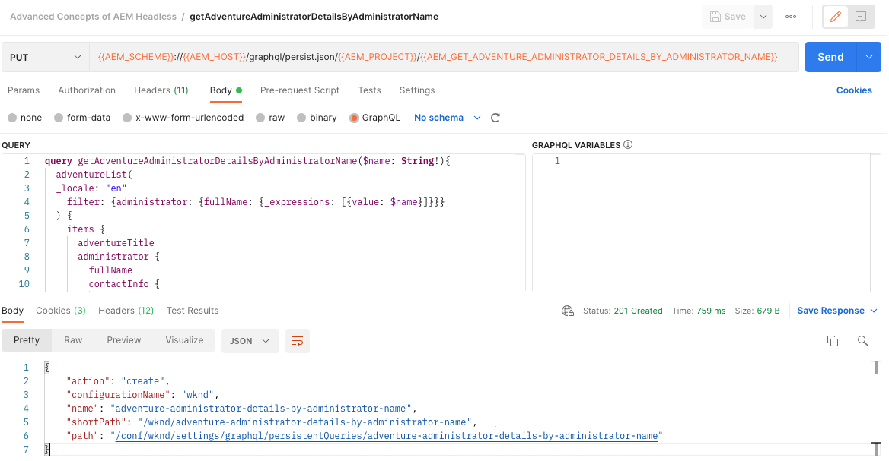

    You have successfully created a persisted query named `adventure-administrator-details-by-administrator-name`.

### Execute a persisted query

Let's execute the persisted query that you have created.

1. Create a new GET request within your Postman collection, using the following request URI:

    ```plaintext
    {{AEM_SCHEME}}://{{AEM_HOST}}/graphql/execute.json/{{AEM_PROJECT}}/{{AEM_GET_ADVENTURE_ADMINISTRATOR_DETAILS_BY_ADMINISTRATOR_NAME}}
    ```
    
    Note that the request URI now includes the `execute.json` action.

    If you execute this request as is, an error is thrown because the query requires a variable `name`. You must pass this variable as a parameter into the request URI.

    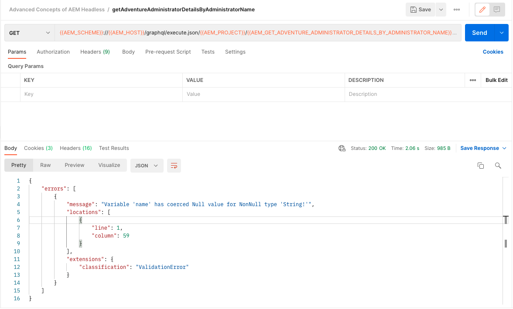

1. Next, retrieve an Administrator with the name Jacob Wester. Parameters for the persisted GraphQL queries must be separated from the previous URI components by `;` and encoded before passing them into the request URI. In your browser console execute the following command:

    ```js
    encodeURIComponent(";name=Jacob Wester")
    ```

    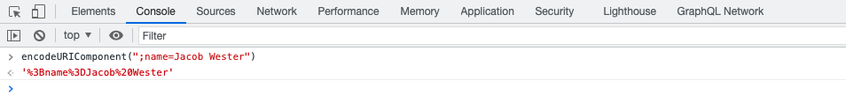

1. Copy the result from the console and paste it at the end of the request URI in Postman. You should have the following request URI:

    ```plaintext
    {{AEM_SCHEME}}://{{AEM_HOST}}/graphql/execute.json/{{AEM_PROJECT}}/{{AEM_GET_ADVENTURE_ADMINISTRATOR_DETAILS_BY_ADMINISTRATOR_NAME}}%3Bname%3DJacob%20Wester
    ```

1. Execute the GET request. You should receive the following response:

    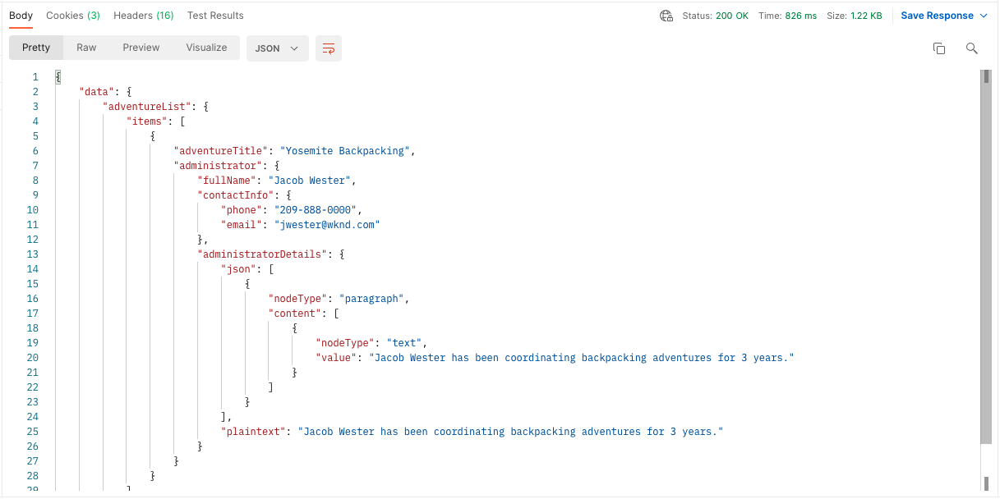

You have now created and executed a persisted GraphQL query with a parameter.

You can follow the steps outlined above to persist the rest of the GraphQL queries from the [text file](assets/graphql-persisted-queries/advanced-concepts-aem-headless-graphql-queries.txt) using the variables you have created at the [beginning of this chapter](#variables). 

The full [Postman collection](/help/headless-tutorial/graphql/advanced-graphql/assets/tutorial-files/AdvancedConceptsofAEMHeadless.postman_collection.json) is also available to download and import.

## Update persisted queries

While persisted queries are created using a PUT request, you must use a POST request to update an existing persisted query. For this tutorial, let's update the persisted query named `adventure-administrator-details-by-administrator-name` that you created in the [previous section](#create-persisted-query).

1. Duplicate the tab that you used for the PUT request in the previous section. In the copy, change the HTTP method to POST.

1. In the GraphQL query, let's remove the `plaintext` format from the `administratorDetails` field.

    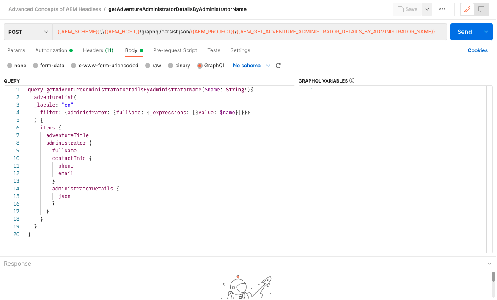

1. Execute the request. You should get the following response:

    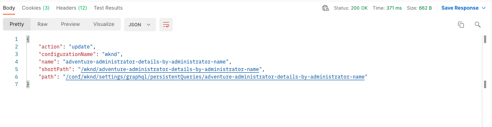

You have now updated the `adventure-administrator-details-by-administrator-name` persisted query. It is important to always update your GraphQL queries in AEM if changes are made.

## Pass cache-control parameters in persisted queries {#cache-control-all-adventures}

The AEM GraphQL API allows you to add cache-control parameters to your queries in order to improve performance.

Use the `getAllAdventureDetails` query created in the previous chapter. The query response is large and it is useful to control its `age` in the cache.

This persisted query is used later to update the [client application](/help/headless-tutorial/graphql/advanced-graphql/client-application-integration.md).

1. In your Postman collection, create a new variable:

    ```plaintext
    AEM_GET_ALL_AT_ONCE: all-adventure-details
    ```

1. Create a new PUT request to persist this query. 

1. In the **Body** tab of your request, select the **raw** data type.

    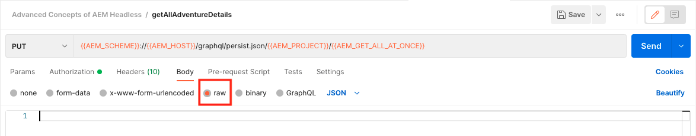

1. To use cache control in a query, you need to wrap the query in a JSON structure and add cache-control parameters at the end. Copy and paste the following query into the body of your request:

    ```json
    {
    "query": " query getAllAdventureDetails($fragmentPath: String!) { adventureByPath(_path: $fragmentPath){ item { _path adventureTitle adventureActivity adventureType adventurePrice adventureTripLength adventureGroupSize adventureDifficulty adventurePrice adventurePrimaryImage{ ...on ImageRef{ _path mimeType width height } } adventureDescription { html json } adventureItinerary { html json } location { _path name description { html json } contactInfo{ phone email } locationImage{ ...on ImageRef{ _path } } weatherBySeason address{ streetAddress city state zipCode country } } instructorTeam { _metadata{ stringMetadata{ name value } } teamFoundingDate description { json } teamMembers { fullName contactInfo { phone email } profilePicture{ ...on ImageRef { _path } } instructorExperienceLevel skills biography { html } } } administrator { fullName contactInfo { phone email } biography { html } } } _references { ...on ImageRef { _path mimeType } ...on LocationModel { _path __typename } } } }", 
    "cache-control": { "max-age": 300 }
    }
    ```

    >[!CAUTION]
    >
    >The wrapped query must not contain line breaks.

    Your request should now look like the following:

    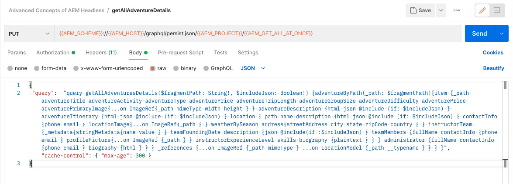

1. Execute the request. You should get the response indicating that the `all-adventure-details` persisted query was successfully created.

    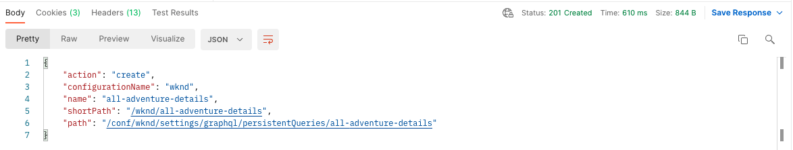

## Congratulations!

Congratulations! You have now learned how to persist GraphQL queries with parameters, update persisted queries, and use cache-control parameters with persisted queries.

## Next steps

In the [next chapter](/help/headless-tutorial/graphql/advanced-graphql/client-application-integration.md), you will implement the requests for persisted queries in the WKND app.

While it is optional for this tutorial, make sure to publish all content in real-world production situations. For a review of Author and Publish environments in AEM, refer to the [AEM Headless and GraphQL video series](../video-series/author-publish-architecture.md).