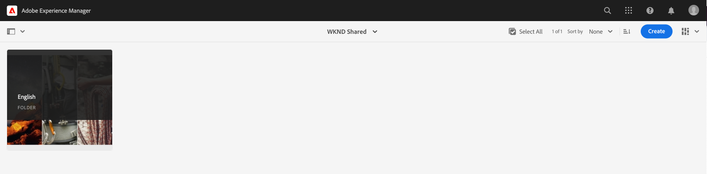

# Advanced Concepts of AEM Headless

{{aem-headless-trials-promo}}

This end-to-end tutorial continues the [basic tutorial](../multi-step/overview.md) that covered the fundamentals of Adobe Experience Manager (AEM) Headless and GraphQL. The advanced tutorial illustrates in-depth aspects of working with Content Fragment Models, Content Fragments, and the AEM GraphQL persisted queries, including using the GraphQL persisted queries in a client application.

## Prerequisites

Complete the [quick setup for AEM as a Cloud Service](../quick-setup/cloud-service.md) to configure your AEM as a Cloud Service environment. 

It is highly recommended that you complete the previous [basic tutorial](../multi-step/overview.md) and [video series](../video-series/modeling-basics.md) tutorials before proceeding with this advanced tutorial. Although you can complete the tutorial using a local AEM environment, this tutorial only covers the workflow for AEM as a Cloud Service.

>[!CAUTION]
>
>If you do not have access to AEM as a Cloud Service environment, you can complete [AEM Headless quick setup using the local SDK](https://experienceleague.adobe.com/docs/experience-manager-learn/getting-started-with-aem-headless/graphql/quick-setup/local-sdk.html). However, it is important to note that some product UI pages such as Content Fragments navigation is different.

## Objectives

This tutorial covers the following topics:

* Create Content Fragment Models using validation rules and more advanced data types such as Tab Placeholders, nested fragment references, JSON objects, and Date & Time data types.
* Author Content Fragments while working with nested content and fragment references, and configure folder policies for content fragment-authoring governance.
* Explore AEM GraphQL API capabilities using GraphQL queries with variables and directives.
* Persist GraphQL queries with parameters in AEM and learn how to use cache-control parameters with persisted queries.
* Integrate requests for persisted queries into the sample WKND GraphQL React app using the AEM Headless JavaScript SDK.

## Advanced concepts of AEM Headless overview

The following video provides a high-level overview of the concepts that are covered in this tutorial. The tutorial includes defining Content Fragment Models with more advanced data types, nesting Content Fragments, and persisting GraphQL queries in AEM.

>[!VIDEO](https://video.tv.adobe.com/v/340035?quality=12&learn=on)

>[!CAUTION]
>
>This video (at 2:25) mentions about installing the GraphiQL query editor via Package Manager to explore GraphQL queries. However in newer versions of AEM as Cloud Service a built-in **GraphiQL Explorer** is provided, thus package installation is not required. See [Using the GraphiQL IDE](https://experienceleague.adobe.com/docs/experience-manager-cloud-service/content/headless/graphql-api/graphiql-ide.html) for more information.

## Project setup

The WKND Site project has all necessary configurations, so you can start the tutorial right after you complete the [quick setup](../quick-setup/cloud-service.md). This section only highlights some important steps that you can use when creating your own AEM Headless project.

### Review existing configuration

The first step to starting any new project in AEM is creating its configuration, as a workspace and to create GraphQL API endpoints. To review or create a configuration, navigate to **Tools** > **General** > **Configuration Browser**.

Observe that the `WKND Shared` site configuration has already been created for the tutorial. To create a configuration for your own project, select **Create** in the top-right corner and complete the form in the Create Configuration modal that appears.

### Review GraphQL API endpoints

Next, you must configure API endpoints to send GraphQL queries to. To review existing endpoints or create one, navigate to **Tools** > **General** > **GraphQL**.

Observe that the `WKND Shared Endpoint` has already been created. To create an endpoint for your project, select **Create** in the top-right corner and follow the workflow.

>[!NOTE]
>
> After saving the endpoint, you will see a modal about visiting the Security Console, which allows you to adjust security settings if you wish to configure access to the endpoint. Security permissions themselves are outside of the scope of this tutorial, however. For more information, refer to the [AEM documentation](https://experienceleague.adobe.com/docs/experience-manager-65/administering/security/security.html).

### Review WKND content structure and language root folder

A well-defined content structure is key to the success of AEM headless implementation. It is helpful for scalability, usability, and permission management of your content.

A language root folder is a folder with an ISO language code as its name such as EN or FR. The AEM translation management system uses these folders to define the primary language of your content and languages for content translation.

Go to **Navigation** > **Assets** > **Files**.

Navigate into the **WKND Shared** folder. Observe the folder with the title "English" and the name "EN". This folder is the language root folder for the WKND Site project.

For your own project, create a language root folder inside your configuration. See the section on [creating folders](/help/headless-tutorial/graphql/advanced-graphql/author-content-fragments.md#create-folders) for more details.

### Assign a configuration to the nested folder

Finally, you must assign your project's configuration to the language root folder. This assignment enables the creation of Content Fragments based on Content Fragment Models defined in your project's configuration.

To assign the language root folder to the configuration, select the folder, then select **Properties** in the top navigation bar.

Next, navigate to the **Cloud Services** tab and select the folder icon in the **Cloud Configuration** field.

In the modal that appears, select your previously created configuration to assign the language root folder to it.

### Best practices

The following are best practices when creating your own project in AEM:

* The folder hierarchy should be modeled with localization and translation in mind. In other words, language folders should be nested within configuration folders, which allows for easy translation of content within those configuration folders.
* The folder hierarchy should be kept flat and straightforward. Avoid moving or renaming folders and fragments later on, especially after publishing for live usage, as it changes paths which can affect fragment references and GraphQL queries.

## Starter and Solution Packages

Two AEM **packages** are available and can be installed via [Package Manager](/help/headless-tutorial/graphql/advanced-graphql/author-content-fragments.md#sample-content)

* [Advanced-GraphQL-Tutorial-Starter-Package-1.1.zip](/help/headless-tutorial/graphql/advanced-graphql/assets/tutorial-files/Advanced-GraphQL-Tutorial-Starter-Package-1.1.zip) is used later in the tutorial and contains sample images and folders.
* [Advanced-GraphQL-Tutorial-Solution-Package-1.2.zip](/help/headless-tutorial/graphql/advanced-graphql/assets/tutorial-files/Advanced-GraphQL-Tutorial-Solution-Package-1.2.zip) contains the finished solution for Chapters 1-4 including new Content Fragment Models, Content Fragments, and Persisted GraphQL queries. Useful for those who want to skip right into the [Client Application Integration](/help/headless-tutorial/graphql/advanced-graphql/client-application-integration.md) chapter.

The [React App - Advanced Tutorial - WKND Adventures](https://github.com/adobe/aem-guides-wknd-graphql/blob/main/advanced-tutorial/README.md) project is available to review and explore the sample application. This sample application retrieves the content from AEM by invoking the persisted GraphQL queries and renders it in an immersive experience.

## Getting started

To get started with this advanced tutorial, follow these steps:

1. Set up a development environment using [AEM as a Cloud Service](../quick-setup/cloud-service.md).
1. Start the tutorial chapter on [Create Content Fragment Models](/help/headless-tutorial/graphql/advanced-graphql/create-content-fragment-models.md).
