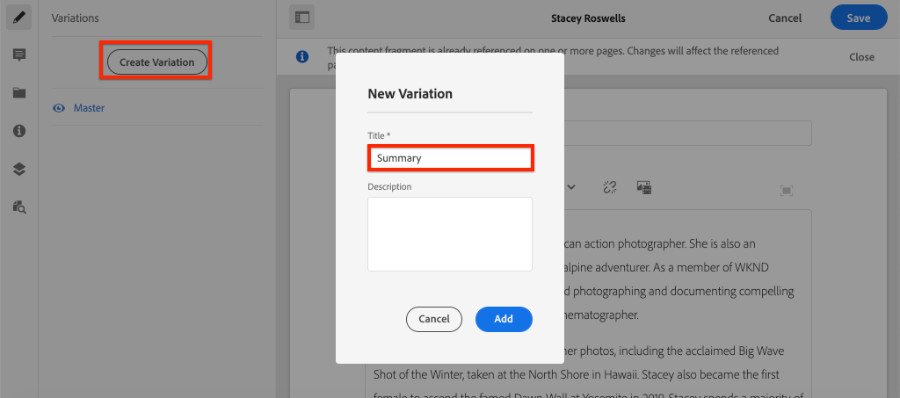
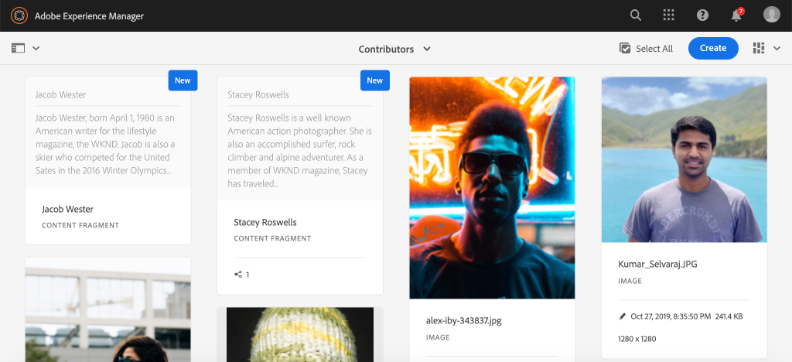

# Authoring Content Fragment {#authoring-content-fragments}

>[!CAUTION]
>
> The AEM GraphQL API for Content Fragments Delivery is available on request.
> Please reach out to Adobe Support to enable the API for your AEM as a Cloud Service program.

In this chapter you will create and edit a new Content Fragment based on the [newly defined Contributor Content Fragment Model](./content-fragment-models.md). You will also learn how to create variations of Content Fragments.

## Prerequisites {#prerequisites}

This is a multi-part tutorial and it is assumed that the steps outlined in the [Defining Content Fragment Models](./content-fragment-models.md) have been completed.

## Objectives {#objectives}

* Author a Content Fragment based on a Content Fragment Model
* Create a Content Fragment variation

## Content Fragment Authoring Overview {#overview}

>[!VIDEO](https://video.tv.adobe.com/v/22451/?quality=12&learn=on)

The above video gives a high level overview of authoring Content Fragments.

## Create a Content Fragment {#create-content-fragment}

In the previous chapter, [Defining Content Fragment Models](./content-fragment-models.md), a **Contributor** model was created. Author a new Content Fragment using this model.

1. From the **AEM Start** menu navigate to **Assets** > **Files**.
1. Click through the folders to navigate to **WKND Site** > **English** > **Contributors**. This folder contains a list of head shots for Contributors of the WKND brand.

1. Click **Create** in the upper right and select **Content Fragment**:

    

1. Select the **Contributor** model and click **Next**.

    

    This is the same **Contributor** model that was created in the previous chapter.

1. Enter **Stacey Roswells** for the title and click **Create**.
1. Click **Open** in the **Success** dialog to open the newly created fragment.

    

    Observe that the fields defined by the model are now available to author this instance of the Content Fragment.

1. For **Full Name** enter: **Stacey Roswells**.
1. For **Biography** enter a brief biography. Need some inspiration? Feel free to re-use this [text file](assets/author-content-fragments/stacey-roswells-bio.txt).
1. For **Picture Reference** click the **folder** icon and browse to **WKND Site** > **English** > **Contributors** > **stacey-roswells.jpg**. This will evaluate to the path: `/content/dam/wknd/en/contributors/stacey-roswells.jpg`.
1. For **Occupation** choose **Photographer**.

    

1. Click **Save** to save the changes.

## Create a Content Fragment Variation

All Content Fragments start with a **Master** variation. The **Master** variation can be considered the *default* content of the fragment and is automatically used when the content is exposed via the GraphQL APIs. It is also possible to create variations of a Content Fragment. This feature offers additional flexibility for designing an implementation.

Variations could be used to target specific channels. For example a **mobile** variation could be created that contains a smaller amount of text or references a channel-specific image. How variations are used is really up to the implementation. Like any feature, careful planning should be done before using.

Next, create a new variation to get an idea of the capabilities available.

1. Re-open the **Stacey Roswells** Content Fragment.
1. In the left side-rail click **Create Variation**.
1. In the **New Variation** modal enter a Title of **Summary**.

    

1. Click into the **Biography** multi-line field and click the **Expand** button to enter the full-screen view for the multi-line field.

    

1. Click **Summarize Text** in the upper right-hand menu.

1. Enter a **Target** of **50** words and click **Start**.

    

    This will open a summarization preview. AEM's machine language processor will attempt to summarize the text based on the target word count. You can also select different sentences to remove.

1. Click **Summarize** when you are happy with the summarization. Click into the multi-line text field and toggle the **Expand** button to return to the main view.

1. Click **Save** to save the changes.

## Create an additional Content Fragment

Repeat the steps outlined in [Create a Content Fragment](#create-content-fragment) to create an additional **Contributor**. This will be used in the next chapter as an example of how to query multiple fragments.

1. In the **Contributors** folder click **Create** in the upper right and select **Content Fragment**:
1. Select the **Contributor** model and click **Next**.
1. Enter **Jacob Wester** for the title and click **Create**.
1. Click **Open** in the **Success** dialog to open the newly created fragment.
1. For **Full Name** enter: **Jacob Wester**.
1. For **Biography** enter a brief biography. Need some inspiration? Feel free to re-use this [text file](assets/author-content-fragments/jacob-wester.txt).
1. For **Picture Reference** click the **folder** icon and browse to **WKND Site** > **English** > **Contributors** > **jacob_wester.jpg**. This will evaluate to the path: `/content/dam/wknd/en/contributors/jacob_wester.jpg`.
1. For **Occupation** choose **Writer**.
1. Click **Save** to save the changes. There is no need to create a variation, unless you want to!

    

    You should now have two **Contributors** fragments.

## Congratulations! {#congratulations}

Congratulations, you just authored multiple Content Fragments and created a variation.

## Next Steps {#next-steps}

In the next chapter, [Explore GraphQL APIs](explore-graphql-api.md), you will explore AEM's GraphQL APIs using the built-in GrapiQL tool. Learn how AEM automatically generates a GraphQL schema based on a Content Fragment model. You will experiment constructing basic queries using the GraphQL syntax.