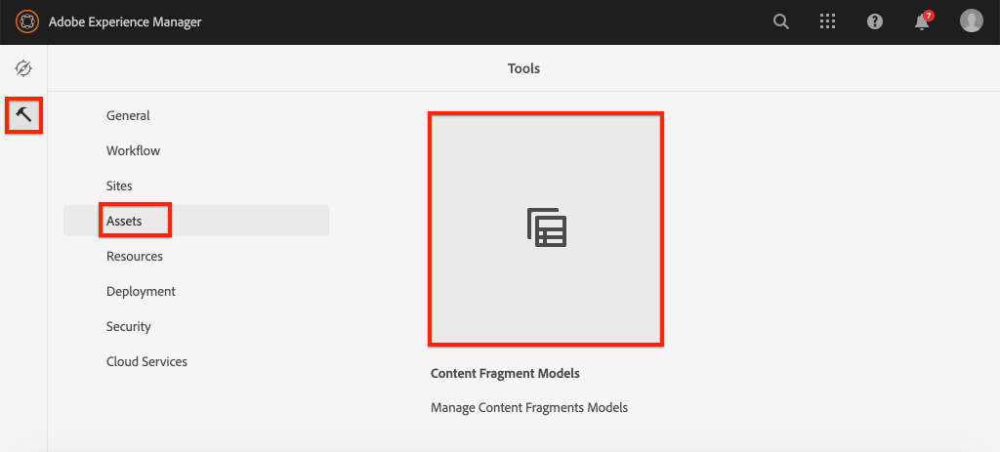
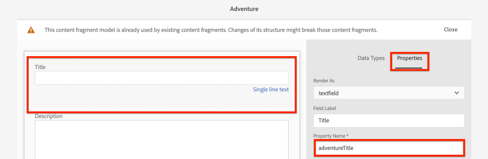
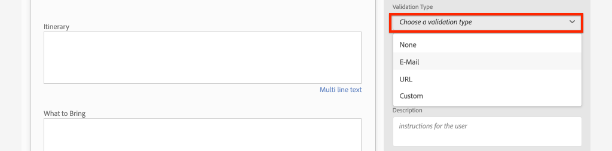
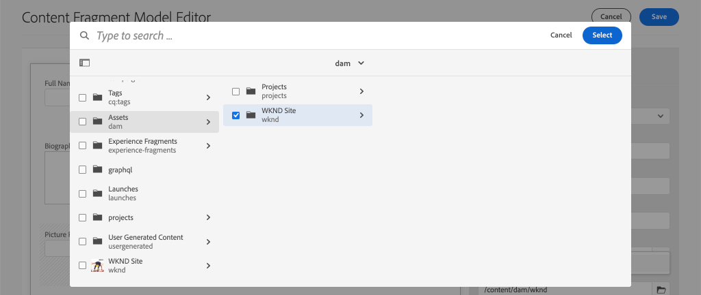
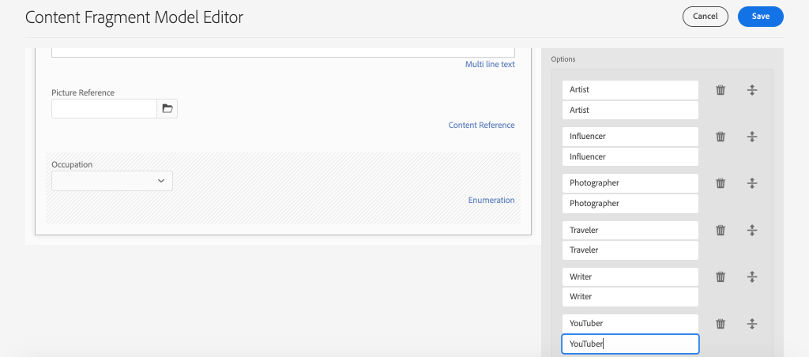

# Defining Content Fragment Models {#content-fragment-models}

>[!CAUTION]
>
> The AEM GraphQL API for Content Fragment Delivery will be released in early 2021.
> The related documentation is available for preview purposes.

In this chapter learn how to model content and build a schema with **Content Fragment Models**. You will review existing models and create a new model. You will also learn about the different data types that can be used to define a schema as part of the model.

In this chapter you will create a new model for a **Contributor**, which is the data model for those users that author magazine and adventure content as part of the WKND brand.

## Prerequisites {#prerequisites}

This is a multi-part tutorial and it is assumed that the steps outlined in the [Quick Setup](./setup.md) have been completed.

## Objectives {#objectives}

* Create a new Content Fragment Model.
* Identify available data types and validation options for building models.
* Understand how the Content Fragment Model defines **both** the data schema and the authoring template for a Content Fragment.

## Content Fragment Model Overview {#overview}

>[!VIDEO](https://video.tv.adobe.com/v/22452/?quality=12&learn=on)

The above video gives a high level overview of working with Content Fragment Models.

## Inspect the Adventure Content Fragment Model

In the previous chapter several Adventures Content Fragments were edited and displayed on an external application. Let's inspect the Adventure Content Fragment Model to understand the underlying data schema of these fragments.

1. From the **AEM Start** menu navigate to **Tools** > **Assets** > **Content Fragment Models**.

    

1. Navigate into the **WKND Site** folder and hover over the **Adventure** Content Fragment Model and click the **Edit** icon (pencil) to open the model.

    

1. This opens the **Content Fragment Model Editor**. Observe that the fields define the Adventure model include different **Data Types** like **Single line text**, **Multi line text**, **Enumeration**, and **Content Reference**.

1. The right-hand column of the editor lists the  available **Data Types** which define the form fields used for authoring Content Fragments.

1. Select the **Title** field in the main panel. In the right-hand column click the **Properties** tab:

    

    Observe the **Property Name** field is set to `adventureTitle`. This defines the name of the property that is persisted to AEM. The **Property Name** also defines the **key** name for this property as part of the data schema. This **key** will be used when the Content Fragment data is exposed via GraphQL APIs.

    >[!CAUTION]
    >
    > Modifying the **Property Name** of a field **after** Content Fragments are derived from the Model, has downstream effects. Field values in existing fragments will no longer be referenced and the data schema exposed by GraphQL will change, impacting existing applications.

1. Scroll down in the **Properties** tab and view the **Validation Type** dropdown.

    

    Out of the box form validations are available for **E-mail** and **URL**. It is also possible to define a **Custom** validation using a regular expression.

1. Click **Cancel** to close the Content Fragment Model Editor.

## Create a Contributor Model

Next, create a new model for a **Contributor**, which is the data model for those users that author magazine and adventure content as part of the WKND brand.

1. Click **Create** in the upper right corner to bring up the **Create Model** wizard.
1. For **Model Title** enter: **Contributor** and click **Create**

    

    Click **Open** to open the newly created model.

1. Drag and Drop a **Single line text** element on to the main panel. Enter the following properties on the **Properties** tab:

    * **Field Label**: **Full Name**
    * **Property Name**: `fullName`
    * Check **Required**

    

1. Click the **Data Types** tab and drag and drop a **Multi line text** field beneath the **Full Name** field. Enter the following properties:

    * **Field Label**: **Biography**
    * **Property Name**: `biographyText`
    * **Default Type**: **Rich Text**

1. Click the **Data Types** tab and drag and drop a **Content Reference** field. Enter the following properties:

    * **Field Label**: **Picture Reference**
    * **Property Name**: `pictureReference`
    * **Root Path**: `/content/dam/wknd`

    When configuring the **Root Path** you can click the **folder** icon to bring up a modal to select the path. This will restrict which folders authors can use to populate the path.

    

1. Add a validation to the **Picture Reference** so that only content types of **Images** can be used to populate the field.

    

1. Click the **Data Types** tab and drag and drop an **Enumeration**  data type beneath the **Picture Reference** field. Enter the following properties:

    * **Field Label**: **Occupation**
    * **Property Name**: `occupation`

1. Add several **Options** using the **Add a option** button. Use the same value for **Option Label** and **Option Value**:

    **Artist**, **Influencer**, **Photographer**, **Traveler**, **Writer**, **YouTuber**

    

1. The final **Contributor** model should look like the following:

    

1. Click **Save** to save the changes.

## Enable the Contributor Model

Content Fragment Models default to a **Draft** state when first created. This allows users to refine the Content Fragment Model **before** allowing authors to use it. Recall that modifying the **Property Name** of a field in the model changes the underlying data schema and can have significant downstream effects on existing fragments and external applications. It is recommended to carefully plan the naming convention used for the **Property Name** of fields.

1. Observe that the **Contributor** model is currently in a **Draft** state.

1. Enable the **Contributor Model** by hovering over the card and clicking the **Enable** icon:

    

## Congratulations! {#congratulations}

Congratulations, you just created your first Content Fragment Model!

## Next Steps {#next-steps}

In the next chapter, [Authoring Content Fragment Models](author-content-fragments.md), you will create and edit a new Content Fragment based on a Content Fragment Model. You will also learn how to create variations of Content Fragments.