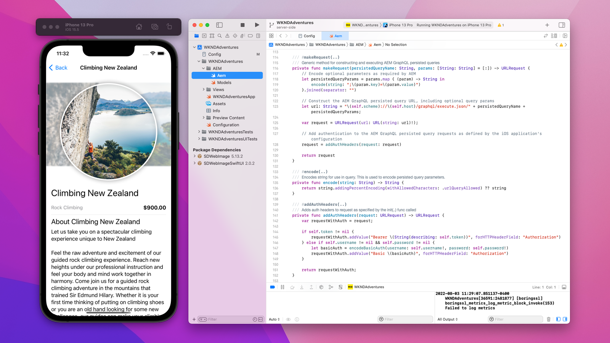
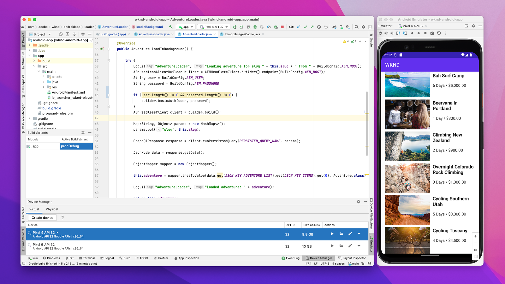

# AEM Headless mobile deployments

AEM Headless mobile deployments are native mobile apps for iOS, Android&trade;, etc. that consume and interact with content in AEM in a headless manner.

Mobile deployments require minimal configuration, as HTTP connections to AEM Headless APIs are not initiated in the context of a browser.

## Deployment configurations

The following deployment configuration must be in-place for mobile app deployments.

| Mobile app connects to                             | AEM Author | AEM Publish | AEM Preview |
|---------------------------------------------------:|:----------:|:-----------:|:-----------:|
| [Dispatcher filters](./configurations/dispatcher-filters.md)      | &#10008;   | &#10004;    | &#10004;    |
| Cross-origin resource sharing (CORS)              | &#10008;   | &#10008;    | &#10008;    |
| [AEM hosts](./configurations/aem-hosts.md)                         | &#10004;   | &#10004;    | &#10004;    |

## Example mobile apps

Adobe provides example iOS and Android&trade; mobile apps.

    <!-- iOS app -->
    

       

           

               <figure class="image is-16by9">
                   
               </figure>
           

           

               

                   
<a href="../example-apps/ios-swiftui-app.md" title="iOS app">iOS app</a>

                   
An example iOS app, written in SwiftUI, that consumes content from AEM Headless GraphQL APIs.

                   <a href="../example-apps/ios-swiftui-app.md" class="spectrum-Button spectrum-Button--outline spectrum-Button--primary spectrum-Button--sizeM">
                       View example
                   </a>
               

           

       

    

    <!-- Android app -->
    

       

           

               <figure class="image is-16by9">
                   
               </figure>
           

           

               

                   
<a href="../example-apps/android-app.md" title="Android&trade; app">Android&trade; app</a>

                   
An example Java&trade; Android&trade; app that consumes content from AEM Headless GraphQL APIs.

                   <a href="../example-apps/android-app.md" class="spectrum-Button spectrum-Button--outline spectrum-Button--primary spectrum-Button--sizeM">
                       View example
                   </a>
               

           

       

    

