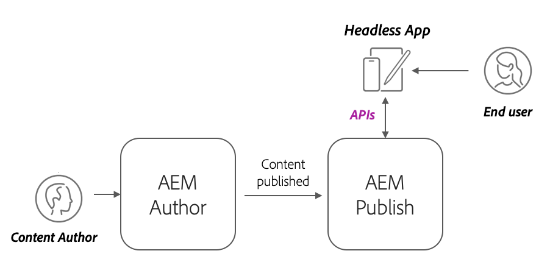
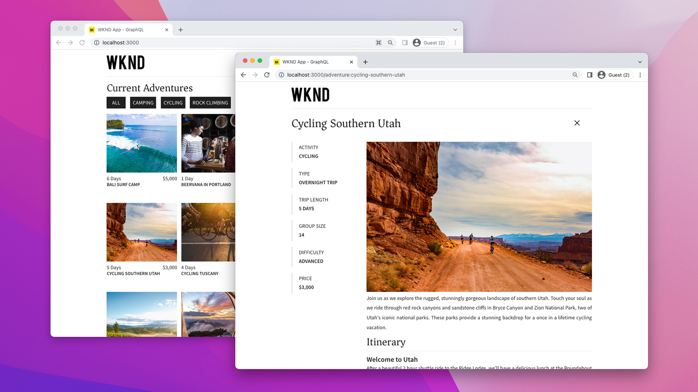

# AEM Headless deployments

AEM Headless client deployments take many forms; AEM-hosted SPA, external SPA, web site, mobile app, or even server-to-server process. 

Depending on the client and how it is deployed, AEM Headless deployments have different considerations. 

## AEM service architecture

Before exploring deployment considerations, it's imperative to understand AEM's logical architecture, and the separation and roles of AEM as a Cloud Service's service tiers. AEM as a Cloud Service is comprised of two logical services:

+ __AEM Author__ is the service where teams create, collaborate, and publish Content Fragments (and other assets).
+ __AEM Publish__ is the service that were published Content Fragments (and other assets) are replicated for general consumption.
+ __AEM Preview__ is the service that mimics AEM Publish in behavior, but has content published to it for preview or review purposes. AEM Preview is intended for internal audiences, and not for the general delivery of content. The use of AEM Preview is optional, based on the desired workflow.

Typical AEM as a Cloud Service headless deployment architecture_

AEM Headless clients operating in a production capacity typically interact with AEM Publish, which contains the approved, published content. Clients interacting with AEM Author need to take special care, as AEM Author is secure by default, requiring authorization for all requests, and may also contain work in progress, or unapproved content.

## Headless client deployments

    <!-- Single-page App (SPA) -->
    

       

           

               <figure class="image is-16by9">
                   
               </figure>
           

           

               

                   
<a href="./spa.md" title="Single-page App (SPA)">Single-page app (SPA)</a>

                   
Learn about deployment considerations for single-page apps (SPA).

                   <a href="./spa.md" class="spectrum-Button spectrum-Button--outline spectrum-Button--primary spectrum-Button--sizeM">
                       Learn
                   </a>
               

           

       

    

<!-- Web component/JS -->

   

       

           <figure class="image is-16by9">
               
           </figure>
       

       

           

               
<a href="./web-component.md" title="Web component/JS">Web component/JS</a>

               
Learn about deployment considerations for web components and browser-based JavaScript headless consumers.

               <a href="./web-component.md" class="spectrum-Button spectrum-Button--outline spectrum-Button--primary spectrum-Button--sizeM">
                   Learn
               </a>
           

       

   

<!-- Mobile apps -->

   

       

           <figure class="image is-16by9">
               
           </figure>
       

       

           

               
<a href="./mobile.md" title="Mobile apps">Mobile app</a>

               
Learn about deployment considerations for mobile apps.

               <a href="./mobile.md" class="spectrum-Button spectrum-Button--outline spectrum-Button--primary spectrum-Button--sizeM">
                   Learn
               </a>
           

       

   

<!-- Server-to-server apps -->

   

       

           <figure class="image is-16by9">
               
           </figure>
       

       

           

               
<a href="./server-to-server.md" title="Server-to-server apps">Server-to-server app</a>

               
Learn about deployment considerations for server-to-server apps

               <a href="./server-to-server.md" class="spectrum-Button spectrum-Button--outline spectrum-Button--primary spectrum-Button--sizeM">
                   Learn
               </a>
           

       

   

