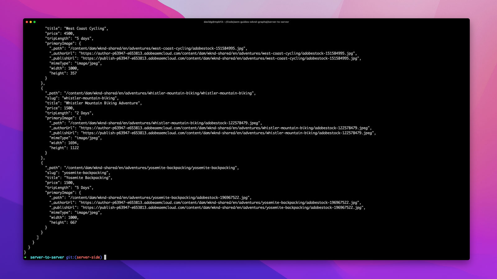

# AEM Headless server-to-server deployments

AEM Headless server-to-server deployments involve server-side applications or processes that consume and interact with content in AEM in a headless manner.

Server-to-server deployments require minimal configuration, as HTTP connections to AEM Headless APIs are not initiated in the context of a browser.

## Deployment configurations

The following deployment configuration must be in-place for server-to-server app deployments.

| Server-to-server app connects to →                             | AEM Author | AEM Publish | AEM Preview |
|---------------------------------------------------------------:|:----------:|:-----------:|:-----------:|
| [Dispatcher filters](./configurations/dispatcher-filters.md)   | &#10008;   | &#10004;    | &#10004;    |
| Cross-origin resource sharing (CORS)                           | &#10008;   | &#10008;    | &#10008;    |
| [AEM hosts](./configurations/aem-hosts.md)                     | &#10004;   | &#10004;    | &#10004;    |

## Authorization requirements

Authorized requests to AEM GraphQL APIs they typically occur in the context of server-to-server apps, since other app types, such as [single-page apps](./spa.md), [mobile](./mobile.md), or [Web Components](./web-component.md), typically do use authorization as it is difficult to secure the credentials . 
 
When authorizing requests to AEM as a Cloud Service, use [service credentials-based token authentication](https://experienceleague.adobe.com/docs/experience-manager-cloud-service/content/implementing/developing/generating-access-tokens-for-server-side-apis.html). To learn more about authenticating requests to AEM as a Cloud Service, review the [token-based authentication tutorial](https://experienceleague.adobe.com/docs/experience-manager-learn/getting-started-with-aem-headless/authentication/overview.html). The tutorial explores token-based authentication using [AEM Assets HTTP APIs](https://experienceleague.adobe.com/docs/experience-manager-cloud-service/content/assets/admin/mac-api-assets.html) but the same concepts and approaches are applicable to apps interacting with AEM Headless GraphQL APIs.

## Example server-to-server app

Adobe provides an example server-to-server app coded in Node.js.

    <!-- Server-to-server app -->
    

       

           

               <figure class="image is-16by9">
                   
               </figure>
           

           

               

                   
<a href="../example-apps/server-to-server-app.md" title="Server-to-server app">Server-to-server app</a>

                   
An example server-to-server app, written in Node.js, that consumes content from AEM Headless GraphQL APIs.

                   <a href="../example-apps/server-to-server-app.md" class="spectrum-Button spectrum-Button--outline spectrum-Button--primary spectrum-Button--sizeM">
                       View example
                   </a>
               

           

       

    

