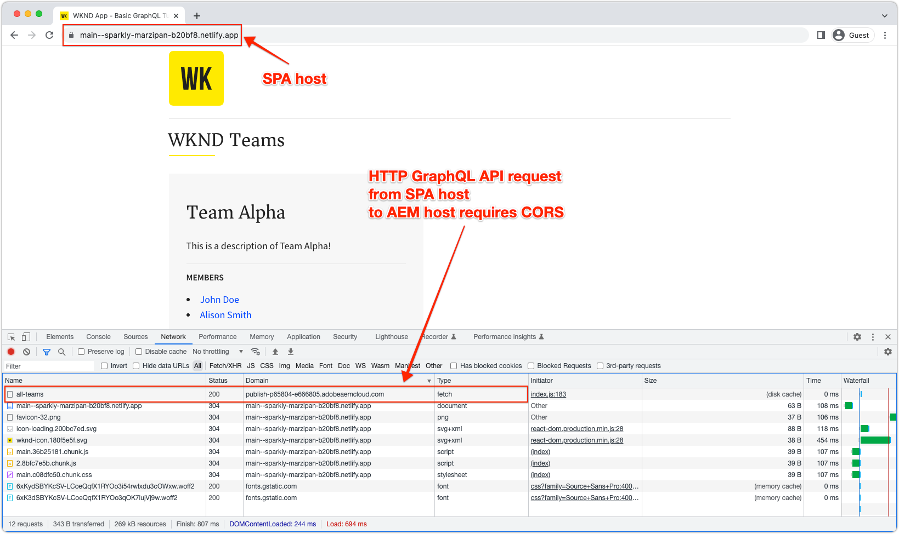
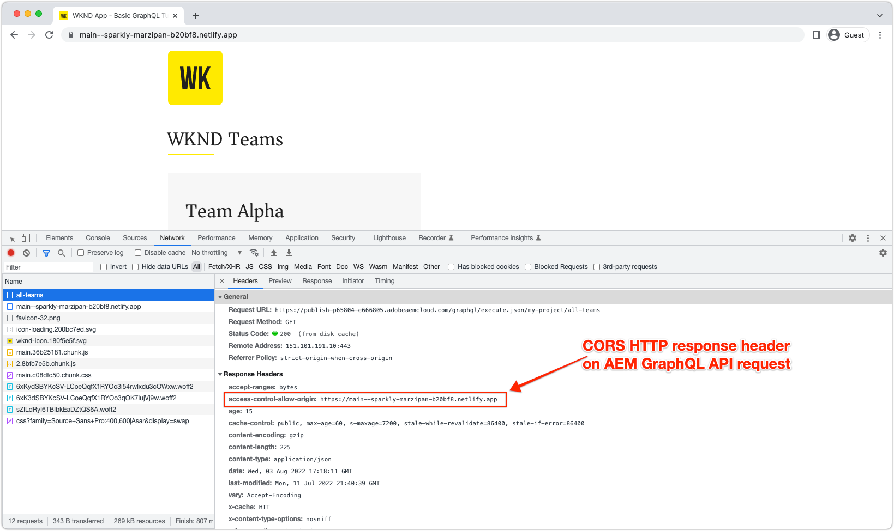
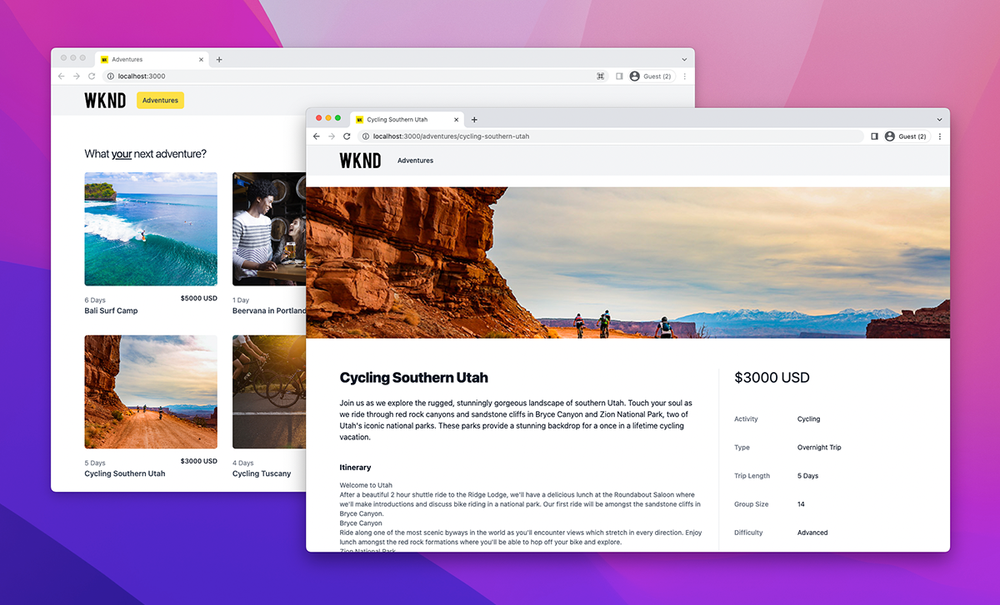

# AEM Headless SPA deployments

AEM Headless single-page app (SPA) deployments involve JavaScript-based applications built using frameworks such as React or Vue, that consume and interact with content in AEM in a headless manner.

Deploying a SPA that interacts AEM in a headless manner involves hosting the SPA and making it accessible via a web browser.

## Host the SPA

A SPA is comprised of a collection of native web resources: **HTML, CSS, and JavaScript**. These resources are generated during the _build_ process (for example, `npm run build`) and deployed to a host for consumption by end users.

There are various **hosting** options depending upon your organization's requirements:

1. **Cloud providers** such as **Azure** or **AWS**.

2. **On premise** hosting in a corporate **data center**

3. **Front-end hosting platforms** such as **AWS Amplify**, **Azure App Service**, **Netlify**, **Heroku**, **Vercel**, etc.

## Deployment configurations

The main consideration when hosting a SPA that interacts with AEM headless, is if the SPA is accessed via AEM's domain (or host), or on a different domain.  The reason is SPAs are web applications running in web browsers, and thus are subject to web browsers security policies. 

### Shared domain

A SPA and AEM share domains when both are access by end users from the same domain. For example:

+ AEM is accessed via: `https://wknd.site/`
+ SPA is accessed via `https://wknd.site/spa`

Since both AEM and the SPA are accessed from the same domain, web browsers allow the SPA to make XHR to AEM Headless endpoints without the need for CORS, and allow the sharing of HTTP cookies (such as AEM's `login-token` cookie).

How SPA and AEM traffic is routed on the shared domain, is up to you: CDN with multiple origins, HTTP server with reverse proxy, hosting the SPA directly in AEM, and so on.

Below are deployment configurations required for SPA production deployments, when hosted on the same domain as AEM.

| SPA connects to                                    | AEM Author | AEM Publish | AEM Preview |
|---------------------------------------------------:|:----------:|:-----------:|:-----------:|
| [Dispatcher filters](./configurations/dispatcher-filters.md)      | &#10008;   | &#10004;    | &#10004;    |
| Cross-origin resource sharing (CORS)                              | &#10008;   | &#10008;    | &#10008;    |
| AEM hosts                                                         | &#10008;   | &#10008;    | &#10008;    |

### Different domains

A SPA and AEM have different domains when they are accessed by end users from the different domain. For example:

+ AEM is accessed via: `https://wknd.site/`
+ SPA is accessed via `https://wknd-app.site/`

Since AEM and the SPA are accessed from different domains, web browsers enforce security policies such as [cross-origin resource sharing (CORS)](./configurations/cors.md), and prevent sharing HTTP cookies (such as AEM's `login-token` cookie).

Below are deployment configurations required for SPA production deployments, when hosted on a different domain than AEM.

| SPA connects to                                    | AEM Author | AEM Publish | AEM Preview |
|---------------------------------------------------:|:----------:|:-----------:|:-----------:|
| [Dispatcher filters](./configurations/dispatcher-filters.md)      | &#10008;   | &#10004;    | &#10004;    |
| [Cross-origin resource sharing (CORS)](./configurations/cors.md)  | &#10004;   | &#10004;    | &#10004;    |
| [AEM hosts](./configurations/aem-hosts.md)                         | &#10004;   | &#10004;    | &#10004;    |

#### Example SPA deployment on different domains

In this example, the SPA is deployed to a Netlify domain (`https://main--sparkly-marzipan-b20bf8.netlify.app/`) and the SPA consumes AEM GraphQL APIs from the AEM Publish domain (`https://publish-p65804-e666805.adobeaemcloud.com`). The below screenshots highlight the CORS requirement.

1. The SPA is served from a Netlify domain, but makes an XHR call to AEM GraphQL APIs on a different domain. This cross-site request requires [CORS](./configurations/cors.md) to be set up on AEM to allow request from the Netlify domain to access its content.

    

2. Inspecting the XHR request to the AEM GraphQL API, the `Access-Control-Allow-Origin` is present, indicating to the web browser that AEM allows request from this Netlify domain to access its content.

    If the AEM [CORS](./configurations/cors.md) was missing or did not include the Netlify domain, the web browser would fail the XHR request, and report a CORS error.

   

## Example single-page app

Adobe provides an example single-page app coded in React.

<!-- React app -->

   

       

           <figure class="image is-16by9">
               
           </figure>
       

       

           

               
<a href="../example-apps/react-app.md" title="React app">React app</a>

               
An example single-page app, written in React, that consumes content from AEM Headless GraphQL APIs.

               <a href="../example-apps/react-app.md" class="spectrum-Button spectrum-Button--outline spectrum-Button--primary spectrum-Button--sizeM">
                   View example
               </a>
           

       

   

<!-- Next.js app -->

   

       

           <figure class="image is-16by9">
               
           </figure>
       

       

           

               
<a href="../example-apps/next-js.md" title="Next.js app">Next.js app</a>

               
An example single-page app, written in Next.js, that consumes content from AEM Headless GraphQL APIs.

               <a href="../example-apps/next-js.md" class="spectrum-Button spectrum-Button--outline spectrum-Button--primary spectrum-Button--sizeM">
                   View example
               </a>
           

       

   

