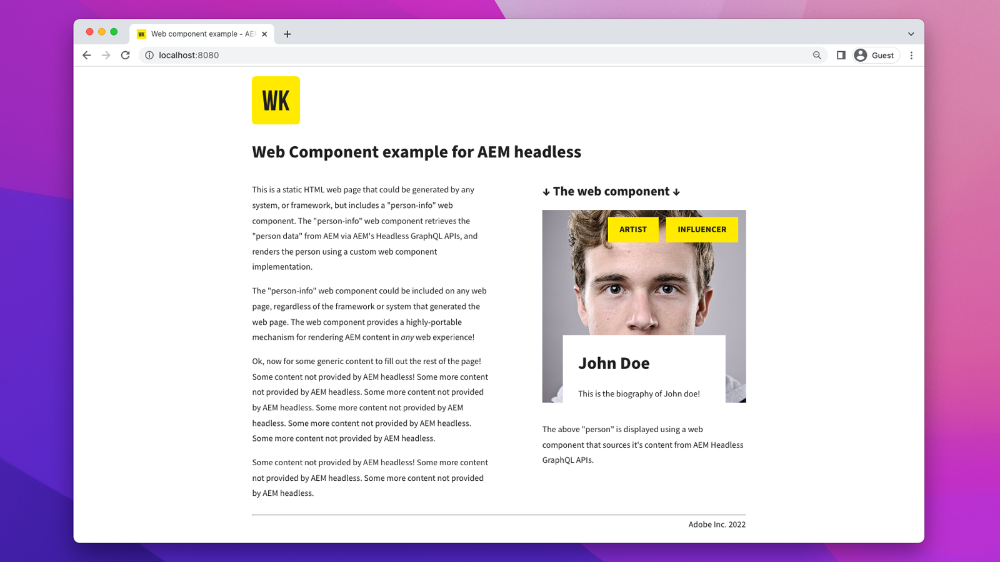

# AEM Headless Web Component deployments

AEM Headless [Web Component](https://developer.mozilla.org/en-US/docs/Web/Web_Components)/JS deployments are pure JavaScript apps that run in a web browser, that consume and interact with content in AEM in a headless manner. Web Component/JS deployments differ from [SPA deployments](./spa.md) in that they don't use a robust SPA framework, and are expected to be embedded in the context of any website, deliver, to surface content from AEM.

## Deployment configurations

The following deployment configuration must be in-place for Web Component/JS deployments.

| Web Component/JS app connects to              | AEM Author | AEM Publish | AEM Preview |
|---------------------------------------------------:|:----------:|:-----------:|:-----------:|
| [Dispatcher filters](./configurations/dispatcher-filters.md)      | &#10008;   | &#10004;    | &#10004;    |
| [Cross-origin resource sharing (CORS)](./configurations/cors.md)  | &#10004;   | &#10004;    | &#10004;    |
| [AEM hosts](./configurations/aem-hosts.md)                         | &#10004;   | &#10004;    | &#10004;    |

## Example Web Component

Adobe provides an example Web Component.

    <!-- Web Component -->
    

       

           

               <figure class="image is-16by9">
                   
               </figure>
           

           

               

                   
<a href="../example-apps/web-component.md" title="Web Component">Web Component</a>

                   
An example Web Component, written in pure JavaScript, that consumes content from AEM Headless GraphQL APIs.

                   <a href="../example-apps/web-component.md" class="spectrum-Button spectrum-Button--outline spectrum-Button--primary spectrum-Button--sizeM">
                       View example
                   </a>
               

           

       

    

