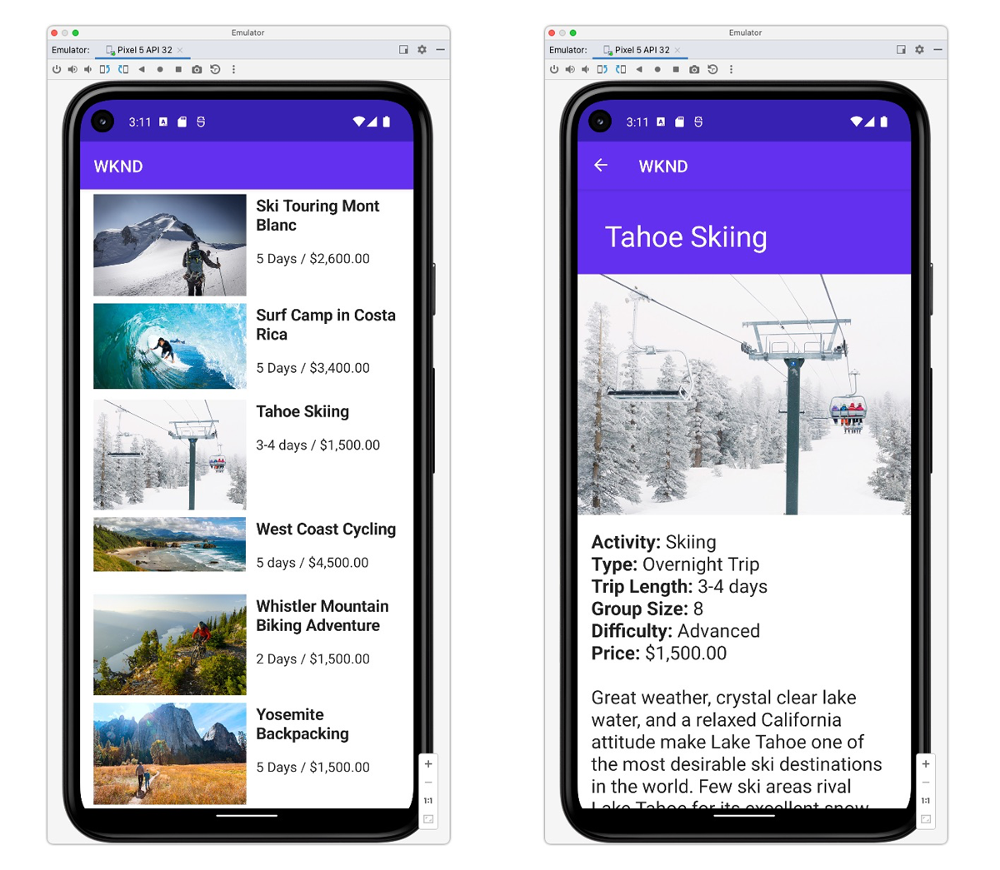

# Android App

Example applications are a great way to explore the headless capabilities of Adobe Experience Manager (AEM). This Android application demonstrates how to query content using the GraphQL APIs of AEM. The [AEM Headless Client for Java](https://github.com/adobe/aem-headless-client-java) is used to execute the GraphQL queries and map data to Java objects to power the app.




View the [source code on GitHub](https://github.com/adobe/aem-guides-wknd-graphql/tree/main/android-app)

## Prerequisites {#prerequisites}

The following tools should be installed locally:

+ [Android Studio](https://developer.android.com/studio)
+ [Git](https://git-scm.com/)

## AEM requirements

The Android application works with the following AEM deployment options. All deployments requires the [WKND Site v3.0.0+](https://github.com/adobe/aem-guides-wknd/releases/latest) to be installed.

+ [AEM as a Cloud Service](https://experienceleague.adobe.com/docs/experience-manager-cloud-service/content/implementing/deploying/overview.html)

The Android application is designed to connect to an __AEM Publish__ environment, however it can source content from AEM Author if authentication is provided in the Android application's configuration. 

## How to use

1. Clone the `adobe/aem-guides-wknd-graphql` repository:

    ```shell
    $ git clone git@github.com:adobe/aem-guides-wknd-graphql.git
    ```

1. Launch [Android Studio](https://developer.android.com/studio) and open the folder `android-app`
1. Modify the file `config.properties` at `app/src/main/assets/config.properties` and update `contentApi.endpoint` to match your target AEM environment:
    
    ```plain
    contentApi.endpoint=https://publish-p123-e456.adobeaemcloud.com
    ```

    __Basic authentication__

    The `contentApi.user` and `contentApi.password` authenticate a local AEM user with access to WKND GraphQL content.

    ```plain
    contentApi.endpoint=https://author-p123-e456.adobeaemcloud.com
    contentApi.user=admin
    contentApi.password=admin
    ```

1. Download an [Android Virtual Device](https://developer.android.com/studio/run/managing-avds) (minimum API 28).
1. Build and deploy the app using the Android emulator.


### Connecting to AEM environments

If connecting to an AEM author environment [authorization](https://github.com/adobe/aem-headless-client-java#using-authorization) is required. The [AEMHeadlessClientBuilder](https://github.com/adobe/aem-headless-client-java/blob/main/client/src/main/java/com/adobe/aem/graphql/client/AEMHeadlessClientBuilder.java) provides the ability to use [token-based authentication](https://experienceleague.adobe.com/docs/experience-manager-learn/getting-started-with-aem-headless/authentication/overview.html). To use token-based authentication update client builder in `AdventureLoader.java` and `AdventuresLoader.java`:

  ```java
  /* Comment out basicAuth
   if (user != null && password != null) {
     builder.basicAuth(user, password);
   }
  */
  
  // use token-authentication where `token` is a String representing the token
  builder.tokenAuth(token)
  ```

## The code

Below is a brief summary of the important files and code used to power the application. The full code can be found on [GitHub](https://github.com/adobe/aem-guides-wknd-graphql/tree/main/android-app).

### Persisted queries

Following AEM Headless best practices, the iOS application uses AEM GraphQL persisted queries to query adventure data. The application uses two persisted queries:

+ `wknd/adventures-all` persisted query, which returns all adventures in AEM with an abridged set of properties. This persisted query drives the initial view's adventure list.

```
# Retrieves a list of all adventures
{
    adventureList {
        items {
            _path
            slug
            title
            price
            tripLength
            primaryImage {
                ... on ImageRef {
                _dynamicUrl
                _path
                }
            }
        }
    }
}
```

+ `wknd/adventure-by-slug` persisted query, which returns a single adventure by `slug` (a custom property that uniquely identifies an adventure) with a complete set of properties. This persisted query powers the adventure detail views.

```
# Retrieves an adventure Content Fragment based on it's slug
# Example query variables: 
# {"slug": "bali-surf-camp"} 
# Technically returns an adventure list but since the the slug 
# property is set to be unique in the CF Model, only a single CF is expected

query($slug: String!) {
  adventureList(filter: {
        slug: {
          _expressions: [ { value: $slug } ]
        }
      }) {
    items {
      _path
      title
      slug
      activity
      adventureType
      price
      tripLength
      groupSize
      difficulty
      price
      primaryImage {
        ... on ImageRef {
          _dynamicUrl
          _path
        }
      }
      description {
        json
        plaintext
      }
      itinerary {
        json
        plaintext
      }
    }
    _references {
      ...on AdventureModel {
        _path
        slug
        title
        price
        __typename
      }
    }
  }
}
```

### Execute GraphQL persisted query

AEM's persisted queries are executed over HTTP GET and thus, the [AEM Headless client for Java](https://github.com/adobe/aem-headless-client-java) is used to execute the persisted GraphQL queries against AEM and load the adventure content into the app.

Each persisted query has a corresponding "loader" class, that asynchronously calls the AEM HTTP GET end point, and returns the adventure data using the custom defined [data model](#data-models).

+ `loader/AdventuresLoader.java` 

    Fetches the list of Adventures on the home screen of the application using the `wknd-shared/adventures-all` persisted query.

+ `loader/AdventureLoader.java` 

    Fetches a single adventure selecting it via the `slug` parameter, using the `wknd-shared/adventure-by-slug` persisted query.

```java
//AdventuresLoader.java

public static final String PERSISTED_QUERY_NAME = "/wknd-shared/adventures-all";
...
AEMHeadlessClientBuilder builder = AEMHeadlessClient.builder().endpoint(config.getContentApiEndpoint());

// Optional authentication for basic auth
String user = config.getContentApiUser();
String password = config.getContentApiPassword();

if (user != null && password != null) {
    builder.basicAuth(user, password);
}

AEMHeadlessClient client = builder.build();
// run a persistent query and get a response
GraphQlResponse response = client.runPersistedQuery(PERSISTED_QUERY_NAME);
```

### GraphQL response data models{#data-models}

`Adventure.java` is a Java POJO that is initialized with the JSON data from the GraphQL request, and models an adventure for use in the Android application's views.

### Views

The Android application uses two views to present the adventure data in the mobile experience.

+ `AdventureListFragment.java` 

    Invokes the `AdventuresLoader` and displays the returned adventures in a list.

+ `AdventureDetailFragment.java` 

    Invokes the `AdventureLoader` using the `slug` param passed in via the adventure selection on the `AdventureListFragment` view, and displays the details of a single adventure.

### Remote images

`loader/RemoteImagesCache.java` is a utility class that helps prepare remote images in a cache so that they can be used with Android UI elements. The adventure content references images in AEM Assets via a URL and this class is used to display that content.

## Additional resources

+ [Getting Started with AEM Headless - GraphQL Tutorial](https://experienceleague.adobe.com/docs/experience-manager-learn/getting-started-with-aem-headless/graphql/multi-step/overview.html)
+ [AEM Headless Client for Java](https://github.com/adobe/aem-headless-client-java)
