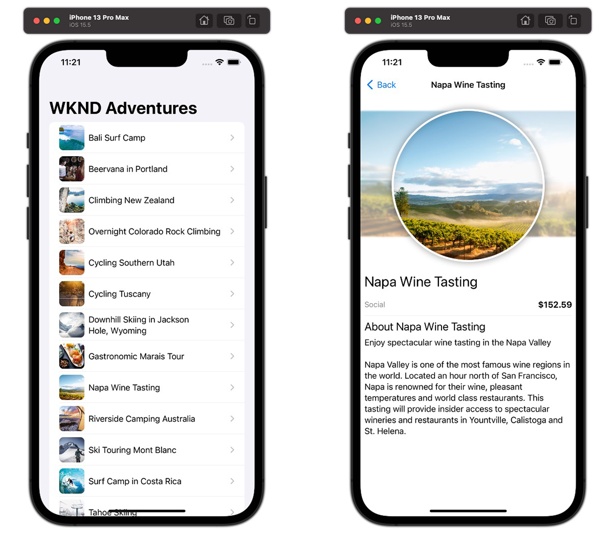

# iOS app

Example applications are a great way to explore the headless capabilities of Adobe Experience Manager (AEM). This iOS application demonstrates how to query content using AEM's GraphQL APIs using persisted queries.



View the [source code on GitHub](https://github.com/adobe/aem-guides-wknd-graphql/tree/main/ios-app)

## Prerequisites {#prerequisites}

The following tools should be installed locally:

+ [Xcode](https://developer.apple.com/xcode/) (requires macOS)
+ [Git](https://git-scm.com/)

## AEM requirements

The iOS application works with the following AEM deployment options. All deployments requires the [WKND Site v3.0.0+](https://github.com/adobe/aem-guides-wknd/releases/latest) to be installed.

+ [AEM as a Cloud Service](https://experienceleague.adobe.com/docs/experience-manager-cloud-service/content/implementing/deploying/overview.html)
+ Local set up using [the AEM Cloud Service SDK](https://experienceleague.adobe.com/docs/experience-manager-learn/cloud-service/local-development-environment-set-up/overview.html)

The iOS application is designed to connect to an __AEM Publish__ environment, however it can source content from AEM Author if authentication is provided in the iOS application's configuration. 

## How to use

1. Clone the `adobe/aem-guides-wknd-graphql` repository:

    ```shell
    $ git clone git@github.com:adobe/aem-guides-wknd-graphql.git
    ```

1. Launch [Xcode](https://developer.apple.com/xcode/) and open the folder `ios-app`
1. Modify the file `Config.xcconfig` file and update `AEM_SCHEME` and `AEM_HOST` to match your target AEM Publish service.

    ```plain
    // The http/https protocol scheme used to access the AEM_HOST
    AEM_SCHEME = https
    // Target hostname for AEM environment, do not include http:// or https://
    AEM_HOST = publish-p123-e456.adobeaemcloud.com
    ```

    If connecting to AEM Author, add the `AEM_AUTH_TYPE` and supporting authentication properties to the `Config.xcconfig`.

    __Basic authentication__

    The `AEM_USERNAME` and `AEM_PASSWORD` authenticate a local AEM user with access to WKND GraphQL content.

    ```plain
    AEM_AUTH_TYPE = basic
    AEM_USERNAME = admin
    AEM_PASSWORD = admin
    ```

    __Token authentication__

    The `AEM_TOKEN` is an [access token](https://experienceleague.adobe.com/docs/experience-manager-learn/getting-started-with-aem-headless/authentication/overview.html) that authenticates to an AEM user with access to WKND GraphQL content.

    ```plain
    AEM_AUTH_TYPE = token
    AEM_TOKEN = abcd...0123
    ```
    
1. Build the application using Xcode and deploy the app to iOS simulator
1. A list of adventures from the WKND site should be displayed on the application. Selecting an adventure opens the adventure details. On the adventures list view, pull to refresh the data from AEM.

## The code

Below is a summary of how the iOS application is built, how it connects to AEM Headless to retrieve content using GraphQL persisted queries, and how that data is presented. The full code can be found on [GitHub](https://github.com/adobe/aem-guides-wknd-graphql/tree/main/ios-app).

### Persisted queries

Following AEM Headless best practices, the iOS application uses AEM GraphQL persisted queries to query adventure data. The application uses two persisted queries:

+ `wknd/adventures-all` persisted query, which returns all adventures in AEM with an abridged set of properties. This persisted query drives the initial view's adventure list.

```
# Retrieves a list of all Adventures
#
# Optional query variables:
# - { "offset": 10 }
# - { "limit": 5 }
# - { 
#    "imageFormat": "JPG",
#    "imageWidth": 1600,
#    "imageQuality": 90 
#   }

query ($offset: Int, $limit: Int, $sort: String, $imageFormat: AssetTransformFormat=JPG, $imageWidth: Int=1200, $imageQuality: Int=80) {
  adventureList(
    offset: $offset
    limit: $limit
    sort: $sort
    _assetTransform: {
      format: $imageFormat
      width: $imageWidth
      quality: $imageQuality
      preferWebp: true
  }) {
    items {
      _path
      slug
      title
      activity
      price
      tripLength
      primaryImage {
        ... on ImageRef {
          _path
          _dynamicUrl
        }
      }
    }
  }
}
```

+ `wknd/adventure-by-slug` persisted query, which returns a single adventure by `slug` (a custom property that uniquely identifies an adventure) with a complete set of properties. This persisted query powers the adventure detail views.

```
query ($slug: String!, $imageFormat:AssetTransformFormat=JPG, $imageSeoName: String, $imageWidth: Int=1200, $imageQuality: Int=80) {
  adventureList(
    filter: {slug: {_expressions: [{value: $slug}]}}
    _assetTransform: {
      format: $imageFormat
      seoName: $imageSeoName
      width: $imageWidth
      quality: $imageQuality
      preferWebp: true
  }) {
    items {
      _path
      title
      slug
      activity
      adventureType
      price
      tripLength
      groupSize
      difficulty
      price
      primaryImage {
        ... on ImageRef {
          _path
          _dynamicUrl
        }
      }
      description {
        json
        plaintext
        html
      }
      itinerary {
        json
        plaintext
        html
      }
    }
    _references {
      ... on AdventureModel {
        _path
        slug
        title
        price
        __typename
      }
    }
  }
}
```

### Execute GraphQL persisted query

AEM's persisted queries are executed over HTTP GET and thus, common GraphQL libraries that use HTTP POST such as Apollo, cannot be used. Instead, create a custom class that executes the persisted query HTTP GET requests to AEM.

`AEM/Aem.swift` instantiates the `Aem` class used for all interactions with AEM Headless. The pattern is:

1. Each persisted query has a corresponding public func (ex. `getAdventures(..)` or `getAdventureBySlug(..)`) the iOS application's views invoke to get adventure data.
1. The public func calls a private func `makeRequest(..)` that invokes an asynchronous HTTP GET request to AEM Headless, and returns the JSON data.
1. Each public func then decodes the JSON data, and performs any required checks or transformations, before returning the Adventure data to the view.
  
   + AEM's GraphQL JSON data is decoded using the structs/classes defined in `AEM/Models.swift`, which map to the JSON objects returned my AEM Headless. 

```swift
    /// # getAdventures(..)
    /// Returns all WKND adventures using the `wknd-shared/adventures-all` persisted query.
    /// For this func call to work, the `wknd-shared/adventures-all` query must be deployed to the AEM environment/service specified by the host.
    /// 
    /// Since HTTP requests are async, the completion syntax is used.
    func getAdventures(params: [String:String], completion: @escaping ([Adventure]) ->  ()) {
               
        let request = makeRequest(persistedQueryName: "wknd-shared/adventures-all", params: params)
        
        URLSession.shared.dataTask(with: request) { (data, response, error) in
            if ((error) != nil) {
                print("Unable to connect to AEM GraphQL endpoint")
                completion([])
            } else if (!data!.isEmpty) {
                let adventures = try! JSONDecoder().decode(Adventures.self, from: data!)
                DispatchQueue.main.async {
                    completion(adventures.data.adventureList.items)
                }
            }
        }.resume();
    }
    
    ...

    /// #makeRequest(..)
    /// Generic method for constructing and executing AEM GraphQL persisted queries
    private func makeRequest(persistedQueryName: String, params: [String: String] = [:]) -> URLRequest {
        // Encode optional parameters as required by AEM
        let persistedQueryParams = params.map { (param) -> String in
            encode(string: ";\(param.key)=\(param.value)")
        }.joined(separator: "")
        
        // Construct the AEM GraphQL persisted query URL, including optional query params
        let url: String = "\(self.scheme)://\(self.host)/graphql/execute.json/" + persistedQueryName + persistedQueryParams;

        var request = URLRequest(url: URL(string: url)!);

        // Add authentication to the AEM GraphQL persisted query requests as defined by the iOS application's configuration
        request = addAuthHeaders(request: request)
        
        return request
    }
    
    ...
```

### GraphQL response data models

iOS prefers mapping JSON objects to typed data models. 

The `src/AEM/Models.swift` defines the [decodable](https://developer.apple.com/documentation/swift/decodable) Swift structs and classes that map to the AEM JSON responses returned by AEM's JSON responses.

### Views

SwiftUI is used for the various views in the application. Apple provides a getting started tutorial for [building lists and navigation with SwiftUI](https://developer.apple.com/tutorials/swiftui/building-lists-and-navigation).

+ `WKNDAdventuresApp.swift` 

  The entry of the application and includes `AdventureListView` whose `.onAppear` event handler is used to fetch all adventures data via `aem.getAdventures()`. The shared `aem` object is initialized here, and exposed to other views as an [EnvironmentObject](https://developer.apple.com/documentation/swiftui/environmentobject).

+ `Views/AdventureListView.swift` 
  
  Displays a list of adventures (based on the data from `aem.getAdventures()`) and displays a list item for each adventure using the `AdventureListItemView`. 

+ `Views/AdventureListItemView.swift`

  Displays each item in the adventures list (`Views/AdventureListView.swift`).

+ `Views/AdventureDetailView.swift`

    Displays the details of an adventure including the title, description, price, activity type, and primary image. This view queries AEM for full adventure details using `aem.getAdventureBySlug(slug: slug)`, where the `slug` parameter is passed in based on the select list row.

### Remote images

Images referenced by adventure Content Fragments, are served by AEM. This iOS app uses the path `_dynamicUrl` field in the GraphQL response, and prefixes the `AEM_SCHEME` and `AEM_HOST` to create a fully qualified URL. If developing against the AE SDK, `_dynamicUrl` returns null, so for development fallback to the image's `_path` field.

If connecting to protected resources on AEM that requires authorization, credentials must also be added to image requests.

[SDWebImageSwiftUI](https://github.com/SDWebImage/SDWebImageSwiftUI) and [SDWebImage](https://github.com/SDWebImage/SDWebImage) are used to load the remote images from AEM that populate the Adventure image on the `AdventureListItemView` and `AdventureDetailView` views.

The `aem` class (in `AEM/Aem.swift`) facilitates the use of AEM images in two ways:

1. `aem.imageUrl(path: String)` is used in views to prepend the AEM's scheme and host to the image's path, creating fully qualified URL.

    ```swift
    // adventure.image() => /adobe/dynamicmedia/deliver/dm-aid--741ed388-d5f8-4797-8095-10c896dc9f1d/example.jpg?quality=80&preferwebp=true

    let imageUrl = aem.imageUrl(path: adventure.image()) 
    // imageUrl => https://publish-p123-e456.adobeaemcloud.com/adobe/dynamicmedia/deliver/dm-aid--741ed388-d5f8-4797-8095-10c896dc9f1d/example.jpg?quality=80&preferwebp=true
    ```

2. The `convenience init(..)` in `Aem` set HTTP Authorization headers on the image HTTP request, based on the iOS applications configuration.

    + If __basic authentication__ is configured, then basic authentication is attached to all image requests.

    ```swift
    /// AEM/Aem.swift
    ///
    /// # Basic authentication init
    /// Used when authenticating to AEM using local accounts (basic auth)
    convenience init(scheme: String, host: String, username: String, password: String) {
        ...
        
        // Add basic auth headers to all Image requests, as they are (likely) protected as well
        SDWebImageDownloader.shared.setValue("Basic \(encodeBasicAuth(username: username, password: password))", forHTTPHeaderField: "Authorization")
    }
    ```
  
    + If __token authentication__ is configured, then token authentication is attached to all image requests.

    ```swift 
    /// AEM/Aem.swift
    ///
    /// # Token authentication init
    ///  Used when authenticating to AEM using token authentication (Dev Token or access token generated from Service Credentials)
    convenience init(scheme: String, host: String, token: String) {
        ...
        
        // Add token auth headers to all Image requests, as they are (likely) protected as well
        SDWebImageDownloader.shared.setValue("Bearer \(token)", forHTTPHeaderField: "Authorization")
    }
    ```

    + If __no authentication__ is configured, then no authentication is attached to image requests.

A similar approach can be used with the SwiftUI-native [AsyncImage](https://developer.apple.com/documentation/swiftui/asyncimage). `AsyncImage` is supported on iOS 15.0+.

## Additional resources

+ [Getting Started with AEM Headless - GraphQL Tutorial](https://experienceleague.adobe.com/docs/experience-manager-learn/getting-started-with-aem-headless/graphql/multi-step/overview.html)
+ [SwiftUI Lists and Navigation Tutorial](https://developer.apple.com/tutorials/swiftui/building-lists-and-navigation)
