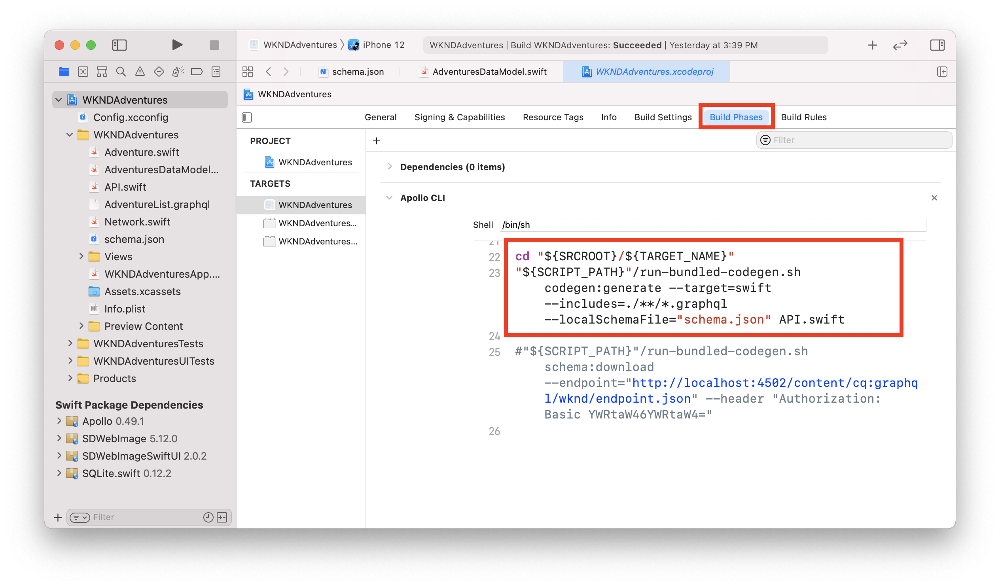
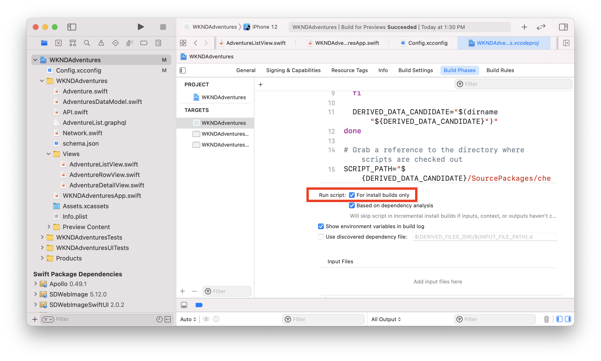

# iOS SwiftUI App

Example applications are a great way to explore the headless capabilities of Adobe Experience Manager (AEM). This iOS application demonstrates how to query content using the GraphQL APIs of AEM. The Apollo Client iOS is used to generate the GraphQL queries and map data to Swift objects to power the app. SwiftUI is used to render a simple list and detail view of the content.

>[!VIDEO](https://video.tv.adobe.com/v/338042/?quality=12&learn=on)

## Prerequisites {#prerequisites}

The following tools should be installed locally:

* [Xcode 9.3+](https://developer.apple.com/xcode/)
* [Git](https://git-scm.com/)

## AEM Requirements

The application is designed to connect to an AEM **Publish** environment with the latest release of the [WKND Reference site](https://github.com/adobe/aem-guides-wknd/releases/latest) installed.

* [AEM as a Cloud Service](https://experienceleague.adobe.com/docs/experience-manager-cloud-service/overview/introduction.html)
* [AEM 6.5.10+](https://experienceleague.adobe.com/docs/experience-manager-65/release-notes/service-pack/new-features-latest-service-pack.html)

We recommend [deploying the WKND Reference site to a Cloud Service environment](https://experienceleague.adobe.com/docs/experience-manager-cloud-service/implementing/deploying/overview.html#coding-against-the-right-aem-version). A local setup using [the AEM Cloud Service SDK](https://experienceleague.adobe.com/docs/experience-manager-learn/cloud-service/local-development-environment-set-up/overview.html) or [AEM 6.5 QuickStart jar](https://experienceleague.adobe.com/docs/experience-manager-learn/foundation/development/set-up-a-local-aem-development-environment.html?lang=en#install-local-aem-instances) can also be used.

## How to use

1. Clone the `aem-guides-wknd-graphql` repository:

    ```shell
    git clone git@github.com:adobe/aem-guides-wknd-graphql.git
    ```

1. Launch [Xcode](https://developer.apple.com/xcode/) and open the folder `ios-swiftui-app`
1. Modify the file `Config.xcconfig` file and update `AEM_HOST` to match your target AEM Publish environment

    ```plain
    // Target hostname for AEM environment, do not include http:// or https://
    AEM_HOST = localhost:4503
    // GraphQL Endpoint
    AEM_GRAPHQL_ENDPOINT = /content/cq:graphql/wknd/endpoint.json
    ```

1. Build the application using Xcode and deploy the app to iOS simulator
1. A list of adventures from the WKND reference site should be displayed on the application.

## The code

Below is a brief summary of the important files and code used to power the application. The full code can be found on [GitHub](https://github.com/adobe/aem-guides-wknd-graphql/tree/main/ios-swiftui-app).

### Apollo iOS

The [Apollo iOS](https://www.apollographql.com/docs/ios/) client is used by the app to execute the GraphQL query against AEM. The official [Apollo Tutorial](https://www.apollographql.com/docs/ios/tutorial/tutorial-introduction/) has much more detail on how to install and use.

`schema.json` is a file that represents the GraphQL schema from an AEM environment with the WKND Reference site installed. `schema.json` was downloaded from AEM and added to the project. The Apollo client inspects any files with the extension `.graphql` as part of a custom Build Phase. The Apollo client then uses the `schema.json` file and any `.graphql` queries to automatically generate the file `API.swift`. 

This provides the application a strongly typed model to execute the query and model(s) representing the results.



`AdventureList.graphql` contains the query used to query the adventures:

```
query AdventureList
{
  adventureList {
    items {
      _path
      adventureTitle
      adventurePrice
      adventureActivity
      adventureDescription {
        plaintext
        markdown
      }
      adventureDifficulty
      adventureTripLength
      adventurePrimaryImage {
        ...on ImageRef {
          _authorUrl
          _publishUrl
        }
      }
    }
  }
}
```

`Network.swift` constructs the `ApolloClient`. The `endpointURL` used is constructed by reading the values of the `Config.xcconfig` file. If you wanted to connect to an AEM **Author** instance and needed to add additional headers for authentication, you would want to modify the `ApolloClient` here.

```swift
// Network.swift
private(set) lazy var apollo: ApolloClient = {
        // The cache is necessary to set up the store, which we're going to hand to the provider
        let cache = InMemoryNormalizedCache()
        let store = ApolloStore(cache: cache)
  
        let client = URLSessionClient()
        let provider = DefaultInterceptorProvider(client: client, shouldInvalidateClientOnDeinit: true, store: store)
        let url = Connection.baseURL // from Configx.xcconfig 

        // no additional headers, public instances by default require no additional authentication
        let requestChainTransport = RequestChainNetworkTransport(interceptorProvider: provider, endpointURL: url)

        return ApolloClient(networkTransport: requestChainTransport,store: store)
    }()
}
```

### Adventure Data

The application is designed to display a list of Adventures and then a detail view of each adventure.

`AdventuresDataModel.swift` is a class that includes a function `fetchAdventures()`. This function uses the `ApolloClient` to execute the query. On a successful query the results array will be of type `AdventureListQuery.Data.AdventureList.Item`, auto-generated by the `API.swift` file.

```swift
func fetchAdventures() {
        Network.shared.apollo
            //AdventureListQuery() generated based on AdventureList.graphql file
           .fetch(query: AdventureListQuery()) { [weak self] result in
           
             guard let self = self else {
               return
             }
                   
             switch result {
             case .success(let graphQLResult):
                print("Success AdventureListQuery() from: \(graphQLResult.source)")

                if let adventureDataItems =  graphQLResult.data?.adventureList.items {
                    // map graphQL items to an array of Adventure objects
                    self.adventures = adventureDataItems.compactMap { Adventure(adventureData: $0!) }
                }
                ...
             }
           }
}
```

It is possible to use `AdventureListQuery.Data.AdventureList.Item` directly to power the application. However it is very possible that some of the data is incomplete and therefore some of the properties may be null.

`Adventure.swift` is a custom model introduced acts as a wrapper of the model generated by Apollo. `Adventure` is initialized with `AdventureListQuery.Data.AdventureList.Item`. A `typealias` is used to shorten to make the code more readable:

```
// use typealias
typealias AdventureData = AdventureListQuery.Data.AdventureList.Item
```

The `Adventure` struct is initialized with an `AdventureData` object:

```swift
struct Adventure: Identifiable {
    let id: String
    let adventureTitle: String
    let adventurePrice: String
    let adventureDescription: String
    let adventureActivity: String
    let adventurePrimaryImageUrl: String
    
    // initialize with AdventureData object aka AdventureListQuery.Data.AdventureList.Item
    init(adventureData: AdventureData) {
        // use path as unique idenitifer, otherwise
        self.id = adventureData._path ?? UUID().uuidString
        self.adventureTitle = adventureData.adventureTitle ?? "Untitled"
        self.adventurePrice = adventureData.adventurePrice ?? "Free"
        self.adventureActivity = adventureData.adventureActivity ?? ""
        ...
```

This allows us to then provide default values and perform additional checks for incomplete data. We can then use the `Adventure` model safely to power various UI elements and do not have to constantly check for null values.

In AEM, pieces of content are uniquely identified by `_path`. In `Adventure.swift` we populate the `id` property with the value of `_path`. This allows `Adventure` to implement the `Identifiable` interface and makes it easier to iterate over an array or list.

### Views

SwiftUI is used for the various views in the application. A great tutorial for [building lists and navigation](https://developer.apple.com/tutorials/swiftui/building-lists-and-navigation) can be found on Apple's developer site. The code for this application is loosely derived from it.

`WKNDAdventuresApp.swift` is the entry of the application. It includes `AdventureListView` and the `.onAppear` event is used to fetch the adventure data.

`AdventureListView.swift` - creates a `NavigationView` and a list of adventures populated by `AdventureRowView`. Navigation to an `AdventureDetailView` is set up here.

`AdventureRowView` - displays the Adventure's primary image and the Adventure Title in a row. 

`AdventureDetailView` - displays a full detail of the individual adventure including the title, description, price, activity type and primary image.

When the Apollo CLI runs and re-generates `API.swift` it causes the preview to stop. To use the the Automatic Preview function, you will need to update the **Apollo CLI** Build Phase and check to run the script **For Install builds only**. 



### Remote Images

[SDWebImageSwiftUI](https://github.com/SDWebImage/SDWebImageSwiftUI) and [SDWEbImage](https://github.com/SDWebImage/SDWebImage) are used to load the remote images from AEM that populate the Adventure primary image on the Row and Detail views.

The [AsyncImage](https://developer.apple.com/documentation/swiftui/asyncimage) is a native SwiftUI view that could also be used. `AsyncImage` is only supported for iOS 15.0+.

## Additional Resources

* [Getting Started with AEM Headless - GraphQL Tutorial](https://experienceleague.adobe.com/docs/experience-manager-learn/getting-started-with-aem-headless/graphql/multi-step/overview.html)
* [SwiftUI Lists and Navigation Tutorial](https://developer.apple.com/tutorials/swiftui/building-lists-and-navigation)
* [Apollo iOS Client Tutorial](https://www.apollographql.com/docs/ios/tutorial/tutorial-introduction/)

