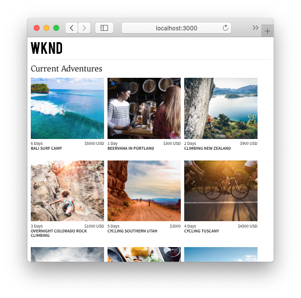

# React App

Example applications are a great way to explore the headless capabilities of Adobe Experience Manager (AEM). A React application is provided that demonstrates how to query content using the GraphQL APIs of AEM. The AEM Headless Client for JavaScript is used to execute the GraphQL queries that power the app.



A full step by step tutorial is available [here](https://experienceleague.adobe.com/docs/experience-manager-learn/getting-started-with-aem-headless/graphql/multi-step/overview.html).

## Prerequisites {#prerequisites}

The following tools should be installed locally:

* [JDK 11](https://experience.adobe.com/#/downloads/content/software-distribution/en/general.html?1_group.propertyvalues.property=.%2Fjcr%3Acontent%2Fmetadata%2Fdc%3AsoftwareType&1_group.propertyvalues.operation=equals&1_group.propertyvalues.0_values=software-type%3Atooling&fulltext=Oracle%7E+JDK%7E+11%7E&orderby=%40jcr%3Acontent%2Fjcr%3AlastModified&orderby.sort=desc&layout=list&p.offset=0&p.limit=14)
* [Node.js v10+](https://nodejs.org/en/)
* [npm 6+](https://www.npmjs.com/)
* [Git](https://git-scm.com/)

## AEM Requirements

The application is designed to connect to an AEM **Author** or **Publish** environment with the latest release of the [WKND Reference site](https://github.com/adobe/aem-guides-wknd/releases/latest) installed.

* [AEM as a Cloud Service](https://experienceleague.adobe.com/docs/experience-manager-cloud-service/overview/introduction.html)
* [AEM 6.5.10+](https://experienceleague.adobe.com/docs/experience-manager-65/release-notes/service-pack/new-features-latest-service-pack.html)

We recommend [deploying the WKND Reference site to a Cloud Service environment](https://experienceleague.adobe.com/docs/experience-manager-cloud-service/implementing/deploying/overview.html#coding-against-the-right-aem-version). A local setup using [the AEM Cloud Service SDK](https://experienceleague.adobe.com/docs/experience-manager-learn/cloud-service/local-development-environment-set-up/overview.html) or [AEM 6.5 QuickStart jar](https://experienceleague.adobe.com/docs/experience-manager-learn/foundation/development/set-up-a-local-aem-development-environment.html?lang=en#install-local-aem-instances) can also be used.

## How to use

1. Clone the `aem-guides-wknd-graphql` repository:

    ```shell
    git clone git@github.com:adobe/aem-guides-wknd-graphql.git
    ```

1. Edit the `aem-guides-wknd/react-app/.env.development` file and ensure that `REACT_APP_HOST_URI` points to your target AEM instance. Update the authentication method (if connecting to an author instance).

    ```plain
    # Server namespace
    REACT_APP_HOST_URI=http://localhost:4503
    REACT_APP_GRAPHQL_ENDPOINT=/content/graphql/global/endpoint.json
    #AUTH (Choose one method)
    # Authentication methods: 'service-token', 'dev-token', 'basic' or leave blank to use no authentication
    ...
    ```

1. Open a terminal and run the commands:

    ```shell
    $ cd aem-guides-wknd-graphql/react-app
    $ npm install
    $ npm start
    ```
1. A new browser window should load on [http://localhost:3000](http://localhost:3000)
1. A list of adventures from the WKND reference site should be displayed on the application.

## The code

Below is a brief summary of the important files and code used to power the application. The full code can be found on [GitHub](https://github.com/adobe/aem-guides-wknd-graphql).

### AEM Headless Client for JavaScript

The [AEM Headless Client](https://github.com/adobe/aem-headless-client-js) is used to execute the GraphQL query. The AEM Headless Client provides two methods for executing queries, [`runQuery`](https://github.com/adobe/aem-headless-client-js/blob/main/api-reference.md#aemheadlessrunqueryquery-options--promiseany) and [`runPersistedQuery`](https://github.com/adobe/aem-headless-client-js/blob/main/api-reference.md#aemheadlessrunpersistedquerypath-variables-options--promiseany). 

`runQuery` executes a standard GraphQL query for AEM content and is the most common type of query run.

[Persisted Queries](https://experienceleague.adobe.com/docs/experience-manager-learn/getting-started-with-aem-headless/graphql/video-series/graphql-persisted-queries.html) are a feature in AEM that caches the results of a GraphQL query and then makes the result available over GET. Persisted Queries should be used for common queries that will be executed over and over. In this application the list of Adventures is the first query executed on the home screen. This will be a very popular query and therefore a persisted query should be used. `runPersistedQuery` executes a request against a persisted query endpoint.

`src/api/useGraphQL.js` is a [React Effect Hook](https://reactjs.org/docs/hooks-overview.html#effect-hook) that listens for changes to the parameter `query` and `path`. If `query` is blank then a persisted query is used based on the `path`. Here is where the AEM Headless Client is constructed and used to fetch data.

```js
function useGraphQL(query, path) {
    let [data, setData] = useState(null);
    let [errorMessage, setErrors] = useState(null);

    useEffect(() => {
      // construct a new AEMHeadless client based on the graphQL endpoint
      const sdk = new AEMHeadless({ endpoint: REACT_APP_GRAPHQL_ENDPOINT })

      // if query is not null runQuery otherwise fall back to runPersistedQuery
      const request = query ? sdk.runQuery.bind(sdk) : sdk.runPersistedQuery.bind(sdk);

      request(query || path)
        .then(({ data, errors }) => {
          //If there are errors in the response set the error message
          if(errors) {
            setErrors(mapErrors(errors));
          }
          //If data in the response set the data as the results
          if(data) {
            setData(data);
          }
        })
        .catch((error) => {
          setErrors(error);
        });
    }, [query, path]);

    return {data, errorMessage}
}
```

### Adventure content

The app primarily displays a list of Adventures and gives the users an option to click into the details of an Adventure.

`Adventures.js` - Displays a card list of Adventures. 