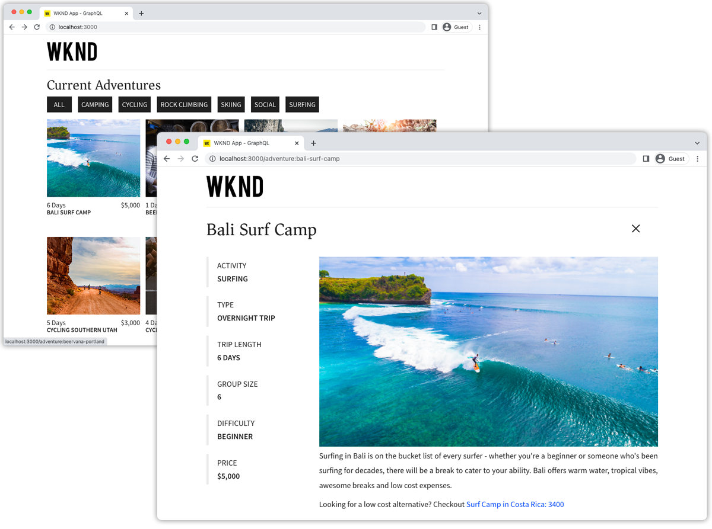

# React App{#react-app}

Example applications are a great way to explore the headless capabilities of Adobe Experience Manager (AEM). This React application demonstrates how to query content using AEM's GraphQL APIs using persisted queries. The AEM Headless Client for JavaScript is used to execute the GraphQL persisted queries that power the app.



View the [source code on GitHub](https://github.com/adobe/aem-guides-wknd-graphql/tree/main/react-app)

A [full step-by-step tutorial](https://experienceleague.adobe.com/docs/experience-manager-learn/getting-started-with-aem-headless/graphql/multi-step/overview.html) describing how this React app was build is available.

## Prerequisites {#prerequisites}

The following tools should be installed locally:

+ [Node.js v18](https://nodejs.org/en/)
+ [Git](https://git-scm.com/)

## AEM requirements

The React application works with the following AEM deployment options. All deployments requires the [WKND Site v3.0.0+](https://github.com/adobe/aem-guides-wknd/releases/latest) to be installed.

+ [AEM as a Cloud Service](https://experienceleague.adobe.com/docs/experience-manager-cloud-service/content/implementing/deploying/overview.html)
+ Local set up using [the AEM Cloud Service SDK](https://experienceleague.adobe.com/docs/experience-manager-learn/cloud-service/local-development-environment-set-up/overview.html)
  + Requires [JDK 11](https://experience.adobe.com/#/downloads/content/software-distribution/en/general.html?1_group.propertyvalues.property=.%2Fjcr%3Acontent%2Fmetadata%2Fdc%3AsoftwareType&1_group.propertyvalues.operation=equals&1_group.propertyvalues.0_values=software-type%3Atooling&fulltext=Oracle%7E+JDK%7E+11%7E&orderby=%40jcr%3Acontent%2Fjcr%3AlastModified&orderby.sort=desc&layout=list&p.offset=0&p.limit=14)

The React application is designed to connect to an __AEM Publish__ environment, however it can source content from AEM Author if authentication is provided in the React application's configuration. 

## How to use

1. Clone the `adobe/aem-guides-wknd-graphql` repository:

    ```shell
    $ git clone git@github.com:adobe/aem-guides-wknd-graphql.git
    ```

1. Edit the `aem-guides-wknd-graphql/react-app/.env.development` file and set `REACT_APP_HOST_URI` to point at your target AEM. 

    Update the authentication method if connecting to an author instance.

    ```plain
    # Server namespace
    REACT_APP_HOST_URI=https://publish-p123-e456.adobeaemcloud.com
    
    #AUTH (Choose one method)
    # Authentication methods: 'service-token', 'dev-token', 'basic' or leave blank to use no authentication
    REACT_APP_AUTH_METHOD=basic

    # For Bearer auth, use DEV token (dev-token) from Cloud console
    REACT_APP_DEV_TOKEN=dev-token

    # For Service toke auth, provide path to service token file (download file from Cloud console)
    REACT_APP_SERVICE_TOKEN=auth/service-token.json

    # For Basic auth, use AEM ['user','pass'] pair (eg for Local AEM Author instance)
    REACT_APP_BASIC_AUTH_USER=admin
    REACT_APP_BASIC_AUTH_PASS=admin
    ```

1. Open a terminal and run the commands:

    ```shell
    $ cd aem-guides-wknd-graphql/react-app
    $ npm install
    $ npm start
    ```

1. A new browser window should load on [http://localhost:3000](http://localhost:3000)
1. A list of adventures from the WKND reference site should be displayed on the application.

## The code

Below is a summary of how the React application is built, how it connects to AEM Headless to retrieve content using GraphQL persisted queries, and how that data is presented. The full code can be found on [GitHub](https://github.com/adobe/aem-guides-wknd-graphql/tree/main/react-app).


### Persisted queries

Following AEM Headless best practices, the React application uses AEM GraphQL persisted queries to query adventure data. The application uses two persisted queries:

+ `wknd/adventures-all` persisted query, which returns all adventures in AEM with an abridged set of properties. This persisted query drives the initial view's adventure list.

```
# Retrieves a list of all Adventures
#
# Optional query variables:
# - { "offset": 10 }
# - { "limit": 5 }
# - { 
#    "imageFormat": "JPG",
#    "imageWidth": 1600,
#    "imageQuality": 90 
#   }
query ($offset: Int, $limit: Int, $sort: String, $imageFormat: AssetTransformFormat=JPG, $imageWidth: Int=1200, $imageQuality: Int=80) {
  adventureList(
    offset: $offset
    limit: $limit
    sort: $sort
    _assetTransform: {
      format: $imageFormat
      width: $imageWidth
      quality: $imageQuality
      preferWebp: true
  }) {
    items {
      _path
      slug
      title
      activity
      price
      tripLength
      primaryImage {
        ... on ImageRef {
          _path
          _dynamicUrl
        }
      }
    }
  }
}
```

+ `wknd/adventure-by-slug` persisted query, which returns a single adventure by `slug` (a custom property that uniquely identifies an adventure) with a complete set of properties. This persisted query powers the adventure detail views.

```
# Retrieves an Adventure Fragment based on it's unique slug.
#
# Required query variables:
# - {"slug": "bali-surf-camp"}
#
# Optional query variables:
# - { 
#     "imageFormat": "JPG",
#     "imageSeoName": "my-adventure",
#     "imageWidth": 1600,
#     "imageQuality": 90 
#   }
#  
# This query returns an adventure list but since the the slug property is set to be unique in the Content Fragment Model, only a single Content Fragment is expected.

query ($slug: String!, $imageFormat:AssetTransformFormat=JPG, $imageSeoName: String, $imageWidth: Int=1200, $imageQuality: Int=80) {
  adventureList(
    filter: {slug: {_expressions: [{value: $slug}]}}
    _assetTransform: {
      format: $imageFormat
      seoName: $imageSeoName
      width: $imageWidth
      quality: $imageQuality
      preferWebp: true
  }) {
    items {
      _path
      title
      slug
      activity
      adventureType
      price
      tripLength
      groupSize
      difficulty
      price
      primaryImage {
        ... on ImageRef {
          _path
          _dynamicUrl
        }
      }
      description {
        json
        plaintext
        html
      }
      itinerary {
        json
        plaintext
        html
      }
    }
    _references {
      ... on AdventureModel {
        _path
        slug
        title
        price
        __typename
      }
    }
  }
}
```

### Execute GraphQL persisted query

AEM's persisted queries are executed over HTTP GET and thus, the [AEM Headless client for JavaScript](https://github.com/adobe/aem-headless-client-js) is used to [execute the persisted GraphQL queries](https://github.com/adobe/aem-headless-client-js/blob/main/api-reference.md#aemheadlessrunpersistedquerypath-variables-options--promiseany) against AEM and load the adventure content into the app.

Each persisted query has a corresponding React [useEffect](https://reactjs.org/docs/hooks-effect.html) hook in `src/api/usePersistedQueries.js`, that asynchronously calls the AEM HTTP GET persisted query end point, and returns the adventure data.

Each function in turn invokes the `aemHeadlessClient.runPersistedQuery(...)`, executing the persisted GraphQL query.

```js
// src/api/usePersistedQueries.js

/**
 * React custom hook that returns a list of adevntures by activity. If no activity is provided, all adventures are returned.
 * 
 * Custom hook that calls the 'wknd-shared/adventures-all' or 'wknd-shared/adventures-by-activity' persisted query.
 *
 * @returns an array of Adventure JSON objects, and array of errors
 */
export function useAdventuresByActivity(adventureActivity, params = {}) {
  ...
  let queryVariables = params;

  // If an activity is provided (i.e "Camping", "Hiking"...) call wknd-shared/adventures-by-activity query
  if (adventureActivity) {
    // The key is 'activity' as defined in the persisted query
    queryVariables = { ...queryVariables, activity: adventureActivity };

    // Call the AEM GraphQL persisted query named "wknd-shared/adventures-by-activity" with parameters
    response = await fetchPersistedQuery("wknd-shared/adventures-by-activity", queryVariables);
  } else {
    // Else call the AEM GraphQL persisted query named "wknd-shared/adventures-all" to get all adventures
    response = await fetchPersistedQuery("wknd-shared/adventures-all", queryVariables);
  }
  
  ... 
}

...
/**
 * Private function that invokes the AEM Headless client.
 * 
 * @param {String} persistedQueryName the fully qualified name of the persisted query
 * @param {*} queryParameters an optional JavaScript object containing query parameters
 * @returns the GraphQL data or an error message 
 */
async function fetchPersistedQuery(persistedQueryName, queryParameters) {
  let data;
  let err;

  try {
    // AEM GraphQL queries are asynchronous, either await their return or use Promise-based .then(..) { ... } syntax
    const response = await aemHeadlessClient.runPersistedQuery(
      persistedQueryName,
      queryParameters
    );
    // The GraphQL data is stored on the response's data field
    data = response?.data;
  } catch (e) {
    // An error occurred, return the error messages
    err = e
      .toJSON()
      ?.map((error) => error.message)
      ?.join(", ");
    console.error(e.toJSON());
  }

  return { data, err };
}
```

### Views

The React application uses two views to present the adventure data in the web experience.

+ `src/components/Adventures.js` 

    Invokes `getAdventuresByActivity(..)` from `src/api/usePersistedQueries.js` and displays the returned adventures in a list.

+ `src/components/AdventureDetail.js` 

    Invokes the `getAdventureBySlug(..)` using the `slug` param passed in via the adventure selection on the `Adventures` component, and displays the details of a single adventure.

### Environment variables

Several [environment variables](https://create-react-app.dev/docs/adding-custom-environment-variables) are used to connect to an AEM environment. Default connects to AEM Publish running at `http://localhost:4503`. Update the `.env.development` file, to change the AEM connection :

+ `REACT_APP_HOST_URI=https://publish-p123-e456.adobeaemcloud.com`: Set to AEM target host
+ `REACT_APP_GRAPHQL_ENDPOINT=/content/graphql/global/endpoint.json`: Set the GraphQL endpoint path. This is not used by this React app, since this app only uses persisted queries.
+ `REACT_APP_AUTH_METHOD=`: The preferred authentication method. Optional, as per default no authentication is used.
  + `service-token`: Use Service Credentials to obtain an access token on AEM as a Cloud Service
  + `dev-token`: Use dev token for local development on AEM as a Cloud Service
  + `basic`: Use user/pass for local development with local AEM Author
  + Leave blank to connect to AEM without authentication
+ `REACT_APP_AUTHORIZATION=admin:admin`: Set basic authentication credentials to use if connecting to an AEM Author environment (for development only). If connecting to a Publish environment, this setting is not necessary.
+ `REACT_APP_DEV_TOKEN`: Dev token string. To connect to remote instance, beside Basic authentication (user:pass) you can use Bearer authentication with DEV token from Cloud console
+ `REACT_APP_SERVICE_TOKEN`: Path to service credentials file. To connect to remote instance, authentication can be done with Service token also (download file from the Developer Console).

### Proxy AEM requests

When using the webpack development server (`npm start`) the project relies on a [proxy setup](https://create-react-app.dev/docs/proxying-api-requests-in-development/#configuring-the-proxy-manually) using `http-proxy-middleware`. The file is configured at [src/setupProxy.js](https://github.com/adobe/aem-guides-wknd-graphql/blob/main/react-app/src/setupProxy.js) and relies on several custom environment variables set at `.env` and `.env.development`.

If connecting to an AEM author environment, the corresponding [authentication method needs to be configured](#environment-variables).

### Cross-origin resource sharing (CORS)

This React application relies on a AEM-based CORS configuration running on the target AEM environment and assumes that React app runs on `http://localhost:3000` in development mode.  Review the[AEM Headless deployment documentation](https://experienceleague.adobe.com/docs/experience-manager-learn/getting-started-with-aem-headless/deployments/spa.html) for more information how to setup and configure CORS.
