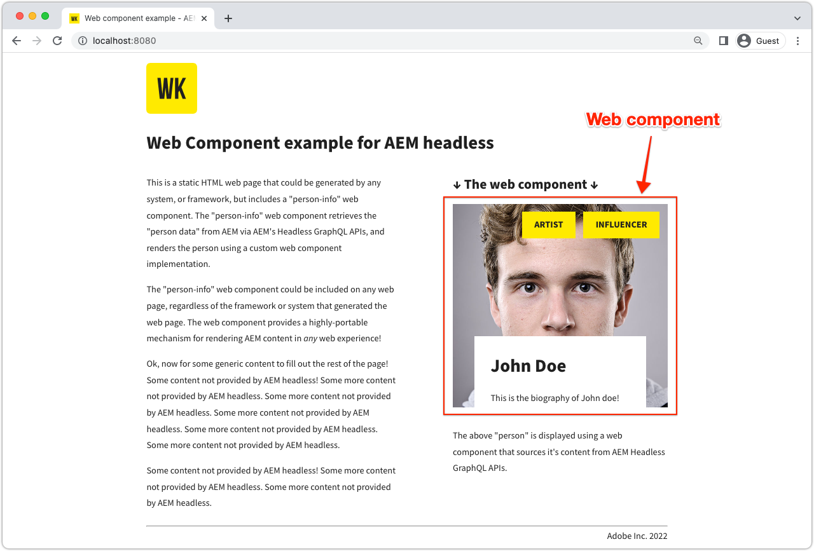

# Web Component

Example applications are a great way to explore the headless capabilities of Adobe Experience Manager (AEM). This Web Component application demonstrates how to query content using AEM's GraphQL APIs using persisted queries and render a portion of UI, accomplished using pure JavaScript code. 



View the [source code on GitHub](https://github.com/adobe/aem-guides-wknd-graphql/tree/main/web-component)

## Prerequisites {#prerequisites}

The following tools should be installed locally:

+ [Node.js v18](https://nodejs.org/en/)
+ [Git](https://git-scm.com/)

## AEM requirements

The Web Component works with the following AEM deployment options. 

+ [AEM as a Cloud Service](https://experienceleague.adobe.com/docs/experience-manager-cloud-service/content/implementing/deploying/overview.html)
+ Local set up using [the AEM Cloud Service SDK](https://experienceleague.adobe.com/docs/experience-manager-learn/cloud-service/local-development-environment-set-up/overview.html)
    + Requires [JDK 11](https://experience.adobe.com/#/downloads/content/software-distribution/en/general.html?1_group.propertyvalues.property=.%2Fjcr%3Acontent%2Fmetadata%2Fdc%3AsoftwareType&1_group.propertyvalues.operation=equals&1_group.propertyvalues.0_values=software-type%3Atooling&fulltext=Oracle%7E+JDK%7E+11%7E&orderby=%40jcr%3Acontent%2Fjcr%3AlastModified&orderby.sort=desc&layout=list&p.offset=0&p.limit=14) (if connecting to local AEM 6.5 or AEM SDK)

This example app relies on [basic-tutorial-solution.content.zip](../multi-step/assets/explore-graphql-api/basic-tutorial-solution.content.zip) to be installed and the required [deployment configurations](../deployment/web-component.md) are in place.


>[!IMPORTANT]
>
>The Web Component is designed to connect to an __AEM Publish__ environment, however it can source content from AEM Author if authentication is provided in the Web Component's [`person.js`](https://github.com/adobe/aem-guides-wknd-graphql/blob/main/web-component/src/person.js#L11) file. 

## How to use

1. Clone the `adobe/aem-guides-wknd-graphql` repository:

    ```shell
    $ git clone git@github.com:adobe/aem-guides-wknd-graphql.git
    ```

1. Navigate to `web-component` sub-directory.

    ```shell
    $ cd aem-guides-wknd-graphql/web-component
    ```

1. Edit the `.../src/person.js` file to include the AEM connection details:

    In the `aemHeadlessService` object, update the `aemHost` to point to your AEM Publish service.

    ```plain
    # AEM Server namespace
    aemHost=https://publish-p123-e456.adobeaemcloud.com

    # AEM GraphQL API and Persisted Query Details
    graphqlAPIEndpoint=graphql/execute.json
    projectName=my-project
    persistedQueryName=person-by-name
    queryParamName=name
    ```

    If connecting to an AEM Author service, in the `aemCredentials` object, provide local AEM user credentials.

    ```plain
    # For Basic auth, use AEM ['user','pass'] pair (for example, when connecting to local AEM Author instance)
    username=admin
    password=admin
    ```

1. Open a terminal and run the commands from `aem-guides-wknd-graphql/web-component`:

    ```shell
    $ npm install
    $ npm start
    ```

1. A new browser window opens the static HTML page that embeds the Web Component at [http://localhost:8080](http://localhost:8080).
1. The _Person Info_ Web Component is displayed on the web page.

## The code

Below is a summary of how the Web Component is built, how it connects to AEM Headless to retrieve content using GraphQL persisted queries, and how that data is presented. The complete code can be found on [GitHub](https://github.com/adobe/aem-guides-wknd-graphql/tree/main/web-component).

### Web Component HTML tag

A reusable Web Component (aka custom element) `<person-info>` is added to the `../src/assets/aem-headless.html` HTML page. It supports `host` and `query-param-value` attributes to drive the behavior of the component. The `host` attribute's value overrides `aemHost` value from `aemHeadlessService` object in `person.js`, and `query-param-value` is used to select the person to render.

```html
    <person-info 
        host="https://publish-p123-e456.adobeaemcloud.com"
        query-param-value="John Doe">
    </person-info>
```

### Web Component implementation

The `person.js` defines the Web Component functionality and below are key highlights from it.

#### PersonInfo element implementation

The `<person-info>` custom element's class object defines the functionality by using the `connectedCallback()` life-cycle methods, attaching a shadow root, fetching GraphQL persisted query, and DOM manipulation to create the custom element's internal shadow DOM structure.

```javascript
// Create a Class for our Custom Element (person-info)
class PersonInfo extends HTMLElement {

    constructor() {
        ...
        // Create a shadow root
        const shadowRoot = this.attachShadow({ mode: "open" });
        ...
    }

    ...

    // lifecycle callback :: When custom element is appended to document
    connectedCallback() {
        ...
        // Fetch GraphQL persisted query
        this.fetchPersonByNamePersistedQuery(headlessAPIURL, queryParamValue).then(
            ({ data, err }) => {
                if (err) {
                    console.log("Error while fetching data");
                } else if (data?.personList?.items.length === 1) {
                    // DOM manipulation
                    this.renderPersonInfoViaTemplate(data.personList.items[0], host);
                } else {
                    console.log(`Cannot find person with name: ${queryParamValue}`);
                }
            }
        );
    }

    ...

    //Fetch API makes HTTP GET to AEM GraphQL persisted query
    async fetchPersonByNamePersistedQuery(headlessAPIURL, queryParamValue) {
        ...
        const response = await fetch(
            `${headlessAPIURL}/${aemHeadlessService.persistedQueryName}${encodedParam}`,
            fetchOptions
        );
        ...
    }

    // DOM manipulation to create the custom element's internal shadow DOM structure
    renderPersonInfoViaTemplate(person, host){
        ...
        const personTemplateElement = document.getElementById('person-template');
        const templateContent = personTemplateElement.content;
        const personImgElement = templateContent.querySelector('.person_image');
        personImgElement.setAttribute('src',
            host + (person.profilePicture._dynamicUrl || person.profilePicture._path));
        personImgElement.setAttribute('alt', person.fullName);
        ...
        this.shadowRoot.appendChild(templateContent.cloneNode(true));
    }
}
```

#### Register the `<person-info>` element

```javascript
    // Define the person-info element
    customElements.define("person-info", PersonInfo);
```

### Cross-origin resource sharing (CORS)

This Web Component relies on an AEM-based CORS configuration running on the target AEM environment and assumes that the host page runs on `http://localhost:8080` in development mode and below is a sample CORS OSGi configuration for the local AEM Author service. 

Please review [deployment configurations](../deployment/web-component.md) for respective AEM service. 
