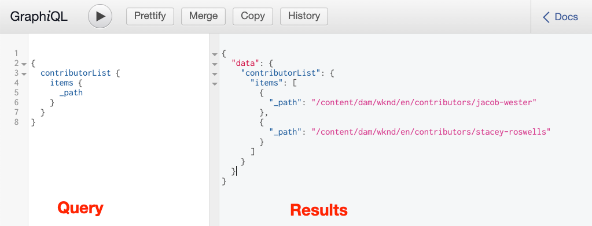
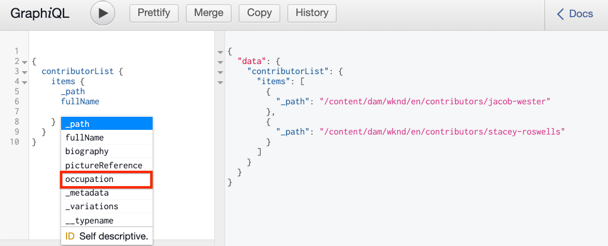

# Explore GraphQL APIs {#explore-graphql-apis}

>[!CAUTION]
>
> The AEM GraphQL API for Content Fragment Delivery will be released in early 2021.
> The related documentation is available for preview purposes.

The GraphQL API of AEM provide a powerful query language to expose data of Content Fragments to downstream applications. Content Fragment models define the data schema that is used by Content Fragments. Whenever a Content Fragment Model is created or updated, the schema is translated and added to the "graph" that makes up the GraphQL API.

In this chapter, we will explore some common GraphQL queries to gather content. Built into AEM is an IDE called [GraphiQL](https://github.com/graphql/graphiql). The GraphiQL IDE allows you to quickly test and refine the queries and data returned. GraphiQL also provides easy access to the documentation, making it easy to learn and understand what methods are available.

## Prerequisites {#prerequisites}

This is a multi-part tutorial and it is assumed that the steps outlined in the [Authoring Content Fragments](./author-content-fragments.md) have been completed.

## Objectives {#objectives}

* Learn to use the GraphiQL tool to construct a query using GraphQL syntax.
* Learn how to query a list of Content Fragments and a single Content Fragment.
* Learn how to filter and request specific data attributes.
* Learn how to query a variation of a Content Fragment.
* Learn how to join a query of multiple Content Fragment models

## Query a list of Content Fragments {#query-list-cf}

A common requirement will be to query for multiple Content Fragments.

1. Navigate to the GraphiQL IDE at [http://localhost:4502/content/graphiql.html](http://localhost:4502/content/graphiql.html).
1. Paste the following query in the left panel (below the list of comments):

    ```graphql
    {
      contributorList {
        items {
            _path
          }
      }
    }
    ```

1. Press the **Play** button in the top menu to execute the query. You should see the results of the Contributors content fragments from the previous chapter:

    

1. Position the cursor beneath the `_path` text and enter **CTRL+Space** to trigger code hinting. Add `fullName` and `occupation` to the query.

    

1. Execute the query again by pressing the **Play** button and you should see the results include the additional properties of `fullName` and `occupation`.

    

    `fullName` and `occupation` are simple properties. Recall from the [Defining Content Fragment Models](./content-fragment-models.md) chapter that `fullName` and `occupation` are the values used when defining the **Property Name** of the respective fields.

1. `pictureReference` and `biography` represent more complex fields. Update the query with the following to return data about the `pictureReference` and `biography` fields.

    ```graphql
    {
    contributorList {
        items {
          _path
          fullName
          occupation
          biography {
            html
          }
          pictureReference {
            ... on ImageRef {
                _path
                width
                height
                }
            }
        }
      }
    }
    ```

    `biography` is a multi-line text field and the GraphQL API allows us to choose a variety of formats for the results like `html`, `markdown`, `json` or `plaintext`.

    `pictureReference` is a content reference and it is expected to be an image, therefore built-in `ImageRef` object is used. This allows us to request additional data about the image being reference, like the `width` and `height`.

1. Next, experiment with querying for a list of **Adventures**. Execute the following query:

    ```graphql
    {
      adventureList {
        items {
          adventureTitle
          adventureType
          adventurePrimaryImage {
            ...on ImageRef {
              _path
              mimeType
            }
          }
        }
      }
    }
    ```

    You should see a list of **Adventures** returned. Feel free to experiment by adding additional fields to the query.

## Filter a List of Content Fragments {#filter-list-cf}

Next, let's look at how it is possible to filter the results to a subset of Content Fragments based on a property value.

1. Enter the following query in the GraphiQL UI:

    ```graphql
    {
    contributorList(filter: {
      occupation: {
        _expressions: {
          value: "Photographer"
          }
        }
      }) {
        items {
          _path
          fullName
          occupation
        }
      }
    }
    ```

    The above query performs a search against all Contributors in the system. The added filter to the beginning of the query will perform a comparison on the `occupation` field and the string "**Photographer**".

1. Execute the query, it is expected that only a single **Contributor** is returned.
1. Enter the following query to query a list of **Adventures** where the `adventureActivity` is **not** equal to **"Surfing"**:

    ```graphql
    {
      adventureList(filter: {
        adventureActivity: {
            _expressions: {
                _operator: EQUALS_NOT
                value: "Surfing"
            }
        }
    }) {
        items {
        _path
        adventureTitle
        adventureActivity
        }
      }
    }
    ```

1. Execute the query and inspect the results. Observe that none of the results include an `adventureType` equal to **"Surfing"**.

There are many other options for filtering and creating complex queries, above are just a few examples.

## Query a single Content Fragment {#query-single-cf}

It is also possible to directly query a single Content Fragment. Content in AEM is stored in a hierarchical manner and the unique identifier for a fragment is based on the fragment's path. If the goal is to return data about a single fragment it is preferred to use the path and query the model directly. Using this syntax means that the query complexity will be very low and will generate a faster result.

1. Enter the following query in the GraphiQL editor:

    ```graphql
    {
     contributorByPath(_path: "/content/dam/wknd/en/contributors/stacey-roswells") {
        item {
          _path
          fullName
          biography {
            html
          }
        }
      }
    }
    ```

1. Execute the query and observe that the single result for the **Stacey Roswells** fragment is returned.

    In the previous exercise, you used a filter to narrow down a list of results. You could use a similar syntax to filter by path, however the above syntax is preferred for performance reasons.

1. Recall in the [Authoring Content Fragments](./author-content-fragments.md) chapter that a **Summary** variation was created for **Stacey Roswells**. Update the query to return the **Summary** variation:

    ```graphql
    {
    contributorByPath
    (
        _path: "/content/dam/wknd/en/contributors/stacey-roswells"
        variation: "summary"
    ) {
        item {
          _path
          fullName
          biography {
            html
          }
        }
      }
    }
    ```

    Even though the variation was named **Summary**, variations are persisted in lowercase and therefore `summary` is used.

1. Execute the query and observe that the `biography` field contains a much shorter `html` result.

## Query for Multiple Content Fragment Models {#query-multiple-models}

It is also possible to combine separate queries into a single query. This is useful for minimizing the number of HTTP requests needed to power the application. For example the *Home* view of an application may display content based on **two** different Content Fragment Models. Rather than executing **two** separate queries, we can combine the queries into a single request.

1. Enter the following query in the GraphiQL editor:

    ```graphql
    {
      adventureList {
        items {
          _path
          adventureTitle
        }
      }
      contributorList {
        items {
          _path
          fullName
        }
      }
    }
    ```

1. Execute the query and observe that the result set contains data from **Adventures** and **Contributors**:

  ```json
  {
    "data": {
      "adventureList": {
        "items": [
          {
            "_path": "/content/dam/wknd/en/adventures/bali-surf-camp/bali-surf-camp",
            "adventureTitle": "Bali Surf Camp"
          },
          {
            "_path": "/content/dam/wknd/en/adventures/beervana-portland/beervana-in-portland",
            "adventureTitle": "Beervana in Portland"
          },
          ...
        ]
      },
      "contributorList": {
        "items": [
          {
            "_path": "/content/dam/wknd/en/contributors/jacob-wester",
            "fullName": "Jacob Wester"
          },
          {
            "_path": "/content/dam/wknd/en/contributors/stacey-roswells",
            "fullName": "Stacey Roswells"
          }
        ]
      }
    }
  }
  ```

## Congratulations! {#congratulations}

Congratulations, you just created and executed several GraphQL queries!

## Next Steps {#next-steps}

In the next chapter, [Querying AEM from a React app](./graphql-and-external-app.md), you will explore how an external application can query AEM's GraphQL endpoints. The external app modifying the sample WKND GraphQL React app to add filtering GraphQL queries, allowing the app's user to filter adventures by activity. You will also be introduced to some basic error handling.
