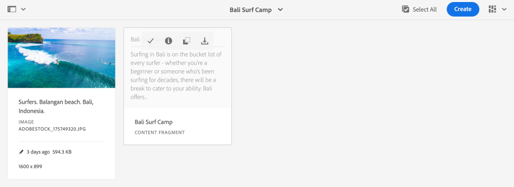
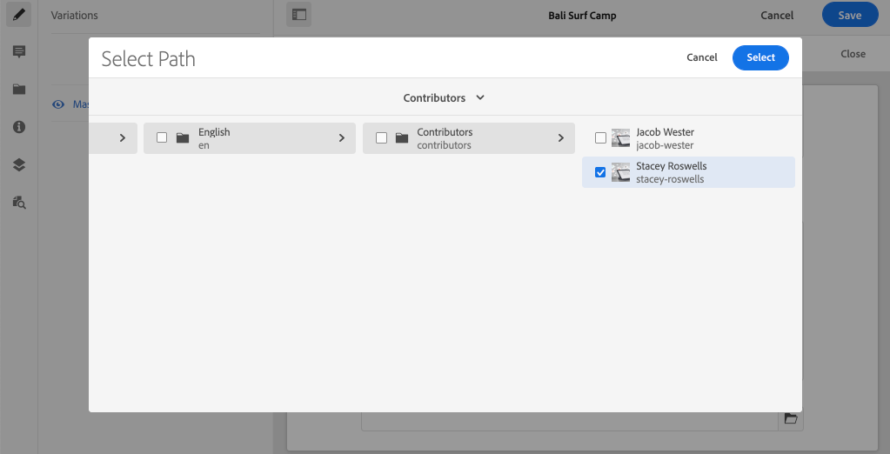
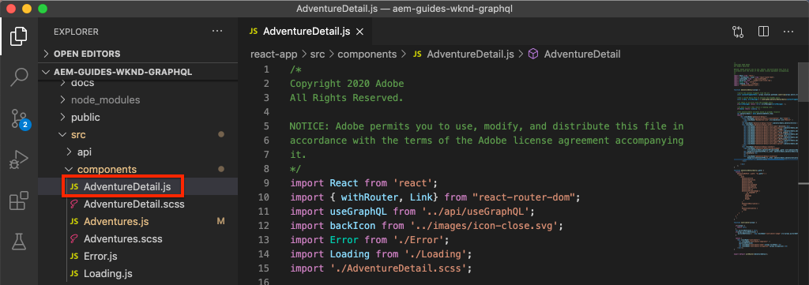

# Advanced data modeling with Fragment References

>[!CAUTION]
>
> The AEM GraphQL API for Content Fragment Delivery will be released in early 2021.
> The related documentation is available for preview purposes.

It is possible to reference a Content Fragment from within another Content Fragments. This enables a user to build complex data models with relationships between Fragments.

In this chapter you will update the Adventure model to include a reference to the Contributor model using the **Fragment Reference** field. You will also learn how to modify a GraphQL query to include fields from a referenced model.

## Prerequisites

This is a multi-part tutorial and it is assumed that the steps outlined in the previous parts have been completed.

## Objectives

In this chapter, we'll learn how to:

* Update a Content Fragment Model to use the Fragment Reference field
* Create a GraphQL query that returns fields from a referenced model

## Add a Fragment Reference {#add-fragment-reference}

Update the Adventure Content Fragment Model to add a reference to the Contributor model.

1. Open a new browser and navigate to AEM.
1. From the **AEM Start** menu navigate to **Tools** > **Assets** > **Content Fragment Models** > **WKND Site**.
1. Open the **Adventure** Content Fragment Model

    

1. Under **Data Types**, drag and drop a **Fragment Reference** field into the main panel.

    

1. Update the **Properties** for this field with the following:

    * Render As - `fragmentreference`
    * Field Label - **Adventure Contributor**
    * Property Name - `adventureContributor`
    * Model Type -  Select the **Contributor** model
    * Root Path - `/content/dam/wknd`

    

    The property name `adventureContributor` can now be used to reference a Contributor Content Fragment.

1. Save the changes to the model.

## Assign a Contributor to an Adventure

Now that the Adventure Content Fragment model has been updated, we can edit an existing fragment and reference a Contributor. It should be noted that editing the Content Fragment model *affects* any existing Content Fragments created from it.

1. Navigate to **Assets** > **Files** > **WKND Site** > **English** > **Adventures** > **[Bali Surf Camp](http://localhost:4502/assets.html/content/dam/wknd/en/adventures/bali-surf-camp)**.

    

1. Click into the **Bali Surf Camp** content fragment to open the Content Fragment Editor.
1. Update the **Adventure Contributor** field and select a Contributor by clicking the folder icon.

    

    *Select a path to a Contributor Fragment*

    

    Notice that only fragments created using the **Contributor** model are able to be selected.

1. Save the changes to the fragment.

1. Repeat the above steps to assign a contributor to adventures like [Yosemite Backpacking](http://localhost:4502/editor.html/content/dam/wknd/en/adventures/yosemite-backpacking/yosemite-backpacking) and [Colorado Rock Climbing](http://localhost:4502/editor.html/content/dam/wknd/en/adventures/colorado-rock-climbing/colorado-rock-climbing)

## Query nested Content Fragment with GraphiQL

Next, perform a query for an Adventure and add nested properties of the referenced Contributor model. We will use the GraphiQL tool to quickly verify the syntax of the query.

1. Navigate to GraphiQL tool in AEM: [http://localhost:4502/content/graphiql.html](http://localhost:4502/content/graphiql.html)

1. Enter the following query:

    ```graphql
    {
      adventureByPath(_path:"/content/dam/wknd/en/adventures/bali-surf-camp/bali-surf-camp") {
         item {
           _path
           adventureTitle
           adventureContributor {
             fullName
             occupation
             pictureReference {
            ...on ImageRef {
              _path
            }
          }
        }
      }
     }
    }
    ```

   The above query is for a single Adventure by it's path. The `adventureContributor` property references the Contributor model and we can then request properties from the nested Content Fragment.

1. Execute the query and you should get a result like the following:

    ```json
    {
      "data": {
        "adventureByPath": {
            "item": {
                "_path": "/content/dam/wknd/en/adventures/bali-surf-camp/bali-surf-camp",
                "adventureTitle": "Bali Surf Camp",
                "adventureContributor": {
                    "fullName": "Stacey Roswells",
                    "occupation": "Photographer",
                    "pictureReference": {
                        "_path": "/content/dam/wknd/en/contributors/stacey-roswells.jpg"
                    }
                }
            }
         }
      }
    }
    ```

1. Experiment with other queries like `adventureList` and add properties for the referenced Content Fragment under `adventureContributor`.

## Update the React app to display Contributor content

Next, update the queries used by the React Application to include the new Contributor and display information about the Contributor as part of the Adventure details view.

1. Open the WKND GraphQL React app in your IDE.

1. Open the file `src/components/AdventureDetail.js`.

    

1. Find the function `adventureDetailQuery(_path)`. The `adventureDetailQuery(..)` function simply wraps a filtering GraphQL query, which uses AEM's `<modelName>ByPath` syntax to query a single Content Fragment identified by its JCR path.

1. Update the query to include information about the referenced Contributor:

    ```javascript
    function adventureDetailQuery(_path) {
        return `{
            adventureByPath (_path: "${_path}") {
            item {
                _path
                adventureTitle
                adventureActivity
                adventureType
                adventurePrice
                adventureTripLength
                adventureGroupSize
                adventureDifficulty
                adventurePrice
                adventurePrimaryImage {
                    ... on ImageRef {
                    _path
                    mimeType
                    width
                    height
                    }
                }
                adventureDescription {
                    html
                }
                adventureItinerary {
                    html
                }
                adventureContributor {
                    fullName
                    occupation
                    pictureReference {
                        ...on ImageRef {
                            _path
                        }
                    }
                }
              }
           }
         }
        `;
    }
    ```

    With this update additional properties about the `adventureContributor`, `fullName`, `occupation`, and `pictureReference` will be included in the query.

1. Inspect the `Contributor` component embedded in the `AdventureDetail.js` file at `function Contributor(...)`. This component will render the Contributor's name, occupation and picture if the properties exist.

    The `Contributor` component is referenced in the `AdventureDetail(...)` `return` method:

    ```javascript
    function AdventureDetail(props) {
        ...
        return (
            ...
             <h2>Itinerary</h2>
            <hr />
            <div className="adventure-detail-itinerary"
                 dangerouslySetInnerHTML={{__html: adventureData.adventureItinerary.html}}></div>
            {/* Contributor component is instaniated and 
                is passed the adventureContributor object from the GraphQL Query results */}
            <Contributer {...adventureData.adventureContributor} />
            ...
        )
    }
    ```

1. Save the changes to the file.
1. Start the React App, if not already running:

    ```shell
    $ cd aem-guides-wknd-graphql/react-app
    $ npm start
    ```

1. Navigate to [http://localhost:3000](http://localhost:3000/) and click an Adventure that has a referenced Contributor. You should now see the Contributor information listed below the **Itinerary**:

    


## Congratulations!{#congratulations}

Congratulations! You've updated an existing Content Fragment Model to reference a nested Content Fragment using the **Fragment Reference** field. You also learned how to modify a GraphQL query to include fields from a referenced model.
