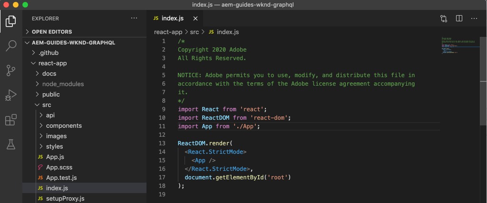
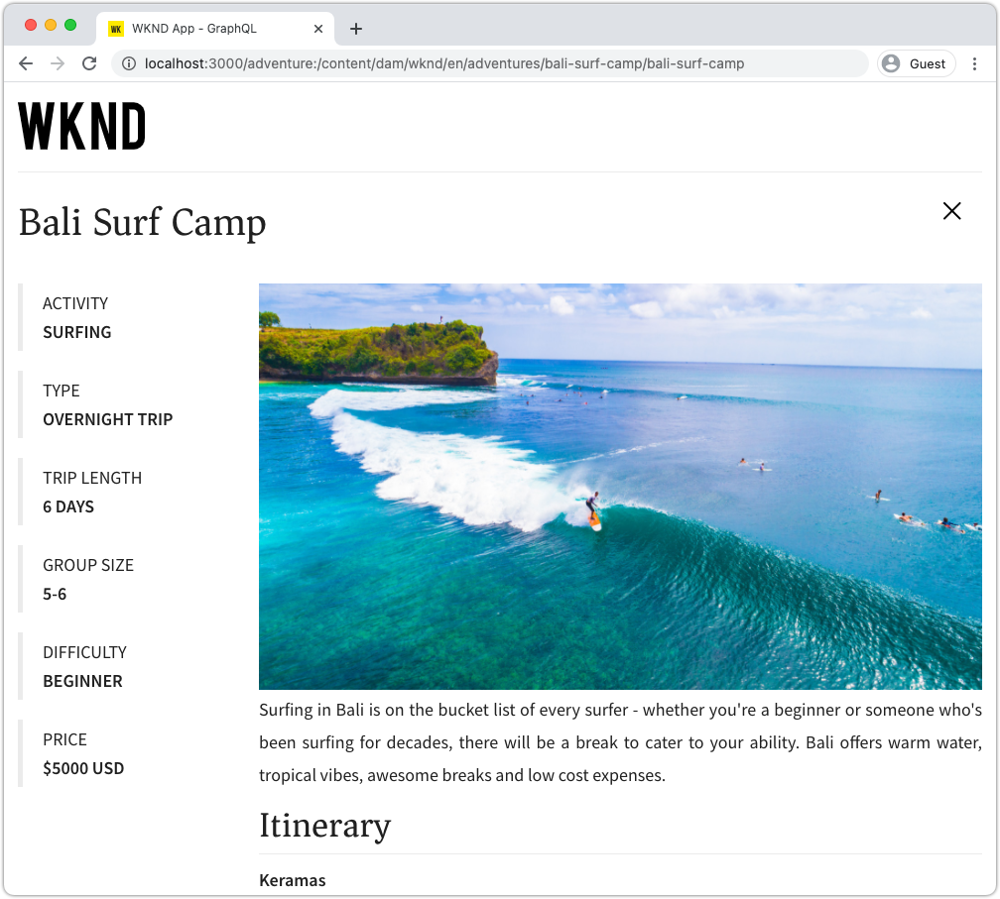
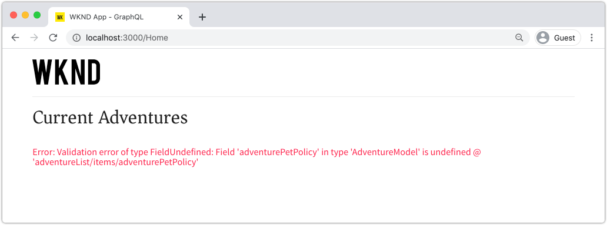

# Query AEM using GraphQL from an external app

In this chapter, we explore how AEM's GraphQL APIs can be used to drive the experience in an external application.

This tutorial uses a simple React app to query and display Adventure content exposed by AEM's GraphQL APIs. The use of React is largely unimportant, and the consuming external application could be written in any framework for any platform.

## Prerequisites

This is a multi-part tutorial and it is assumed that the steps outlined in the previous parts have been completed.

_IDE screenshots in this chapter come from [Visual Studio Code](https://code.visualstudio.com/)_

Optionally, install a browser extension like [GraphQL Network](https://chrome.google.com/webstore/detail/graphql-network/igbmhmnkobkjalekgiehijefpkdemocm) to be able to view more details about a GraphQL query.

## Objectives

In this chapter, we'll learn how to:

* Start and understand the functionality of the sample React app
* Explore how calls are made from the external app to AEM's GraphQL end-points
* Define a GraphQL query to filter a list of adventures Content Fragments by activity 
* Update the React app to provide controls to filter via GraphQL, the list of adventures by activity

## Start the React app

As this chapter focuses on developing a client to consume Content Fragments over GraphQL, the sample [WKND GraphQL React app source code must be downloaded and setup](./setup.md#react-app) on your local machine, and the [AEM SDK is running as the Author service](./setup.md#aem-sdk) with the [sample WKND Site installed](./setup.md#wknd-site).

Starting the React app is outlined in more detail in the [Quick Setup](./setup.md) chapter, however the abridged instructions can be followed:

1. If you haven't already, clone the sample WKND GraphQL React app from [Github.com](https://github.com/adobe/aem-guides-wknd-graphql)

    ```shell
    $ git clone --branch tutorial/react git@github.com:adobe/aem-guides-wknd-graphql.git
    ```

1. Open the WKND GraphQL React app in your IDE

    

1. From the command line, navigate into the `react-app` folder
1. Start the WKND GraphQL React app, by executing the following command from the project root (the `react-app` folder)

    ```shell
    $ cd aem-guides-wknd-graphql/react-app
    $ npm start
    ```

1. Review the app at [http://localhost:3000/](http://localhost:3000/). The sample React app has two main parts:

    * The home experience acts as an index of WKND Adventures, by querying __Adventure__ Content Fragments in AEM using GraphQL. In this chapter, we'll modify this this view to support filtering of adventures by activity.

        

    * The adventure details experience, uses GraphQL to query the specific __Adventure__ Content Fragment, and displays more data points.

        

1. Use the browser's development tools and a browser extension like [GraphQL Network](https://chrome.google.com/webstore/detail/graphql-network/igbmhmnkobkjalekgiehijefpkdemocm) to inspect the GraphQL queries sent to AEM and their JSON responses. This approach can be used to monitor GraphQL requests and responses to ensure they are formulated correctly, and their responses are as expected.

    

    *GraphQL query sent to AEM from the React app*

    

    *JSON response from AEM to the React app*

    The queries and response should match what was seen in the GraphiQL IDE.

    >[!NOTE]
    >
    > During development, the React app is configured to proxy HTTP requests through the webpack development server to AEM. The React app is making requests to  `http://localhost:3000` which proxies them to the AEM Author service running on `http://localhost:4502`. Review the file `src/setupProxy.js` and `env.development` for details.
    >
    > In non-development scenarios, the React app would be configured directly make requests to AEM.

## Explore the app's GraphQL code

1. In your IDE open the file `src/api/useGraphQL.js`.

    This is a [React Effect Hook](https://reactjs.org/docs/hooks-overview.html#effect-hook) that listens for changes to the app's `query`, and on change makes a HTTP POST request to the AEM GraphQL end-point, and returns the JSON response to the app.

    Any time the React app needs to make a GraphQL query, it invokes this custom `useGraphQL(query)` hook, passing in the GraphQL to send to AEM.

    This Hook uses the simple `fetch` module to make the HTTP POST GraphQL request, but other modules such as the [Apollo GraphQL client](https://www.apollographql.com/docs/react/) can used similarly.

1. Open `src/components/Adventures.js` in the IDE, which is responsible for the home view's adventures listing, and review the invocation of the `useGraphQL` hook.
 
    This code sets the default `query` to be the `allAdventuresQuery` as defined lower down in this file.

    ```javascript
    const [query, setQuery] = useState(allAdventuresQuery);
    ```

    ... and any time the `query` variable changes, the `useGraphQL` hook is invoked, which in turns executes the GraphQL query against AEM, returning the JSON to the `data` variable, which is then used to render the list of adventures. 

    ```javascript
    const { data, errorMessage } = useGraphQL(query);
    ```

    The `allAdventuresQuery` is a constant GraphQL query defined in the file, that queries all Adventure Content Fragments, without any filtering, and returns only the data points needs to render the home view.

    ```javascript
    const allAdventuresQuery = `
    {
        adventureList {
          items {
            _path
            adventureTitle
            adventurePrice
            adventureTripLength
            adventurePrimaryImage {
            ... on ImageRef {
                _path
                mimeType
                width
                height
              }
            }
          }
      }
    }
    `;
    ```

1. Open `src/components/AdventureDetail.js`, the React component responsible for displaying the adventure details experience. This view requests a specific Content Fragment, using it's JCR path as its unique id, and renders the provided details.

    Similarly to `Adventures.js`, the custom `useGraphQL` React Hook is re-used to perform that GraphQL query against AEM.

    The Content Fragment's path is collected from the component's `props` top be used to specify the Content Fragment to query for.

    ```javascript
    const contentFragmentPath = props.location.pathname.substring(props.match.url.length);
    ```

    ... and the GraphQL parameterized query is constructed using the `adventureDetailQuery(..)` function, and passed to `useGraphQL(query)` which executes the GraphQL query against AEM and returns the results to the `data` variable.

    ```javascript
    const { data, errorMessage } = useGraphQL(adventureDetailQuery(contentFragmentPath));
    ```

    The `adventureDetailQuery(..)` function simply wraps a filtering GraphQL query, which uses AEM's `<modelName>ByPath` syntax to query a single Content Fragment identified by its JCR path, and returns all the specified data points required to render the adventure's details.

    ```javascript
    function adventureDetailQuery(_path) {
    return `{
        adventureByPath (_path: "${_path}") {
          item {
            _path
            adventureTitle
            adventureActivity
            adventureType
            adventurePrice
            adventureTripLength
            adventureGroupSize
            adventureDifficulty
            adventurePrice
            adventurePrimaryImage {
                ... on ImageRef {
                _path
                mimeType
                width
                height
                }
            }
            adventureDescription {
                html
            }
            adventureItinerary {
                html
            }
          }
        }
    }
    `;
    }
    ```

## Create a parameterized GraphQL query

Next, let's modify the React app to perform parameterized, filtering GraphQL queries that restrict the home view by the adventures' activity.

1. In your IDE, open the file: `src/components/Adventures.js`. This file represents the home experience's adventures component, that queries for and displays the Adventures cards.
1. Inspect the function `filterQuery(activity)`, which is unused, but has been prepared to formulate a GraphQL query that filters adventures by `activity`.

    Notice that parameter `activity` is injected into the GraphQL query as part of a `filter` on the `adventureActivity` field, requiring that field's value to match the parameter's value. 

    ```javascript
    function filterQuery(activity) {
        return `
            {
            adventures (filter: {
                adventureActivity: {
                _expressions: [
                    {
                    value: "${activity}"
                    }
                  ]
                }
            }){
                items {
                _path
                adventureTitle
                adventurePrice
                adventureTripLength
                adventurePrimaryImage {
                ... on ImageRef {
                    _path
                    mimeType
                    width
                    height
                }
                }
              }
          }
        }
        `;
    }
    ```

1. Update the React Adventures component's `return` statement to add buttons that invoke the new parameterized `filterQuery(activity)` to provide the adventures to list.

    ```javascript
    function Adventures() {
        ...
        return (
            <div className="adventures">

            {/* Add these three new buttons that set the GraphQL query accordingly */}

            {/* The first button uses the default `allAdventuresQuery` */}
            <button onClick={() => setQuery(allAdventuresQuery)}>All</button>

            {/* The 2nd and 3rd button use the `filterQuery(..)` to filter by activity */}
            <button onClick={() => setQuery(filterQuery('Camping'))}>Camping</button>
            <button onClick={() => setQuery(filterQuery('Surfing'))}>Surfing</button>

            <ul className="adventure-items">
            ...
        )
    }
    ```

1. Save the changes and reload the React app in the web browser. The three new buttons appear at the top, and clicking them automatically re-queries AEM for Adventure Content Fragments with the matching activity.

    

1. Try adding more filtering buttons for the activities: `Rock Climbing`, `Cycling` and `Skiing`

## Handle GraphQL errors

GraphQL is strongly typed and therefore can return helpful error messages if the query is invalid. Next, let's simulate an incorrect query to see the error message returned.

1. Re-open the file `src/api/useGraphQL.js`. Inspect the following snippet to see the error handling:

    ```javascript
    //useGraphQL.js
    .then(({data, errors}) => {
            //If there are errors in the response set the error message
            if(errors) {
                setErrors(mapErrors(errors));
            }
            //Otherwise if data in the response set the data as the results
            if(data) {
                setData(data);
            }
        })
        .catch((error) => {
            setErrors(error);
        });
    ```

    The response is inspected to see if it includes an `errors` object. The `errors` object will be sent by AEM if there are issues with the GraphQL query, such as an undefined field based on the schema. If there is no `errors` object the `data` is set and returned.

    The `window.fetch` includes a `.catch` statement to *catch* any common errors like an invalid HTTP request or if the connection to the server cannot be made.

1. Open the file `src/components/Adventures.js`.
1. Modify the `allAdventuresQuery` to include an invalid property `adventurePetPolicy`:

    ```javascript
    /**
     * Query for all Adventures
     * adventurePetPolicy has been added beneath items
    */
    const allAdventuresQuery = `
    {
        adventureList {
          items {
            adventurePetPolicy
            _path
            adventureTitle
            adventurePrice
            adventureTripLength
            adventurePrimaryImage {
            ... on ImageRef {
                _path
                mimeType
                width
                height
            }
            }
          }
        }
    }
    `;
    ```

    We know that `adventurePetPolicy` is not part of the Adventure model, so this should trigger an error.

1. Save the changes and return to the browser. You should see an error message like the following:

    

    The GraphQL API detects that `adventurePetPolicy` is undefined in the `AdventureModel` and returns an appropriate error message.

1. Inspect the response from AEM using the browser's developer tools to see the `errors` JSON object:

    

    The `errors` object is verbose and includes information about the location of the malformed query and classification of the error.

1. Return to `Adventures.js` and revert the query change, to return the app to its proper state.

## Congratulations!{#congratulations}

Congratulations! You've successfully explored the code of the sample WKND GraphQL React app and updated it to using parametrized, filtering GraphQL queries to list adventures by activity! You also got a chance to explore some basic error handling.

## Next Steps {#next-steps}

In the next chapter, [Advanced data modeling with Fragment References](./fragment-references.md) you will learn how use the Fragment Reference feature to create a relationship between two different Content Fragments. You will also learn how to modify a GraphQL query to include field from a referenced model.
