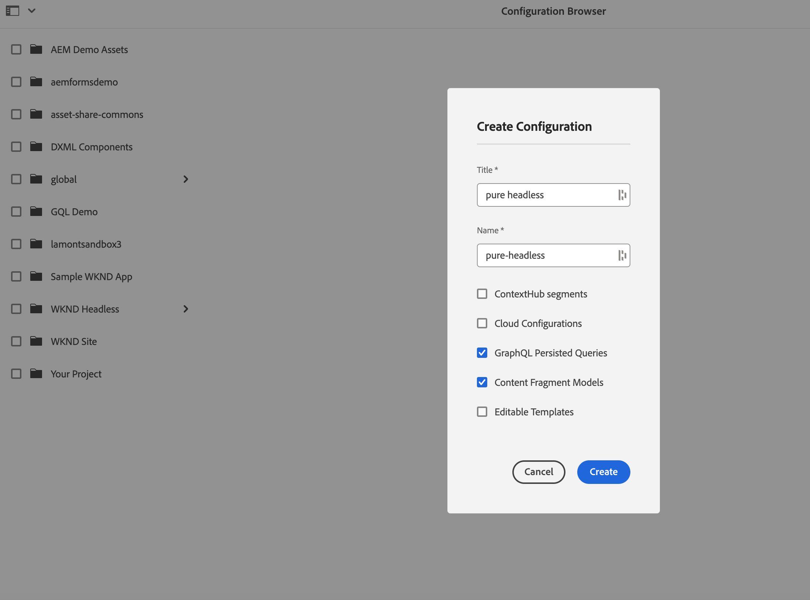
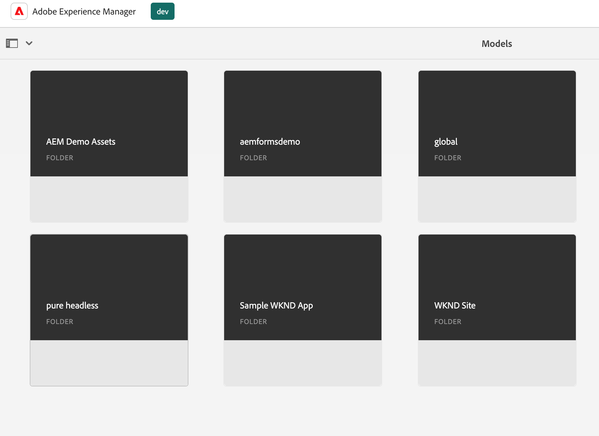
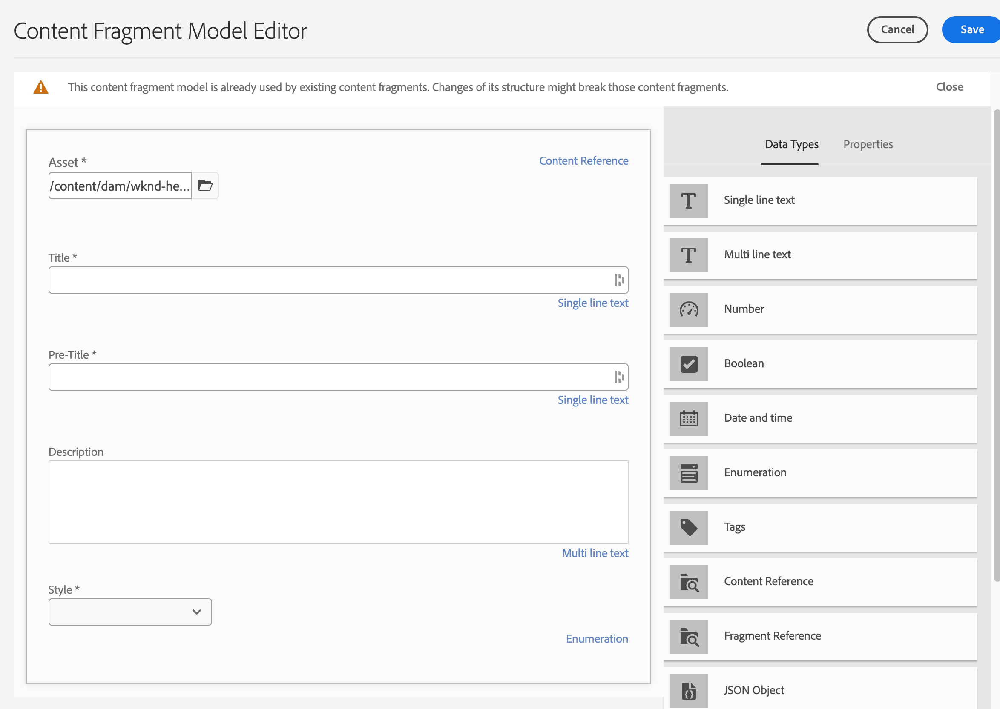
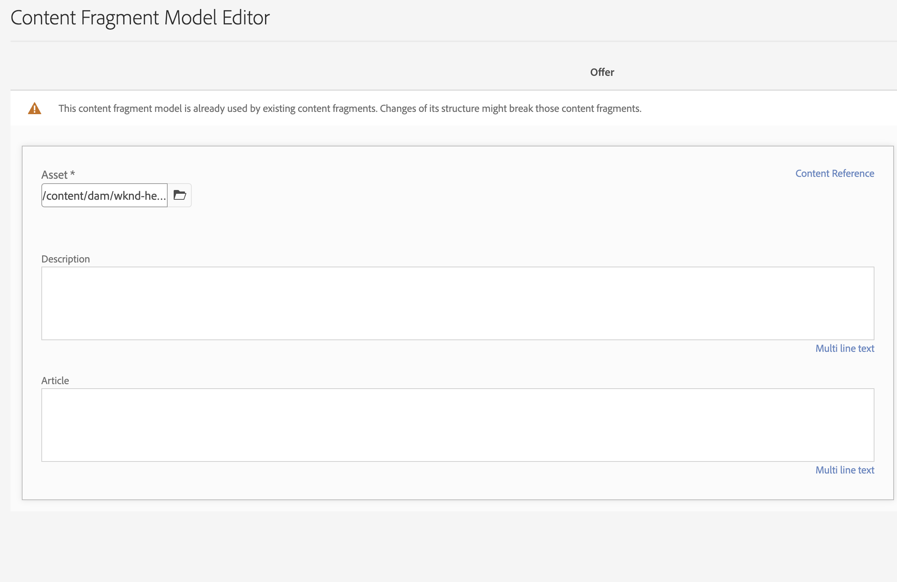
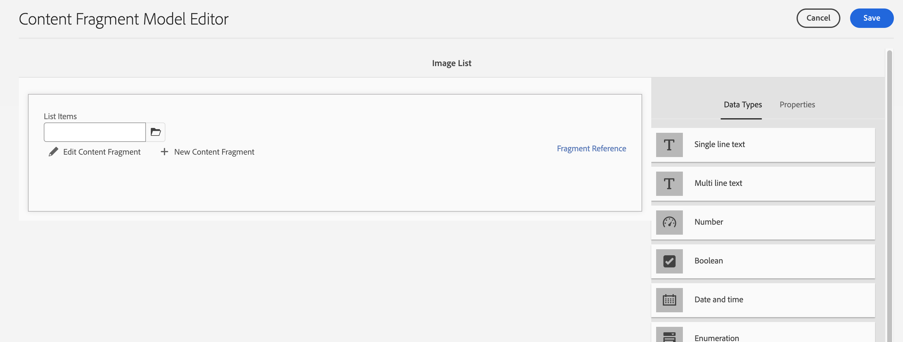
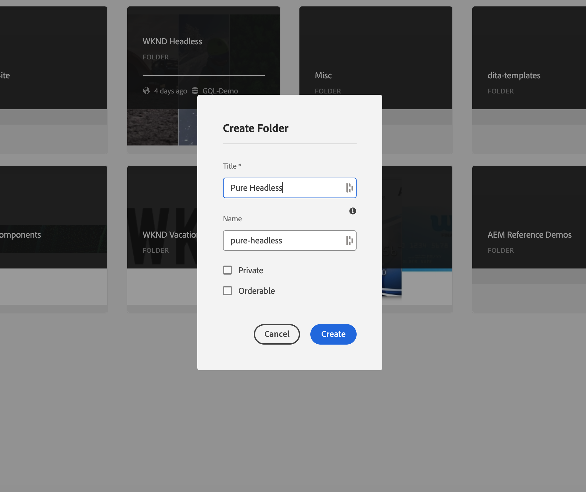
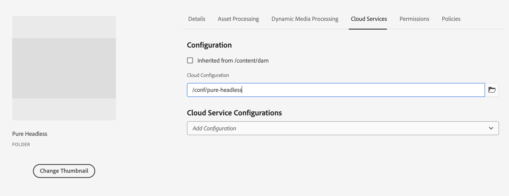
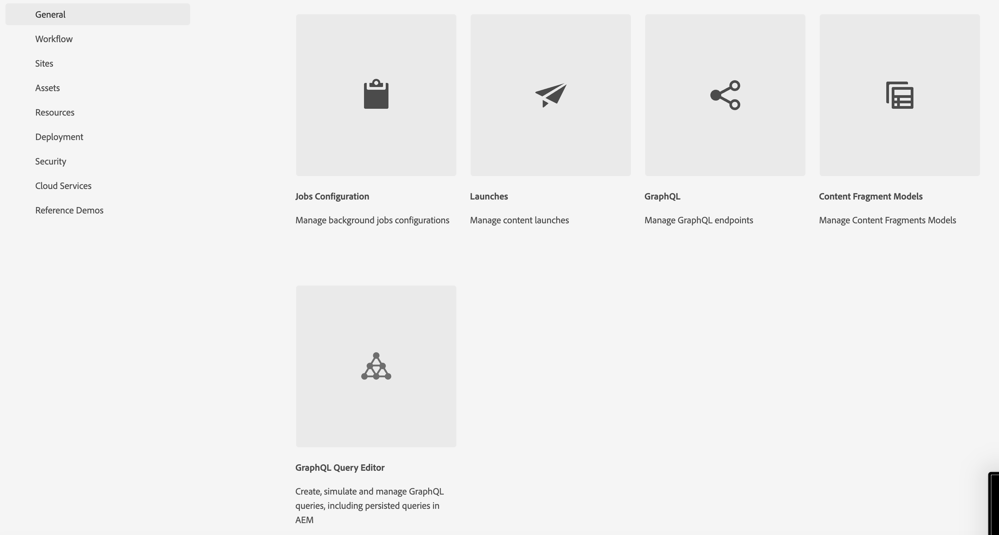
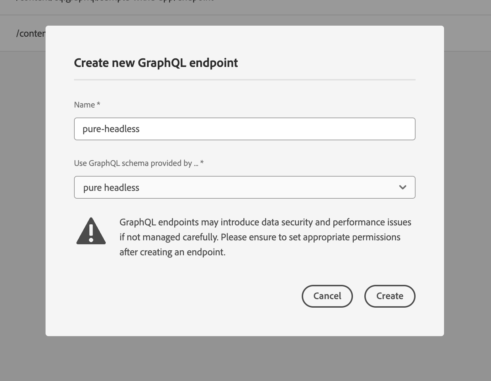

# Content modeling

Welcome to the tutorial chapter on Content Fragments and GraphQL endpoints in Adobe Experience Manager (AEM). We'll cover leveraging Content Fragments, creating Fragment Models, and using GraphQL endpoints in AEM.

Content Fragments offer a structured approach to managing content across channels, providing flexibility and reusability. Enabling Content Fragments in AEM allows modular content creation, enhancing consistency and adaptability.

First, we'll guide you through enabling Content Fragments in AEM, covering necessary configurations and settings for seamless integration.

Next, we'll cover creating Fragment Models, which define structure and attributes. Learn how to design models aligned with your content requirements and manage them effectively.

Then, we'll demonstrate creating Content Fragments from the models, providing step-by-step guidance on authoring and publishing.

Additionally, we'll explore defining AEM GraphQL endpoints. GraphQL efficiently retrieves data from AEM, and we'll set up and configure endpoints to expose desired data. Persisted queries will optimize performance and caching.

Throughout the tutorial, we'll provide explanations, code examples, and practical tips. By the end, you'll have the skills to enable Content Fragments, create Fragment Models, generate Fragments, and define AEM GraphQL endpoints and persisted queries. Let's get started!

## Context-aware Configuration

1. Navigate to __Tools > Configuration Browser__ to create a configuration for the headless experience.

    

    Provide a __title__ and __name__, and check __GraphQL Persisted Queries__ and __Content Fragment Models__.


## Content Fragment Models

1. Navigate to __Tools > Content Fragment Models__ and select the folder with the name of the configuration created in step 1.

    

1. Inside the folder, select __Create__ and name the model __Teaser__. Add the following datatypes to the __Teaser__ model.

    | Datatype | Name | Required | Options |
    |----------|------|----------|---------|
    | Content Reference | Asset | yes | Add a default image if you'd like. Ex: /content/dam/wknd-headless/assets/AdobeStock_307513975.mp4 |
    | Single line text | Title | yes |
    | Single line text | Pre-Title | no |
    | Multi line text | Description | no | Ensure that default type is rich text |
    | Enumeration | Style | yes | Render as dropdown. Options are Hero -> hero and Featured -> featured |

    

1. Inside the folder, create a second model named __Offer__. Click create and give the model the name "Offer" and add the following datatypes:

    | Datatype | Name | Required | Options |
    |----------|------|----------|---------|
    | Content Reference | Asset | yes | Add default image. Ex: `/content/dam/wknd-headless/assets/AdobeStock_238607111.jpeg` |
    | Multi line text | Description | no ||
    | Multi line text | Article | no ||

    

1. Inside the folder, create a third model named __Image List__. Click create and give the model the name "Image List" and add the following datatypes:

    | Datatype | Name | Required | Options |
    |----------|------|----------|---------|
    | Fragment Reference | List Items | yes | Render as Multiple Field. Allowed content fragment model is Offer. |

    

## Content Fragments

1. Now navigate to Assets and create a folder for the new site. Click create and name the folder.

    

1. After the folder is created, select the folder and open its __Properties__.
1. In the folder's __Cloud Configurations__ tab, select the configuration [created earlier](#enable-content-fragments-and-graphql).

    

   Click into the new folder and create a teaser. Click __Create__ and __Content Fragment__ and select the __Teaser__ model. Name the model __Hero__ and click __Create__.

    | Name | Notes |
    |----------|------|
    | Asset | Leave as default value or choose a different asset (video or image) |
    | Title | `Explore. Discover. Live.` |
    | Pre-Title | `Join use for your next adventure.` |
    | Description |Leave blank |
    | Style | `Hero` |

    

## GraphQL endpoints

1. Navigate to __Tools > GraphQL__

    

1. Click __Create__ and give the new endpoint a name and choose the newly created configuration.

    

## GraphQL Persisted Queries

1. Let's test the new endpoint. Navigate to __Tools > GraphQL Query Editor__ and choose our endpoint for the drop down in the top-right of the window.

1. In the query editor, create a few different queries. 


    ```graphql
    {
        teaserList {
            items {
            title
            }
        }
    }
    ```

    You should get a list containing the single fragment created [above](#create-content).

    For this exercise, create a full query that the AEM headless app uses. Create a query that returns a single teaser by path. In the query editor, enter the following query:

    ```graphql
    query TeaserByPath($path: String!) {
    component: teaserByPath(_path: $path) {
        item {
        __typename
        _path
        _metadata {
            stringMetadata {
            name
            value
            }
        }
        title
        preTitle
        style
        asset {
            ... on MultimediaRef {
            __typename
            _authorUrl
            _publishUrl
            format
            }
            ... on ImageRef {
            __typename
            _authorUrl
            _publishUrl
            mimeType
            width
            height
            }
        }
        description {
            html
            plaintext
        }
        }
    }
    }
    ```

    In the __query variables__ input at the bottom, enter:

    ```json
    {
        "path": "/content/dam/pure-headless/hero"
    }
    ```

    >[!NOTE]
    >
    > You may need to adjust the query variable `path` based the folder and fragment names.


    Run the query to receive the results of the Content Fragment created earlier.

1. Click __Save__  to persist (save) the query and name the query __teaser__. This allows us to reference the query by name in the application.

## Next steps

Congratulations! You've successfully configured AEM as a Cloud Service to allow for the creation of Content Fragments and GraphQL endpoints. You've also created a Content Fragment Model and Content Fragment, and defined a GraphQL endpoint and persisted query. You are now ready to move on to the next tutorial chapter, where you will learn how to create an AEM Headless React application that consumes the Content Fragments and GraphQL endpoint you created in this chapter.

[Next Chapter: AEM Headless APIs and React](./2-aem-headless-apis-and-react.md)
