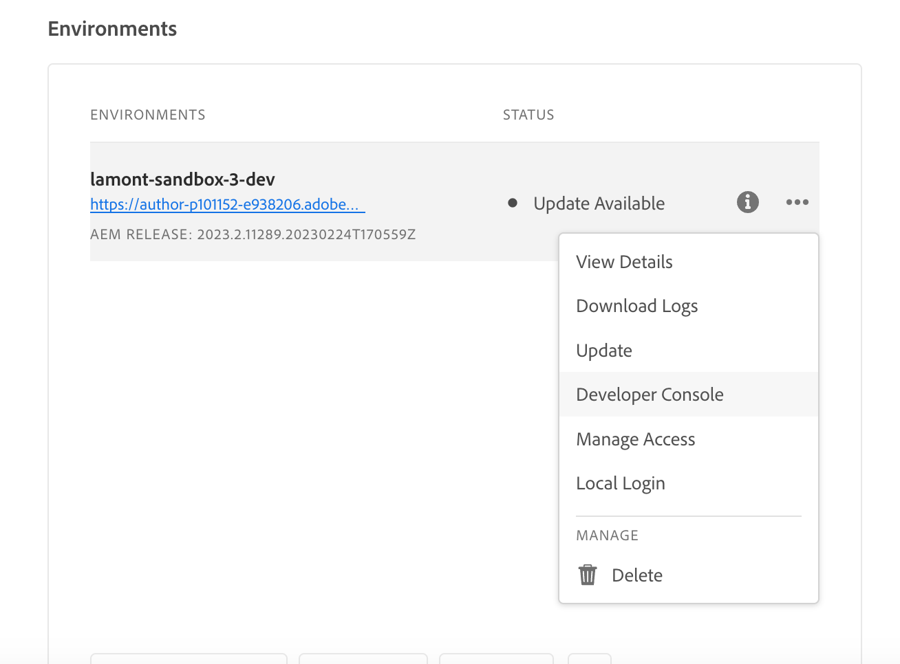
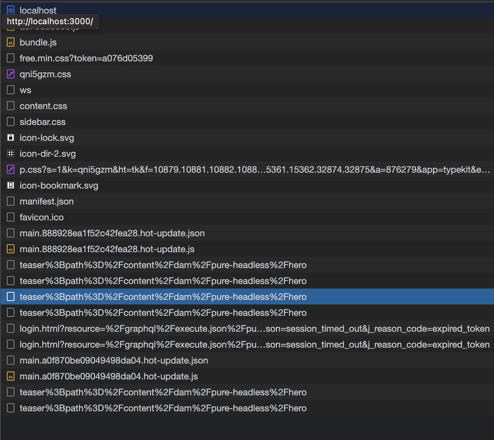

# AEM Headless APIs and React

Welcome to this tutorial chapter where we will explore configuring a React app to connect with Adobe Experience Manager (AEM) Headless APIs using the AEM Headless SDK. We'll cover retrieving Content Fragment data from AEM's GraphQL APIs and displaying it in the React app.

AEM Headless APIs allow accessing AEM content from any client app. We'll guide you through configuring your React app to connect to AEM Headless APIs using the AEM Headless SDK. This setup establishes a reusable communication channel between your React app and AEM.

Next, we'll use the AEM Headless SDK to retrieve Content Fragment data from AEM's GraphQL APIs. Content Fragments in AEM provide structured content management. By utilizing the AEM Headless SDK, you can easily query and fetch Content Fragment data using GraphQL.

Once we have the Content Fragment data, we'll integrate it into your React app. You'll learn how to format and display the data in an appealing manner. We'll cover best practices for handling and rendering Content Fragment data in React components, ensuring a seamless integration with your app's UI.

Throughout the tutorial, we'll provide explanations, code examples, and practical tips. By the end, you'll be able to configure your React app to connect to AEM Headless APIs, retrieve Content Fragment data using the AEM Headless SDK, and seamlessly display it in your React app. Let's get started!


## Clone the React app

1. Clone the app from [Github](https://github.com/lamontacrook/headless-first/tree/main) by executing the following command on the command line.

    ```
    $ git clone git@github.com:lamontacrook/headless-first.git
    ```

1. Change into the `headless-first` directory, and install the dependencies.

    ```
    $ cd headless-first
    $ npm ci
    ```

## Configure the React app

1. Create a file named `.env` at the root of the project. In `.env` set the following values:

    ```
    REACT_APP_AEM=<URL of the AEM instance>
    REACT_APP_ENDPOINT=<the name of the endpoint>
    REACT_APP_PROJECT=<the name of the folder with Content Fragments>
    REACT_APP_TOKEN=<developer token>
    ```

1. You can retrieve a developer token in Cloud Manager. Log in to [Adobe Cloud Manager](https://experience.adobe.com/). Click __Experience Manager > Cloud Manager__. Choose the appropriate Program and then click the ellipses next to the Environment.

    

    1. Click in the __Integrations__ tab
    1. Click __Local Token tab & Get Local Development Token__ button
    1. Copy the access token beginning after the open quote until before the close quote.
    1. Paste the copied token as the value for `REACT_APP_TOKEN` in the `.env` file.
    1. Let's now build the app by executing `npm ci` on the command line.
    1. Now start the React app and by executing `npm run start` on the command line.
    1. In [./src/utils](https://github.com/lamontacrook/headless-first/tree/main/src/utils) a file named `context.js`  includes the code to set the values in the `.env` file into the context of the app.

## Run the React app

1. Start the React app by executing `npm run start` on the command line.

    ```
    $ npm run start
    ```

    The React app will start and open a browser window to `http://localhost:3000`. Changes to the React app will be automatically reloaded in the browser.

## Connect to AEM Headless APIs

1. To connect the React app to AEM  as a Cloud Service, let's add a few things to `App.js`. In the `React` import, add `useContext`.

    ```javascript
    import React, {useContext} from 'react';
    ```

    Import `AppContext` from the `context.js` file.

    ```javascript
    import { AppContext } from './utils/context';
    ```

    Now within the app code, define a context variable.

    ```javascript
    const context = useContext(AppContext);
    ```

    And, finally wrap the return code in `<AppContext.Provider> ... </AppContext.Provider>`.

    ```javascript
    ...
    return(<div className='App'>
        <AppContext.Provider value={context}>
            ...
        </AppContext.Provider>
    </div>);
    ```

    For reference, the `App.js` should now be like this.

    ```javascript
    import React, {useContext} from 'react';
    import './App.css';
    import { BrowserRouter, Routes, Route } from 'react-router-dom';
    import Home from './screens/home/home';
    import { AppContext } from './utils/context';

    const App = () => {
    const context = useContext(AppContext);
    return (
        <div className='App'>
        <AppContext.Provider value={context}>
            <BrowserRouter>
            <Routes>
                <Route exact={true} path={'/'} element={<Home />} />
            </Routes>
            </BrowserRouter>
        </AppContext.Provider>
        </div>
    );
    };

    export default App;
    ```

1. Import the `AEMHeadless` SDK. This SDK is a helper library used by the app to interact with AEM's Headless APIs.

    Add this import statement to the `home.js`.

    ```javascript
    import AEMHeadless from '@adobe/aem-headless-client-js';
    ```

    Add the following `{ useContext, useEffect, useState }` to the` React` import statement.

    ```javascript
    import React, { useContext, useEffect, useState } from 'react';
    ```

    Import the `AppContext`.

    ```javascript
    import { AppContext } from '../../utils/context';
    ```

    Inside the `Home` component, get the `context` variable from the `AppContext`.

    ```javascript
    const Home = () => {
    const context = useContext(AppContext);
    ...
    }
    ```

1. Initialize the AEM Headless SDK inside a  `useEffect()`, since the AEM Headless SDK must change when the  `context` variable changes.

    ```javascript
    useEffect(() => {
    const sdk = new AEMHeadless({
        serviceURL: context.url,
        endpoint: context.endpoint,
        auth: context.token
    });
    }, [context]);  
    ```

    >[!NOTE]
    >
    > There is a `context.js` file under `/utils` that is reading elements from the `.env` file. For reference, the `context.url` is the URL of the AEM as a Cloud Service environment. The `context.endpoint` is the full path to the endpoint created in the previous lesson. Lastly, the `context.token` is the developer token.


1. Create React state that exposes the content coming from the AEM Headless SDK.

    ```javascript
    const Home = () => {
    const [content, setContent] = useState({});
    ...
    }
    ```

1. Connect the app to AEM. Use the persisted query created in the previous lesson. Let's add the following code inside the `useEffect` after the AEM Headless SDK is initialized. Make the `useEffect` dependent on the  `context` variable as seen below.


    ```javascript
    useEffect(() => {
    ...
    sdk.runPersistedQuery('<name of the endpoint>/<name of the persisted query>', { path: `/content/dam/${context.project}/<name of the teaser fragment>` })
        .then(({ data }) => {
        if (data) {
            setContent(data);
        }
        })
        .catch((error) => {
        console.log(`Error with pure-headless/teaser. ${error.message}`);
        });
    }, [context]);
    ```

1. Open the developer tools' Network view to review the GraphQL request.

    `<url to environment>/graphql/execute.json/pure-headless/teaser%3Bpath%3D%2Fcontent%2Fdam%2Fpure-headless%2Fhero`

    

    The AEM Headless SDK encodes the request for GraphQL and adds the provided parameters. You may open the request in the browser. 

    >[!NOTE]
    >
    > Since the request is going to the author environment, you must be logged into the environment in another tab of the same browser.


## Render Content Fragment content

1. Display the Content Fragments in the app. Return a `<div>` with the teaser's title.

    ```javascript
    return (
    <div className='main-body'>
        <div>{content.component && (content.component.item.title)}</div>
    </div>
    );
    ```

    You should see the title field of the teaser displayed on the screen.

1. The last step,  is to add the teaser to the page. A React teaser component is included in the package. First, let's include the import. At the top of the `home.js` file, add the line:

    `import Teaser from '../../components/teaser/teaser';`

    Update the return statement:

    ```javascript
    return (
    <div className='main-body'>
        <div>{content.component && <Teaser content={content.component.item} />}</div>
    </div>
    );
    ```

    You should now see the teaser with the content included within the fragment.


## Next Steps

Congratulations! You've successfully updated the React app to integrate with AEM Headless APIs using the AEM Headless SDK! 

Next, let's create a more complex Image List component that dynamically renders referenced Content Fragments from AEM.

[Next Chapter: Build an Image List component](./3-complex-components.md)
