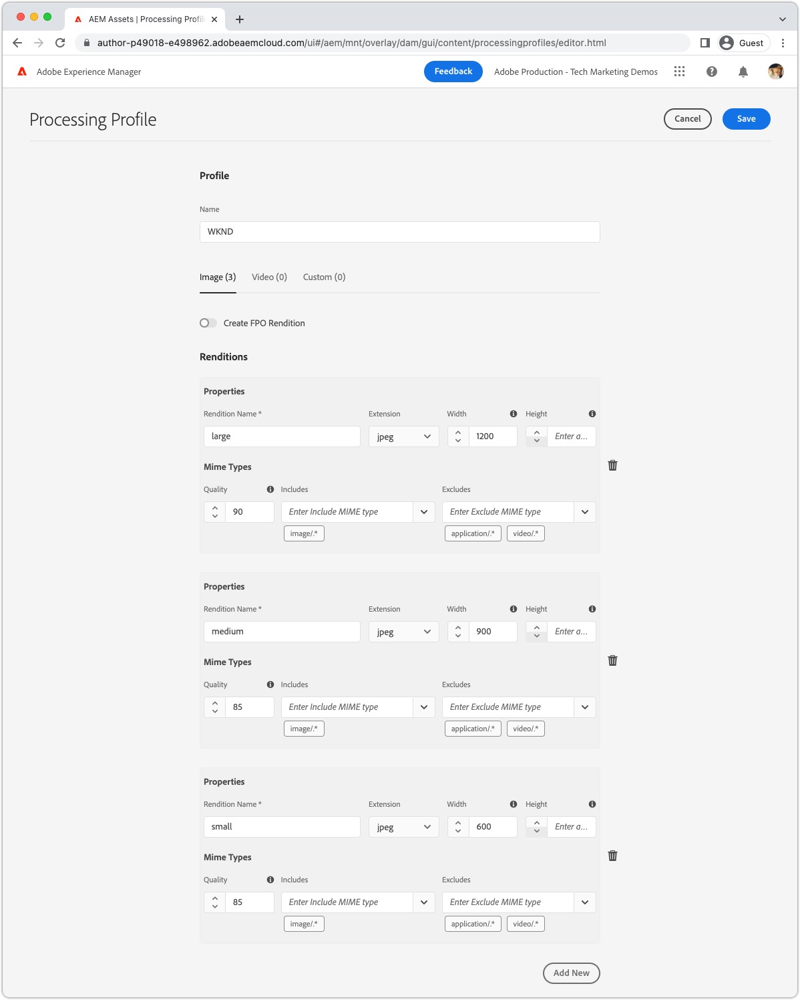
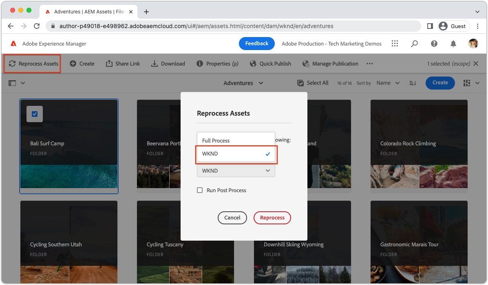
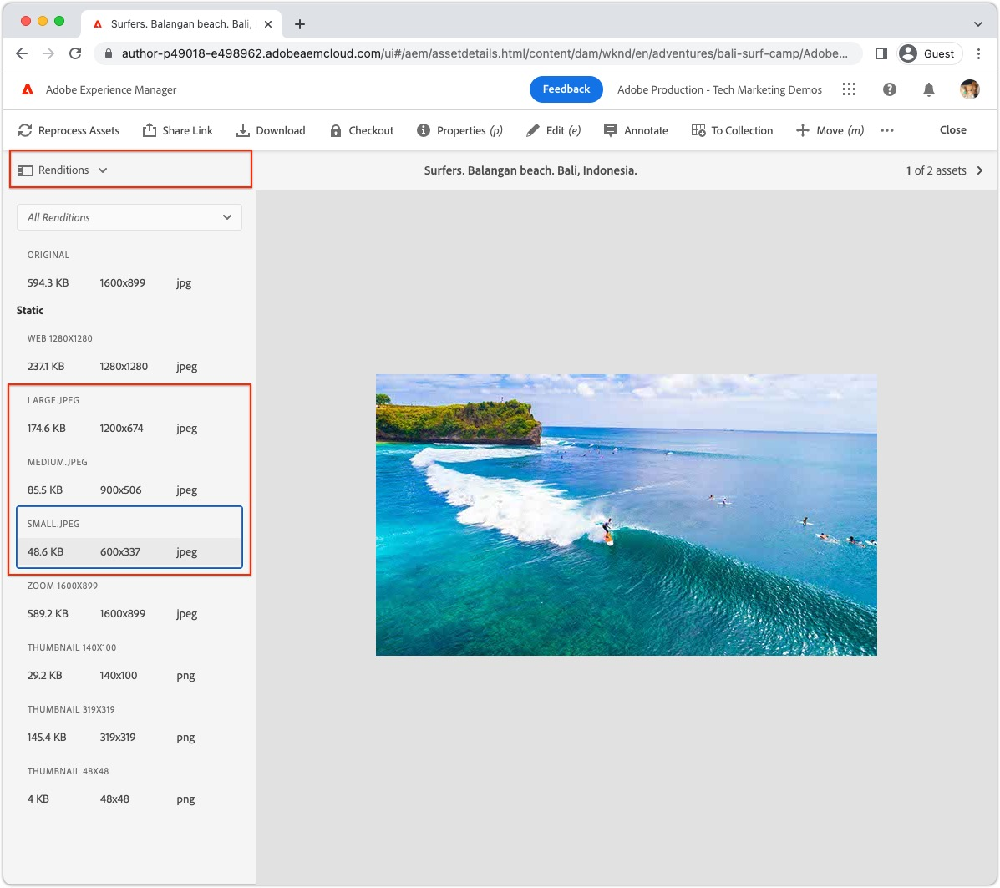
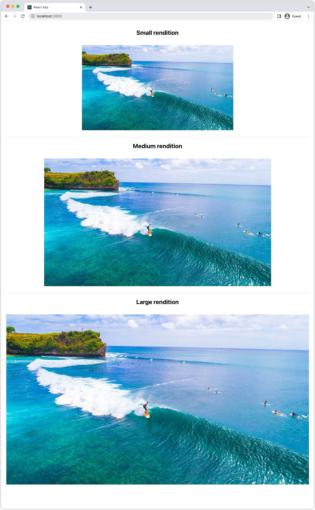

# Images with AEM Headless

Images are a critical aspect of [developing a rich, compelling AEM headless experiences](https://experienceleague.adobe.com/docs/experience-manager-learn/getting-started-with-aem-headless/graphql/multi-step/overview.html). AEM Headless supports management of image assets and their optimized delivery.

Content Fragments used in AEM Headless content modeling, often reference image assets intended for display in the headless experience. AEM's GraphQL queries can be written to provide URLs to images based on where the image is referenced from. 

The `ImageRef` type has three URL options for content references:

+ `_path` is the referenced path in AEM, and does not include an AEM origin (host name)
+ `_authorUrl` is the full URL to the image asset on AEM Author 
  + [AEM Author](https://experienceleague.adobe.com/docs/experience-manager-learn/cloud-service/underlying-technology/introduction-author-publish.html) can be used to provide a preview experience of the headless application.
+ `_publishUrl` is the full URL to the image asset on AEM Publish
  + [AEM Publish](https://experienceleague.adobe.com/docs/experience-manager-learn/cloud-service/underlying-technology/introduction-author-publish.html) is typically where the production deployment of the headless application displays images from.

The fields are best used based on the following criteria:

| ImageRef fields    | Client web app served from AEM | Client app queries AEM Author | Client app queries AEM Publish | 
|--------------------|:------------------------------:|:-----------------------------:|:------------------------------:|
| `_path`            | ✔                              | ✘                             | ✘                              | 
| `_authorUrl`       | ✘                              | ✔                             | ✘                              |
| `_publishUrl`      | ✘                              | ✘                             | ✔                              |

Use of `_authorUrl` and `_publishUrl` should align with the AEM GraphQL endpoint that is being used to source the GraphQL response.

## Content Fragment Model

Ensure the Content Fragment field containing the image reference is of the __content reference__ data type. 

Field types are reviewed in the [Content Fragment Model](https://experienceleague.adobe.com/docs/experience-manager-cloud-service/content/assets/content-fragments/content-fragments-models.html), by selecting the field, and inspecting the __Properties__ tab on the right.


## GraphQL query 

In the GraphQL query, return the field as the `ImageRef` type, and request the appropriate fields `_path`, `_authorUrl`, or `_publishUrl` required by your application.

```javascript
{
  adventureByPath(_path: "/content/dam/wknd/en/adventures/bali-surf-camp/bali-surf-camp") {
    item {
      adventurePrimaryImage {
        ... on ImageRef {
          _path,
          _authorUrl,
          _publishUrl
        }
      }
    }
  }  
}
```

## GraphQL response

The resulting JSON response contains the requested fields containing the URls to the image assets.

```json
{
  "data": {
    "adventureByPath": {
      "item": {
        "adventurePrimaryImage": {
          "_path": "/content/dam/wknd/en/adventures/bali-surf-camp/AdobeStock_175749320.jpg",
          "_authorUrl": "https://author-p123-e456.adobeaemcloud.com/content/dam/wknd/en/adventures/bali-surf-camp/AdobeStock_175749320.jpg",
          "_publishUrl": "https://publish-p123-e789.adobeaemcloud.com/content/dam/wknd/en/adventures/bali-surf-camp/AdobeStock_175749320.jpg"
        }
      }
    }
  }
}
```

To load the referenced image in your application, use the appropriate field, `_path`, `_authorUrl`, or `_publishUrl` of the `adventurePrimaryImage` as the image's source URL.

The domains of the `_authorUrl` and `_publishUrl` are automatically defined by AEM as a Cloud Service using the [Externalize](https://experienceleague.adobe.com/docs/experience-manager-cloud-service/content/implementing/developer-tools/externalizer.htmli).

In React, displaying the image from AEM Publish looks like:

```html

```

## Image renditions

Image assets support customizable [renditions](../../../assets/authoring/renditions.md), which are alternate representations of the original asset. Custom renditions can aid in the optimization of a headless experience. Instead of requesting the original image asset, which is often a large, hi-res file, optimized renditions can be requested by the headless application.

### Create renditions

AEM Assets administrators define the custom renditions using Processing Profiles. The Processing Profiles can then be applied to specific folder trees or assets directly to generate the renditions for those assets.

#### Processing Profiles

Asset renditions specifications are defined in [Processing Profiles](../../../assets/configuring//processing-profiles.md) by AEM Assets administrators.

Create or update a Processing Profile and add rendition definitions for the image sizes required by the headless application. Renditions can be named anything, but should be named semantically.



In this example three renditions are created:

| Rendition name | Extension | Max width |
|----------------|:---------:|----------:|
| large          | jpeg      | 1200px    |
| medium         | jpeg      | 900px     |
| small          | jpeg      | 600px     |

The attributes called out in the above table are important:

+ __Rendition name__ is used to request the rendition.
+ __Extension__ is the extension used to request the __rendition name__.
+ __Max width__ is used to inform the developer which rendition should be used based on its use in the headless application.

Rendition definitions depend on your headless application's needs, so make sure to define the optimal rendition set for your use case and are named semantically regarding how they are being used.

#### Reprocess assets{#reprocess-assets}

With the Processing Profile created (or updated), reprocess the assets to generate the new renditions defined in the Processing Profile. If assets are not processed with the new renditions will not exist.

+ Preferably, [assigned the Processing Profile to a folder](../../../assets/configuring//processing-profiles.md) so any new assets uploaded to said folder, automatically generate the renditions. Existing assets must be reprocessed using the ah-hoc approach below.

+ Or, ad-hoc, by selecting a folder or asset, selecting __Reprocess Assets__, and selecting the new Processing Profile name.

    

#### Review renditions

Renditions can be validated by [opening an asset's renditions view](../../../assets/authoring/renditions.md), and selecting the new renditions for preview in the renditions rail. If the renditions are missing, [ensure the assets are processed using the Processing Profile](#reprocess-assets).



#### Publish assets

Ensure that the assets with the new renditions are [(re)published](../../../assets/sharing/publish.md) so the new renditions are accessible on AEM Publish. 

### Access renditions

Renditions are accessed directly by appending the __rendition names__ and __rendition extensions__ defined in the Processing Profile to the asset's URL.

| Asset URL | Renditions subpath | Rendition name | Rendition extension | | Rendition URL |
|-----------|:------------------:|:--------------:|--------------------:|:--:|---|
| https://publish-p123-e789.adobeaemcloud.com/content/dam/example.jpg | /_jcr_content/renditions/ | large | .jpeg | → | https://publish-p123-e789.adobeaemcloud.com/content/dam/example.jpg/_jcr_content/renditions/large.jpeg |
| https://publish-p123-e789.adobeaemcloud.com/content/dam/example.jpg | /_jcr_content/renditions/ | medium | .jpeg | → | https://publish-p123-e789.adobeaemcloud.com/content/dam/example.jpg/_jcr_content/renditions/medium.jpeg |
| https://publish-p123-e789.adobeaemcloud.com/content/dam/example.jpg | /_jcr_content/renditions/ | small | .jpeg | → | https://publish-p123-e789.adobeaemcloud.com/content/dam/example.jpg/_jcr_content/renditions/small.jpeg |

{style="table-layout:auto"}

### GraphQL query{#renditions-graphl-query}

AEM's GraphQL does require extra syntax for requesting image renditions. Instead [images are queried](#images-graphql-query) in the usual manner, and the desired rendition is specified in-code. It is important to [ensure image assets used by the headless application have the same-named renditions](#reprocess-assets).

### React example

Let's create a simple React application that displays three renditions, small, medium, and large, of a single image asset.



#### Create Image component{#react-example-image-component}

Create a React component that renders the images. This component accepts four properties:

+ `assetUrl`: The image asset URL as provided via the GraphQL query's response.
+ `renditionName`: The name of rendition to load.
+ `renditionExtension`: The extension of the rendition to load.
+ `alt`: The alt text for the image; accessibility is important!

This component constructs the [rendition URL using the format outlined in __Access renditions__](#access-renditions). An `onError` handler is set to display the original asset in the event the rendition is missing.

This example uses the original asset url as the fallback in the `onError` handler, in the event, a rendition is missing.

```javascript
// src/Image.js

export default function Image({ assetUrl, renditionName, renditionExtension, alt }) {
  // Construct the rendition Url in the format:
  //   <ASSET URL>/_jcr_content/renditions<RENDITION NAME>.<RENDITION EXTENSION>
  const renditionUrl = `${assetUrl}/_jcr_content/renditions/${renditionName}.${renditionExtension}`;

  // Load the original image asset in the event the named rendition is missing
  const handleOnError = (e) => { e.target.src = assetUrl; }

  return (
    <>
      
    </>
  );
}
```

#### Define the `App.js`{#app-js}

This simple `App.js` queries AEM for an Adventure image, and then display that image's three renditions: small, medium, and large.

Querying against AEM is performed in the custom React hook [useGraphQL that uses the AEM Headless SDK](./aem-headless-sdk.md#graphql-queries).

The results of the query, and the specific rendition parameters are passed to the [Image React component](#react-example-image-component).

```javascript
// src/App.js

import "./App.css";
import { useGraphQL } from "./useGraphQL";
import Image from "./Image";

function App() {

  // The GraphQL that returns an image
  const adventureQuery = `{
        adventureByPath(_path: "/content/dam/wknd/en/adventures/bali-surf-camp/bali-surf-camp") {
          item {
            adventureTitle,
            adventurePrimaryImage {
              ... on ImageRef {
                _path,
                _authorUrl,
                _publishUrl
              }
            }
          }
        }  
    }`;

  // Get data from AEM using GraphQL
  let { data } = useGraphQL(adventureQuery);

  // Wait for GraphQL to provide data
  if (!data) { return <></> }

  return (
    <div className="app">
      
      <h2>Small rendition</h2>
      {/* Render the small rendition for the Adventure Primary Image */}
      <Image
        assetUrl={data.adventureByPath.item.adventurePrimaryImage._publishUrl}
        renditionName="small"
        renditionExtension="jpeg"
        alt={data.adventureByPath.item.adventureTitle}
      />

      <hr />

      <h2>Medium rendition</h2>
      {/* Render the medium rendition for the Adventure Primary Image */}
      <Image
        assetUrl={data.adventureByPath.item.adventurePrimaryImage._publishUrl}
        renditionName="medium"
        renditionExtension="jpeg"
        alt={data.adventureByPath.item.adventureTitle}
      />

      <hr />

      <h2>Large rendition</h2>
      {/* Render the large rendition for the Adventure Primary Image */}
      <Image
        assetUrl={data.adventureByPath.item.adventurePrimaryImage._publishUrl}
        renditionName="large"
        renditionExtension="jpeg"
        alt={data.adventureByPath.item.adventureTitle}
      />
    </div>
  );
}

export default App;
```
