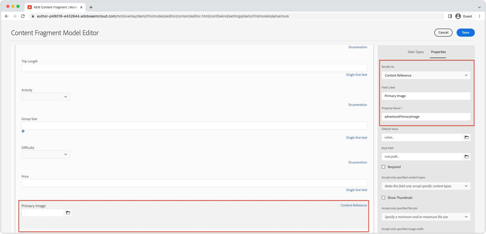

# Optimized images with AEM Headless {#images-with-aem-headless}

Images are a critical aspect of [developing rich, compelling AEM headless experiences](https://experienceleague.adobe.com/docs/experience-manager-learn/getting-started-with-aem-headless/graphql/multi-step/overview.html). AEM Headless supports management of image assets and their optimized delivery.

Content Fragments used in AEM Headless content modeling, often reference image assets intended for display in the headless experience. AEM's GraphQL queries can be written to provide URLs to images based on where the image is referenced from. 

The `ImageRef` type has four URL options for content references:

+ `_path` is the referenced path in AEM, and does not include an AEM origin (host name)
+ `_dynamicUrl` is the full URL to the preferred, web-optimized image asset.
  + The `_dynamicUrl` does not include a AEM origin, so the domain (AEM Author or AEM Publish service) must be provided by the client application.
+ `_authorUrl` is the full URL to the image asset on AEM Author 
  + [AEM Author](https://experienceleague.adobe.com/docs/experience-manager-learn/cloud-service/underlying-technology/introduction-author-publish.html) can be used to provide a preview experience of the headless application.
+ `_publishUrl` is the full URL to the image asset on AEM Publish
  + [AEM Publish](https://experienceleague.adobe.com/docs/experience-manager-learn/cloud-service/underlying-technology/introduction-author-publish.html) is typically where the production deployment of the headless application displays images from.

The `_dynamicUrl` is the preferred URL to use for image assets and should replace the use of `_path`, `_authorUrl`, and `_publishUrl` whenever possible.

|                                | AEM as a Cloud Service | AEM as a Cloud Service RDE | AEM SDK | AEM 6.5 |
| ------------------------------ |:----------------------:|:--------------------------:|:-------:|:-------:|
| Supports web-optimized images? | &#10004;               | &#10004;                   | &#10008;| &#10008;|


>[!CONTEXTUALHELP]
>id="aemcloud_learn_headless_graphql_images"
>title="Images with AEM Headless"
>abstract="Learn how AEM Headless supports the management of image assets and their optimized delivery."

## Content Fragment Model

Ensure the Content Fragment field containing the image reference is of the __content reference__ data type. 

Field types are reviewed in the [Content Fragment Model](https://experienceleague.adobe.com/docs/experience-manager-cloud-service/content/assets/content-fragments/content-fragments-models.html), by selecting the field, and inspecting the __Properties__ tab on the right.



## GraphQL persisted query 

In the GraphQL query, return the field as the `ImageRef` type, and request the `_dynamicUrl` field. For example, querying an adventure in the [WKND Site project](https://github.com/adobe/aem-guides-wknd) and including image URL for the image asset references in its `primaryImage` field, can be done with a new persisted query `wknd-shared/adventure-image-by-path` defined as:

```graphql {highlight="11"}
query($path: String!, $imageFormat: AssetTransformFormat=JPG, $imageSeoName: String, $imageWidth: Int, $imageQuality: Int) {
  adventureByPath(
    _path: $path
    _assetTransform: {
      format: $imageFormat
      width: $imageWidth
      quality: $imageQuality
      preferWebp: true
    }
  ) {
    item {
      _path
      title
      primaryImage {
        ... on ImageRef {
          _dynamicUrl
        }
      }
    }
  }
}
```

### Query variables

```json
{ 
  "path": "/content/dam/wknd-shared/en/adventures/bali-surf-camp/bali-surf-camp",
  "imageFormat": "JPG",
  "imageWidth": 1000,
}
```

The `$path` variable used in the `_path` filter requires the full path to the content fragment (for example `/content/dam/wknd-shared/en/adventures/bali-surf-camp/bali-surf-camp`).

The `_assetTransform` defines how the `_dynamicUrl` is constructed to optimize the served image rendition. Web-optimized images URLs can also be adjusted on the client by changing the URL's query parameters.

| GraphQL parameter | URL parameter | Description | Required | GraphQL variable values | URL parameter values | Example URL parameter |  
|:---------|:----------|:-------------------------------|:--:|:--------------------------|:---|:--|
| `format` | N/A  | The format of the image asset. | ✔ | `GIF`, `PNG`, `PNG8`, `JPG`, `PJPG`, `BJPG`,  `WEBP`, `WEBPLL`, `WEBPLY`  | N/A | N/A |
| `seoName` | N/A | Name of file segment in URL. If not provided the image asset name is used. | ✘ |  Alphanumeric, `-`, or `_` | N/A  | N/A |
| `crop` | `crop` | Crop frame taken out of the image, must be within the size of the image | ✘ | Positive integers defining a crop region within the bounds of the original image dimensions | Comma-delimited string of numeric coordinates `<X_ORIGIN>,<Y_ORIGIN>,<CROP_WIDTH>,<CROP_HEIGHT>`  | `?crop=10,20,300,400` |
| `size` | `size` | Size of the output image (both height and width) in pixels. | ✘ | Positive integers | Comma-delimited positive integers in the order `<WIDTH>,<HEIGHT>`  |  `?size=1200,800` |
| `rotation` | `rotate` | Rotation of the image in degrees. | ✘ | `R90`, `R180`, `R270` | `90`, `180`, `270` | `?rotate=90` |
| `flip`  | `flip` | Flip the image. | ✘ | `HORIZONTAL`, `VERTICAL`, `HORIZONTAL_AND_VERTICAL` | `h`, `v`, `hv` | `?flip=h`|
| `quality` | `quality` |  Image quality in percent of original quality. | ✘ | 1-100 | 1-100 | `?quality=80` |
| `width`   | `width` | Width of the output image in pixels. When `size` is provided `width` is ignored. | ✘ |  Positive integer | Positive integer | `?width=1600` |
| `preferWebP` | `preferwebp` | If `true` and AEM serves a WebP if the browser supports it, regardless of the `format`. | ✘ | `true`, `false` |  `true`, `false` | `?preferwebp=true` |

## GraphQL response

The resulting JSON response contains the requested fields containing the web-optimized URL to the image assets.

```json {highlight="8"}
{
  "data": {
    "adventureByPath": {
      "item": {
        "_path": "/content/dam/wknd-shared/en/adventures/bali-surf-camp/bali-surf-camp",
        "title": "Bali Surf Camp",
        "primaryImage": {
          "_dynamicUrl": "/adobe/dynamicmedia/deliver/dm-aid--a38886f7-4537-4791-aa20-3f6ef0ac3fcd/adobestock_175749320.jpg?preferwebp=true&width=1000&quality=80"
        }
      }
    }
  }
}
```

To load the web-optimized image of th  referenced image in your application, used the `_dynamicUrl` of the `primaryImage` as the image's source URL.

In React, displaying a web-optimized image from AEM Publish looks like:

```jsx
const AEM_HOST = "https://publish-p123-e456.adobeaemcloud.com";
...
let dynamicUrl = AEM_HOST + data.adventureByPath.item.primaryImage._dynamicUrl;
...

```

Remember, `_dynamicUrl` does not include the AEM domain, so you must provide the desired origin for the image URL to resolve.

### Responsive URLs

The above example shows using a single size image, however in web experiences, responsive image sets are often required. Responsive images can be implemented using [img srcsets](https://css-tricks.com/a-guide-to-the-responsive-images-syntax-in-html/#using-srcset) or [picture elements](https://css-tricks.com/a-guide-to-the-responsive-images-syntax-in-html/#using-srcset). The following code snippet shows how to use the `_dynamicUrl` as a based, and append different width parameters, to power different responsive views. Not only can the `width` query parameter be used, but other query parameters can be added by the client to further optimize the image asset based on its needs.

```javascript
const AEM_HOST = "https://publish-p123-e456.adobeaemcloud.com";
...
// Read the data from GraphQL response
let dynamicUrl = AEM_HOST + data.adventureByPath.item.primaryImage._dynamicUrl;
let alt = data.adventureByPath.item.title;
...
{/*-- Example img srcset --*/}
document.body.innerHTML=`
    alt="${alt}"
    src="${${dynamicUrl}&width=1000}"
    srcset="`
      ${dynamicUrl}&width=1000 1000w,
      ${dynamicUrl}&width=1600 1600w,
      ${dynamicUrl}&width=2000 2000w,
      `"
    sizes="calc(100vw - 10rem)"/>`;
...
{/*-- Example picture --*/}
document.body.innerHTML=`<picture>
      <source srcset="${dynamicUrl}&width=2600" media="(min-width: 2001px)"/>
      <source srcset="${dynamicUrl}&width=2000" media="(min-width: 1000px)"/>
      
    </picture>`;
```

### React example

Let's create a simple React application that displays web-optimized images following [responsive image patterns](https://css-tricks.com/a-guide-to-the-responsive-images-syntax-in-html/). There are two main patterns for responsive images:

+ [Img element with srcset](https://css-tricks.com/a-guide-to-the-responsive-images-syntax-in-html/#using-srcset) for increased performance
+ [Picture element](https://css-tricks.com/a-guide-to-the-responsive-images-syntax-in-html/#using-picture) for design control

#### Img element with srcset

>[!VIDEO](https://video.tv.adobe.com/v/3418556/?quality=12&learn=on)

[Img elements with srcset](https://css-tricks.com/a-guide-to-the-responsive-images-syntax-in-html/#using-srcset) are used with the `sizes` attribute to provide different image assets for different screen sizes. Img srcsets are useful when providing different image assets for different screen sizes.

#### Picture element

[Picture elements](https://css-tricks.com/a-guide-to-the-responsive-images-syntax-in-html/#using-picture) are used with multiple `source` elements to provide different image assets for different screen sizes. Picture elements are useful when providing different image renditions for different screen sizes.

>[!VIDEO](https://video.tv.adobe.com/v/3418555/?quality=12&learn=on)

#### Example code

This simple React app uses the [AEM Headless SDK](./aem-headless-sdk.md) to query AEM Headless APIs for an Adventure content, and displays the web-optimized image using [img element with srcset](#img-element-with-srcset) and [picture element](#picture-element). The `srcset` and `sources` use a custom `setParams` function to append the web-optimized delivery query parameter to the `_dynamicUrl` of the image, so change the image rendition delivered based on the web client's needs.

Querying against AEM is performed in the custom React hook [useAdventureByPath that uses the AEM Headless SDK](./aem-headless-sdk.md#graphql-persisted-queries).

```javascript
// src/App.js

import "./App.css";
import { useAdventureByPath } from './api/persistedQueries'

const AEM_HOST = process.env.AEM_HOST;

function App() {

  /**
   * Update the dynamic URL with client-specific query parameters
   * @param {*} imageUrl the image URL
   * @param {*} params the AEM web-optimized image query parameters
   * @returns the dynamic URL with the query parameters
   */
  function setOptimizedImageUrlParams(imageUrl, params) {
    let url = new URL(imageUrl);
    Object.keys(params).forEach(key => {
      url.searchParams.set(key, params[key]);
    });
    return url.toString();
  }

  // Get data from AEM using GraphQL persisted query as defined above 
  // The details of defining a React useEffect hook are explored in How to > AEM Headless SDK
  // The 2nd parameter define the base GraphQL query parameters used to request the web-optimized image
  let { data, error } = useAdventureByPath(
        "/content/dam/wknd-shared/en/adventures/bali-surf-camp/bali-surf-camp", 
        { imageFormat: "JPG" }
      );

  // Wait for AEM Headless APIs to provide data
  if (!data) { return <></> }

  const alt = data.adventureByPath.item.title;
  const imageUrl =  AEM_HOST + data.adventureByPath.item.primaryImage._dynamicUrl;

  return (
    <div className="app">
      
      <h1>Web-optimized images</h1>

      {/* Render the web-optimized image img with srcset for the Adventure Primary Image */}
      <h2>Img srcset</h2>

      

       {/* Render the web-optimized picture for the Adventure Primary Image */}
        <h2>Picture element</h2>

        <picture>
          {/* When viewport width is greater than 2001px */}
          <source srcSet={setOptimizedImageUrlParams(imageUrl, { width : 2600 })} media="(min-width: 2001px)"/>        
          {/* When viewport width is between 1000px and 2000px */}
          <source srcSet={setOptimizedImageUrlParams(imageUrl, { width : 2000})} media="(min-width: 1000px)"/>
          {/* When viewport width is less than 799px */}
          
        </picture>
    </div>
  );
}

export default App;
```
