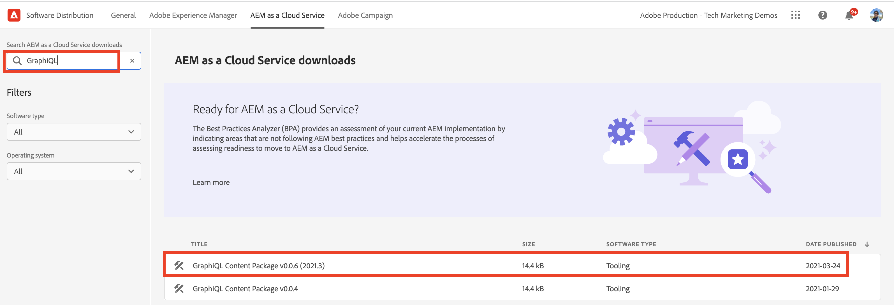
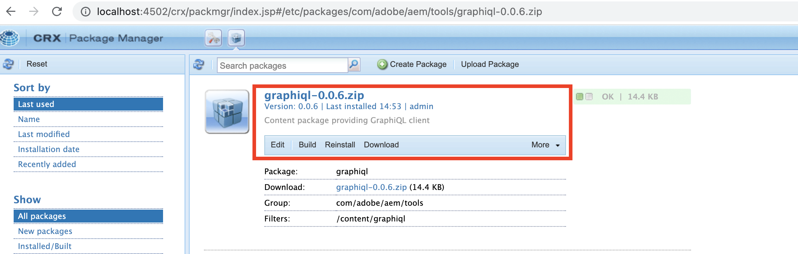
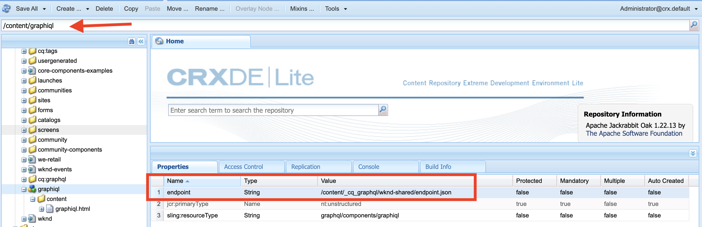
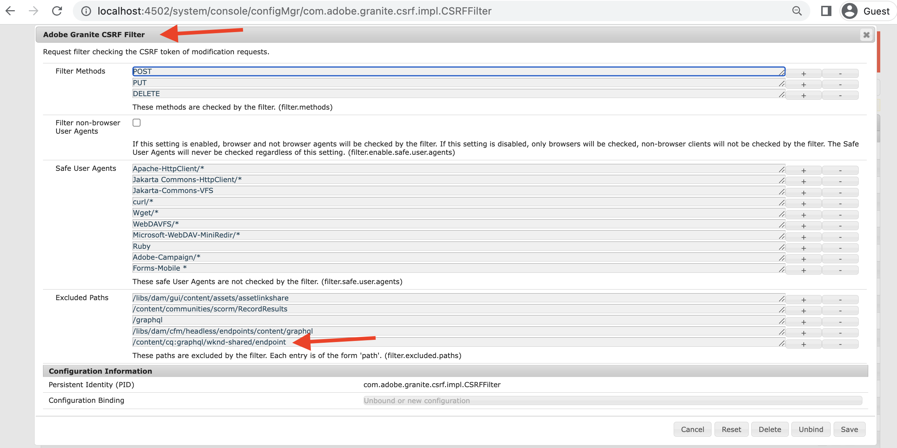
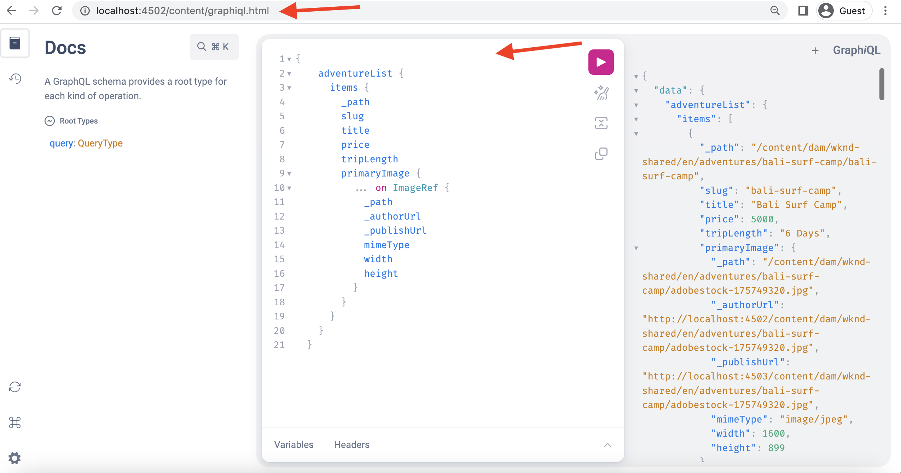

# Install GraphiQL IDE on AEM 6.5

In AEM 6.5 the GraphiQL IDE tool must be manually installed.

1.  Navigate to the **[Software Distribution Portal](https://experience.adobe.com/#/downloads/content/software-distribution/en/aemcloud.html)** > **AEM as a Cloud Service**.
1.  Search for "GraphiQL" (be sure to include the **i** in **GraphiQL**).
1.  Download the latest **GraphiQL Content Package v.x.x.x**.

    

    The zip file is an AEM package that can be installed directly.

1.  From the AEM Start menu, navigate to **Tools** > **Deployment** > **Packages**.
1.  Click **Upload Package** and choose the package downloaded in the prior step. Click **Install** to install the package.

    

1.  Navigate to **CRXDE Lite** > **Repository Panel** > select `/content/graphiql` node (for example, <http://localhost:4502/crx/de/index.jsp#/content/graphiql>).
1.  In the **Properties** tab change value of `endpoint` property to `/content/_cq_graphql/wknd-shared/endpoint.json`.
    

1.  Navigate to the **Web Console Configuration** UI > Search for **CSRF Filter** configuration (for example,<http://localhost:4502/system/console/configMgr/com.adobe.granite.csrf.impl.CSRFFilter)>
1.  In the `Excluded Paths` property name field update, the WKND GraphQL endpoint path to `/content/cq:graphql/wknd-shared/endpoint`.

1.  Access the GraphiQL editor using `//HOST:PORT/content/graphiql.html`, and verify you can construct a new query or execute an existing query. (e.g <http://localhost:4502/content/graphiql.html>)

>[!TIP]
>
>To support your project-specific GraphQL schema and query execution, you have to make corresponding changes for the `endpoint` and `Excluded Paths` values in above steps.
