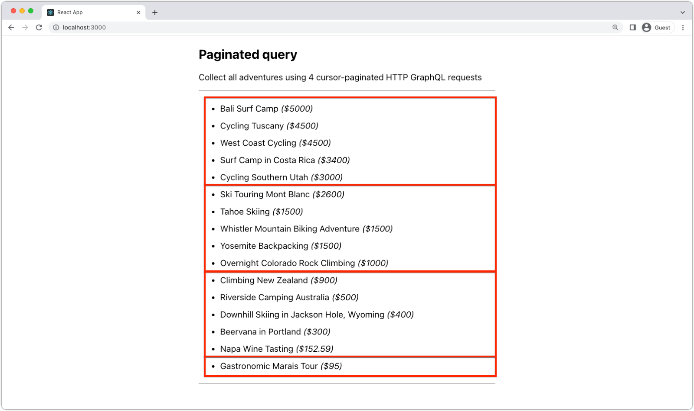

# Large result sets in AEM Headless

AEM Headless GraphQL queries can return large results. This article describes how to work with large results in AEM Headless to ensure the best performance for your application. 

AEM Headless supports a [offset/limit](#list-query) and [cursor-based pagination](#paginated-query) queries to smaller subsets of a larger result set. Multiple requests can be made to collect as many results as required. 

The examples below use small subsets of results (four records per request) to demonstrate the techniques. In a real application, you would use a larger number of records per request to improve performance. 50 records per request is a good baseline.

## Content Fragment Model

Pagination and sorting can be used against any Content Fragment Model.

## GraphQL persisted queries

When working with large datasets, both offset and limit and cursor-based pagination can be used to retrieve a specific subset of the data. However, there are some differences between the two techniques that may make one more appropriate than the other in certain situations.

### Offset/limit

List queries, using `limit` and `offset` provide a straightforward approach that specifies the starting point (`offset`) and the number of records to retrieve (`limit`). This approach allows a subset of results to be selected from anywhere within the full result set, such as jumping to a specific page of results. While it's easy to implement, it can be slow and inefficient when dealing with large result, as retrieving many records requires scanning through all the previous records. This approach can also lead to performance issues when the offset value is high, as it may require retrieving and discarding many results.

#### GraphQL query

```graphql
# Retrieves a list of Adventures sorted price descending, and title ascending if there is the prices are the same.
query adventuresByOffetAndLimit($offset:Int!, $limit:Int) {
    adventureList(offset: $offset, limit: $limit, sort: "price DESC, title ASC", ) {
      items {
        _path
        title
        price
      }
    }
  }
```

##### Query variables

```json
{
  "offset": 1,
  "limit": 4
}
```

#### GraphQL response

The resulting JSON response contains the 2nd, 3rd, 4th and 5th most expensive Adventures. The first two adventures in the results have the same price (`4500` so the [list query](#list-queries) specifies adventures with the same price is then sorted by title in ascending order.)

```json
{
  "data": {
    "adventureList": {
      "items": [
        {
          "_path": "/content/dam/wknd-shared/en/adventures/cycling-tuscany/cycling-tuscany",
          "title": "Cycling Tuscany",
          "price": 4500
        },
        {
          "_path": "/content/dam/wknd-shared/en/adventures/west-coast-cycling/west-coast-cycling",
          "title": "West Coast Cycling",
          "price": 4500
        },
        {
          "_path": "/content/dam/wknd-shared/en/adventures/surf-camp-in-costa-rica/surf-camp-costa-rica",
          "title": "Surf Camp in Costa Rica",
          "price": 3400
        },
        {
          "_path": "/content/dam/wknd-shared/en/adventures/cycling-southern-utah/cycling-southern-utah",
          "title": "Cycling Southern Utah",
          "price": 3000
        }
      ]
    }
  }
}
```

### Paginated query

Cursor-based pagination, available in Paginated queries, involves using a cursor (a reference to a specific record) to retrieve the next set of results. This approach is more efficient as it avoids the need to scan through all the previous records to retrieve the required subset of data. Paginated queries are great for iterating through large result sets from the beginning, to some point in the middle, or to the end. List queries, using `limit` and `offset` provide a straightforward approach that specifies the starting point (`offset`) and the number of records to retrieve (`limit`). This approach allows a subset of results to be selected from anywhere within the full result set, such as jumping to a specific page of results. While it's easy to implement, it can be slow and inefficient when dealing with large result, as retrieving many records requires scanning through all the previous records. This approach can also lead to performance issues when the offset value is high, as it may require retrieving and discarding many results.

#### GraphQL query

```graphql
# Retrieves the most expensive Adventures (sorted by title ascending if there is the prices are the same)
query adventuresByPaginated($first:Int, $after:String) {
 adventurePaginated(first: $first, after: $after, sort: "price DESC, title ASC") {
       edges {
          cursor
          node {
            _path
            title
            price
          }
        }
        pageInfo {
          endCursor
          hasNextPage
        }
    }
  }
```

##### Query variables

```json
{
  "first": 3
}
```

#### GraphQL response

The resulting JSON response contains the 2nd, 3rd, 4th and 5th most expensive Adventures. The first two adventures in the results have the same price (`4500` so the [list query](#list-queries) specifies adventures with the same price is then sorted by title in ascending order.)

```json
{
  "data": {
    "adventurePaginated": {
      "edges": [
        {
          "cursor": "NTAwMC4...Dg0ZTUwN2FkOA==",
          "node": {
            "_path": "/content/dam/wknd-shared/en/adventures/bali-surf-camp/bali-surf-camp",
            "title": "Bali Surf Camp",
            "price": 5000
          }
        },
        {
          "cursor": "SFNDUwMC4wC...gyNWUyMWQ5M2Q=",
          "node": {
            "_path": "/content/dam/wknd-shared/en/adventures/cycling-tuscany/cycling-tuscany",
            "title": "Cycling Tuscany",
            "price": 4500
          }
        },
        {
          "cursor": "AVUwMC4w...0ZTYzMjkwMzE5Njc=",
          "node": {
            "_path": "/content/dam/wknd-shared/en/adventures/west-coast-cycling/west-coast-cycling",
            "title": "West Coast Cycling",
            "price": 4500
          }
        }
      ],
      "pageInfo": {
        "endCursor": "NDUwMC4w...kwMzE5Njc=",
        "hasNextPage": true
      }
    }
  }
}
```

#### Next set of paginated results

The next set of results can be fetched using the `after` parameter and the `endCursor` value from the previous query. If there are no more results to fetch, `hasNextPage` is `false`.

##### Query variables

```json
{
  "first": 3,
  "after": "NDUwMC4w...kwMzE5Njc="
}
```

## React examples

The following are React examples that demonstrate how to use [offset and limit](#offset-and-limit) and [cursor-based pagination](#cursor-based-pagination) approaches. Typically the number of results per request is larger, however for the purposes of these examples, the limit is set to 5.

### Offset and limit example

>[!VIDEO](https://video.tv.adobe.com/v/3418381/?quality=12&learn=on)

Using offset and limit, subsets of results can easily be retrieved and displayed.

#### useEffect hook

The `useEffect` hook invokes a persisted query (`adventures-by-offset-and-limit`) that retrieves a list of Adventures. The query uses the `offset` and `limit` parameters to specify the starting point and the number of results to retrieve. The `useEffect` hook is invoked when the `page` value changes.


```javascript
import { useState, useEffect } from "react";
import AEMHeadless from "@adobe/aem-headless-client-js";
...
export function useOffsetLimitAdventures(page, limit) {
    const [adventures, setAdventures] = useState([]);
    const [hasMore, setHasMore] = useState(true);

    useEffect(() => {
      async function fetchData() {
        const queryParameters = {
          offset: page * limit, // Calculate the offset based on the current page and the limit
          limit: limit + 1,     // Add 1 to the limit to determine if there are more adventures to fetch
        };

        // Invoke the persisted query with the offset and limit parameters
        const response = await aemHeadlessClient.runPersistedQuery(
          "wknd-shared/adventures-by-offset-and-limit",
          queryParameters
        );        
        const data = response?.data;

        if (data?.adventureList?.items?.length > 0) {
          // Collect the adventures - slice off the last item since the last item is used to determine if there are more adventures to fetch
          setAdventures([...data.adventureList.items].slice(0, limit));
          // Determine if there are more adventures to fetch
          setHasMore(data.adventureList.items.length > limit);
        } else {
          setHasMore(false);
        }
      }
      fetchData();
    }, [page]);

    return { adventures, hasMore };
}
```

#### Component

The component uses the `useOffsetLimitAdventures` hook to retrieve a list of Adventures. The `page` value is incremented and decremented to fetch the next and previous set of results. The `hasMore` value is used to determine if the next page button should be enabled.

```javascript
import { useState } from "react";
import { useOffsetLimitAdventures } from "./api/persistedQueries";

export default function OffsetLimitAdventures() {
  const LIMIT = 5;
  const [page, setPage] = useState(0);

  let { adventures, hasMore } = useOffsetLimitAdventures(page, LIMIT);

  return (
    <section className="offsetLimit">
      <h2>Offset/limit query</h2>
      <p>Collect sub-sets of adventures using offset and limit.</p>

      <h4>Page: {page + 1}</h4>
      <p>
        Query variables:
        <em>
          <code>
            &#123; offset: {page * LIMIT}, limit: {LIMIT} &#125;
          </code>
        </em>
      </p>

      <hr />

      <ul className="adventures">
        {adventures?.map((adventure) => {
          return (
            <li key={adventure._path}>
              {adventure.title} <em>(${adventure.price})</em>
            </li>
          );
        })}
      </ul>

      <hr />

      <ul className="buttons">
        <li>
          <button disabled={page === 0} onClick={() => setPage(page - 1)}>
            Previous
          </button>
        </li>
        <li>
          <button disabled={!hasMore} onClick={() => setPage(page + 1)}>
            Next
          </button>
        </li>
      </ul>
    </section>
  );
}
```

### Paginated example



_Each red box represents a discrete paginated HTTP GraphQL query._

Using cursor-based pagination, large result sets can easily be retrieved and displayed, by incrementally collecting the results and concatenating them to the existing results.


#### UseEffect hook

The `useEffect` hook invokes a persisted query (`adventures-by-paginated`) that retrieves a list of Adventures. The query uses the `first` and `after` parameters to specify the number of results to retrieve and the cursor to start from. `fetchData` continuously loops, collecting the next set of paginated results, until there are no more results to fetch. 

```javascript
import { useState, useEffect } from "react";
import AEMHeadless from "@adobe/aem-headless-client-js";
...
export function usePaginatedAdventures() {
    const LIMIT = 5;
    const [adventures, setAdventures] = useState([]);
    const [queryCount, setQueryCount] = useState(0);

    useEffect(() => {
      async function fetchData() {
        let paginatedAdventures = [];
        let paginatedCount = 0;
        let hasMore = false;
        let after = null;
        
        do {
          const response = await aemHeadlessClient.runPersistedQuery(
            "wknd-shared/adventures-by-paginated",
            {
                first: LIMIT,
                after: after
            }
          );
          // The GraphQL data is stored on the response's data field
          const data = response?.data;

          paginatedCount = paginatedCount + 1;

          if (data?.adventurePaginated?.edges?.length > 0) {
            // Add the next set page of adventures to full list of adventures
            paginatedAdventures = [...paginatedAdventures, ...data.adventurePaginated.edges];
          }

          // If there are more adventures, set the state to fetch them
          hasMore = data.adventurePaginated?.pageInfo?.hasNextPage;
          after = data.adventurePaginated.pageInfo.endCursor;

        } while (hasMore);

        setQueryCount(paginatedCount);
        setAdventures(paginatedAdventures);
      }

      fetchData();
    }, []);

    return { adventures, queryCount };
}
```

#### Component

The component uses the `usePaginatedAdventures` hook to retrieve a list of Adventures. The `queryCount` value is used to display the number of HTTP requests made to retrieve the list of Adventures.

```javascript
import { useState } from "react";
import { usePaginatedAdventures } from "./api/persistedQueries";
...
export default function PaginatedAdventures() {
  let { adventures, queryCount } = usePaginatedAdventures();

  return (
    <section className="paginated">
      <h2>Paginated query</h2>
      <p>Collect all adventures using {queryCount} cursor-paginated HTTP GraphQL requests</p>

      <hr/>
      <ul className="adventures">
        {adventures?.map((adventure) => {
          return (
            <li key={adventure.node._path}>
              {adventure.node.title} <em>(${adventure.node.price})</em>
            </li>
          );
        })}
      </ul>
      <hr/>
    </section>
  );
}
```
