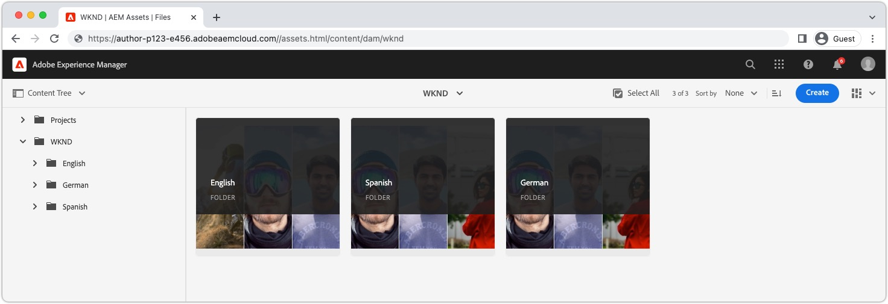

# Localized content with AEM Headless

AEM provides a [Translation Integration Framework](https://experienceleague.adobe.com/docs/experience-manager-cloud-service/content/sites/administering/reusing-content/translation/integration-framework.html) for headless content, allowing Content Fragments and supporting assets to be easily translated for use across locales. This is the same framework used to translate other AEM content, such as Pages, Experience Fragments, Assets, and Forms. Once [headless content has been translated](https://experienceleague.adobe.com/docs/experience-manager-cloud-service/content/headless/journeys/translation/overview.html), and published, it is ready for consumption by headless applications.

## Assets folder structure{#assets-folder-structure}

Ensure that the localized Content Fragments in AEM follow the [recommended localization structure](https://experienceleague.adobe.com/docs/experience-manager-cloud-service/content/headless/journeys/translation/getting-started.html#recommended-structure). 



The locale folders must be siblings, and the folder name, rather than title, must be a valid [ISO 639-1 code](https://en.wikipedia.org/wiki/List_of_ISO_639-1_codes) representing the locale of the content contained in the folder.

The locale code is also the value used to filter the Content Fragments returned by the GraphQL query.

| Locale code | AEM path | Content locale |
|--------------------------------|----------|----------|
| de | /content/dam/.../**de**/... | German content  |
| en | /content/dam/.../**en**/... | English content |
| es | /content/dam/.../**es**/... | Spanish content |

## GraphQL persisted query

AEM provides a `_locale` GraphQL filter that automatically filters content by locale code . For example, querying all English adventures in the [WKND reference demo project](https://experienceleague.adobe.com/docs/experience-manager-cloud-service/content/onboarding/demo-add-on/create-site.html) can be done with a new persisted query `wknd-shared/adventures-by-locale` defined as:

```graphql
query($locale: String!) {
  adventureList(_locale: $locale) {
    items {      
      _path
      title
    }
  }
}
```

The `$locale` variable used in the `_locale` filter requires the locale code (for example `en`, `en_us`, or `de`) as specified in [AEM's asset folder-base localization convention](#assets-folder-structure).

## React example

Let's create a simple React application that controls what Adventure content to query from AEM based on a locale selector using the `_locale` filter.

When __English__ is selected in the locale selector, then English Adventure Content Fragments under `/content/dam/wknd/en` are returned, when __Spanish__ is selected, then Spanish Content Fragments under `/content/dam/wknd/es`, and so on, and so forth.


### Create a `LocaleContext`{#locale-context}

First, create a [React context](https://reactjs.org/docs/context.html) to allow the locale to be used across the React application's components. 

```javascript
// src/LocaleContext.js

import React from 'react'

const DEFAULT_LOCALE = 'en';

const LocaleContext = React.createContext({
    locale: DEFAULT_LOCALE, 
    setLocale: () => {}
});

export default LocaleContext;
```

### Create a `LocaleSwitcher` React component{#locale-switcher}

Next, create a locale switcher React component that set's the [LocaleContext's](#locale-context) value to the user's selection.

This locale value is used to drive the GraphQL queries, ensuring they only return content matching the selected locale.

```javascript
// src/LocaleSwitcher.js

import { useContext } from "react";
import LocaleContext from "./LocaleContext";

export default function LocaleSwitcher() {
  const { locale, setLocale } = useContext(LocaleContext);

  return (
    <select value={locale}
            onChange={e => setLocale(e.target.value)}>
      <option value="de">Deutsch</option>
      <option value="en">English</option>
      <option value="es">Español</option>
    </select>
  );
}
```

### Query content using the `_locale` filter{#adventures}

The Adventures component queries AEM for all adventures by locale and lists their titles. This is achieved by passing the locale value stored in the React context, to the query using the `_locale` filter.

This approach can be extended to other queries in your application, ensuring all queries only include content specified by a user's locale selection.

The querying against AEM is performed in the custom React hook [getAdventuresByLocale, described in more detail on the Querying AEM GraphQL documentation](./aem-headless-sdk.md).

```javascript
// src/Adventures.js

import { useContext } from "react"
import { useAdventuresByLocale } from './api/persistedQueries'
import LocaleContext from './LocaleContext'

export default function Adventures() {
    const { locale } = useContext(LocaleContext);

    // Get data from AEM using GraphQL persisted query as defined above 
    // The details of defining a React useEffect hook are explored in How to > AEM Headless SDK
    let { data, error } = useAdventuresByLocale(locale);

    return (
        <ul>
            {data?.adventureList?.items?.map((adventure, index) => { 
                return <li key={index}>{adventure.title}</li>
            })}
        </ul>
    )
}
```

### Define the `App.js`{#app-js}

Lastly, tie it all together by wrapping the React application in with the `LanguageContext.Provider` and setting the locale value. This allows the other React components, [LocaleSwitcher](#locale-switcher), and [Adventures](#adventures) to share the locale selection state.

```javascript
// src/App.js

import { useState, useContext } from "react";
import LocaleContext from "./LocaleContext";
import LocaleSwitcher from "./LocaleSwitcher";
import Adventures from "./Adventures";

export default function App() {
  const [locale, setLocale] = useState(useContext(LocaleContext).locale);

  return (
    <LocaleContext.Provider value={{locale, setLocale}}>
      <LocaleSwitcher />
      <Adventures />
    </LocaleContext.Provider>
  );
}
```
