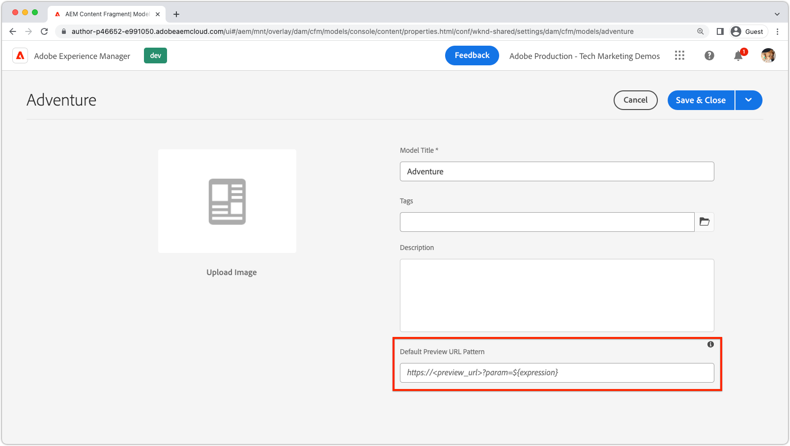
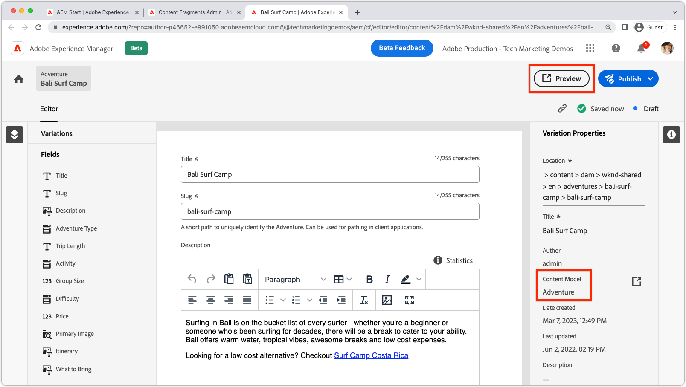

# Content Fragment preview

AEM Headless applications support integrated authoring preview. The preview experience links the AEM Author's Content Fragment editor with your custom app (addressable via HTTP), allowing for a deep link into the app that renders the Content Fragment being previewed.

>[!VIDEO](https://video.tv.adobe.com/v/3416906?quality=12&learn=on)

To use Content Fragment preview, several conditions must be satisfied:

1. The app must be deployed to a URL accessible to authors
1. The app must be configured to connect to AEM Author service (rather than the AEM Publish service)
1. The app must be designed with URLs or routes that can use [Content Fragment path or ID](#url-expressions) to select the Content Fragments to display for preview in the app experience.

## Preview URLs

Preview URLs, using [URL expressions](#url-expressions), are set on the Content Fragment Model's Properties. 



1. Log in to AEM Author service as an Administrator
1. Navigate to __Tools > General > Content Fragment Models__
1. Select the __Content Fragment Model__ and select __Properties__ form the top action bar.
1. Enter the preview URL for the Content Fragment Model using [URL expressions](#url-expressions)
    + The preview URL must point to a deployment of the app that connects to AEM Author service.

### URL expressions

Each Content Fragment Model can have a preview URL set. The Preview URL can be parameterized per Content Fragment using the URL expressions listed in the table below. Multiple URL expressions can be used in a single preview URL.

|                                         | URL Expression                      | Value       |
| --------------------------------------- | ----------------------------------- | ----------- |
| Content Fragment path                   | `${contentFragment.path}`           | `/content/dam/wknd-shared/en/adventures/surf-camp-bali/surf-camp-bali` |
| Content Fragment ID                     | `${contentFragment.id}`             | `12c34567-8901-2aa3-45b6-d7890aa1c23c` |
| Content Fragment variation              | `${contentFragment.variation}`      | `main` |
| Content Fragment Model path             | `${contentFragment.model.path}`     | `/conf/wknd-shared/settings/dam/cfm/models/adventure` |
| Content Fragment Model name             | `${contentFragment.model.name}`     | `adventure` |

Example preview URLs:

+ A preview URL on the __Adventure__ model could look like `https://preview.app.wknd.site/adventure${contentFragment.path}` that resolves to `https://preview.app.wknd.site/adventure/content/dam/wknd-shared/en/adventures/surf-camp-bali/surf-camp-bali`
+ A preview URL on the __Article__ model could look like `https://preview.news.wknd.site/${contentFragment.model.name}/${contentFragment.id}.html?variation=${contentFragment.variation}` the resolves `https://preview.news.wknd.site/article/99c34317-1901-2ab3-35b6-d7890aa1c23c.html?variation=main`

## In-app preview

Any Content Fragment using the configured Content Fragment Model, has a Preview button. The Preview button opens the Content Fragment Model's preview URL and injects the open Content Fragment's values into the [URL expressions](#url-expressions).



Perform a hard refresh (clearing the browser's local cache) when previewing Content Fragment changes in the app.

## React example

Let's explore the WKND App, a simple React application that displays adventures from AEM using AEM Headless GraphQL APIs.

The example code is available on [Github.com](https://github.com/adobe/aem-guides-wknd-graphql/tree/main/preview-tutorial).

## URLs and routes

The URLs or routes used to preview a Content Fragment must be composable using [URL expressions](#url-expressions). In this preview-enabled version of the WKND app, the adventure Content Fragments are displayed via the `AdventureDetail` component bound to the route `/adventure<CONTENT FRAGMENT PATH>`. Thus, the WKND Adventure model's Preview URL must be set to `https://preview.app.wknd.site:3000/adventure${contentFragment.path}` to resolve to this route.

Content Fragment preview only works if the app has an addressable route, that can be populated with [URL expressions](#url-expressions) that render that Content Fragment in the app in a preview-able manner.

+ `src/App.js`

```javascript
...
function App() {
  return (
    <Router>
      <div className="App">
        <header>
            <Link to={"/"}>
                
            </Link>        
            <hr />
        </header>
        <Routes>
          {/* The route's path must match the Adventure Model's Preview URL expression. In React since the path has `/` you must use wildcards to match instead of the usual `:path` */}
          <Route path='/adventure/*' element={<AdventureDetail />}/>
          <Route path="/" element={<Home />}/>
        </Routes>
      </div>
    </Router>
  );
}

export default App;
```

### Display the authored content

The `AdventureDetail` component simply parses the Content Fragment path, injected into the Preview URL via the `${contentFragment.path}` [URL expression](#url-expressions), from the route URL, and uses it to collect and render the WKND Adventure.

+ `src/components/AdventureDetail.js`

```javascript
...
function AdventureDetail() {

    // Read the `path` value which is the parameter used to query for the adventure's details
    // since the params value captures the `*` wildcard in `/adventure/*`, or everything after the first `/` in the Content Fragment path.
    const params = useParams();
    const pathParam = params["*"];

    // Add the leading '/' back on 
    const path = '/' + pathParam;
    
    // Query AEM for the Adventures's details, using the Content Fragment's `path`
    const { adventure, references, error } = useAdventureByPath(path);

    // Handle error and loading conditions
    if (error) {
        return <Error errorMessage={error} />;
    } else if (!adventure) {
        return <Loading />;
    }

    return (<div className="adventure-detail">
        ...
        <AdventureDetailRender {...adventure} references={references} />
    </div>);
}
...
```
