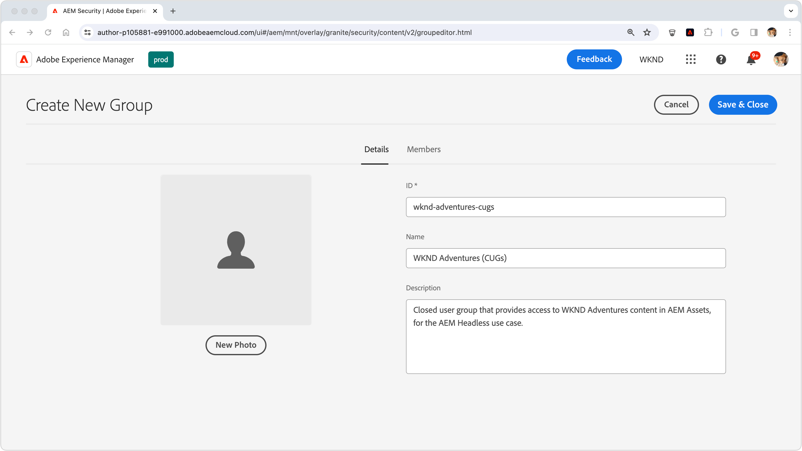
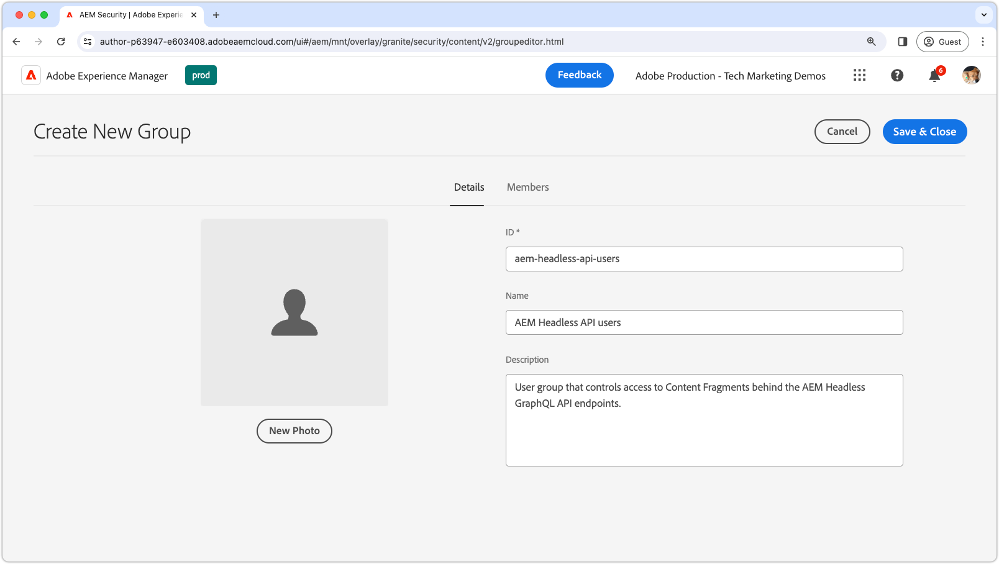
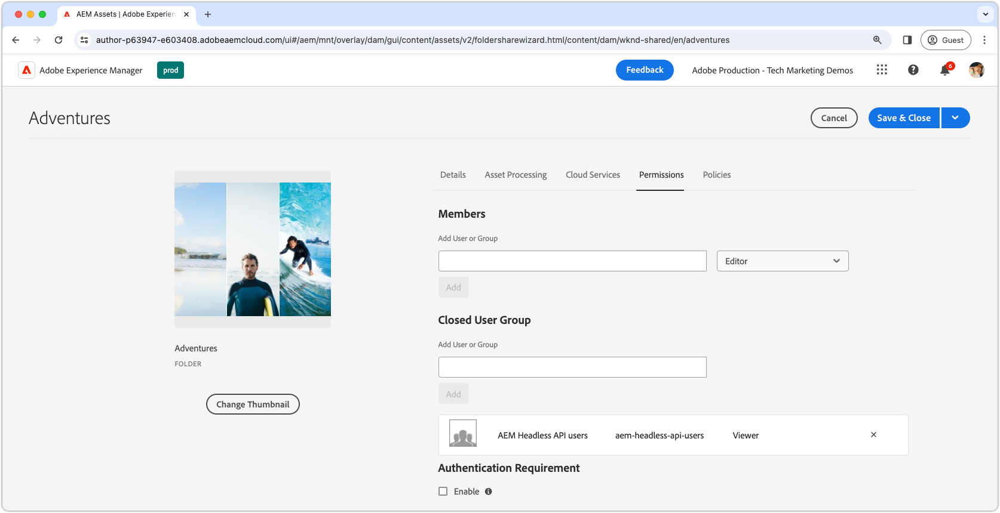

# Protecting content in AEM Headless

Ensuring the integrity and security of your data when serving AEM Headless content from AEM Publish is crucial when serving sensitive content. This how-to walks through securing the content served by AEM Headless GraphQL API endpoints.

The guidance in this tutorial where there are stringent requirements for content to be exclusively available to specific users or user groups. It is imperative to distinguish between personalized marketing content and private content, such as PII or personal financial data, to avoid confusion and unintended outcomes. This tutorial addresses protecting private content. 

When discussing marketing content, we are referring to content tailored for individual users or groups, which is not intended for general consumption. However, it's essential to understand that while this content may be targeted for certain users, its exposure outside the intended context (e.g., through manipulation of HTTP requests) does not pose a security, legal, or reputational risk.

It is emphasized that all content addressed in this article is assumed to be private, and may only be viewed by designated users or groups. Marketing content often does not require protection, rather its delivery to specific users can be managed by the application, and cached for performance.

This how-to does not cover:

- Securing the endpoints directly, but instead concentrates on securing the content they deliver. 
- Authentication for AEM Publish or obtaining login tokens. Authentication methods and credential passing depend on individual use cases and implementations.

## User groups

First, we must define a [user group](https://experienceleague.adobe.com/en/docs/experience-manager-learn/cloud-service/accessing/aem-users-groups-and-permissions) containing the users that should have access to the protected content.

{align="center"}

User groups assign access to AEM Headless content, including Content Fragments or other referenced assets.

1. Log in to AEM Author as a **user administrator**.
1. Navigate to **Tools** > **Security** > **Groups**.
1. Select **Create** in the top right corner.
1. In the **Details** tab, specify the **Group ID** and **Group Name**.
   - The Group ID and Group Name can be anything, but in this example uses the name **AEM Headless API users**.
1. Select **Save & Close**.
1. Select the newly created group, then choose **Activate** from the action bar.

If various levels of access are required, create multiple user groups which can be associated with different content.

### Adding users to user groups

To grant AEM Headless GraphQL API requests access to protected content, you can associate the headless request with a user belonging to a specific user group. Here are two common approaches:

1. **AEM as a Cloud Service [technical accounts](https://experienceleague.adobe.com/en/docs/experience-manager-learn/getting-started-with-aem-headless/authentication/service-credentials):**
   - Create a technical account in the AEM as a Cloud Service Developer Console.
   - Log in to AEM Author once with the technical account.
   - Add the technical account to the user group via **Tools > Security > Groups > AEM Headless API users > Members**.
   - **Activate** both the technical account user and the user group on AEM Publish.
   - This method is requires the headless client not expose the Service Credentials to the user, as they are credentials for a specific user, and should not be shared.
   
   {align="center"}

2. **Named users:**
   - Authenticate named users and directly add them to the user group on AEM Publish.
   - This method requires the headless client to authenticate user credentials with AEM Publish, obtain an AEM login or access token, and use this token for subsequent requests to AEM. The details of how to achieve this are not covered in this how-to, and are dependent on the implementation.

## Protecting Content Fragments

Protecting Content Fragments is essential for safeguarding your AEM Headless content and is achieved by associating the content with a Closed User Group (CUG). When a user makes a request to the AEM Headless GraphQL API, the content returned is filtered based on the user's CUGs.

{align="center"}

Follow these steps to achieve this through [Closed User Groups (CUGs)](https://experienceleague.adobe.com/en/docs/experience-manager-learn/assets/advanced/closed-user-groups).

1. Log in to AEM Author as a **DAM user**.
2. Navigate to **Assets > Files** and select the **folder** containing the Content Fragments to protect. CUGs are applied hierarchically and effect subfolders unless overridden by a different CUG.
   - Ensure that users belonging to other channels utilizing the contents of the folders are included in this user group. Alternatively, include the user groups associated with those channels in the list of CUGs. If not, the content will not be accessible to those channels.
3. Select the folder and choose **Properties** from the toolbar.
4. Select the **Permissions** tab.
5. Type in the **Group Name** and select the **Add** button to add the new CUG.
6. **Save** to apply the CUG.
7. **Select** the asset folder and select **Publish** to send the folder with the applied CUGs to AEM Publish, where it will be evaluated as a permission.

Perform these same steps for all folders containing Content Fragments that need to be protected, applying the correct CUGs to each folder.

Now, when an HTTP request is made to the AEM Headless GraphQL API endpoint, only the Content Fragments accessible by the requesting user's specified CUGs will be included in the result. If the user lacks access to any Content Fragment, the result will be empty, albeit still returning a 200 HTTP status code.

### Protecting referenced content

Content Fragments often reference other AEM content such as images. To secure this referenced content, apply CUGs to the asset folders in which the referenced assets are stored. Note that referenced assets are commonly requested using methods distinct from those of the AEM Headless GraphQL APIs. Consequently, the manner in which access tokens are passed on requests to these referenced assets may differ.

Depending on the content architecture, it may be necessary to apply CUGs to multiple folders to ensure all referenced content is protected.

## Prevent caching of protected content

AEM as a Cloud Service [caches HTTP responses by default](https://experienceleague.adobe.com/en/docs/experience-manager-learn/cloud-service/caching/publish) for performance enhancement. However, this can cause issues with serving protected content. To prevent caching of such content, [remove cache headers for specific endpoints](https://experienceleague.adobe.com/en/docs/experience-manager-learn/cloud-service/caching/publish#how-to-customize-cache-rules-1) in the Apache configuration of the AEM Publish instance. 

Add the following rule to your Dispatcher project's Apache configuration file to remove cache headers for specific endpoints:

```xml
# dispatcher/src/conf.d/available_vhosts/example.vhost

<VirtualHost *:80>
    ...
    # Replace `example` with the name of your GraphQL endpoint's configuration name.
    <LocationMatch "^/graphql/execute.json/example/.*$">
        # Remove cache headers for protected endpoints so they are not cached
        Header unset Cache-Control
        Header unset Surrogate-Control
        Header set Age 0
    </LocationMatch>
    ...
</VirtualHost>
```

Note that this will incur a performance penalty as the content will not be cached by the dispatcher or CDN. This is a trade-off between performance and security.

## Protecting AEM Headless GraphQL API endpoints

This guide does not address securing the [AEM Headless GraphQL API endpoints](https://experienceleague.adobe.com/en/docs/experience-manager-cloud-service/content/headless/graphql-api/graphql-endpoint) themselves, but rather focuses on securing the content served by them. All users, including anonymous users, can access the endpoints containing protected content. Only the content accessible by the user's Closed User Groups will be returned. If no content is accessible, the AEM Headless API response will still have a 200 HTTP response status code, but the results will be empty. Typically, securing the content is sufficient, as the endpoints themselves do not inherently expose sensitive data. If you need to secure the endpoints, apply ACLs to them on AEM Publish via [Sling Repository Initialization (repoinit) scripts](https://sling.apache.org/documentation/bundles/repository-initialization.html#repoinit-parser-test-scenarios).
