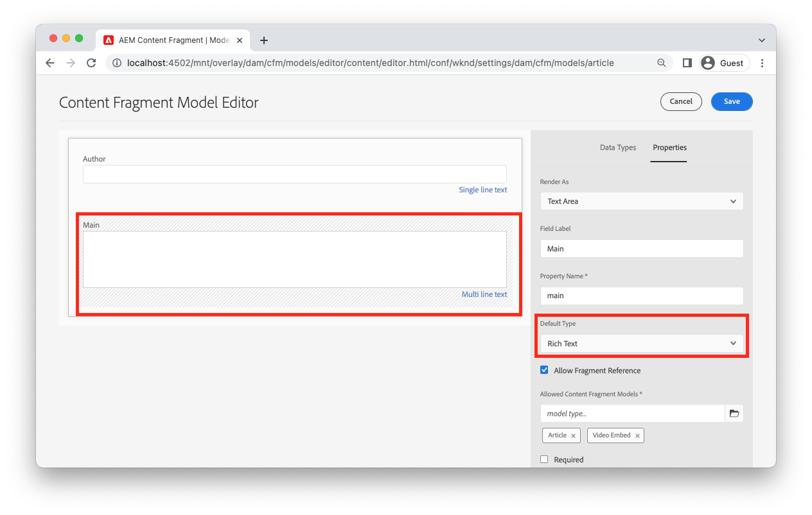
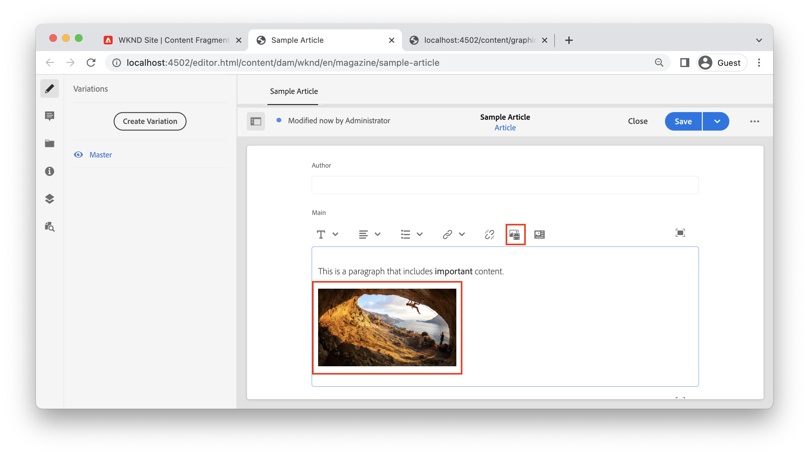
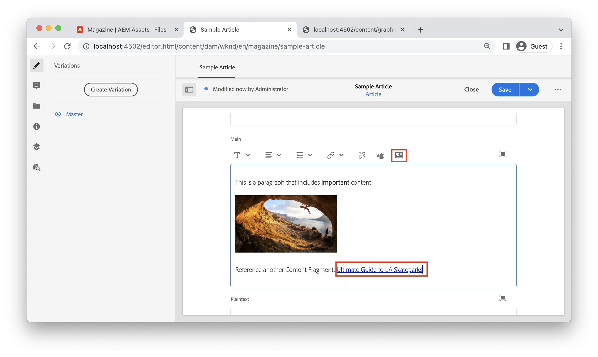

# Rich text with AEM Headless

The Multi line text field is a data type of Content Fragments that enables authors to create rich text content. References to other content, such as images or other Content Fragments can be dynamically inserted in-line within the flow of the text. The Single line text field is another data type of Content Fragments that should be used for simple text elements.

AEM's GraphQL API offers a robust capability to return rich text as HTML, plain text, or as pure JSON. The JSON representation is powerful as it gives the client application full control over how to render the content.

## Multi line editor

>[!VIDEO](https://video.tv.adobe.com/v/342104/?quality=12&learn=on)

In the Content Fragment Editor, the Multi line text field's menu bar provides authors with standard rich text formatting capabilities, such as **bold**, *italics*, and underline. Opening the Multi line field in full screen mode enables [additional formatting tools like Paragraph type, find and replace, spell check, and more](https://experienceleague.adobe.com/docs/experience-manager-cloud-service/content/assets/content-fragments/content-fragments-variations.html).

>[!NOTE]
>
> The rich text plugins in the Multi line editor cannot be customized.

## Multi line text data type {#multi-line-data-type}

Use the **Multi line text** data type when defining your Content Fragment Model to enable rich text authoring.



Several properties of the Multi line field can be configured.

The **Render as** property can be set to:

* Text Area - renders a single Multi line field
* Multiple Field - renders multiple Mutli line fields


The **Default Type** can be set to:

* Rich Text
* Markdown
* Plain Text

The **Default Type** option directly influences the editing experience and determines if the rich text tools are present.

You can also [enable in-line references](#insert-fragment-references) to other Content Fragments by checking the **Allow Fragment Reference** and configuring the **Allowed Content Fragment Models**.

If the content will be localized check the **Translatable** box. Only Rich Text and Plain Text can be localized. See [working with localized content for more details](./localized-content.md).

## Rich text response with GraphQL API

When creating a GraphQL query, developers can choose different response types from `html`, `plaintext`, `markdown`, and `json` from a Multi line field.

Developers can use the [JSON Preview](https://experienceleague.adobe.com/docs/experience-manager-cloud-service/content/assets/content-fragments/content-fragments-json-preview.html) in the Content Fragment editor to show all values of the current Content Fragment that can be returned using the GraphQL API.

### JSON example

The `json` response offers the most flexibility for front-end developers when working with rich text content. The rich text content is delivered as an array of JSON node types that can be processed uniquely based on the client platform.

Below is a JSON response type of a multi-line field named `main` that contains a paragraph: "*This is a paragraph that includes **important** content.*" where "important" is marked as **bold**.

**GraphQL query:**

```graphql
{
  articleByPath(_path: "/content/dam/wknd/en/magazine/sample-article")
  {
    item {
      _path
      main {
        json
      }
    }
  }
}
```

**GraphQL response:**

```json
{
  "data": {
    "articleByPath": {
      "item": {
        "_path": "/content/dam/wknd/en/magazine/sample-article",
        "main": {
          "json": [
            {
              "nodeType": "paragraph",
              "content": [
                {
                  "nodeType": "text",
                  "value": "This is a paragraph that includes "
                },
                {
                  "nodeType": "text",
                  "value": "important",
                  "format": {
                    "variants": [
                      "bold"
                    ]
                  }
                },
                {
                  "nodeType": "text",
                  "value": " content. "
                }
              ]
            }
          ]
        }
      }
    }
  }
}
```

### Other examples

Below are several examples of response types of a multi-line field named `main` that contains a paragraph: "This is a paragraph that includes **important** content." where "important" is marked as **bold**.

+++HTML example

**GraphQL query:**

```graphql
{
  articleByPath(_path: "/content/dam/wknd/en/magazine/sample-article")
  {
    item {
      _path
      main {
        html
      }
    }
  }
}
```

**GraphQL response:**

```json
{
  "data": {
    "articleByPath": {
      "item": {
        "_path": "/content/dam/wknd/en/magazine/sample-article",
        "main": {
            "html": "<p>This is a paragraph that includes <b>important</b> content.&nbsp;</p>\n"
        }
      }
    }
  }
}
```

+++

+++Markdown example

**GraphQL query:**

```graphql
{
  articleByPath(_path: "/content/dam/wknd/en/magazine/sample-article")
  {
    item {
      _path
      main {
        markdown
      }
    }
  }
}
```

**GraphQL response:**

```json
{
  "data": {
    "articleByPath": {
      "item": {
        "_path": "/content/dam/wknd/en/magazine/sample-article",
        "main": {
            "markdown": "This is a paragraph that includes **important** content. \n\n ",
        }
      }
    }
  }
}
```

+++

+++Plaintext example

**GraphQL query:**

```graphql
{
  articleByPath(_path: "/content/dam/wknd/en/magazine/sample-article")
  {
    item {
      _path
      main {
        plaintext
      }
    }
  }
}
```

**GraphQL response:**

```json
{
  "data": {
    "articleByPath": {
      "item": {
        "_path": "/content/dam/wknd/en/magazine/sample-article",
        "main": {
            "plaintext": "This is a paragraph that includes important content. ",
        }
      }
    }
  }
}
```

The `plaintext` render option strips out any formatting.

+++


## Rendering a rich text JSON response {#render-multiline-json-richtext}

The Multi line field's rich text JSON response is structured as a hierarchical tree. Each object or node represents a different HTML block of the rich text.

Below is a sample JSON response of a Multi line text field. Observe that each object, or node, includes a `nodeType` which represents the HTML block from the rich text like `paragraph`, `link`, and `text`. Each node optionally contains `content` which is a subarray containing any children of the current node.

```json
"json": [// root "content" or child nodes
            {
                "nodeType": "paragraph", // node for a paragraph
                "content": [ // children of current node
                {
                    "nodeType": "text", // node for a text
                    "value": "This is the first paragraph. "
                },
                {
                    "nodeType": "link",
                    "data": {
                        "href": "http://www.adobe.com"
                    },
                    "value": "An external link"
                }
                ],
            },
            {
                "nodeType": "paragraph",
                "content": [
                {
                    "nodeType": "text",
                    "value": "This is the second paragraph."
                },
                ],
            },
]
```

The easiest way to render the Multi line `json` response is to process each object or node in the response and then process any children of the current node. A recursive function can be used to traverse the JSON tree. 

Below is sample code that illustrates a recursive traversal approach. The samples are JavaScript based and use React's [JSX](https://reactjs.org/docs/introducing-jsx.html), however the programming concepts can be applied to any language.

```javascript
// renderNodeList - renders a list of nodes
function renderNodeList(childNodes) {
    
    if(!childNodes) {
        // null check
        return null;
    }

    return childNodes.map(node, index) => {
        return renderNode(node);
    }
}
```

The `renderNodeList` function is the entrypoint into the recursive algorithm. The `renderNodeList` function expects an array of `childNodes`. Each node in the array is then passed to a function `renderNode`.

```javascript
// renderNode - renders an individual node
function renderNode(node) {

    // if the current node has children, recursively process them
    const children = node.content ? renderNodeList(node.content) : null;

    // use a map to render the current node based on its nodeType
    return nodeMap[node.nodeType]?.(node, children);
}
```

The `renderNode` function expects a single object named `node`. A node may have children which is processed recursively using the `renderNodeList` function described above. Finally, a `nodeMap` is used to render the contents of the node based on its `nodeType`.

```javascript
// nodeMap - object literal that maps a JSX response based on a given key (nodeType)
const nodeMap = {
    'paragraph': (node, children) => <p>{children}</p>,
    'link': node => <a href={node.data.href} target={node.data.target}>{node.value}</a>,
    'text': node => node.value,
    'unordered-list': (node, children) => <ul>{children}</ul>,
    'ordered-list': (node, children) => <ol>{children}</ol>,
    'list-item': (node, children) => <li>{children}</li>,
    ...
}
```

The `nodeMap` is a JavaScript Object literal that is used as a map. Each of the "keys" represent a different `nodeType`. Parameters of `node` and `children` can be passed in to the resulting functions that render the node. The return type used in this example is JSX, however the approach could be adapted to build out a string literal representing HTML content.

### Full code example

A re-usable rich text-rendering utility can be found in the [WKND GraphQL React example](https://github.com/adobe/aem-guides-wknd-graphql/tree/main/react-app). 

* [renderRichText.js](https://github.com/adobe/aem-guides-wknd-graphql/tree/main/react-app/src/utils/renderRichText.js) - reusable utility that exposes a function `mapJsonRichText`. This utility can be used by components that want to render a rich text JSON response as React JSX.
* [AdventureDetail.js](https://github.com/adobe/aem-guides-wknd-graphql/blob/main/react-app/src/components/AdventureDetail.js) - Example component that makes a GraphQL request that includes rich text. The component uses the `mapJsonRichText` utility to render the rich text and any references.


## Add in-line references to rich text {#insert-fragment-references}

The Mutli Line field allows authors to insert images or other digital assets from AEM Assets in the flow of the rich text.  



The above screenshot depicts an image inserted in the Multi Line field using the **Insert asset** button.

References to other Content Fragments can also be linked or inserted in the Multi Line field using the **Insert Content Fragment** button.



The above screenshot depicts another Content Fragment, Ultimate Guide to LA Skate Parks, being inserted into the multi-line field. The types of Content Fragments that can be inserted into field is controlled by the **Allowed Content Fragment Models** configuration in the [Multi line data type](#multi-line-data-type) in the Content Fragment Model.

## Query in-line references with GraphQL

The GraphQL API enables developers to create a query that includes additional properties about any references inserted in a Multi line field. The JSON response includes a separate `_references` object that lists these extra properties. The JSON response gives developers full control of how to render the references or links instead of having to deal with opinionated HTML.

For example, you might want to:

* Include custom routing logic for managing links to other Content Fragments when implementing a Single Page Application, like using React Router or Next.js
* Render an in-line image using the absolute path to an AEM Publish environment as the `src` value.
* Determine how to render an embedded reference to another Content Fragment with additional custom properties.

Use the `json` return type and include the `_references` object when constructing a GraphQL query:

**GraphQL query:**

```graphql
{
  articleByPath(_path: "/content/dam/wknd/en/magazine/sample-article")
  {
    item {
      _path
      main {
        json
      }
    }
    _references {
      ...on ImageRef {
        _path
        _publishUrl
        width
        __typename
      }
      ...on ArticleModel {
        _path
        author
        __typename
      }
      
    }
  }
}
```

In the above query, the `main` field is returned as JSON. The `_references` object includes fragments for handling any references that are of type `ImageRef` or of type `ArticleModel`.

**JSON response:**

```json
{
  "data": {
    "articleByPath": {
      "item": {
        "_path": "/content/dam/wknd/en/magazine/sample-article",
        "main": {
          "json": [
            {
              "nodeType": "paragraph",
              "content": [
                {
                  "nodeType": "text",
                  "value": "This is a paragraph that includes "
                },
                {
                  "nodeType": "text",
                  "value": "important",
                  "format": {
                    "variants": [
                      "bold"
                    ]
                  }
                },
                {
                  "nodeType": "text",
                  "value": " content. "
                }
              ]
            },
            {
              "nodeType": "paragraph",
              "content": [
                {
                  "nodeType": "reference",
                  "data": {
                    "path": "/content/dam/wknd/en/activities/climbing/sport-climbing.jpg",
                    "mimetype": "image/jpeg"
                  }
                }
              ]
            },
            {
              "nodeType": "paragraph",
              "content": [
                {
                  "nodeType": "text",
                  "value": "Reference another Content Fragment: "
                },
                {
                  "nodeType": "reference",
                  "data": {
                    "href": "/content/dam/wknd/en/magazine/la-skateparks/ultimate-guide-to-la-skateparks",
                    "type": "fragment"
                  },
                  "value": "Ultimate Guide to LA Skateparks"
                }
              ]
            }
          ]
        }
      },
      "_references": [
        {
          "_path": "/content/dam/wknd/en/activities/climbing/sport-climbing.jpg",
          "_publishUrl": "http://publish-p123-e456.adobeaemcloud.com/content/dam/wknd/en/activities/climbing/sport-climbing.jpg",
          "width": 1920,
          "__typename": "ImageRef"
        },
        {
          "_path": "/content/dam/wknd/en/magazine/la-skateparks/ultimate-guide-to-la-skateparks",
          "author": "Stacey Roswells",
          "__typename": "ArticleModel"
        }
      ]
    }
  }
}
```

The JSON response includes where the reference was inserted in the rich text with the `"nodeType": "reference"`. The `_references` object then includes each reference with the additional properties requested. For example, the `ImageRef` returns the `width` of the image referenced in the article.

## Rendering in-line references in rich text

To render in-line references, the recursive approach explained in [Rendering a multi-line JSON response](#render-multiline-json-richtext) can be expanded.

Where `nodeMap` is the map that renders the JSON nodes.

```javascript
const nodeMap = {
        'reference': (node, children) => {

            // variable for reference in _references object
            let reference;
            
            // asset reference
            if(node.data.path) {
                // find reference based on path
                reference = references.find( ref => ref._path === node.data.path);
            }
            // Fragment Reference
            if(node.data.href) {
                // find in-line reference within _references array based on href and _path properties
                reference = references.find( ref => ref._path === node.data.href);
            }

            // if reference found, merge properties of reference and current node, then return render method of it using __typename property
            return reference ? renderReference[reference.__typename]({...reference, ...node}) : null;
        }
    }
```

The high-level approach is to inspect whenever a `nodeType` equals `reference` in the Mutli Line JSON response. A custom render function can then be called that includes the `_references` object returned in the GraphQL response.

The in-line reference path can then be compared to the corresponding entry in the `_references` object and another custom map `renderReference` can be called.

```javascript

const renderReference = {
    // node contains merged properties of the in-line reference and _references object
    'ImageRef': (node) => {
        // when __typename === ImageRef
        return  
    },
    'ArticleModel': (node) => {
        // when __typename === ArticleModel
        return <Link to={`/article:${node._path}`}>{`${node.value}`}</Link>;
    }
    ...
}
```

The `__typename` of the `_references` object can be used to map different reference types to different render functions.

### Full code example

A full example of writing a custom references renderer can be found in [AdventureDetail.js](https://github.com/adobe/aem-guides-wknd-graphql/blob/main/react-app/src/components/AdventureDetail.js) as part of the [WKND GraphQL React example](https://github.com/adobe/aem-guides-wknd-graphql/tree/main/react-app).

## End-to-End example

>[!VIDEO](https://video.tv.adobe.com/v/342105/?quality=12&learn=on)

The preceding video shows an end-to-end example:

1. Updating a Content Fragment Model's Multi line text field to allow Fragment References
1. Using the Content Fragment Editor to include an image and reference to another fragment in a Multi line text field.
1. Creating a GraphQL query that includes the Multi line text response as JSON and any `_references` used.
1. Writing a React SPA that renders the in-line references of the rich text response.
