# Authoring Content Fragment {#authoring-content-fragments}

In this chapter, you create and edit a new Content Fragment based on the [newly defined Content Fragment Model](./content-fragment-models.md). You also learn how to create variations of Content Fragments.

## Prerequisites {#prerequisites}

This is a multi-part tutorial and it is assumed that the steps outlined in the [Defining Content Fragment Models](./content-fragment-models.md) have been completed.

## Objectives {#objectives}

* Author a Content Fragment based on a Content Fragment Model
* Create a Content Fragment variation

## Create an Asset Folder

Content Fragments are stored in folders in AEM Assets. To create Content Fragments from the models created in the previous chapter, a folder must be created to store them. A configuration is required on the folder to enable creation of fragments from specific models.

1.  From the AEM Start screen, navigate to **Assets** > **Files**.

    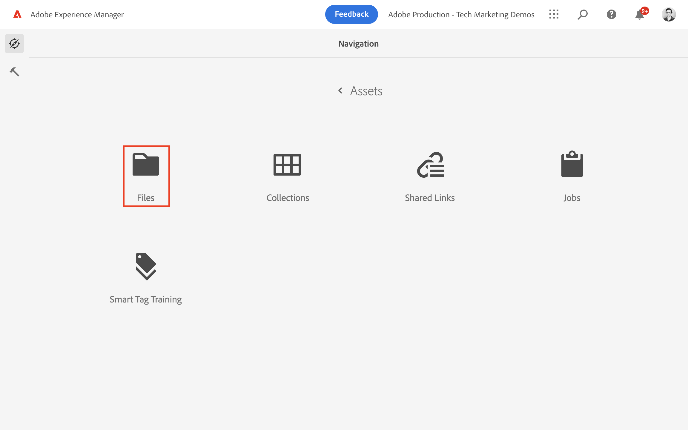

1.  Tap **Create** in the top-right corner and tap **Folder**. In the resulting dialog, enter:

    * Title*: **My Project**
    * Name: **my-project**

    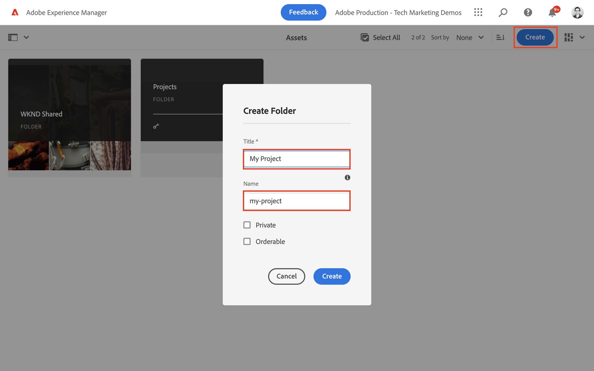

1.  Select the **My Folder** folder and tap **Properties**.

    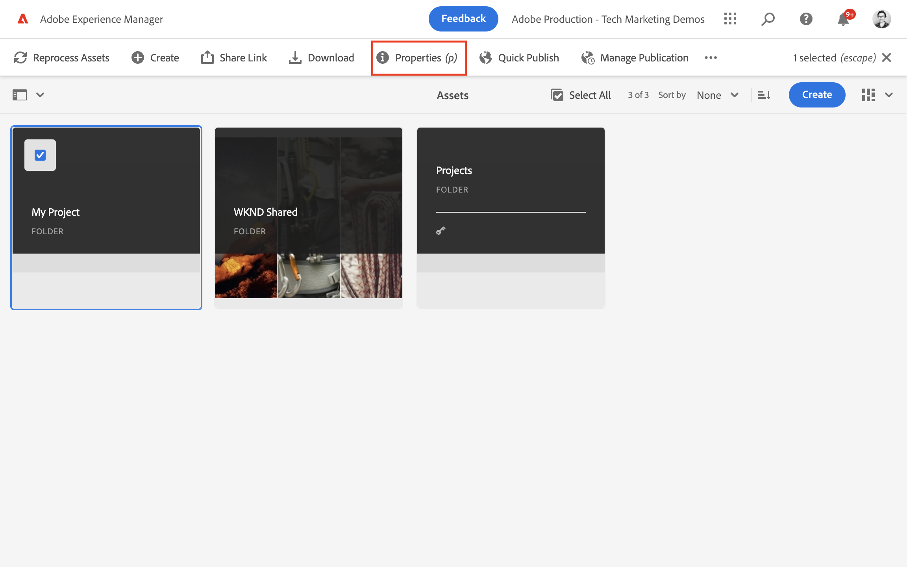

1.  Tap the **Cloud Services** tab. Under the Cloud Configuration tab, use the path finder to select the **My Project** configuration. The value should be `/conf/my-project`.

    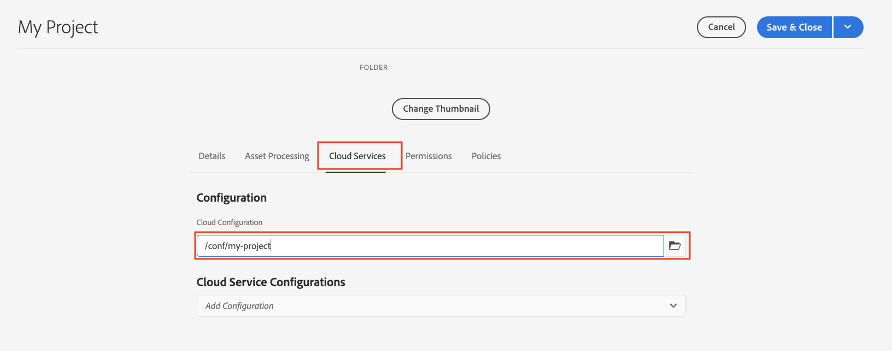

    Setting this property enables Content Fragments to be created using the models created in the previous chapter.

1.  Tap the **Policies** tab, under the **Allowed Content Fragment Models** field use the path finder to select the **Person** and **Team** model created earlier.

    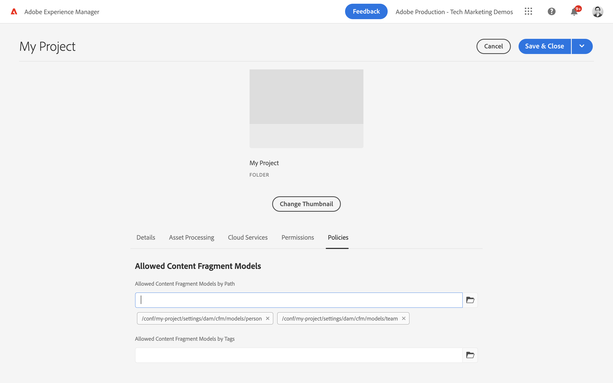

    These policies are inherited by any subfolders automatically and can be overridden. You can also allow models by tags or enable models from other project configurations. This mechanism provides a powerful way to manage your content hierarchy.

1.  Tap **Save & Close** to save the changes to the folder properties.

1.  Navigate inside the **My Project** folder.

1.  Create another folder with the following values:

    * Title*: **English**
    * Name: **en**

    A best practice is to set up projects for multilingual support. See [the following docs page for more information](https://experienceleague.adobe.com/docs/experience-manager-cloud-service/content/assets/admin/translate-assets.html).

## Create a Content Fragment {#create-content-fragment}

Next several Content Fragments are created based on the **Team** and **Person** models.

1.  From the AEM Start Screen, tap **Content Fragments** to open up the Content Fragments UI.

    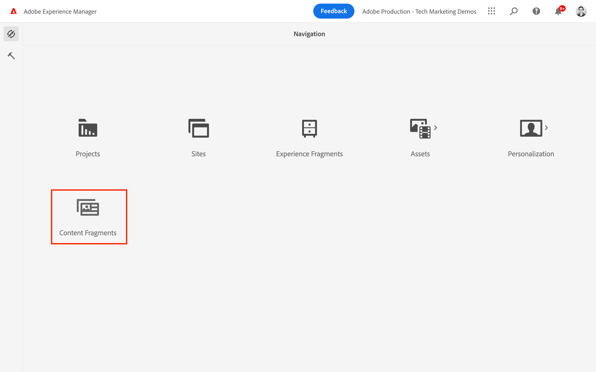

1.  In the left-hand rail, expand **My Project** and tap **English**.
1.  Tap **Create** to bring up the **New Content Fragment** dialog and enter the following values:

    * Location: `/content/dam/my-project/en`
    * Content Fragment model: **Person**
    * Title: **John Doe**
    * Name: `john-doe`

    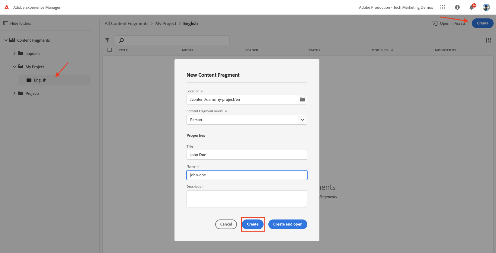
1.  Tap **Create**.
1.  Repeat the above steps to create a fragment representing **Alison Smith**:

    * Location: `/content/dam/my-project/en`
    * Content Fragment model: **Person**
    * Title: **Alison Smith**
    * Name: `alison-smith`

    Tap **Create** to create the Person fragment.

1.  Next, repeat the steps to create a **Team** fragment representing **Team Alpha**:

    * Location: `/content/dam/my-project/en`
    * Content Fragment model: **Team**
    * Title: **Team Alpha**
    * Name: `team-alpha`

    Tap **Create** to create the Team fragment.

1.  There should be three Content Fragments beneath **My Project** > **English**:

    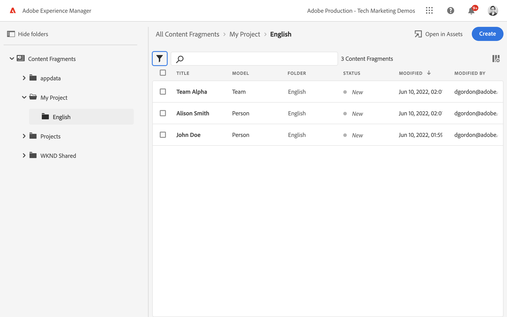

## Edit Person Content Fragments {#edit-person-content-fragments}

Next populate the newly created fragments with data.

1.  Tap the checkbox next to **John Doe** and tap **Open**.

    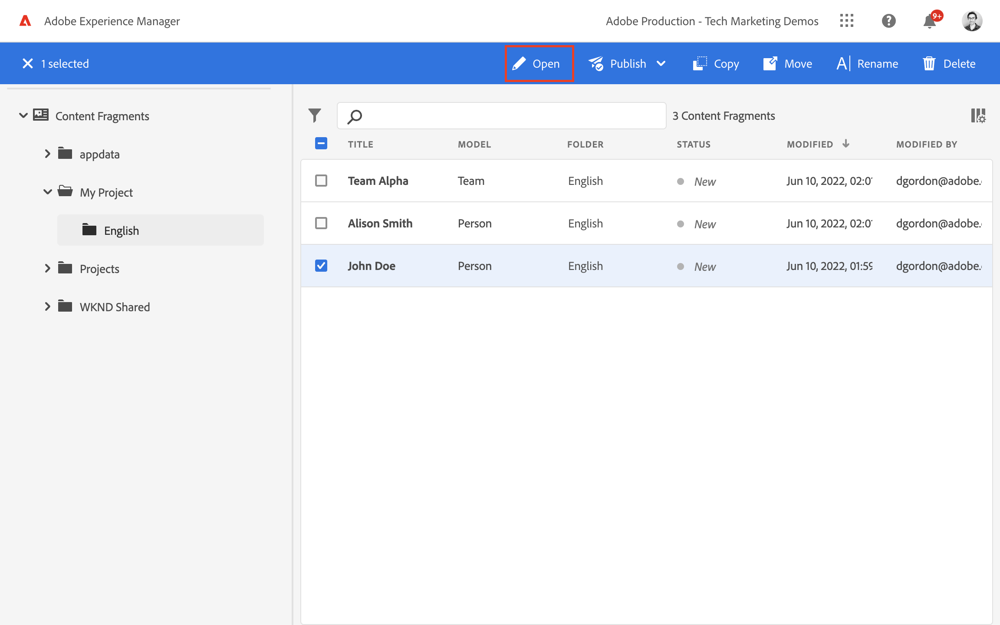

1.  The Content Fragment Editor contains a form based on the Content Fragment model. Fill out the various fields to add content to the **John Doe** fragment. For Profile Picture, upload your own image to AEM Assets.

    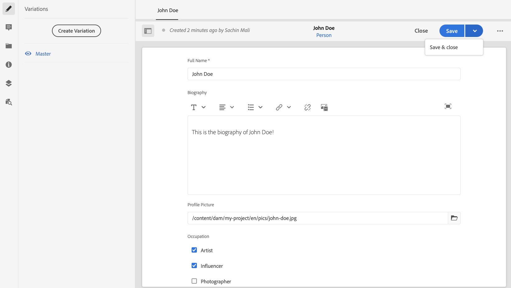

1.  Tap **Save & Close** to save the changes to the John Doe fragment.
1.  Return to the Content Fragment UI and open the **Alison Smith** file for editing.
1.  Repeat the above steps to populate the **Alison Smith** fragment with content.

## Edit Team Content Fragment {#edit-team-content-fragment}

1.  Open the **Team Alpha** Content Fragment using the Content Fragment UI.
1.  Fill out the fields for **Title**, **Short Name**, and **Description**.
1.  Select the **John Doe** and **Alison Smith** Content Fragments to populate the **Team Members** field:

    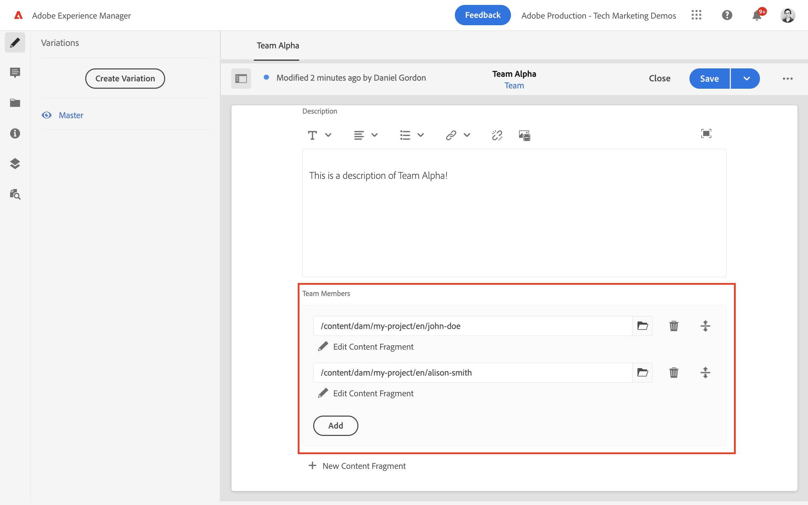

    >[!NOTE]
    >
    >You can also create Content Fragments in-line by using the **New Content Fragment** button.

1.  Tap **Save & Close** to save the changes to the Team Alpha fragment.

## Publish Content Fragments

Upon review and verification, publish the authored `Content Fragments`

1.  From the AEM Start Screen, tap **Content Fragments** to open up the Content Fragments UI.

1.  In the left-hand rail, expand **My Project** and tap **English**.

1.  Tap the checkbox next to the content fragments and tap **Publish**.
    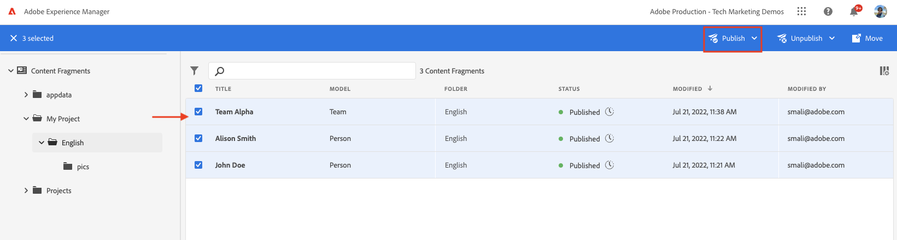

## Congratulations! {#congratulations}

Congratulations, you authored multiple Content Fragments and created a variation.

## Next Steps {#next-steps}

In the next chapter, [Explore GraphQL APIs](explore-graphql-api.md), you will explore AEM's GraphQL APIs using the built-in GrapiQL tool. Learn how AEM automatically generates a GraphQL schema based on a Content Fragment model. You will experiment constructing basic queries using the GraphQL syntax.

## Related Documentation

* [Managing Content Fragments](https://experienceleague.adobe.com/docs/experience-manager-cloud-service/content/assets/content-fragments/content-fragments-managing.html)
* [Variations - Authoring Fragment Content](https://experienceleague.adobe.com/docs/experience-manager-cloud-service/content/assets/content-fragments/content-fragments-variations.html)
